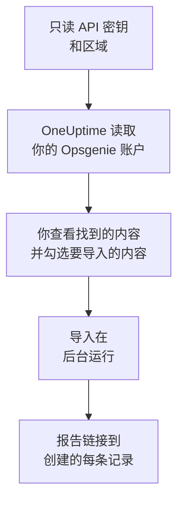

# 从 Opsgenie 迁移

Atlassian 正在停用 Opsgenie：Opsgenie 自 2025 年 6 月起停止销售，并将于 2027 年 4 月结束支持。OneUptime 可以成为你的值班团队的新家，**从其他工具导入** 只需几分钟就能把团队迁移过来。使用一个只读的 Opsgenie API 密钥，OneUptime 会读取你的用户、团队、计划、升级和服务，展示找到的内容，并创建你勾选的内容。Opsgenie 中的任何内容都不会改变。

:::cards
- [导入你的账户](#导入你的-opsgenie-账户): 创建密钥，读取你的账户，并勾选要导入的内容。
- [会导入什么](#会导入什么): 每条 Opsgenie 记录在 OneUptime 中会变成什么。
- [完成迁移](#完成迁移): 导入完成后要做的事。
:::

## 工作原理

- **密钥只使用一次。** OneUptime 读取你的账户期间，密钥会加密保存；读取一结束，无论成功与否，密钥都会立即删除。它不会再次显示，也不会写入任何日志。
- **OneUptime 只读取。** 它只调用 Opsgenie 自己的 API：`api.opsgenie.com`，欧洲账户则是 `api.eu.opsgenie.com`。当 Opsgenie 要求放慢速度时，它会等待后重试。
- **在你开始导入之前，不会创建任何内容。** 预览会为每一项显示：它是新的、已在 OneUptime 中（并按原样使用）、已由之前的导入带入，或者无法导入的原因。
- **再次运行绝不会重复创建。** OneUptime 会按 Opsgenie ID 记住每次导入带入的内容。在 Opsgenie 中添加人员或计划后再次运行，只会创建新的内容。

## 开始之前

- **一个 OneUptime 项目，以及创建所导入内容的权限。** 项目所有者和项目管理员可以导入所有内容。其他角色也可以运行导入，并导入他们有权创建的记录类型。其余内容会显示为不导入，并附上原因。
- **一个具有 Read 和 Configuration access 权限的 Opsgenie API 密钥。** 有了 Configuration access，密钥才能读取用户、团队、计划和升级。导入绝不会写入 Opsgenie。
- **你的 Opsgenie 区域。** 如果你在 `app.eu.opsgenie.com` 登录，你的账户在欧洲；否则在美国。

## 导入你的 Opsgenie 账户

:::steps
### 在 Opsgenie 中创建 API 密钥
在 Opsgenie 中依次打开 **Settings** > **API key management**，然后选择 **Add new API key**。将它命名为 `OneUptime import`，只授予 **Read** 和 **Configuration access**，然后复制密钥。

### 打开导入页面
在 OneUptime 中依次打开 **项目设置** > **从其他工具导入**，然后选择 **Opsgenie**。

### 连接 Opsgenie
在 **你的 Opsgenie 账户在哪里？** 下选择 **美国** 或 **欧洲**。将密钥粘贴到 **Opsgenie API 密钥** 中，然后选择 **读取我的 Opsgenie 账户**。较大的账户需要几分钟，读取期间你可以离开页面。

### 勾选要导入的内容
预览按类型分节列出找到的内容。所有将被创建的内容一开始都已勾选，但在 Opsgenie 中关闭的计划，以及不在任何团队、计划或升级中的人员除外。每一项下面，OneUptime 会说明哪些内容不会原样导入。当勾选的项目用到了你未勾选的内容时，它会提示，**一并勾选** 可以把它们勾选上。

### 开始导入
如果要邀请人员，请在 **将新成员邀请到** 中选择他们加入的团队。然后选择 **开始导入**。导入在后台运行：你可以离开页面，报告会在那里等你。
:::

报告会统计已创建、已邀请和未导入的数量，并列出每一项及其对应记录的链接，失败的排在最前面。以前的导入列在同一页面的 **以前的导入** 下。

## 会导入什么

| Opsgenie 中 | OneUptime 中 | 方式 |
| --- | --- | --- |
| 用户 | 项目成员 | 按电子邮件地址匹配。尚未加入项目的人会被邀请加入你选择的团队。被封禁的用户不会导入。 |
| 团队 | 团队 | 连同成员一起创建。项目中已有同名团队时按原样使用，其成员保持不变。 |
| 计划 | 值班计划 | 每个轮换都会成为一个层，人员、开始时间、轮次长度和时间限制保持不变，使用计划的时区，并归计划所属团队所有。 |
| 升级 | 值班策略 | 每条规则都会成为一条升级规则，呼叫相同的计划、用户或团队。延迟相同的规则一起呼叫，下一条升级规则之前的等待时间为两次延迟之差。升级的重复次数成为策略的重复次数。 |
| 服务 | 服务 | 在服务目录中创建，归其团队所有。 |

如果计划的轮换会让两个人同时值班，它会按每个轮换拆分成一个 OneUptime 计划，因为 OneUptime 的计划同一时间只有一人值班。原先呼叫该计划的每个值班策略都会呼叫所有这些计划。

## 不会导入什么

- **告警、事件及其历史。** OneUptime 从你的配置开始，而不是从过去的告警开始。
- **集成、心跳、告警策略和路由规则。** 请改为将你的监视器和告警来源指向 OneUptime，见 [完成迁移](#完成迁移)。
- **计划的覆盖，以及已经结束的轮换。** 导入后，在 OneUptime 中添加你仍然需要的覆盖。
- **每个人的通知规则。** 每个人在接受邀请后，在自己的 **用户设置** 中选择被呼叫的方式。
- **OneUptime 中没有完全对应项的步骤。** 呼叫下一位值班人员或团队管理员的规则，会以 OneUptime 中最接近的方式导入，预览会说明有哪些变化。

## 限制

一次导入最多创建 2,000 条记录：最多 500 人、200 个团队、200 个值班计划、200 个值班策略和 500 个服务。超出限制的内容会显示为不导入。再次运行导入即可带入其余部分。

在 OneUptime Cloud 上，你的套餐不包含的记录会显示为不导入，并注明所需的套餐。

预览保留一天。只有读取账户的人才能勾选内容并开始导入。项目所有者和项目管理员可以看到每次导入的进度和报告。

## 完成迁移

:::steps
### 检查值班计划
在 **值班** > **值班计划** 中打开每个计划，检查现在谁在值班、接下来是谁。

### 确保每个人都能被呼叫
被邀请的人接受邀请后，添加用于接收呼叫的电话号码、电子邮件地址或移动应用。**值班** > **就绪情况** 会显示哪些人还无法联系到。

### 将告警发送到 OneUptime
将你的监视器和发出告警的工具指向 OneUptime，并呼叫自己一次进行测试。

### 在 Opsgenie 中关闭呼叫
当 OneUptime 能呼叫到正确的人后，请在 Opsgenie 中关闭通知，以免有人被重复呼叫。
:::

## 故障排除

:::details Opsgenie 不接受 API 密钥
请检查你是否复制了完整的密钥、它是否是 **API key management** 中的密钥而不是某个集成的密钥、它是否有 **Read** 和 **Configuration access** 权限，以及你是否选择了账户所在的区域。然后选择 **重试**。
:::

:::details 预览中缺少某类记录
密钥无法读取该类记录，预览顶部会说明这一点。请为密钥授予 **Configuration access**，然后重新读取账户。
:::

:::details 有些项目无法勾选
每一项都会说明原因：被封禁的用户、项目中已有的名称、之前的导入已带入的内容，或者你无权创建、或你的套餐不包含的记录。
:::

## 后续步骤

:::cards
- [值班计划](/docs/on-call/schedules): 层、限制和交接。
- [升级规则](/docs/on-call/escalation-rules): 值班策略如何呼叫人员。
- [从 incident.io 迁移](/docs/moving-to-oneuptime/incident-io): 从 incident.io 迁移团队。
:::
