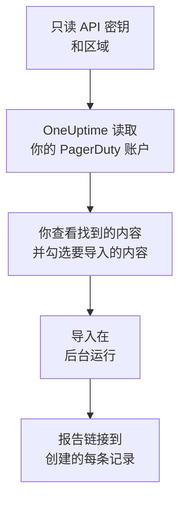

# 从 PagerDuty 迁移

**从其他工具导入** 只需几分钟就能把你的 PagerDuty 配置迁移到 OneUptime。使用一个只读的 PagerDuty API 密钥，OneUptime 会读取你的用户、团队、计划、升级策略和服务，展示找到的内容，并创建你勾选的内容。PagerDuty 中的任何内容都不会改变。

:::cards
- [导入你的账户](#导入你的-pagerduty-账户): 创建密钥，读取你的账户，并勾选要导入的内容。
- [会导入什么](#会导入什么): 每条 PagerDuty 记录在 OneUptime 中会变成什么。
- [完成迁移](#完成迁移): 导入完成后要做的事。
:::

## 工作原理

- **密钥只使用一次。** OneUptime 读取你的账户期间，密钥会加密保存；读取一结束，无论成功与否，密钥都会立即删除。它不会再次显示，也不会写入任何日志。
- **OneUptime 只读取。** 它只调用 PagerDuty 自己的 REST API：`api.pagerduty.com`，欧洲账户则是 `api.eu.pagerduty.com`。当 PagerDuty 要求放慢速度时，它会等待后重试。
- **在你开始导入之前，不会创建任何内容。** 预览会为每一项显示：它是新的、已在 OneUptime 中（并按原样使用）、已由之前的导入带入，或者无法导入的原因。
- **再次运行绝不会重复创建。** OneUptime 会按 PagerDuty ID 记住每次导入带入的内容。在 PagerDuty 中添加人员或计划后再次运行，只会创建新的内容。

## 开始之前

- **一个 OneUptime 项目，以及创建所导入内容的权限。** 项目所有者和项目管理员可以导入所有内容。其他角色也可以运行导入，并导入他们有权创建的记录类型。其余内容会显示为不导入，并附上原因。
- **一个只读的 PagerDuty REST API 密钥。** PagerDuty 的管理员和账户所有者可以创建。导入绝不会写入 PagerDuty，因此密钥只需要读取权限。
- **你的 PagerDuty 区域。** 如果你登录的地址以 `eu.pagerduty.com` 结尾，你的账户在欧洲；否则在美国。

## 导入你的 PagerDuty 账户

:::steps
### 在 PagerDuty 中创建 API 密钥
在 PagerDuty 中依次打开 **Integrations** > **Developer Tools** > **API Access Keys**，然后选择 **Create New API Key**。将描述填写为 `OneUptime import`，勾选 **Read-only API Key**，选择 **Create Key**，然后复制密钥。

### 打开导入页面
在 OneUptime 中依次打开 **项目设置** > **从其他工具导入**，然后选择 **PagerDuty**。

### 连接 PagerDuty
在 **你的 PagerDuty 账户在哪里？** 下选择 **美国** 或 **欧洲**。将密钥粘贴到 **PagerDuty API 密钥** 中，然后选择 **读取我的 PagerDuty 账户**。较大的账户需要几分钟，读取期间你可以离开页面。

### 勾选要导入的内容
预览按类型分节列出找到的内容。所有将被创建的内容一开始都已勾选，但在 PagerDuty 中关闭的服务，以及不在任何团队、计划或升级策略中的人员除外。每一项下面，OneUptime 会说明哪些内容不会原样导入。当勾选的项目用到了你未勾选的内容时，它会提示，**一并勾选** 可以把它们勾选上。

### 开始导入
如果要邀请人员，请在 **将新成员邀请到** 中选择他们加入的团队。然后选择 **开始导入**。导入在后台运行：你可以离开页面，报告会在那里等你。
:::

报告会统计已创建、已邀请和未导入的数量，并列出每一项及其对应记录的链接，失败的排在最前面。以前的导入列在同一页面的 **以前的导入** 下。

## 会导入什么

| PagerDuty 中 | OneUptime 中 | 方式 |
| --- | --- | --- |
| 用户 | 项目成员 | 按电子邮件地址匹配。尚未加入项目的人会被邀请加入你选择的团队。 |
| 团队 | 团队 | 连同成员一起创建。项目中已有同名团队时按原样使用，其成员保持不变。 |
| 计划 | 值班计划 | 每个层都会成为一个层，人员、开始时间、轮次长度和限制保持不变，使用计划的时区，并归计划所属团队所有。层保持原有顺序，因此上层仍然优先于下面的层。 |
| 升级策略 | 值班策略 | 每条升级规则都会成为一条升级规则，呼叫相同的计划和用户，并在相同的延迟后升级。策略的重复次数成为值班策略的重复次数。 |
| 服务 | 服务 | 在服务目录中创建，归其团队所有。在 PagerDuty 中关闭的服务一开始不勾选。 |

PagerDuty 的计划仍然是一个 OneUptime 计划：它的各层之间的优先关系与 PagerDuty 相同。轮次长度不是整小时的层，导入时轮次会取整到小时，预览会说明这一点。

## 不会导入什么

- **事件、告警及其历史。** OneUptime 从你的配置开始，而不是从过去的事件开始。
- **集成、Event Orchestrations、Incident Workflows 和状态页。** 请改为将你的监视器和告警来源指向 OneUptime，见 [完成迁移](#完成迁移)。
- **计划的覆盖，以及已经结束的层。** 导入后，在 OneUptime 中添加你仍然需要的覆盖。
- **基于班次的计划。** 导入读取的是 PagerDuty 分层的计划，而不是较新的基于班次的计划（shift-based schedules）。如果你的账户有这类计划，预览顶部会说明，呼叫其中某个计划的升级规则导入时不含该计划。请在 OneUptime 中创建它们。
- **每个人的通知规则。** 每个人在接受邀请后，在自己的 **用户设置** 中选择被呼叫的方式。
- **OneUptime 中没有完全对应项的规则。** 按轮流方式（round robin）分配人员的升级规则，在 OneUptime 中会同时呼叫所有人，预览会说明有哪些变化。

## 限制

一次导入最多创建 2,000 条记录：最多 500 人、200 个团队、200 个值班计划、200 个值班策略和 500 个服务。超出限制的内容会显示为不导入。再次运行导入即可带入其余部分。

在 OneUptime Cloud 上，你的套餐不包含的记录会显示为不导入，并注明所需的套餐。

预览保留一天。只有读取账户的人才能勾选内容并开始导入。项目所有者和项目管理员可以看到每次导入的进度和报告。

## 完成迁移

:::steps
### 检查值班计划
在 **值班** > **值班计划** 中打开每个计划，检查现在谁在值班、接下来是谁。

### 确保每个人都能被呼叫
被邀请的人接受邀请后，添加用于接收呼叫的电话号码、电子邮件地址或移动应用。**值班** > **就绪情况** 会显示哪些人还无法联系到。

### 将告警发送到 OneUptime
将你的监视器和发出告警的工具指向 OneUptime，并呼叫自己一次进行测试。

### 在 PagerDuty 中关闭呼叫
当 OneUptime 能呼叫到正确的人后，请在 PagerDuty 中关闭通知，以免有人被重复呼叫。
:::

## 故障排除

:::details PagerDuty 不接受 API 密钥
请检查你是否复制了完整的密钥、它是否是 **API Access Keys** 中的 REST API 密钥而不是集成密钥，以及你是否选择了账户所在的区域。然后选择 **重试**。
:::

:::details 预览中缺少某类记录
密钥无法读取该类记录，预览顶部会说明这一点。有些类型只在包含它们的 PagerDuty 套餐中提供，例如团队。请用能读取它们的密钥重新读取账户。
:::

:::details 有些项目无法勾选
每一项都会说明原因：项目中已有的名称、之前的导入已带入的内容，或者你无权创建、或你的套餐不包含的记录。
:::

## 后续步骤

:::cards
- [值班计划](/docs/on-call/schedules): 层、限制和交接。
- [升级规则](/docs/on-call/escalation-rules): 值班策略如何呼叫人员。
- [从 Opsgenie 迁移](/docs/moving-to-oneuptime/opsgenie): 从 Opsgenie 迁移团队。
:::
