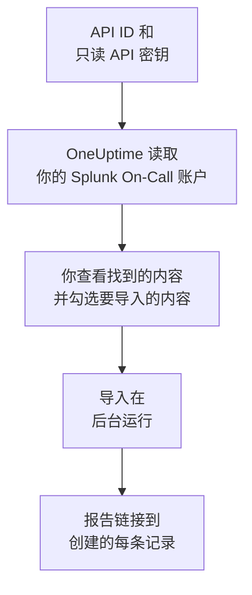

# 从 Splunk On-Call 迁移

**从其他工具导入** 只需几分钟就能把你的 Splunk On-Call（原名 VictorOps）配置迁移到 OneUptime。使用你的 API ID 和一个只读 API 密钥，OneUptime 会读取你的用户、团队、轮换和升级策略，展示找到的内容，并创建你勾选的内容。Splunk On-Call 中的任何内容都不会改变。

:::cards
- [导入你的账户](#导入你的-splunk-on-call-账户): 创建密钥，读取你的账户，并勾选要导入的内容。
- [会导入什么](#会导入什么): 每条 Splunk On-Call 记录在 OneUptime 中会变成什么。
- [完成迁移](#完成迁移): 导入完成后要做的事。
:::

## 工作原理

- **密钥只使用一次。** OneUptime 读取你的账户期间，密钥会与 API ID 一起加密保存；读取一结束，无论成功与否，密钥都会立即删除。它不会再次显示，也不会写入任何日志。
- **OneUptime 只读取。** 它只调用 Splunk On-Call 自己的 API：`api.victorops.com`。Splunk On-Call 对每类请求每秒最多应答两次，因此 OneUptime 会保持这个节奏；当 Splunk On-Call 要求放慢速度时，它会等待后重试。
- **在你开始导入之前，不会创建任何内容。** 预览会为每一项显示：它是新的、已在 OneUptime 中（并按原样使用）、已由之前的导入带入，或者无法导入的原因。
- **再次运行绝不会重复创建。** OneUptime 会按 Splunk On-Call ID 记住每次导入带入的内容。在 Splunk On-Call 中添加人员或轮换后再次运行，只会创建新的内容。

## 开始之前

- **一个 OneUptime 项目，以及创建所导入内容的权限。** 项目所有者和项目管理员可以导入所有内容。其他角色也可以运行导入，并导入他们有权创建的记录类型。其余内容会显示为不导入，并附上原因。
- **你的 Splunk On-Call API ID 和一个只读 API 密钥。** 两者都在 Splunk On-Call 的 **Integrations** > **API** 中。导入绝不会写入 Splunk On-Call，因此只读密钥就够了。

## 导入你的 Splunk On-Call 账户

:::steps
### 在 Splunk On-Call 中创建 API 密钥
在 Splunk On-Call 中依次打开 **Integrations** > **API**。你的 API ID 显示在 API 密钥上方。新建一个名为 `OneUptime import` 的 API 密钥，勾选 **Read-only**，然后复制 API ID 和密钥。

### 打开导入页面
在 OneUptime 中依次打开 **项目设置** > **从其他工具导入**，然后选择 **Splunk On-Call**。

### 连接 Splunk On-Call
将 API ID 粘贴到 **Splunk On-Call 的 API ID** 中，将密钥粘贴到 **Splunk On-Call API 密钥** 中，然后选择 **读取我的 Splunk On-Call 账户**。较大的账户需要几分钟，读取期间你可以离开页面。

### 勾选要导入的内容
预览按类型分节列出找到的内容。所有将被创建的内容一开始都已勾选，但不在任何团队、轮换或升级策略中的人员除外。每一项下面，OneUptime 会说明哪些内容不会原样导入。当勾选的项目用到了你未勾选的内容时，它会提示，**一并勾选** 可以把它们勾选上。

### 开始导入
如果要邀请人员，请在 **将新成员邀请到** 中选择他们加入的团队。然后选择 **开始导入**。导入在后台运行：你可以离开页面，报告会在那里等你。
:::

报告会统计已创建、已邀请和未导入的数量，并列出每一项及其对应记录的链接，失败的排在最前面。以前的导入列在同一页面的 **以前的导入** 下。

## 会导入什么

| Splunk On-Call 中 | OneUptime 中 | 方式 |
| --- | --- | --- |
| 用户 | 项目成员 | 按电子邮件地址匹配。尚未加入项目的人会被邀请加入你选择的团队。 |
| 团队 | 团队 | 连同成员一起创建。项目中已有同名团队时按原样使用，其成员保持不变。 |
| 轮换 | 值班计划 | 每个轮换都会成为一个归其团队所有的计划，其中每个班次都会成为一个层，人员、开始时间、交接以及值班的日期和时段保持不变。现在在 Splunk On-Call 中值班的人，在 OneUptime 中也在值班。 |
| 升级策略 | 值班策略 | 归策略所属团队所有。每个步骤都会成为一条升级规则，呼叫相同的轮换和用户。步骤的超时时间成为该步骤之前的等待时间，中间没有超时的步骤会一起呼叫。 |

同一轮换中同时值班的班次会各自成为一个 OneUptime 计划，因为 OneUptime 的计划同一时间只有一人值班。原先呼叫该轮换的每个值班策略都会呼叫所有这些计划。计划沿用轮换中第一个班次的时区，其他时区的班次会把时段换算到这个时区。

## 不会导入什么

- **事件、告警及其历史。** OneUptime 从你的配置开始，而不是从过去的事件开始。
- **集成、routing keys 和 alert rules。** 请改为将你的监视器和告警来源指向 OneUptime，见 [完成迁移](#完成迁移)。
- **计划好的覆盖。** 导入后，在 OneUptime 中添加你仍然需要的覆盖。
- **每个人的呼叫策略。** 每个人在接受邀请后，在自己的 **用户设置** 中选择被呼叫的方式。
- **OneUptime 中没有完全对应项的步骤。** 调用 webhook 或转到另一个升级策略的步骤不会导入，向不属于任何被导入人员的地址发送邮件的步骤也不会导入。呼叫下一位或上一位值班人员的步骤会呼叫当前值班的人，预览会说明有哪些变化。

## 限制

一次导入最多创建 2,000 条记录：最多 500 人、200 个团队、200 个值班计划和 200 个值班策略。超出限制的内容会显示为不导入。再次运行导入即可带入其余部分。

在 OneUptime Cloud 上，你的套餐不包含的记录会显示为不导入，并注明所需的套餐。

预览保留一天。只有读取账户的人才能勾选内容并开始导入。项目所有者和项目管理员可以看到每次导入的进度和报告。

## 完成迁移

:::steps
### 检查值班计划
在 **值班** > **值班计划** 中打开每个计划，检查现在谁在值班、接下来是谁。

### 确保每个人都能被呼叫
被邀请的人接受邀请后，添加用于接收呼叫的电话号码、电子邮件地址或移动应用。**值班** > **就绪情况** 会显示哪些人还无法联系到。

### 将告警发送到 OneUptime
将你的监视器和发出告警的工具指向 OneUptime，并呼叫自己一次进行测试。

### 在 Splunk On-Call 中关闭呼叫
当 OneUptime 能呼叫到正确的人后，请在 Splunk On-Call 中关闭通知，以免有人被重复呼叫。
:::

## 故障排除

:::details Splunk On-Call 不接受 API ID 和 API 密钥
请检查你是否从 **Integrations** > **API** 复制了 API ID 和完整的密钥，以及该密钥是否已在那里被删除。然后选择 **重试**。
:::

:::details 预览中缺少某类记录
密钥无法读取该类记录，预览顶部会说明这一点。请在 **Integrations** > **API** 中检查密钥，然后重新读取账户。
:::

:::details 有些项目无法勾选
每一项都会说明原因：项目中已有的名称、之前的导入已带入的内容，或者你无权创建、或你的套餐不包含的记录。
:::

## 后续步骤

:::cards
- [值班计划](/docs/on-call/schedules): 层、限制和交接。
- [升级规则](/docs/on-call/escalation-rules): 值班策略如何呼叫人员。
- [从 PagerDuty 迁移](/docs/moving-to-oneuptime/pagerduty): 从 PagerDuty 迁移团队。
:::
