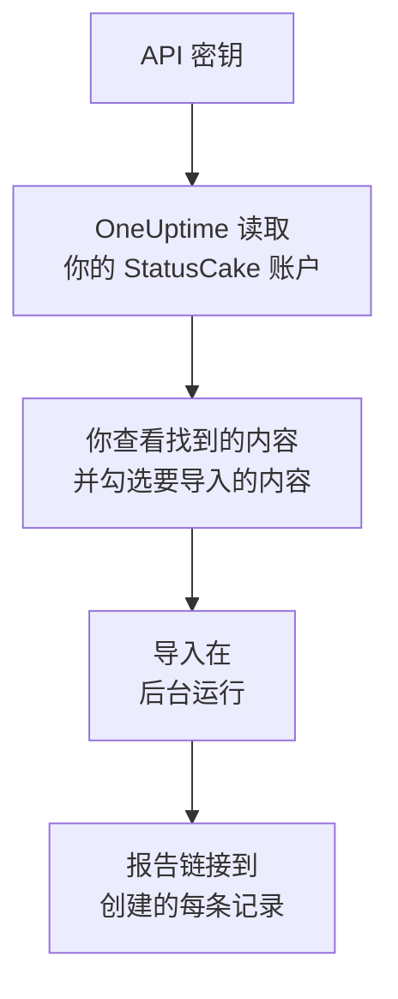

# 从 StatusCake 迁移

**从其他工具导入** 只需几分钟就能把你的 StatusCake 检查迁移到 OneUptime。使用一个 StatusCake API 密钥，OneUptime 会读取你的可用性、SSL 和心跳检查，展示找到的内容，并创建你勾选的内容。StatusCake 中的任何内容都不会改变。

:::cards
- [导入你的账户](#导入你的-statuscake-账户): 创建密钥，读取你的账户，并勾选要导入的内容。
- [会导入什么](#会导入什么): 每个 StatusCake 检查会变成哪种 OneUptime 监视器。
- [完成迁移](#完成迁移): 导入完成后要做的事。
:::

## 工作原理

- **密钥只使用一次。** OneUptime 读取你的账户期间，密钥会加密保存；读取一结束，无论成功与否，密钥都会立即删除。它不会再次显示，也不会写入任何日志。
- **OneUptime 只读取。** 它只调用 StatusCake 自己的 API：`api.statuscake.com`。它每秒发送一个请求，不超过 StatusCake 允许 Free 账户的每分钟 60 个请求。当 StatusCake 要求放慢速度时，它会等待后重试。
- **在你开始导入之前，不会创建任何内容。** 预览会为每一项显示：它是新的、已在 OneUptime 中（并按原样使用）、已由之前的导入带入，或者无法导入的原因。
- **再次运行绝不会重复创建。** OneUptime 会按 StatusCake ID 记住每次导入带入的内容。在 StatusCake 中添加检查后再次运行，只会创建新的内容。

## 开始之前

- **一个 OneUptime 项目，以及创建所导入内容的权限。** 项目所有者和项目管理员可以导入所有内容。其他角色也可以运行导入，并导入他们有权创建的记录类型。其余内容会显示为不导入，并附上原因。
- **一个 StatusCake API 密钥。** 导入绝不会写入 StatusCake。
- **付款方式（OneUptime Cloud）。** 执行检查的监视器即使在 Free 套餐中也会按用量计费，因此请在导入前于 **项目设置** > **账单** 中添加付款方式。没有付款方式时，这些监视器会显示为不导入。

## 导入你的 StatusCake 账户

:::steps
### 在 StatusCake 中创建 API 密钥
在 StatusCake 中打开账户面板，然后进入 **API Keys**。创建一个名为 `OneUptime import` 的密钥并复制。

### 打开导入页面
在 OneUptime 中，进入 **项目设置** > **从其他工具导入**，然后选择 **StatusCake**。

### 连接 StatusCake
将密钥粘贴到 **StatusCake API 密钥** 中，然后选择 **读取我的 StatusCake 账户**。大型账户需要几分钟，读取期间你可以离开页面。

### 勾选要导入的内容
预览按类型分节列出找到的内容。所有将被创建的内容一开始都已勾选，但在 StatusCake 中已暂停的检查除外；勾选它们后会以暂停状态导入。每一项下面，OneUptime 会说明哪些内容不会原样导入。

### 开始导入
选择 **开始导入**。导入在后台运行：你可以离开页面，报告会在那里等你。
:::

报告会统计已创建和未导入的数量，并列出每一项及其对应记录的链接，失败的排在最前面。以前的导入列在同一页面的 **以前的导入** 下。

## 会导入什么

| 在 StatusCake 中 | 在 OneUptime 中 | 方式 |
| --- | --- | --- |
| Uptime, SSL and heartbeat checks | 监视器 | 每个检查都会变成同类型的监视器，地址、间隔、超时以及页面应当（或不应当）包含的文本都相同。 |

- **HTTP 和 HEAD 检查** 会变成网站监视器；如果它们发送数据或标头，则变成 API 监视器。StatusCake 列出会触发告警的状态码：其他任何状态码在 OneUptime 中也都视为正常。
- **Ping 和 TCP 检查** 会变成 Ping 和端口监视器。**SMTP 和 SSH 检查** 会变成对应端口的端口监视器：OneUptime 只检查端口是否响应，不检查其上的通信。
- **DNS 检查** 会变成询问同一台服务器的 DNS 监视器。
- **SSL 检查** 会变成 SSL 证书监视器，提前警告的时间与第一次告警相同。带有 SSL 告警的可用性检查也会获得一个。
- **心跳检查** 会变成入站请求监视器，在周期内没有收到请求时判定为故障。每个监视器在 OneUptime 中都有新地址。

每个监视器都由项目的探测器检查，和你自己创建的监视器一样。OneUptime 不提供的检查间隔会改为最接近的可用间隔，超过一分钟的超时会改为一分钟。任一项发生变化时，预览都会说明。

## 不会导入什么

- **可用性历史、响应时间和事件。** OneUptime 从导入完成时开始检查。
- **告警联系人和集成。** 请按 [完成迁移](#完成迁移) 中的说明，在 OneUptime 中选择通知谁。
- **密码，以及可能包含机密信息的标头。** 需要登录的监视器，或发送 `Authorization`、Cookie 或令牌标头的监视器，会去掉这些内容后导入：请用 [监视器密钥](/docs/monitor/monitor-secrets) 添加。
- **DNS 检查期望的地址。** 请在 OneUptime 中将其添加为标准。
- **页面速度、域名和服务器检查。** OneUptime 有自己的 [域名监视器](/docs/monitor/domain-monitor) 和服务器监控，请改为设置它们。
- **维护窗口。** 预览会统计数量：请在 OneUptime 中将其安排为计划维护。

## 限制

一次导入最多创建 2,000 条记录，其中最多 1,000 个监视器。超出限制的内容会显示为不导入。再次运行导入即可带入其余部分。

在 OneUptime Cloud 上，执行检查的监视器需要付款方式，套餐没有空间容纳的内容会显示为不导入，并注明所需条件。

预览保留一天。只有读取账户的人才能勾选内容并开始导入。项目所有者和项目管理员可以看到每次导入的进度和报告。

## 完成迁移

:::steps
### 检查你的监视器
在 **监视器** 下打开每个监视器，检查它的首批结果。心跳监视器有一个新地址：请让调用它的任务改为指向该地址。

### 选择通知谁
为监视器添加所有者，或为它们创建的事件设置 **值班** > **值班策略** 中的值班策略，这样出现故障时会通知到合适的人。

### 在 StatusCake 中关闭检查
当 OneUptime 检查相同的内容后，请在 StatusCake 中暂停这些检查，以免有人收到重复通知。
:::

## 故障排除

:::details StatusCake 不接受 API 密钥
请检查你是否从 **API Keys** 复制了完整的密钥，以及它是否已被删除。然后选择 **重试**。
:::

:::details 某个监视器显示为不导入
它会说明原因：OneUptime 没有的监视器类型、OneUptime 无法读取的地址，或者项目没有空间或没有付款方式来容纳它。如果 OneUptime 已经运行着名称、类型和地址都相同的监视器，会直接使用该监视器。
:::

:::details 有些项目无法勾选
每一项都会说明原因：项目中已有的名称、之前的导入已带入的内容，或者你无权创建、或你的套餐不包含的记录。
:::

## 后续步骤

:::cards
- [网站监控](/docs/monitor/website-monitor): 网站监视器检查什么，以及如何检查。
- [SSL 证书监控](/docs/monitor/ssl-certificate-monitor): OneUptime 如何在证书到期前发出警告。
- [从 Uptime Kuma 迁移](/docs/moving-to-oneuptime/uptime-kuma): 从 Uptime Kuma 迁移你的检查。
:::
