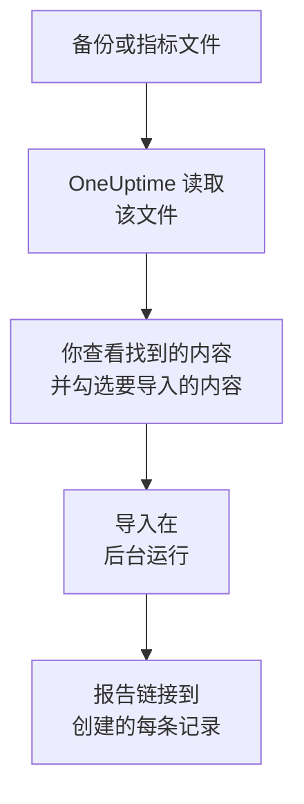

# 从 Uptime Kuma 迁移

Uptime Kuma 运行在你自己的机器上，因此 **从其他工具导入** 通过文件而不是密钥来读取它：Uptime Kuma 1 导出的备份，或任何版本都提供的指标页面。OneUptime 从中读取你的监视器，展示找到的内容，并创建你勾选的内容。Uptime Kuma 中的任何内容都不会改变。

:::cards
- [导入你的监视器](#导入你的-uptime-kuma-监视器): 保存文件，读取它，并勾选要导入的内容。
- [会导入什么](#会导入什么): 每个 Uptime Kuma 监视器在 OneUptime 中会变成什么。
- [完成迁移](#完成迁移): 导入完成后要做的事。
:::

## 工作原理

- **文件只读取一次。** OneUptime 在上传时读取文件以查找你的监视器，从不保存文件。文件中的密码、令牌和推送密钥绝不会被复制。
- **OneUptime 从不连接 Uptime Kuma。** 所有内容都来自文件。既不是 Uptime Kuma 备份也不是其指标页面的文件会被拒绝，并说明原因。
- **在你开始导入之前，不会创建任何内容。** 预览会为每一项显示：它是新的、已在 OneUptime 中（并按原样使用）、已由之前的导入带入，或者无法导入的原因。
- **再次运行绝不会重复创建。** OneUptime 会按 Uptime Kuma ID 记住每次导入带入的内容。添加监视器后读取较新的文件，只会创建新的内容。

## 开始之前

- **一个 OneUptime 项目，以及创建所导入内容的权限。** 项目所有者和项目管理员可以导入所有内容。其他角色也可以运行导入，并导入他们有权创建的记录类型。其余内容会显示为不导入，并附上原因。
- **一个来自 Uptime Kuma 的文件。** 在 Uptime Kuma 1 中，JSON 备份包含每个监视器及其设置。Uptime Kuma 2 没有备份，因此请改为保存它的指标页面：其中列出每个监视器的名称、类型和地址，但不包含检查频率或检查内容。
- **付款方式（OneUptime Cloud）。** 执行检查的监视器即使在 Free 套餐中也会按用量计费，因此请在导入前于 **项目设置** > **账单** 中添加付款方式。没有付款方式时，这些监视器会显示为不导入。

## 导入你的 Uptime Kuma 监视器

:::steps
### 在 Uptime Kuma 中保存文件
在 Uptime Kuma 1 中，依次进入 **Settings** > **Backup**，然后选择 **Export**。在 Uptime Kuma 2 中，在 **Settings** > **API Keys** 下添加一个密钥，打开你的 Uptime Kuma 的 `/metrics`，用户名留空、以该密钥作为密码登录，然后将页面另存为文本文件。

### 打开导入页面
在 OneUptime 中，进入 **项目设置** > **从其他工具导入**，然后选择 **Uptime Kuma**。

### 读取文件
在 **Uptime Kuma 备份或指标文件** 下选择 **选择文件**，选中你保存的文件，然后选择 **读取文件**。OneUptime 会立即读取并显示找到的内容。

### 勾选要导入的内容
预览按类型分节列出找到的内容。所有将被创建的内容一开始都已勾选，但在 Uptime Kuma 中已暂停的监视器除外；勾选它们后会以暂停状态导入。每一项下面，OneUptime 会说明哪些内容不会原样导入。

### 开始导入
选择 **开始导入**。导入在后台运行：你可以离开页面，报告会在那里等你。
:::

报告会统计已创建和未导入的数量，并列出每一项及其对应记录的链接，失败的排在最前面。以前的导入列在同一页面的 **以前的导入** 下。

## 会导入什么

| 在 Uptime Kuma 中 | 在 OneUptime 中 | 方式 |
| --- | --- | --- |
| Monitors | 监视器 | 从备份导入时，每个监视器都会变成同类型的监视器，地址、间隔、超时以及视为正常的状态码都相同。从指标页面导入时，每个监视器都以每五分钟检查一次的设置导入：请在导入后逐个检查。 |

- **HTTP(S) 和关键字监视器** 会变成网站监视器；如果它们发送其他方法、标头或 JSON 正文，则变成 API 监视器，关键字也会按原样设置。
- **JSON 查询监视器** 会变成不含查询的 API 监视器：请在 OneUptime 中将查询添加为标准。
- **Ping、端口和 DNS 监视器** 会变成 Ping、端口和 DNS 监视器。
- **推送监视器** 会变成入站请求监视器，在间隔及其重试期间内没有收到请求时判定为故障。每个监视器在 OneUptime 中都有新地址。
- **手动监视器** 仍然是手动监视器。**分组** 是文件夹，因此其中的监视器会分别导入。
- **证书到期。** 在证书到期前发出警告的监视器，还会获得一个以它命名的 SSL 证书监视器。

每个监视器都由项目的探测器检查，和你自己创建的监视器一样。OneUptime 不提供的检查间隔会改为最接近的可用间隔，超过一分钟的超时会改为一分钟。任一项发生变化时，预览都会说明。

## 不会导入什么

- **可用性历史、响应时间和事件。** OneUptime 从导入完成时开始检查。
- **通知。** 请按 [完成迁移](#完成迁移) 中的说明，在 OneUptime 中选择通知谁。
- **密码，以及可能包含机密信息的标头。** 需要登录的监视器，或发送 `Authorization`、Cookie 或令牌标头的监视器，会去掉这些内容后导入：请用 [监视器密钥](/docs/monitor/monitor-secrets) 添加。
- **反转（upside down）监视器**，即检查失败时视为正常的监视器。OneUptime 没有这样工作的监视器。
- **Docker、数据库、游戏服务器、MQTT 以及 OneUptime 中没有对应项的其他监视器。** 预览会逐一列出。
- **状态页和维护。** 请在 OneUptime 中创建你需要的状态页，并在其中显示导入的监视器。

## 限制

一次导入最多创建 2,000 条记录，其中最多 1,000 个监视器。文件最大为 10 MB。超出限制的内容会显示为不导入。再次运行导入即可带入其余部分。

在 OneUptime Cloud 上，执行检查的监视器需要付款方式，套餐没有空间容纳的内容会显示为不导入，并注明所需条件。

预览保留一天。只有读取文件的人才能勾选内容并开始导入。项目所有者和项目管理员可以看到每次导入的进度和报告。

## 完成迁移

:::steps
### 检查你的监视器
在 **监视器** 下打开每个监视器，检查它的首批结果。心跳监视器有一个新地址：请让调用它的任务改为指向该地址。

### 选择通知谁
为监视器添加所有者，或为它们创建的事件设置 **值班** > **值班策略** 中的值班策略，这样出现故障时会通知到合适的人。

### 在 Uptime Kuma 中关闭检查
当 OneUptime 检查相同的内容后，请在 Uptime Kuma 中暂停这些检查，以免有人收到重复通知。
:::

## 故障排除

:::details 文件被拒绝
OneUptime 会说明原因：文件超过 10 MB、不是有效的 JSON，或者既不是 Uptime Kuma 备份也不是其指标页面。请重新导出备份，或将 `/metrics` 重新保存为纯文本，然后再次选择。
:::

:::details 某个监视器显示为不导入
它会说明原因：OneUptime 没有的监视器类型、OneUptime 无法读取的地址，或者项目没有空间或没有付款方式来容纳它。如果 OneUptime 已经运行着名称、类型和地址都相同的监视器，会直接使用该监视器。
:::

:::details 有些项目无法勾选
每一项都会说明原因：项目中已有的名称、之前的导入已带入的内容，或者你无权创建、或你的套餐不包含的记录。
:::

## 后续步骤

:::cards
- [网站监控](/docs/monitor/website-monitor): 网站监视器检查什么，以及如何检查。
- [入站请求监控](/docs/monitor/incoming-request-monitor): 心跳在 OneUptime 中如何工作。
- [从 UptimeRobot 迁移](/docs/moving-to-oneuptime/uptimerobot): 从 UptimeRobot 迁移你的检查。
:::
