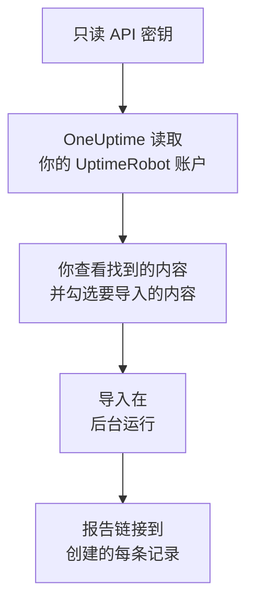

# 从 UptimeRobot 迁移

**从其他工具导入** 只需几分钟就能把你的 UptimeRobot 监视器和状态页迁移到 OneUptime。使用一个只读的 UptimeRobot API 密钥，OneUptime 会读取你的监视器和公开状态页，展示找到的内容，并创建你勾选的内容。UptimeRobot 中的任何内容都不会改变。

:::cards
- [导入你的账户](#导入你的-uptimerobot-账户): 创建密钥，读取你的账户，并勾选要导入的内容。
- [会导入什么](#会导入什么): 每个 UptimeRobot 监视器和状态页在 OneUptime 中会变成什么。
- [完成迁移](#完成迁移): 导入完成后要做的事。
:::

## 工作原理

- **密钥只使用一次。** OneUptime 读取你的账户期间，密钥会加密保存；读取一结束，无论成功与否，密钥都会立即删除。它不会再次显示，也不会写入任何日志。
- **OneUptime 只读取。** 它只调用 UptimeRobot 自己的 API：`api.uptimerobot.com`。它每六秒发送一个请求，不超过 UptimeRobot 允许 Free 账户的每分钟十个请求，因此大型账户需要几分钟。当 UptimeRobot 要求放慢速度时，它会等待后重试。
- **在你开始导入之前，不会创建任何内容。** 预览会为每一项显示：它是新的、已在 OneUptime 中（并按原样使用）、已由之前的导入带入，或者无法导入的原因。
- **再次运行绝不会重复创建。** OneUptime 会按 UptimeRobot ID 记住每次导入带入的内容。在 UptimeRobot 中添加监视器后再次运行，只会创建新的内容。

## 开始之前

- **一个 OneUptime 项目，以及创建所导入内容的权限。** 项目所有者和项目管理员可以导入所有内容。其他角色也可以运行导入，并导入他们有权创建的记录类型。其余内容会显示为不导入，并附上原因。
- **一个 UptimeRobot API 密钥。** Read-only API key 就足够了：导入绝不会写入 UptimeRobot。Main API key 也可以，但单个监视器的密钥只能读取该监视器。
- **付款方式（OneUptime Cloud）。** 执行检查的监视器即使在 Free 套餐中也会按用量计费，因此请在导入前于 **项目设置** > **账单** 中添加付款方式。没有付款方式时，这些监视器会显示为不导入。

## 导入你的 UptimeRobot 账户

:::steps
### 在 UptimeRobot 中创建 API 密钥
在 UptimeRobot 中，依次进入 **Integrations & API** > **API**。创建一个 **Read-only API key**，或复制已有的密钥。

### 打开导入页面
在 OneUptime 中，进入 **项目设置** > **从其他工具导入**，然后选择 **UptimeRobot**。

### 连接 UptimeRobot
将密钥粘贴到 **UptimeRobot API 密钥** 中，然后选择 **读取我的 UptimeRobot 账户**。大型账户需要几分钟，读取期间你可以离开页面。

### 勾选要导入的内容
预览按类型分节列出找到的内容。所有将被创建的内容一开始都已勾选，但在 UptimeRobot 中已暂停的监视器除外；勾选它们后会以暂停状态导入。每一项下面，OneUptime 会说明哪些内容不会原样导入。当勾选的状态页显示了你未勾选的监视器时，它会提示，**一并勾选** 可以把它们勾选上。

### 开始导入
选择 **开始导入**。导入在后台运行：你可以离开页面，报告会在那里等你。
:::

报告会统计已创建和未导入的数量，并列出每一项及其对应记录的链接，失败的排在最前面。以前的导入列在同一页面的 **以前的导入** 下。

## 会导入什么

| 在 UptimeRobot 中 | 在 OneUptime 中 | 方式 |
| --- | --- | --- |
| Monitors | 监视器 | 每个监视器都会变成同类型的监视器，地址、间隔、超时以及视为正常的状态码都相同。 |
| Public status pages | 状态页 | 每个页面显示相同的监视器：页面指定的、带有页面标签的，或者全部监视器，可用率和历史条也和原来一样。设有密码的页面会以私有方式导入。 |

- **HTTP(S) 和关键字监视器** 会变成网站监视器；如果它们发送其他方法、标头或 JSON 正文，则变成 API 监视器。关键字监视器和在 UptimeRobot 中一样，在关键字出现或缺失时判定为故障，并精确匹配关键字，区分大小写。
- **Ping 和端口监视器** 会变成 Ping 和端口监视器。
- **心跳监视器** 会变成入站请求监视器，在间隔加宽限期内没有收到请求时判定为故障。每个监视器在 OneUptime 中都有新地址。
- **DNS 和 API 监视器** 会变成 DNS 和 API 监视器。
- **SSL 到期提醒。** 在证书到期前发出警告的监视器，还会获得一个以它命名、提前同样天数警告的 SSL 证书监视器。

每个监视器都由项目的探测器检查，和你自己创建的监视器一样。OneUptime 不提供的检查间隔会改为最接近的可用间隔，超过一分钟的超时会改为一分钟。任一项发生变化时，预览都会说明。

## 不会导入什么

- **可用性历史、响应时间和事件。** OneUptime 从导入完成时开始检查。
- **告警联系人和集成。** 请按 [完成迁移](#完成迁移) 中的说明，在 OneUptime 中选择通知谁。
- **密码，以及可能包含机密信息的标头。** 需要登录的监视器，或发送 `Authorization`、Cookie 或令牌标头的监视器，会去掉这些内容后导入：请用 [监视器密钥](/docs/monitor/monitor-secrets) 添加。
- **UDP、视觉对比和依赖监视器。** OneUptime 没有能做同样事情的监视器，预览会逐一列出。
- **在端口打开时告警的端口监视器。** 它们的行为与 OneUptime 的端口监视器相反。
- **DNS 监视器期望的应答，以及 API 监视器的断言。** 请在 OneUptime 中将其添加为标准。
- **维护窗口。** 预览会统计数量：请在 OneUptime 中将其安排为计划维护。
- **状态页自己的域名和品牌。** 在 OneUptime 中，在 **自定义域名** 下添加域名，在 **品牌** 下添加徽标。

## 限制

一次导入最多创建 2,000 条记录：最多 1,000 个监视器和 50 个状态页。超出限制的内容会显示为不导入。再次运行导入即可带入其余部分。

在 OneUptime Cloud 上，执行检查的监视器需要付款方式，套餐没有空间容纳的内容会显示为不导入，并注明所需条件。

预览保留一天。只有读取账户的人才能勾选内容并开始导入。项目所有者和项目管理员可以看到每次导入的进度和报告。

## 完成迁移

:::steps
### 检查你的监视器
在 **监视器** 下打开每个监视器，检查它的首批结果。心跳监视器有一个新地址：请让调用它的任务改为指向该地址。

### 选择通知谁
为监视器添加所有者，或为它们创建的事件设置 **值班** > **值班策略** 中的值班策略，这样出现故障时会通知到合适的人。

### 将状态页的地址指向 OneUptime
在 **状态页面** 下打开页面，在 **自定义域名** 中添加你的域名，然后修改它的 DNS 记录。这样访客和订阅者就会访问新页面。

### 在 UptimeRobot 中关闭检查
当 OneUptime 检查相同的内容后，请在 UptimeRobot 中暂停这些检查，以免有人收到重复通知。
:::

## 故障排除

:::details UptimeRobot 不接受 API 密钥
请检查你是否复制了完整的密钥，以及它是否是 **Integrations & API** 中账户的 Read-only 或 Main API key，而不是单个监视器的密钥。然后选择 **重试**。
:::

:::details 某个监视器显示为不导入
它会说明原因：OneUptime 没有的监视器类型、OneUptime 无法读取的地址，或者项目没有空间或没有付款方式来容纳它。如果 OneUptime 已经运行着名称、类型和地址都相同的监视器，会直接使用该监视器。
:::

:::details 有些项目无法勾选
每一项都会说明原因：项目中已有的名称、之前的导入已带入的内容，或者你无权创建、或你的套餐不包含的记录。
:::

## 后续步骤

:::cards
- [网站监控](/docs/monitor/website-monitor): 网站监视器检查什么，以及如何检查。
- [入站请求监控](/docs/monitor/incoming-request-monitor): 心跳在 OneUptime 中如何工作。
- [从 Pingdom 迁移](/docs/moving-to-oneuptime/pingdom): 从 Pingdom 迁移你的检查。
:::
