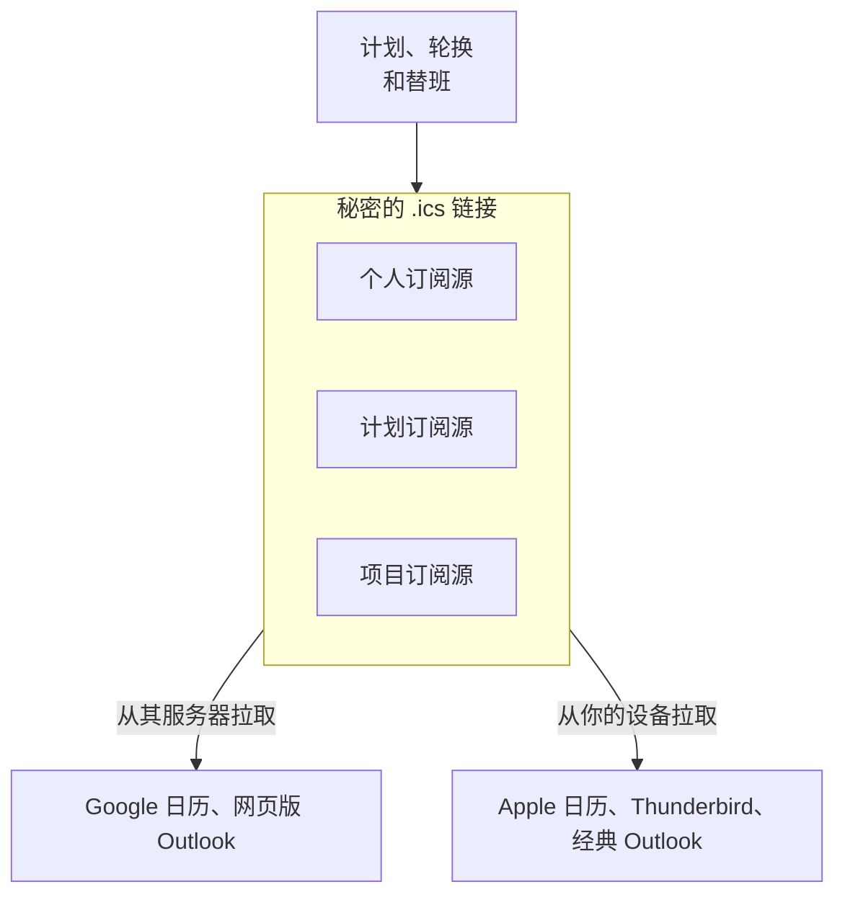

# 日历订阅源

日历订阅源会把你的值班班次放进你平时查看的日历。OneUptime 为每个人、每个计划和每个项目发布一个秘密的 iCalendar（`.ics`）链接；Google 日历、Outlook、Apple 日历、Thunderbird，以及任何能按 URL 订阅日历的应用，都会定期拉取这个链接，并为每个班次显示一个日程。无需安装任何东西，也无需连接任何账户：链接就是全部的集成。



> [!NOTE]
> 订阅的日历用于 **规划** 。日历应用会按自己的节奏重新拉取订阅源——Google 日历每 8 到 24 小时才拉取一次——因此班次开始前一小时做的调换，会通过 OneUptime 自己的提醒、重新分配通知和呼叫通知到你，而不是通过日历。

## 你会得到什么

- 每个班次一个日程。在个人订阅源中标题为 `On-call · <Schedule>` （当计划恰好关联一个升级策略时，会追加 ` · <Policy>` ），在共享订阅源中为 `<Name> · On-call · <Schedule>` 。描述中列出谁在值班、计划及其时区、所在层、以计划时区、UTC 和你的时区表示的班次时间、通过此计划呼叫你的升级策略，以及仪表板中该计划的链接。
- 会遵循替班。有人替你值班时，日程会转给对方（追加 `(covering for <Name>)` ），并在你的日历应用中保持为同一个日程，因此会就地更新而不是重复出现。部分替班会把班次拆成首尾相接的几个日程。
- 默认包含过去两天和未来 90 天。你可以扩展到过去 60 天和未来 180 天；超过 5,000 个日程的订阅源会被缩短，并在日历描述中说明。
- 日程标记为空闲（ `TRANSP:TRANSPARENT` ），因此订阅源永远不会占用你的忙闲状态；也没有任何内容标记为私密，因此共享的团队日历会向所有能看到它的人显示标题。
- 时间以 UTC 发送，由你的日历应用转换；描述中会写出计划时区和你的时区下的时钟时间。在你的 **个人资料** （仪表板右上角的头像）中将你自己的时区设为 **时区** ，计划的时区则在其 **层** 页面的 **Schedule timezone** 卡片中设置。没有时区的计划按服务器时区展开，与呼叫一致，日程中会说明这一点。

固定分配——在升级策略规则中直接指定的用户或团队——没有开始和结束时间，不会出现在任何订阅源中。在 OneUptime Cloud 上，订阅源与值班计划使用相同的套餐（Growth）；低于该套餐的项目会得到一个空日历，而不是错误。

## 三种链接

| 链接 | 谁创建 | 包含什么 | 位置 |
| --- | --- | --- | --- |
| **个人订阅源** | 每个用户，每个项目一个 | 你在该项目所有计划中的班次，以及你替别人值的班次（可选） | **用户设置** > **日历** > **日历订阅** |
| **计划订阅源** | 能编辑该计划的人；能读取的人可以复制链接 | 一个计划中所有人的班次，可选包含覆盖空档日程 | 计划页面上的 **订阅此排班** 卡片 |
| **项目订阅源** | 能编辑值班计划的人；能读取的人可以复制链接 | 项目中所有计划里所有人的班次，可选包含覆盖空档日程 | **值班** > **日历订阅** |

链接形如：

```text
https://<your host>/api/on-call-calendar/user/<token>/shifts.ics
https://<your host>/api/on-call-calendar/schedule/<token>/schedule.ics
https://<your host>/api/on-call-calendar/project/<token>/project.ics
```

> [!WARNING]
> 路径中 43 个字符的令牌是唯一的凭据——不涉及登录、Cookie 或 API 密钥。请像对待密码一样对待这些链接。

## 你的个人订阅源

个人订阅源按项目划分：第二个项目会有第二个链接和第二个日历。

:::steps
### 打开你的日历订阅

在你想查看其班次的项目中打开 **用户设置** > **日历** > **日历订阅** 。 **日历** 是侧边菜单中的一个分组，初始为折叠状态。

### 生成链接

点击 **生成日历链接** 。 **订阅您的值班班次** 卡片现在提供一个统一的订阅流程：

- **添加到您的日历**： **Google 日历** 会打开 Google 日历，并询问是否添加该日历。 **Apple 日历 / Outlook** 会在你的电脑或手机用于订阅的应用中打开链接的 `webcal://` 形式：Mac、iPhone 或 iPad 上是 Apple 日历，Windows 上是 Outlook。
- **或复制链接**： **复制链接** 会复制 `https://` 链接，供任何其他能按 URL 订阅日历的应用使用。在你点击显示之前，链接在页面上是隐藏的。

### 订阅链接

按照下方"在日历应用中订阅"里你所用应用的步骤操作。应用下次拉取链接时，你的班次就会显示为日程：请参阅"日历多久刷新一次"。
:::

### 订阅源设置

在 **日历订阅设置** 卡片上点击 **编辑设置** ，即可更改链接包含的内容：

| 设置 | 作用 |
| --- | --- |
| **包含我为他人代班的班次** | 默认开启。添加你因替班而在本不属于的计划中获得的班次。 |
| **过去班次天数** | 日历向前追溯的范围（默认 2，最多 60）。 |
| **向前天数** | 日历向后覆盖的范围（默认 90，介于 7 和 180 之间）。 |

状态行会显示链接最后一次被拉取的时间、由哪个日历应用拉取、拉取了多少次，以及令牌的最后四个字符，便于区分不同链接。如果两天后仍没有任何应用拉取过链接，页面会询问服务器能否从互联网访问（请参阅"故障排除"）。

### 管理链接

| 操作 | 结果 |
| --- | --- |
| **重新生成链接** | 生成新令牌。所有订阅旧链接的应用都不再更新：在 30 天内旧链接提供空日历，让这些应用清空副本，之后返回 404。请用新链接重新订阅。 |
| **禁用** | 保留链接，但在你重新启用之前提供空日历。 |
| **删除** | 删除链接。仍在拉取它的应用会收到 404，并继续显示最后一次拉取的内容——如果希望它们清空，请先禁用。 |

### 即将到来的班次和代班

页面还会列出你的 **Upcoming shifts** （未来 30 天）以及下文介绍的 **班次前提醒我** 卡片。你自己的每个班次都有一个 **找人代班** 链接：它会在班次所在项目中打开用户替班，并为该班次预填一条新替班，你作为 **谁不在岗？** ，班次时间作为 **开始** 和 **结束** （如果班次已开始，则从现在开始），因此只需填写 **谁代班？** 。替班会在这段时间内把你来自所有值班策略的呼叫都发给代班的人；只存在于某个策略内部的班次，则改在该策略的用户替班页面上安排代班。你替别人值的班次没有 **找人代班** ：替班不会链式传递，所以替代班再找人代班不会改变任何事。

同一个个人链接用 `?schedule=<id>` 筛选到某个计划后，会以 **仅此排班中我的班次** 的形式出现在每个计划的页面上；值班横幅和 **我的值班策略** 页面也有一个指向上述页面的 **将您的班次添加到日历** 链接。

### 在移动应用中

在移动应用中： **On-Call** > **Add shifts to my calendar** （也在 **Settings** > **Calendar feed** 下），每个项目一个链接。在 iPhone 上， **Open in Calendar** 会打开系统的订阅界面。Android 上无法在手机端订阅 URL，因此该界面提供 **Share link** 和 **Copy https link** ，并提示你在电脑上添加链接，之后它会同步到手机。应用的 **Your shifts** 列表来自同样的数据，也有同样的 **Get cover** 操作。

## 在日历应用中订阅

如果你的应用有对应按钮，请在 OneUptime 中使用 **Google 日历** 或 **Apple 日历 / Outlook** ；其他应用使用 **复制链接** 得到的 `https://` 链接。下文"https 和 webcal 链接"说明了这两种形式。

:::tabs
@tab Google 日历
1. 在 OneUptime 中点击 **Google 日历** 。Google 日历会打开并询问是否添加该日历；点击 **添加** 。
2. 或者，在网页版 Google 日历中，点击 **其他日历** 旁边的 **+** > **通过网址添加** ，粘贴链接（OneUptime 中的 **复制链接** ），然后点击 **添加日历** 。

**Google 日历** 按钮会打开 Google 的按网址添加页面，即 `https://calendar.google.com/calendar/r?cid=` 后接经过百分号编码的链接 `webcal://` 形式。该页面只接受 `webcal://` 形式：如果放入 `https://` 形式，Google 会回复 "Unable to add calendar. Check the URL."。 **通过网址添加** 两种形式都接受。

Google **从 Google 的服务器** 拉取订阅源，因此 OneUptime 服务器必须能从互联网访问——OneUptime Cloud 始终可以；自托管安装请参阅"故障排除"。首次拉取通常在订阅后几分钟内完成；之后 Google 大约每 8 到 24 小时刷新一次，有时更久。订阅的日历没有刷新按钮，Google 也会忽略订阅源中的刷新提示。Google 读取链接后，订阅源页面的状态行会显示 **上次获取 …，来自 Google Calendar** 。

日历的名称和时区 **只在首次订阅时** 读取：之后重命名计划不会重命名 Google 中的日历——如果名称重要，请删除后重新添加。Google 会丢弃日历文件中的提醒，因此请在 Google 的设置中为该日历设置默认通知，或者更好的做法是使用 OneUptime 自己的提醒。Google 会记住它无法读取的地址：解决阻止它的问题后，在链接末尾加上 `?nocache=1` 重新添加（OneUptime 会忽略未知的查询参数，因此订阅源本身不变），或者重新生成链接。Android 和 iOS 上的 Google 日历应用无法按 URL 订阅；请在电脑上添加链接，它会出现在手机上。
@tab 网页版 Outlook
1. 打开 **日历** > **添加日历** > **从 Web 订阅** 。
2. 粘贴 `https://` 链接（OneUptime 中的 **复制链接** ），为日历命名，然后点击 **导入** 。

在 Outlook.com、工作或学校账户的网页版 Outlook、新版 Windows 版 Outlook 和 Mac 版 Outlook 中操作相同。Outlook **从 Microsoft 的服务器** 拉取：Outlook.com 大约每 3 小时一次，工作和学校账户每 4 到 6 小时一次，有时超过一天。间隔固定，无法手动刷新。

如果你还希望在手机和网页版 Outlook 中看到该日历，请在这里订阅，而不是在桌面应用中订阅——在经典 Windows 版 Outlook 中创建的订阅只保留在那台电脑上。
@tab 经典 Windows 版 Outlook
1. 在安装了 Outlook 的电脑上，点击 OneUptime 中的 **Apple 日历 / Outlook** 。Windows 会把 `webcal://` 链接交给 Outlook，Outlook 会询问是否添加该 Internet 日历。没有 Outlook 时，Windows 没有 `webcal` 处理程序。
2. 或者，在 Outlook 中打开 **文件** > **账户设置** > **账户设置** > **Internet 日历** > **新建** ，粘贴链接（OneUptime 中的 **复制链接** ），然后点击 **添加** 。

**不要** 在经典 Outlook 中直接打开 `https://…/shifts.ics` 链接本身：那会导入一份永不更新的一次性快照。打开 `webcal://` 链接，或在 **Internet 日历** 下添加地址，才会创建订阅。

订阅源会在 **发送/接收** 时刷新（F9，或发送/接收组中的间隔）。订阅的设置中有一个 **更新限制** 复选框：勾选后，Outlook 的刷新频率不会高于发布者建议的间隔。OneUptime 建议一小时（ `X-PUBLISHED-TTL:PT1H` ），因此订阅源大约每小时刷新一次。没有该提示的订阅源在勾选此框时永远不会刷新；OneUptime 的订阅源带有提示，所以你可以保持勾选。经典 Outlook **从你的电脑** 拉取订阅源，并校验服务器证书。
@tab Apple 日历（macOS）
1. 在 OneUptime 中点击 **Apple 日历 / Outlook** ，或在日历中选择 **文件** > **新建日历订阅** 并粘贴链接。
2. 在订阅面板中设置 **自动刷新** ——每 5 分钟、15 分钟、每小时、每天或每周（默认每小时）——并在 **位置** 下选择 **iCloud** ，这样日历也会出现在你的 iPhone 和 iPad 上，并按该频率持续刷新。

macOS **从你的 Mac** 拉取订阅源，因此只要 Mac 能访问到，私有网络上的安装也能使用。自签名证书或内部 CA 证书必须先在 macOS 钥匙串中设为信任。该面板中 **移除提醒** 默认勾选；这里没有影响，因为订阅源不包含任何闹钟。
@tab iPhone 和 iPad
要在设备上订阅，请在 OneUptime 移动应用中轻点 **Open in Calendar** ，或前往 **设置** > **日历** > **账户** > **添加账户** > **其他** > **添加已订阅的日历** 并粘贴链接。

在设备本身上创建的订阅按 **设置** > **日历** > **账户** > **获取新数据** 刷新——默认 **自动** ，主要在连接 Wi-Fi 充电时拉取。要可靠地刷新，请在 Mac 上以 **iCloud** 为位置订阅，或将 **获取新数据** 设为固定间隔。
@tab Thunderbird
选择 **文件** > **新建** > **日历** > **在网络上** > **iCalendar (ICS)** ，粘贴 `https://` 链接，然后在日历属性中选择刷新间隔：1、5、15、30 或 60 分钟。Thunderbird **从你的电脑** 拉取，并且必须信任服务器的证书。
@tab Android
Google 日历应用和三星日历都无法订阅 URL。请在电脑上将 `https://` 链接添加到 Google 日历（ **其他日历** > **+** > **通过网址添加** ）；之后该日历会随该 Google 账户中的其他内容一起同步到手机。Android 版 OneUptime 移动应用正是为此提供了 **Share link** 和 **Copy https link** 。
@tab 其他服务
Fastmail 大约每小时刷新一次， **连续五次拉取失败后会禁用订阅** ；如果发生这种情况，请在服务器恢复正常后重新添加。Proton Calendar 每 4 到 16 小时刷新一次，并会拒绝非常大的订阅源——如果它报错，请调低 **向前天数** 。Confluence Team Calendars 接受计划订阅源；会遵守其日历名称 28 个字符的限制。
:::

## 日历多久刷新一次

| 日历应用 | 典型刷新间隔 | 拉取来源 | 说明 |
| --- | --- | --- | --- |
| Google 日历（通过网址添加） | 8–24 小时，有时更久 | Google 的服务器 | 无法手动刷新；忽略刷新提示；名称和时区只在首次订阅时读取 |
| Outlook.com | 约 3 小时 | Microsoft 的服务器 | 固定；可能超过 24 小时 |
| 网页版 Outlook（工作、学校） | 约 4–6 小时 | Microsoft 的服务器 | 固定；用户无法调整 |
| 经典 Windows 版 Outlook | 发送/接收时；开启 **更新限制** 后约每小时 | 你的电脑 | 通过 `webcal` 链接订阅；不会同步到手机或网页 |
| Apple 日历（macOS） | 5 分钟到每周，默认每小时 | 你的 Mac | 存储在 iCloud 中才能同步到 iPhone 和 iPad |
| Apple 日历（仅 iOS） | 按 **获取新数据** ，受电量影响 | 你的手机 | 为了可靠，请在 Mac 上订阅 |
| Thunderbird | 1–60 分钟 | 你的电脑 | |
| Fastmail | 约每小时 | Fastmail 的服务器 | 五次拉取失败后禁用 |
| Proton Calendar | 4–16 小时 | Proton 的服务器 | 拒绝大型订阅源 |

OneUptime 本身提供的是最新数据：对层、轮换、替班或策略关联的修改会立即使订阅源失效，响应最多缓存五分钟。你看到的延迟来自日历应用，而不是服务器。OneUptime 通过 `REFRESH-INTERVAL` 和 `X-PUBLISHED-TTL` 建议每小时刷新；只有经典 Outlook 会采纳该提示，而且只在开启 **更新限制** 时——Apple 日历、Thunderbird 等按你为每个日历设置的间隔刷新。

## https 和 webcal 链接

两者指向同一个订阅源。 `webcal://` 只是把链接的协议名改掉，让操作系统打开日历应用而不是浏览器；随后，当服务器提供 https 时，应用会通过 `https://` 拉取订阅源，Apple 日历和 Google 日历都是这样做的。

- **复制链接** 给出 `https://` 形式。Google 日历的 **通过网址添加** 、网页版 Outlook、Thunderbird 和 Fastmail 都接受它。
- **Apple 日历 / Outlook** 打开 `webcal://` 形式：Apple 日历和经典 Windows 版 Outlook 用它订阅。在经典 Outlook 中改为打开 `https://` 形式则是一次性导入。
- **Google 日历** 把 `webcal://` 形式放在 Google 的按网址添加链接中，这是该页面唯一接受的形式。
- OneUptime 不再提供 `webcals://` ：iOS 打不开它（"地址无效"），Google 也不接受。你已经用 `webcals://` 链接订阅的日历会继续有效。
- 如果你的安装仍运行在普通 `http` 上，订阅源会以明文传输（包括令牌），仪表板会在链接旁显示警告；在广泛分享链接之前，请切换到 `https` 。

订阅源 URL 从不重定向。无论以哪种协议到达 OneUptime，它们都返回 `200` ，因为当 TLS 在其前面终止时——在 OneUptime Cloud 上，或在你自己的负载均衡器或 CDN 之后——应用无法判断日历应用使用了哪种协议，在那里重定向会指回同一个 URL。请在终止 TLS 的代理上把普通 `http` 转到 `https` ，那是唯一知道协议的一跳。

## 提醒和重新分配通知

日历应用不会传递订阅源中的闹钟——Google 会丢弃，Apple 默认会移除，Outlook 会将其简化——因此 OneUptime 会发送自己的提醒。

:::steps
1. 打开 **用户设置** > **日历** > **日历订阅** 。
2. 在 **班次前提醒我** 卡片上选择提前时间： **1 周** 、 **1 天** 、 **1 小时** 、 **15 分钟** ，或用 **自定义** 设置 15 分钟到 14 天之间的值。可以同时选择多个。
3. 在 **用户设置** > **通知设置** （值班标签页）的 **我的值班班次开始前** 下选择提醒的送达方式。电子邮件和推送默认开启。
:::

每条提醒每个班次只发送一次。消息会写明计划、通过它呼叫的策略，以及以你的时区表示的开始时间。

- 因为替班设置得晚而落入你某个提前时间之内的班次——例如有人在开始前 20 分钟把班次交给你——会立即收到一条补发提醒。
- 如果你已收到提醒的班次被交给别人，你会收到 **我即将到来的值班班次被重新分配** ，这是单独的事件类型，可以单独静音。
- 班次开始后不会再发送提醒，也不会为没有关联任何升级策略的计划发送提醒，因为这些计划无法呼叫任何人。
- 在 WhatsApp 上，提醒通过 Meta 预先批准的值班模板送达，该模板写明计划和升级策略并链接到计划，但不包含开始时间，而且 WhatsApp 只以英语发送它。重新分配通知没有获批的 WhatsApp 模板，因此会改为通过你的其他渠道送达。

## 计划或项目的共享链接

共享链接属于 **项目** ，而不属于复制它的人；它显示人员姓名，从不显示电子邮件地址。把计划链接放进共享的团队日历——Google、Outlook 或 Confluence——一个订阅就能服务整个团队。

### 计划订阅源

在计划页面上， **订阅此排班** 卡片分为两部分： **仅此排班中我的班次** （带计划筛选的个人链接）和 **此排班中所有人的班次（团队共享链接）** 。对计划拥有 **编辑** 权限的人可以使用 **发布共享链接** ，用 **重新生成链接** 更换链接，或用 **禁用** 将其关闭；能读取该计划的人可以复制它。卡片会显示链接最后一次更换的时间。

### 项目订阅源

**值班** > **日历订阅** 中有 **此项目中所有人的班次（共享链接）** 卡片——一个覆盖项目中所有计划的共享链接——提供同样的发布、重新生成和禁用操作，以及指向你的个人订阅源页面的链接。

### 共享链接设置

在 **共享链接设置** 卡片上点击 **编辑设置** ：

| 设置 | 作用 |
| --- | --- |
| **显示覆盖空档** | 默认关闭。在某层 _应当_ 覆盖却无人值班的地方添加 `No coverage · <Schedule>` 日程：空层、开始日期在未来的层、无法衔接的层，或 24×7 计划中的任何空档。工作时间计划的非工作时间永远不会报告，并且最多生成 100 个空档日程，从最早的开始。 |
| **显示的最小空档（分钟）** | 默认 60。隐藏更短的空档。 |
| **有人离开项目时重新生成** | 默认关闭。当有人离开其在项目中的最后一个团队时自动重新生成链接，让前同事的日历不再更新。之后其他所有人都必须重新订阅，因此需要主动开启。 |
| **过去班次天数** 、 **向前天数** | 与个人订阅源相同。 |

当持有共享链接的人离开时，请更换该链接，或开启上面的自动更换。

当某人离开其在项目中的最后一个团队时，OneUptime 还会将其从该项目的计划层和升级规则中移除，删除该项目中提到此人（作为被替班的人或替班人）的进行中和将来的替班，禁用此人在该项目的个人订阅源，并删除其在那里的提醒。个人链接仅在其所有者是项目成员期间显示班次：每次获取链接时都会检查这一点，因此已离开的人会得到一个空日历，移动应用中的即将到来的班次列表也只涵盖其仍是成员的项目。

## 日程详情

- 每个班次都有一个由计划和班次开始时间组成的稳定标识，因此同一个班次在你的个人订阅源、计划订阅源中，以及重新生成链接之后，都是同一个日程。日历应用会就地更新它；发生变更时日程的序列号会递增。
- 替换整个班次的替班会保留日程并更换人员；只覆盖班次一部分的替班会产生三个首尾相接的日程，例如 A 09:00–12:00、B 12:00–13:00、A 13:00–17:00。
- 当计划关联了两个或更多升级策略，而某个替班只适用于其中一个时，各策略呼叫的人不同。订阅源会如实显示而不是隐藏：班次保留为其他策略所呼叫之人的日程，并附上一条注明呼叫另一人的那个策略的说明，替班人则会多出一个标题为 `On-call · <Schedule> · <Policy> (covering for <Name>)` 的日程。
- 过去的班次在描述中带有一行 "Past shifts reflect the current rotation, not who was actually paged"。
- 没有关联任何升级策略的计划仍会显示，并注明它不会呼叫任何人。

## 用于规划，而非审计

订阅源按 **当前的设置** 显示轮换，包括过去的日子：事后录入的替班会改写日历中的历史。要统计实际值班时长、做公平性评估和计算补偿，请使用 **值班** > **报告** > **用户值班时间** ，它基于寻呼实际做过的事情生成。

## 安全

- 链接中的令牌是唯一的凭据。任何拿到链接的人都能看到班次——姓名、计划、策略——直到链接被重新生成。不要把链接贴到聊天室或工单里；团队需要日历时，请分享计划或项目链接，而不是你的个人链接。
- 链接按项目划分。泄露的个人链接只会暴露一个项目的班次，而不是你所属的所有项目。
- 重新生成链接会让旧令牌进入 30 天的宽限期（空日历，之后 404）。 **禁用** 会提供空日历。未知或过期的链接返回不带任何提示的 404。空日历会让订阅的应用清空副本；404 会让它们保留副本，这就是禁用和重新生成都提供空日历的原因。
- 令牌以哈希形式存储；设置页面上显示的副本用 `ENCRYPTION_SECRET` 加密。在自托管安装中请把该变量设为真正的密钥——如果它未设置，或仍是本仓库附带的占位值之一（ `secret` ，或 `config.example.env` 设置的 `please-change-this-to-random-value` ），服务器会在启动时发出警告。如果之后更改它，由于存储的副本已无法读取，页面会提供 **重新生成链接** ；在你这样做之前，订阅源会继续工作。
- 订阅源响应标记为 `Cache-Control: private` ，被排除在搜索引擎之外（ `X-Robots-Tag: noindex` ），并按链接和客户端地址限速。

OneUptime 自带的 Nginx 不会把订阅源请求写入日志：

```nginx title="default.conf.template"
location ~ ^/api/on-call-calendar/(user|schedule|project)/ {
    access_log off;
    error_log /dev/null crit;
    proxy_max_temp_file_size 0;
    ...
}
```

因此令牌永远不会与客户端地址一起出现在日志文件中；应用程序也从不记录它。 `access_log off` 去掉每个请求的日志行， `error_log` 去掉 Nginx 在上游拉取失败时写入的日志行——没有它，重启期间每个拉取的客户端的令牌都会被记录——而 `proxy_max_temp_file_size 0` 防止大型订阅源被写入临时文件。

> [!WARNING]
> **你在 OneUptime 前面运行的任何代理、WAF 或 CDN 仍会在其访问日志和错误日志中记录完整的 URI，** 除非你将其配置为不记录——在推广订阅源之前请先检查。

## 自托管配置

无需开启任何东西：订阅源在每个安装上都能使用。四个环境变量控制它们，在 Docker Compose 中设置在 `config.env` 里，在 Helm 中设置在 values 的 `onCallCalendarFeed` 下（请参阅 chart 的 [配置参考](https://github.com/OneUptime/oneuptime/blob/master/HelmChart/Public/oneuptime/docs/configuration.md#on-call-calendar-feeds) ）：

| 变量 | Helm 值 | 默认值 | 效果 |
| --- | --- | --- | --- |
| `DISABLE_ON_CALL_CALENDAR_FEED` | `onCallCalendarFeed.disabled` | `false` | 紧急开关。每个订阅源 URL 都返回带 `Retry-After: 3600` 的 `503` ；订阅的应用保留已有副本并稍后重试。不会删除任何内容。 |
| `ON_CALL_CALENDAR_FEED_RATE_LIMIT_WINDOW_SECONDS` | `onCallCalendarFeed.rateLimit.windowSeconds` | `60` | 限速窗口的长度。 |
| `ON_CALL_CALENDAR_FEED_RATE_LIMIT_PER_TOKEN_PER_WINDOW` | `onCallCalendarFeed.rateLimit.perTokenPerWindow` | `60` | 每个窗口内，一个链接从一个客户端地址可被拉取的次数。 |
| `ON_CALL_CALENDAR_FEED_RATE_LIMIT_PER_IP_PER_WINDOW` | `onCallCalendarFeed.rateLimit.perIpPerWindow` | `3000` | 每个窗口内，一个客户端地址在所有链接上可拉取的次数——同一地址后整个办公室的上限。 |

另外还需注意：

- **`HOST` 和 `HTTP_PROTOCOL`** 用于构建链接。如果 `HOST` 为空或为 `localhost` ，或 `HTTP_PROTOCOL` 为 `http` ，订阅源页面会显示警告，链接在外部无法使用。如果 `HOST` 是私有地址—— `10.x` 、 `172.16–31.x` 、 `192.168.x` 、不含点的名称（如容器名），或 `.internal` 、 `.local` 、 `.lan` 等域下的名称——页面会提示 Google 日历和网页版 Outlook 无法访问该链接；同一网络中电脑上的应用仍可访问。
- **`TRUSTED_PROXY_HOPS`** 决定按地址限速时计数的是哪个地址。默认值 `1` 适用于标准的 Docker Compose 和 Helm 部署；你自己的每个会追加 `X-Forwarded-For` 的代理（CDN、WAF 或负载均衡器）都要加一，否则所有日历客户端看起来都是同一个地址，共用一份额度。请参阅 chart 文档中的 [Trusted proxies](https://github.com/OneUptime/oneuptime/blob/master/HelmChart/Public/oneuptime/docs/configuration.md#trusted-proxies) 。
- **Redis** 支撑缓存和限速器。两者都能平稳降级：没有 Redis 时订阅源仍能生成，只是更慢，限速器会放行请求。
- 在 Helm chart 的拆分模式（ `worker.enabled: true` ）下，订阅源在 API 层生成，因此请按整点时大量日历客户端集中拉取来规划该层的规模。
- 上面展示的 Nginx 访问日志豁免是随附的 `packages/Nginx/default.conf.template` 的一部分；自定义模板时请保留它。

## 故障排除

:::details Google 日历提示 "Unable to add calendar. Check the URL."
旧版 OneUptime 在 **Google 日历** 按钮中放的是链接的 `https://` 形式，而 Google 的按网址添加页面只接受 `webcal://` 形式。重新加载订阅源页面并再次点击 **Google 日历** ，或在 **其他日历** > **+** > **通过网址添加** 下添加链接。
:::

:::details Google 日历显示了日历，但没有班次
先查看订阅源页面的状态行。 **上次获取 …，来自 Google Calendar** 表示 Google 已读取链接：在浏览器中打开链接，看看它返回什么——空日历会在 `X-WR-CALDESC` 中说明原因（请参阅下方"日历是空的"）。

**尚未获取** 表示 Google 无法读取它：从你网络之外的机器上运行 `curl -sI <link>` ，必须立即返回带 `Content-Type: text/calendar` 的 `200` 。OneUptime 前面的重定向、登录页、防火墙或机器人检查都会挡住 Google 的拉取程序；旧版 OneUptime 中，在 TLS 于 Nginx 前终止且设置了 `PROVISION_SSL=true` 的安装上，重定向循环也会如此。一旦返回 `200` ，请在链接末尾加上 `?nocache=1` 重新添加，让 Google 重新读取。
:::

:::details 没有任何应用拉取过链接，或提示"无法获取该网址"
Google 日历、网页版 Outlook、Fastmail 和 Proton **从它们自己的服务器** 拉取，因此 OneUptime 主机必须能从公共互联网访问，并使用它们信任的证书。位于私有网络、VPN 之后或使用内部证书颁发机构的安装，无论你粘贴什么，它们都无法访问。

Apple 日历、Thunderbird 和经典 Outlook 从设备拉取，因此只要设备能打开仪表板就能使用——如果证书是自签名的，需先在该设备上信任它。订阅源页面的状态行会告诉你是否已有应用拉取过链接；从你的网络外部对链接执行 `curl -I` 是最快的检查方法：

```bash
curl -I "https://<your host>/api/on-call-calendar/user/<token>/shifts.ics"
```

让 OneUptime _访问_ 私有网络—— [私有网络访问](/docs/self-hosted/private-network-access) ——是另一回事，在这里没有帮助。
:::

:::details 日历内容过时
先看刷新表：对 Google 来说，延迟是正常的。要让 Google 重新查看，请删除后重新添加日历，或在链接后加上 `?nocache=1` （未知参数会被忽略，订阅源不变，但 Google 会把它当作新的）。在经典 Outlook 中按 F9 并检查 **更新限制** 设置。在 Apple 日历中使用 **显示** > **刷新日历** 。如果当天的变更很重要，请依靠 OneUptime 的提醒和重新分配通知，而不是日历。
:::

:::details 日历是空的
空日历是有意为之。这表示链接已禁用、是重新生成后处于 30 天宽限期内的旧链接、项目低于包含值班计划的套餐，或者你已不在该项目的任何计划中。在浏览器中打开链接：日历描述（ `X-WR-CALDESC` ）会说明原因。如果你已离开该项目，链接会一直为空：它只在你是成员期间显示班次。
:::

:::details 链接返回 404
链接未知、已被删除，或其宽限期已结束。请生成新链接并重新订阅。
:::

:::details 链接返回 503
要么设置了 `DISABLE_ON_CALL_CALENDAR_FEED` ，要么服务器繁忙：同时最多只生成少数几个订阅源，展开耗时很长的计划会被截断。如果存在订阅源的先前副本，服务器会改为提供它，并带上 `Warning: 110` 头，因此 503 表示没有可回退的内容。客户端会保留最后一份副本，并在 `Retry-After` 的间隔后重试。Fastmail 连续五次失败后会禁用订阅；服务器恢复正常后请重新添加。 `oncall_calendar_render_duration_ms` 指标可以让运维人员看到哪些订阅源较慢。
:::

:::details 429 或 "too many requests"
同一地址后的大量客户端——办公室 NAT、VPN 网关——共用按地址的额度。请调高 `ON_CALL_CALENDAR_FEED_RATE_LIMIT_PER_IP_PER_WINDOW` ，并检查 `TRUSTED_PROXY_HOPS` ：它太低时，每个客户端都会被算作你自己的代理，所有客户端共用一份额度。
:::

:::details Apple 日历、Thunderbird 或 Outlook 中的证书错误
这些应用在设备上校验 TLS。请将你的内部 CA 导入设备的信任存储——macOS 钥匙串、Windows 证书存储、Thunderbird 证书管理器——或使用公开受信任的证书。Google 和 Microsoft 等服务器端拉取程序无法被设置为信任私有 CA。
:::

:::details 时间不对
文件中的所有时间都是 UTC；日历应用会转换为它自己的时区。如果班次看起来偏移了固定的时长，请检查计划的时区（其 **层** 页面上的 **Schedule timezone** ）和你自己的时区（你的 **个人资料** 中的 **时区** ）。没有时区的计划按服务器时区展开，日程中会说明这一点。
:::

:::details 订阅源提示已被缩短
窗口内的日程超过了 5,000 个。请调低 **向前天数** ，或订阅 **仅此排班中我的班次** ，而不是整个项目。
:::

:::details Google 显示旧的日历名称
Google 只在首次订阅时读取名称；请删除后重新添加日历。
:::

:::details 设置页面提示链接需要重新生成
自链接创建以来 `ENCRYPTION_SECRET` 已更改，因此服务器无法再显示它。现有订阅会继续工作；重新生成会给你一个可以再次复制的链接，并在 30 天后停用旧链接。
:::

:::details 我的订阅源中缺少某个班次
只会显示计划中的班次；在策略规则中直接分配的用户或团队属于固定分配，没有日程。别人通过替班接手的班次会离开你的订阅源，因为它现在在对方的订阅源里。开启 **包含我为他人代班的班次** ，即可看到你通过替班在本不属于的计划中获得的班次。
:::

## 后续步骤

:::cards
- [值班计划](/docs/on-call/schedules): 设置订阅源所显示的轮换。
- [值班时间线](/docs/on-call/schedule-timeline): 在仪表板中并排查看所有计划。
- [升级规则](/docs/on-call/escalation-rules): 把计划关联到策略，让其班次呼叫人员。
:::
