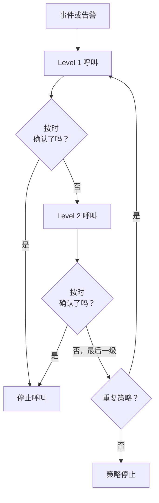
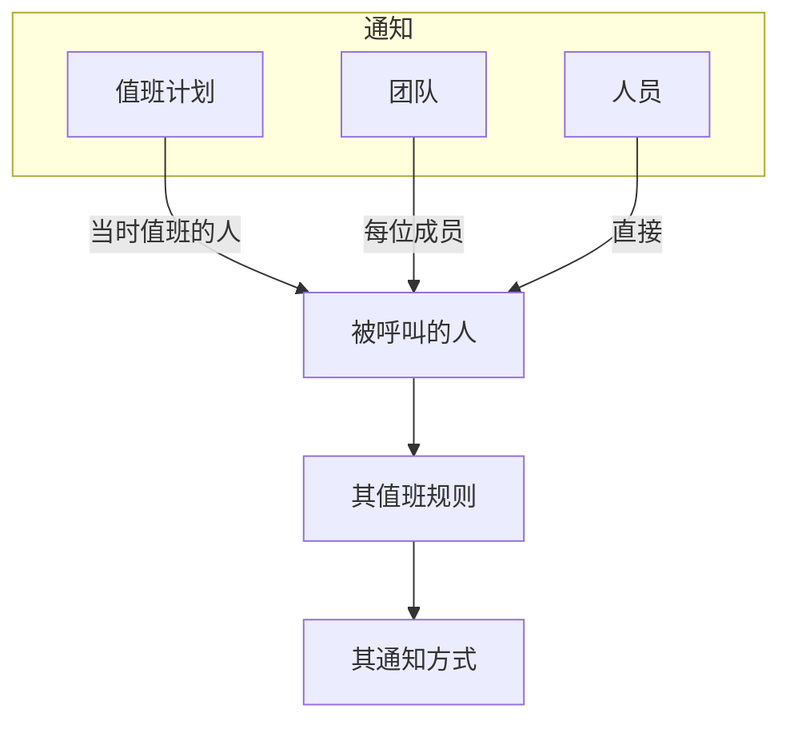

# 升级规则

值班策略按级别呼叫人员。每条升级规则就是一个级别：呼叫谁，以及在呼叫下一级之前等待有人确认多长时间。策略的规则按顺序列在其 **升级规则** 页面上。



:::cards
- [首先呼叫谁](#首先呼叫谁): 创建带有第一个级别的策略。
- [添加升级规则](#添加升级规则): 逐步添加下一个级别。
- [各级别如何呼叫人员](#各级别如何呼叫人员): 时间、重复，以及如何联系到每个人。
- [API 和 Terraform](#使用-api-或-terraform-创建规则): 以代码方式创建策略和规则。
:::

## 首先呼叫谁

在 **值班策略** 页面创建值班策略时，表单会询问它的 **名称** 和 **首先通知谁？** 。这个问题使用与 **通知** 相同的选择器：值班计划、团队和人员，需要多少就选多少。所选对象会成为策略的第一条升级规则 **Level 1** ，在呼叫下一级之前等待确认 **30 分钟** 。

:::steps
1. 前往 **值班** > **值班策略** ，然后点击 **创建值班策略** 。
2. 输入 **名称** 。
3. 在 **首先通知谁？** 下点击 **添加响应人** ，选择首先呼叫的值班计划、团队和人员。
4. 点击 **创建值班策略** 。新策略随后会在其 **升级规则** 页面打开，你可以在那里添加更多级别。
:::

**首先通知谁？** 是可选的。留空时，策略在没有升级规则的情况下开始：在你添加规则之前，它不会呼叫任何人，其概览也会提示这一点。描述和标签位于 **更多字段** 下。只有可以添加升级规则的人才会看到这个问题。

## 添加升级规则

:::steps
### 打开策略的升级规则

打开值班策略，在侧边菜单中选择 **升级规则** ，然后点击 **添加升级规则** 。对话框只有简短的一页。

### 选择通知对象

在 **通知** 下点击 **添加响应人** ，搜索并选择此级别要呼叫的值班计划、团队和人员，需要多少就选多少。至少添加一个。

| 响应人 | 该级别运行时呼叫谁 |
| --- | --- |
| **值班计划** | 该级别运行时在其中值班的人，而不是固定的某个人。 |
| **团队** | 团队的每位成员。 |
| **人员** | 直接呼叫此人。 |

### 设置等待时间

**升级延迟（分钟）** 是在呼叫下一级之前等待确认的时间。初始值为 **30 分钟** ，可按该级别的需要修改。

### 如有需要，为规则命名

其他所有内容都在 **更多字段** 下，打开之前处于折叠状态：

- **名称**：可选。未命名的规则以其级别命名：策略的第一条规则是 **Level 1** ，第二条是 **Level 2** ，依此类推。名称字段会显示规则将获得的名称。
- **描述**：可选的备注，例如此级别呼叫谁以及原因。

折叠时， **更多字段** 的标题会列出这两项，并显示规则已设置的内容：描述或你自己起的名称。

### 创建规则

点击 **Create Rule** 。规则会添加到其他规则下方，成为策略的下一个级别。
:::

## 各级别如何呼叫人员

当事件或告警到达策略时， **Level 1** 会立即呼叫其响应人。如果在等待时间内无人确认，就会呼叫 **Level 2** ，依此沿列表向下。当最后一级的等待时间过去仍无人确认时，如果策略的 **重复策略** （位于规则下方）要求重复，策略会在允许的次数内从 **Level 1** 重新开始，否则停止。确认或解决事件或告警会在任何级别停止呼叫。

以已确认或已解决状态创建的事件、告警或片段（即事后补录的）不会执行任何策略：不会呼叫任何人，其 Feed 会记录这一点并列出这些策略。请参阅 [声明时即已确认或已解决](/docs/incidents/declaring-incidents#声明时即已确认或已解决) 。

要重复策略，请在 **重复策略** 卡片上点击 **编辑** ，打开 **Repeat if no one acknowledges** ，并设置 **Number of times to repeat** 。

### 升级概要

**升级规则** 页面顶部的概要会显示整个阶梯：每个级别何时被呼叫、呼叫谁，以及最后一级之后会发生什么。如果某个级别的响应人无法全部被呼叫，其卡片上会注明；点击标签即可查看是谁以及原因。

### 如何联系到每个人

级别所呼叫的每个人，都按其本人的值班规则联系： **用户设置** > **值班规则** ，其中为事件、事件片段、告警和告警片段各设一个标签页，每个严重级别一张卡片，列出尝试哪种通知方式以及间隔多久。项目管理员可以在 **用户** > 成员 > **值班规则** 中查看和更改成员的规则。



对某人生效的用户替班会把其呼叫改为发送给替班的人。

每条消息都是服务商会接收的消息，因此呼叫总能发出。各渠道能承载的内容如下：

| 渠道 | 能承载的最长消息 |
| --- | --- |
| SMS | 1,600 个字符 |
| 电话 | Twilio 4,000 个字符的通话脚本能容纳的内容 |
| 推送通知 | 4 KB，其中标题、正文和数据最多占 3 KB |
| WhatsApp | 1,024 个字符 |
| Telegram | 4,096 个字符 |

更长的消息（标题很长，或模板放入了很长的描述）会被截断，并以一条说明全文在 OneUptime 中的提示结尾："… (truncated — see OneUptime for the full text)"。WhatsApp 消息的措辞是固定模板，因此在那里截断的是最长的那些值，每个都以 "…" 结尾。消息中的链接永远不会被截断。

### 呼叫未发送时

未发送的呼叫会在此人的 **值班日志** （用户设置）中说明原因：该行显示 **错误** ，状态消息给出原因。它不会再停留在 **Sending** 。消息会说明以下之一：

- 项目余额不足以支付，以及谁可以添加余额；
- 项目中该渠道已关闭，以及谁可以开启它。

项目所有者会就此收到一封电子邮件，直到余额充值或渠道重新开启。

在 OneUptime Cloud 上，每条短信、每次通话、每条 WhatsApp 和 Telegram 消息都从 **项目设置 > 通知 > 通知设置** 上的项目余额中支付：服务商接收消息时，确切费用从余额中扣除，无论同时发出多少条消息。

- 如果那里开启了 **自动充值** ，发现余额低于阈值的那条消息会先充入自动充值设定的金额，并从项目的卡中扣款；同一时刻发现余额不足的多条消息只扣款一次。
- 如果扣款失败（没有支付方式或卡被拒），自动充值会在一小时后再次尝试扣款，在此之前 **通知设置** 顶部会提示这一点。手动添加余额或再次保存自动充值会立即重试。
- 在自动充值无法扣款期间，呼叫会继续使用剩余余额发出。

> [!IMPORTANT]
> 新项目中短信、电话、WhatsApp 和 Telegram 默认关闭：在 OneUptime Cloud 上，每条消息都从项目余额中支付；自托管安装则需要先配置 Twilio 账户或 Telegram 机器人。渠道关闭期间，项目中任何人都无法在该渠道上添加通知方式。只有项目所有者、 **Billing Admin** 或拥有 **Manage Billing** 权限的人才能开启渠道，位置在 **项目设置 > 通知 > 通知设置** 上的 **通知渠道** 卡片中——项目管理员不能。在渠道关闭的每个地方，其他所有人都会被准确告知谁可以开启：在他们自己该渠道的通知方式列表上方、在他们的设置清单中，以及在需要该渠道时他们收到的消息中。

## 编辑、重新排序和删除规则

每条规则的卡片上都有 **Edit rule** ，以及包含其他操作的 **⋯** 菜单：

- **Edit rule** 会打开同样的单页对话框，并按规则当前的内容填好：响应人、等待时间，以及 **更多字段** 下的名称和描述。添加或移除响应人，然后点击 **保存更改** 。清空名称会让规则重新获得其级别的名称。
- 规则 **⋯** 菜单中的 **Move up** 和 **Move down** 会改变它的级别。以级别命名的规则会保持与其位置相符的名称：当 **Level 3** 上移到 **Level 2** 之上时，两者互换名称。你自己选择的名称，例如 **经理** ，无论规则移到哪里都保持不变。
- **Delete rule** 会先询问确认，并说明该级别呼叫谁。删除一个级别后，其下方的级别会上移，以级别命名的规则会相应重命名。

## 使用 API 或 Terraform 创建规则

升级规则是 `/api/on-call-duty-policy-escalation-rule` 资源；规则所呼叫的人员、团队和计划是 `/api/on-call-duty-policy-escalation-rule-user` 、 `-team` 和 `-schedule` 资源。

- 不带 `name` 创建的规则会像在仪表板中一样以其级别命名：成为策略第三级的规则命名为 **Level 3** 。Terraform 的升级规则资源仍然需要名称。
- `escalateAfterInMinutes` 在仪表板之外没有默认值。不带它创建的规则不会等待：此级别运行后会立即呼叫下一级。请显式设置它——仪表板建议的值是 30。
- 在 `miscDataProps` 中带 `onCallSchedules` 、 `teams` 或 `users` （ID 列表）创建的规则会获得这些响应人，仪表板的 **通知** 选择器就是这样发送它们的。不带它们创建的规则在你通过上述资源添加响应人之前不会呼叫任何人。
- 以级别命名的规则只会在你于仪表板中移动或删除规则时被重命名。通过 API 或 Terraform 更改 `order` 只会改变顺序。
- 在 `/api/on-call-duty-policy` 创建值班策略时，在 `miscDataProps` 中带上 `onCallSchedules` 、 `teams` 或 `users` （ID 列表），会像仪表板一样为它创建第一条升级规则：呼叫这些对象的 **Level 1** ， `escalateAfterInMinutes` 为 30。每个 ID 都必须属于该项目，调用方必须有权创建升级规则，否则不会创建策略。不带它们创建的策略和以前一样没有规则；Terraform 的策略资源不会发送它们。

```bash
curl -X POST https://oneuptime.com/api/on-call-duty-policy \
  -H "apikey: $ONEUPTIME_API_KEY" \
  -H "Content-Type: application/json" \
  -d '{
    "data": {
      "projectId": "<project-id>",
      "name": "Production on-call"
    },
    "miscDataProps": {
      "onCallSchedules": ["<schedule-id>"],
      "users": ["<user-id>"]
    }
  }'
```

## 后续步骤

:::cards
- [值班计划](/docs/on-call/schedules): 构建级别所呼叫的轮换。
- [值班时间线](/docs/on-call/schedule-timeline): 查看所有计划中谁在值班，并发现覆盖空档。
- [来电策略](/docs/on-call/incoming-call-policy): 让来电者通过电话联系到值班工程师。
:::
