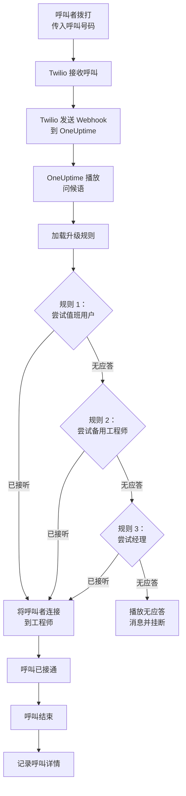
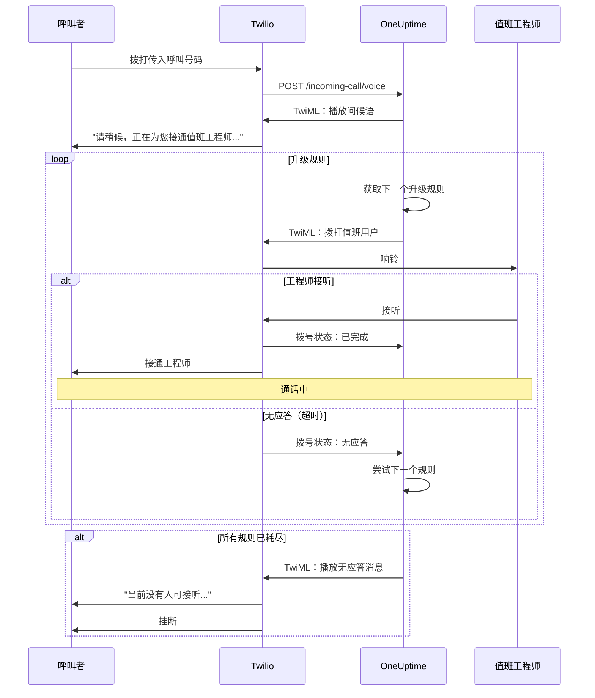
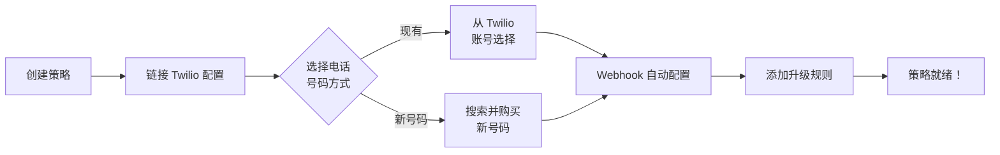
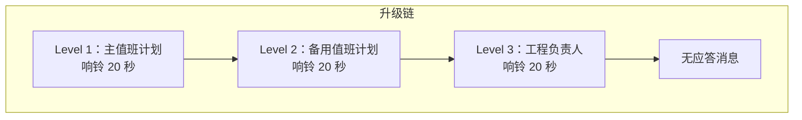
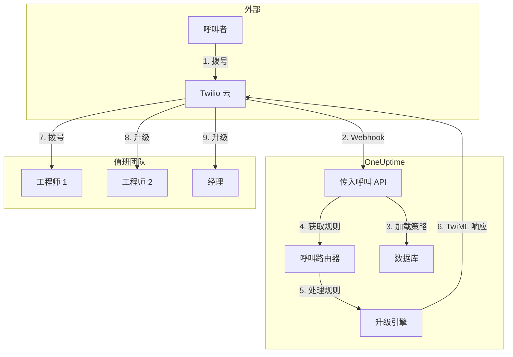

# 传入呼叫策略（Twilio 集成）

传入呼叫策略允许外部呼叫者通过拨打专用电话号码联系到值班工程师。当有人致电时，OneUptime 会通过配置的升级规则路由呼叫，直到工程师接听。

## 工作原理

## 呼叫路由流程

## 前提条件

- Twilio 账号 - 在 [https://www.twilio.com](https://www.twilio.com) 创建
- 您的 Twilio Account SID 和 Auth Token
- 访问您的 OneUptime 自托管实例

## 概述

传入呼叫策略功能的工作方式：

1. 在 Twilio 电话号码上接收传入呼叫
2. 播放可自定义的问候语
3. 通过升级规则（值班计划或人员）路由呼叫
4. 将呼叫者连接到第一个可用的值班工程师
5. 如果无人接听，升级到下一个规则

由于您是自托管 OneUptime，您需要配置自己的 Twilio 账号。这让您完全控制您的电话号码和账单。

## 第一步：创建 Twilio 账号

1. 前往 [https://www.twilio.com](https://www.twilio.com) 注册账号
2. 完成验证流程
3. 从 Twilio 控制台仪表板记录您的 **Account SID** 和 **Auth Token**

## 第二步：在 OneUptime 中配置呼叫/SMS 配置

1. 登录您的 OneUptime 控制台
2. 前往 **项目设置** > **通知** > **通知设置**
3. 在 **Twilio 配置** 中点击 **Create Twilio Config**
4. 填写以下字段：
   - **名称**：友好名称（例如"生产 Twilio 配置"）
   - **描述**：可选描述
   - **Twilio 账户 SID**：您的 Twilio Account SID（以 `AC` 开头）
   - **Twilio 身份验证令牌**：您的 Twilio Auth Token
   - **Twilio 主电话号码**：您 Twilio 账号中用于出站呼叫的电话号码
   - **设为项目默认**：项目的第一个 Twilio 配置会开启此项，因此发给项目成员的短信和通话也会通过此账号发送。如果此账号仅用于来电，请将其关闭。
5. 点击 **保存**

## 第三步：创建传入呼叫策略

1. 前往 **值班** > **来电策略**
2. 点击 **创建传入呼叫策略**
3. 填写以下字段：
   - **名称**：友好名称（例如"支持热线"）
   - **描述**：可选描述
4. 点击 **保存**

## 第四步：将 Twilio 配置链接到策略

1. 打开您新创建的传入呼叫策略
2. 在 **电话号码路由** 卡片中，找到 **第二步：链接 Twilio 配置**
3. 点击 **选择 Twilio 配置** 并选择您在第二步中创建的配置
4. 保存选择

## 第五步：配置电话号码

您有两种设置电话号码的方式：

### 选项 A：使用现有的 Twilio 电话号码

如果您的 Twilio 账号中已有电话号码：

1. 在 **电话号码** 卡片中，点击 **使用现有号码**
2. OneUptime 将从您的 Twilio 账号中获取所有电话号码
3. 选择您要使用的电话号码
4. 点击 **使用此号码** 将其分配给策略

> **注意**：如果电话号码已配置 Webhook，它将被更新以指向 OneUptime。

### 选项 B：购买新电话号码

直接从 OneUptime 购买新电话号码：

1. 在 **电话号码** 卡片中，点击 **购买新号码**
2. 从下拉菜单中选择 **国家**
3. 可选地输入 **区号**（例如 415 代表旧金山）
4. 可选地输入号码应 **包含** 的数字（例如 555）
5. 点击 **搜索** 查找可用号码
6. 从结果中选择一个电话号码
7. 点击 **购买** 以购买号码

该电话号码将从您的 Twilio 账号中购买，Webhook 将 **自动配置**——无需手动设置！

## 第六步：配置升级规则

升级规则决定有人拨打策略号码时，按列表从上到下呼叫谁：

1. 打开您的传入呼叫策略
2. 转到 **升级规则** 选项卡
3. 点击 **添加升级规则**
4. 填写规则，只需一步：
   - **呼叫对象**：一个值班计划或一个人。值班计划会在来电时呼叫当时在该计划中值班的人。人员是您项目的成员。
   - **响铃时长（秒）**：来电转到下一条规则之前，对方电话响铃的时长。默认 20 秒，Twilio 接受 5 到 600 秒。
   - **名称** 和 **描述** 为可选项，位于 **更多字段** 中。未命名的规则按其在列表中的位置显示：**Level 1**、**Level 2**。
5. 保存，然后为接下来要尝试的每个值班计划或人员各添加一条规则

规则按列表从上到下呼叫，新规则添加在末尾。要更改顺序，请拖动规则左上角的手柄；使用键盘时，聚焦手柄，按空格键，用方向键移动，再按一次空格键。

> **注意语音信箱**：**响铃时长** 应短于对方电话把未接来电转入语音信箱所需的时间。如果语音信箱先接听，来电者会接通语音信箱，来电不会转到下一条规则。Twilio 会为每次响铃额外增加几秒。因此新规则从 20 秒开始。默认值还是 30 秒时添加的规则会保留 30 秒：如果这些规则的来电进入了语音信箱，请缩短它们的 **响铃时长**。

### 升级规则示例

| 级别    | 呼叫对象           | 响铃时长 |
| ------- | ------------------ | -------- |
| Level 1 | 主值班计划         | 20 秒    |
| Level 2 | 备用值班计划       | 20 秒    |
| Level 3 | 工程负责人（个人） | 20 秒    |

## 第七步：配置语音消息（可选）

自定义呼叫者听到的消息：

1. 打开您的传入呼叫策略
2. 前往 **设置**
3. 配置：
   - **问候语**：接听呼叫时播放
   - **无应答消息**：所有升级规则失败时播放
   - **无人可用消息**：无人值班时播放

## 配置选项

### 策略设置

| 设置               | 描述                                   | 默认值                                 |
| ------------------ | -------------------------------------- | -------------------------------------- |
| 问候语             | 接听呼叫时播放的 TTS 消息              | "请稍候，我们正在为您接通值班工程师。" |
| 无应答消息         | 所有升级规则失败时的消息               | "没有人可用。请稍后再试。"             |
| 无人可接消息       | 无人值班时的消息                       | "很抱歉，当前没有可用的值班工程师。"   |
| 无人应答时重复策略 | 如果所有规则失败，从第一个规则重新开始 | 已禁用                                 |
| 策略重复次数       | 最大重复尝试次数                       | 1                                      |

### 升级规则设置

| 设置           | 描述                                                                                                     |
| -------------- | -------------------------------------------------------------------------------------------------------- |
| 呼叫对象       | 一个值班计划（呼叫当时在其中值班的人）或一个人。每条规则只呼叫其中之一                                   |
| 响铃时长（秒） | 来电转到下一条规则之前电话响铃的时长（默认：20；5 到 600）                                               |
| 名称和描述     | 可选，位于更多字段中。未命名的规则按其在列表中的位置显示为 Level 1、Level 2 等                               |
| 顺序           | 规则在列表中的位置：规则按从上到下的顺序呼叫。通过拖动规则来更改；通过 API 创建且未指定顺序的新规则会排在末尾 |

通过 API，规则设置 `onCallDutyPolicyScheduleId` 或 `userId`（二者之一，不能同时设置），以及 `escalateAfterSeconds`：响铃时长，省略时为 20。

## 查看呼叫日志

查看传入呼叫历史：

1. 前往 **值班** > **来电策略**
2. 点击您的策略
3. 前往 **通话日志** 选项卡

日志显示：

- 呼叫者电话号码
- 呼叫状态（已完成、无应答、失败等）
- 接听者
- 通话时长
- 时间戳

## 用户电话号码配置

要使用户能够接收传入呼叫，他们必须有已验证的电话号码：

1. 用户前往 **用户设置** > **通知方式**
2. 在 **传入呼叫号码** 下添加电话号码
3. 通过短信验证码验证电话号码

只有拥有已验证电话号码的用户才能通过升级规则接收呼叫。

传入呼叫号码通过短信验证，因此项目必须先开启 **SMS**。项目所有者或拥有 **Manage Billing** 权限的用户可以在 **项目设置 > 通知 > 通知设置** 的 **通知渠道** 卡片中开启它。

## 释放电话号码

如果您不再需要某个电话号码：

1. 打开您的传入呼叫策略
2. 在 **电话号码** 卡片中，点击 **释放号码**
3. 确认释放

> **警告**：释放的号码将归还给 Twilio，可能无法重新购买。

## 故障排查

### 未收到呼叫

- 验证 Twilio 配置是否正确链接到策略
- 检查您的 OneUptime 实例是否可以从互联网访问
- 验证 Twilio Account SID 和 Auth Token 是否正确
- 检查 Twilio 控制台的错误日志

### 呼叫未连接到工程师

- 验证用户在通知设置中是否有已验证的电话号码
- 检查升级规则是否正确配置
- 确保当前时间的值班排班中有用户分配
- 验证策略是否已启用
- 如果来电转入了工程师的语音信箱，请把规则的 **响铃时长** 设置得比其电话转入语音信箱的时间更短

### 音频质量问题

- 确保您的服务器有稳定的互联网连接
- 检查 Twilio 状态页面是否有任何正在进行的问题
- 验证电话号码的格式是否正确（E.164 格式：+15551234567）

## 安全注意事项

- 保护您的 Twilio Auth Token 安全，切勿公开暴露
- 为您的 OneUptime 实例使用 HTTPS
- OneUptime 验证 Webhook 签名以确保请求来自 Twilio
- 考虑限制哪些电话号码可以拨打您的传入呼叫策略

## 架构概览

## 支持

如果遇到传入呼叫策略功能的问题，请：

1. 检查 Twilio 控制台的错误日志
2. 查看 OneUptime 服务器日志
3. 发送邮件至 [hello@oneuptime.com](mailto:hello@oneuptime.com) 联系支持
