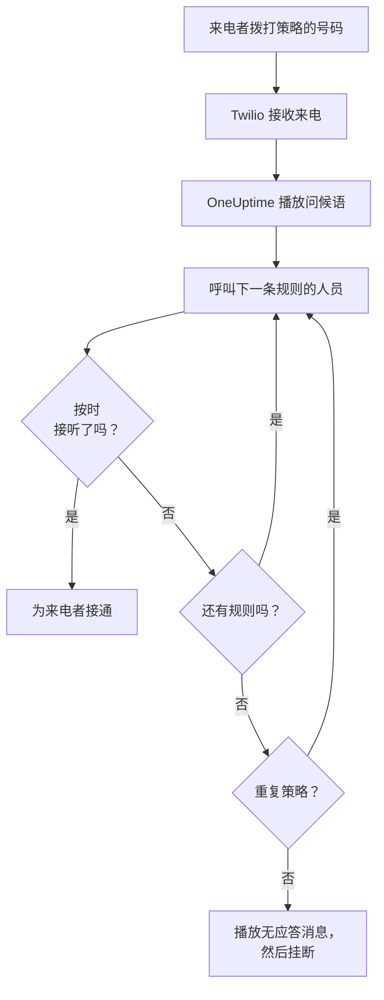
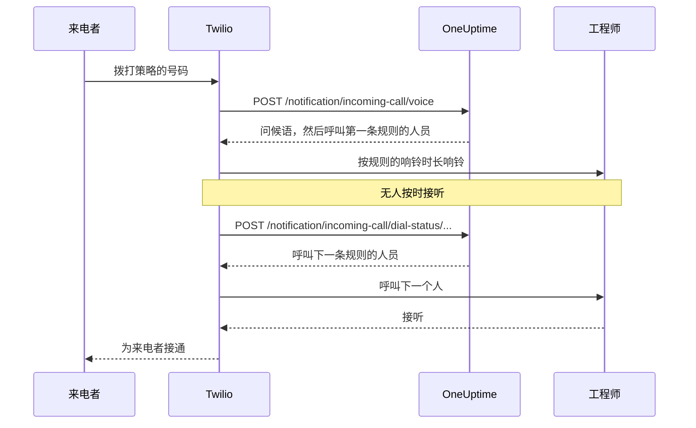

# 来电策略

来电策略为您的团队提供一个能找到值班人员的电话号码。有人拨打该号码时，OneUptime 会依次呼叫策略升级规则中的人员，直到有人接听，然后为来电者接通。号码和通话都使用您自己的 Twilio 账户。

:::cards
- [设置策略](#设置策略): 从 Twilio 账户到一通测试电话，共七步。
- [来电如何路由](#来电如何路由): 呼叫谁、响铃多久，以及来电者会听到什么。
- [未接来电](#未接来电): 通知谁，以及如何在工作流中处理。
- [故障排除](#故障排除): 来电从未到达，或从未接通工程师。
:::

## 开始之前

| 您需要 | 原因 |
| --- | --- |
| 一个 Twilio 账户，及其 Account SID 和 Auth Token | 策略的号码和通话都使用它，Twilio 也向它计费。 |
| OneUptime Cloud 上的 **Growth** 套餐 | 项目需要它才能拥有自己的 Twilio 配置。 |
| 如果自行托管，需要一台 Twilio 能访问的 OneUptime 服务器 | Twilio 会把每通来电发送到 `https://<your host>/notification/incoming-call/voice` 。 |
| 项目中已开启 **SMS** | 每位工程师的号码都通过短信发送的验证码进行验证。 |
| 每位工程师都有已验证的号码 | 规则只会呼叫在项目中添加并验证了来电号码的人。 |

## 设置策略

:::steps
### 添加您的 Twilio 账户

前往 **项目设置** > **通知** > **通知设置** 。在 **Twilio 配置** 卡片中点击 **Create Twilio Config** ，然后填写表单：

- **名称** 和 **描述** ：账户的用途，例如"客服热线"。
- **Twilio 账户 SID** ：来自 Twilio Console。以 `AC` 开头。
- **Twilio 身份验证令牌** ：来自 Twilio Console。
- **Twilio 主电话号码** ：该账户的一个号码，用于其发送的短信和电话。
- **Twilio 备用电话号码** ：可选。向所在国家的接收者发送时代替主号码使用的号码。
- **设为项目默认** ：项目的第一个 Twilio 配置默认开启，这样发给项目成员的短信和电话也会通过此账户。如果此账户只用于来电，请关闭。

### 创建策略

前往 **值班** > **来电策略** ，然后点击 **创建来电策略** 。为其填写 **名称** ，例如"客服热线"，并可选填写 **描述** 和 **标签** 。然后从列表中打开它。

### 选择 Twilio 账户

策略的 **概览** 中有一张带三个编号步骤的 **设置** 卡片。在第一步中点击 **选择** ，在 **Twilio 配置** 下选择账户，然后点击 **保存** 。

### 添加电话号码

在第二步中点击 **Add Phone Number** 。选择 **Use Existing Phone Number** 以使用 Twilio 账户中已有的号码，或选择 **Reserve New Phone Number** 获取新号码。OneUptime 会让号码指向自己，因此无需在 Twilio 中做任何设置。请参阅 [电话号码](#电话号码) 。

### 添加升级规则

在第三步中点击 **管理规则** 。按呼叫顺序，为每个要呼叫的值班计划或人员添加一条规则。请参阅 [升级规则](#升级规则) 。

### 验证每位工程师的号码

规则可能呼叫的每个人都要添加并验证自己的来电号码。请参阅 [工程师的电话号码](#工程师的电话号码) 。

### 拨打号码

三个步骤都完成后，卡片会变为 **Phone Numbers & Twilio Configuration** 。用任意电话拨打该号码，然后打开策略的 **通话日志** ，查看呼叫了谁。
:::

## 来电如何路由

1. Twilio 将来电发送给 OneUptime，OneUptime 朗读策略的 **问候语** 。
2. OneUptime 呼叫第一条升级规则指定的人：该人员本人，或当时在该规则的值班计划中值班的人，用户替班也计算在内。对方的电话会显示策略的号码作为来电号码。
3. 如果对方在规则的 **响铃时长** 内接听，就为来电者接通，通话日志会记录接听人。
4. 如果没有接听，来电者会听到 "Connecting you to the next available engineer."，然后呼叫下一条规则的人员。
5. 最后一条规则之后，如果开启了 **无人应答时重复策略** ，策略会按 **重复策略次数** 从第一条规则重新开始。否则来电者会听到 **无应答消息** ，通话结束。

如果当下没有人可以为某条规则接听，该规则会被跳过而不呼叫任何人：其计划中无人值班、该人员在此项目中没有已验证的来电号码，或已不再是项目成员。当所有规则都没有可呼叫的人时，来电者会听到 **无人可用消息** 。已禁用的策略会用 "Sorry, this service is currently disabled." 应答每通来电并挂断。

OneUptime 会使用 Twilio 配置的 Auth Token 校验每个请求上的 Twilio 签名，并拒绝无法验证的请求。

> [!TIP]
> 把策略的号码保存为手机联系人，例如"客服热线"，这样转接的来电响起时您就能认出来。

## 升级规则

升级规则决定有人拨打策略号码时按列表从上到下呼叫谁。打开策略，在侧边菜单中选择 **升级规则** ，然后点击 **添加升级规则** 。一条规则只有简短的一步：

- **呼叫对象** ：一个值班计划或一个人。计划会呼叫来电时在其中值班的人。人员是您项目的成员。
- **响铃时长（秒）** ：电话响铃多久后转到下一条规则。初始值为 20 秒，Twilio 接受 5 到 600。
- **名称** 和 **描述** 是可选的，位于 **更多字段** 下。没有名称的规则会按其在列表中的位置显示为 **Level 1** 、 **Level 2** 。

规则按列表从上到下呼叫，新规则添加在末尾。要更改顺序，请拖动规则左上角的手柄。使用键盘时，将焦点移到手柄上，按空格键，用方向键移动，再按一次空格键。

> [!WARNING]
> **注意语音信箱** ：让 **响铃时长** 短于对方电话把未接来电转到语音信箱所需的时间。如果语音信箱先接听，来电者会被接通到语音信箱，通话不会转到下一条规则。Twilio 每次响铃都会额外加上几秒。因此新规则从 20 秒开始。在默认值还是 30 秒时添加的规则会保留它们的 30 秒：如果这些规则的来电进入了语音信箱，请调低这些规则的 **响铃时长** 。

例如，三条规则先尝试两个轮换，然后呼叫负责人：

| 级别 | 呼叫对象 | 响铃时长 |
| --- | --- | --- |
| Level 1 | 主值班计划 | 20 秒 |
| Level 2 | 备用值班计划 | 20 秒 |
| Level 3 | 工程负责人（一个人） | 20 秒 |

## 电话号码

一个策略可以有多个号码，每个号码都呼叫同一组规则。每个号码只属于一个策略。在策略的 **概览** 中通过 **Add Phone Number** 添加：

:::tabs
@tab 使用已有的号码
1. 点击 **Add Phone Number** ，然后点击 **Use Existing Phone Number** 。OneUptime 会列出策略 Twilio 账户中的号码。
2. 点击号码旁边的 **选择** ，然后点击 **分配号码** 。

已把来电转往别处的号码会显示 "Currently has a webhook configured"。分配后，其来电会改为发送到 OneUptime。
@tab 预订新号码
1. 点击 **Add Phone Number** ，然后点击 **Reserve New Phone Number** 和 **搜索号码** 。
2. 选择 **国家** 。可选填写 **区号（可选）** ，例如 415，或在 **包含（可选）** 中填写号码应包含的数字。点击 **搜索** ：最多列出 10 个本地号码。
3. 点击号码旁边的 **预订** ，并用 **预订** 确认。Twilio 会把号码费用记入您的 Twilio 账户。
:::

OneUptime 会把号码的语音 webhook 设为 `https://<your host>/notification/incoming-call/voice` ，在自托管安装上由 `HOST` 和 `HTTP_PROTOCOL` 构建。要把策略迁移到另一个 Twilio 账户，请先释放其号码：只有在策略没有号码时才能更改账户。

要释放号码，请点击其旁边的 **释放** ，并用 **释放号码** 确认。

> [!CAUTION]
> 释放号码会把它归还给 Twilio，即使是通过 **Use Existing Phone Number** 带来的号码，而且您可能无法再次获得它。删除策略或其使用的 Twilio 配置也会释放其号码。

## 工程师的电话号码

规则会拨打对方在此项目中为来电验证的号码，并跳过没有号码的人。每个人都自行添加：

:::steps
1. 打开 **用户设置** > **来电策略** > **来电号码** 。 **来电策略** 是侧边菜单中的一个分组，初始为折叠状态。
2. 在 **电话号码 用于来电路由** 卡片中点击 **添加电话号码 用于来电路由** ，输入带国家代码的号码，例如 `+15551234567` 。
3. 在 **验证码** 中输入 OneUptime 通过短信发送到该号码的 6 位验证码，然后点击 **验证** 。 **Send a new code** 会再发送一个。
:::

每个人在每个项目中只能有一个已验证的号码。要更换号码，请先删除旧号码。这些号码独立于值班呼叫使用的 **通知方式** 中的电话号码。

来电号码通过短信验证，因此必须先为项目开启 **SMS** 。项目所有者、 **Billing Admin** 或拥有 **Manage Billing** 的人可以在 **项目设置 > 通知 > 通知设置** 上的 **通知渠道** 卡片中开启它。

## 语音消息和策略设置

打开策略，在侧边菜单的 **高级** 下选择 **设置** 。 **语音消息** 卡片上的 **Edit Messages** 用于更改来电者听到的内容； **策略设置** 卡片上的 **Edit Policy Settings** 用于更改其余设置。

| 设置 | 作用 | 新策略的值 |
| --- | --- | --- |
| **问候语** | 接听来电时、呼叫第一个人之前朗读。 | "Please wait while we connect you to the on-call engineer." |
| **无应答消息** | 所有规则都尝试过但无人接听时朗读。 | "No one is available. Please try again later." |
| **无人可用消息** | 所有规则都没有可呼叫的人时朗读。 | "We are sorry, but no on-call engineer is currently available. Please try again later or contact support." |
| **已启用** | 已禁用的策略会拒绝所有来电。 | 开启 |
| **无人应答时重复策略** | 最后一条规则之后，从第一条重新开始。 | 关闭 |
| **重复策略次数** | 重新开始的次数。 | 1 |

Twilio 用文字转语音朗读这些消息，因此请按您希望听到的样子来写。

## 通话日志

每通来电都列在策略侧边菜单 **日志** 下的 **通话日志** 页面中：包括 **呼叫方** 、 **Number Called** 、其 **状态** 、接听人（ **应答人** ）、 **持续时间** ，以及开始时间（ **开始于** ）。在某通来电上点击 **View Timeline** 可查看其 **呼叫时间线** ：呼叫过的每个人、使用的号码，以及每次尝试的结果。

| 状态 | 发生了什么 |
| --- | --- |
| **Initiated** 、 **Escalated** | 通话仍在进行：来电已到达、电话正在响铃，或已转到后面的规则。 |
| **已完成** | 有人接听，来电者已接通。 |
| **无应答** | 所有升级规则都已尝试，无人接听。来电者听到了您的 **无应答消息** 。 |
| **Caller Hung Up** | 工程师的电话正在响铃时来电者挂断了。 |
| **失败** | 无人可呼叫：没有任何升级规则有拥有已验证来电号码的值班用户（来电者听到了您的 **无人可用消息** ），或策略已禁用。 |

## 未接来电

通话在未接通任何人的情况下结束即为未接来电：其状态为 **无应答** 、 **Caller Hung Up** 或 **失败** 。

### 通知谁

来电未接时，OneUptime 会通知策略的所有者：策略 **所有者** 页面上添加的用户和团队成员。如果策略没有所有者，则改为通知项目所有者。

通知会说明谁打来的电话、拨打了哪个号码、为什么无人接听，以及呼叫了谁、每次尝试的结果如何。通知中附有指向通话日志中该通来电的链接。

所有者默认收到电子邮件。每个人都可以在 **用户设置** > **通知设置** 中的 **值班** > **来电策略** > **未接来电** 下选择其他渠道（短信、电话、推送等）或关闭它。

### 在工作流中处理未接来电

来电通话日志可用作工作流触发器：

- **On Create Incoming Call Log** 在来电到达时运行。
- **On Update Incoming Call Log** 随着通话进行而运行。设置 **Ended At** 的那次更新就是通话结束。

只处理未接来电时，例如把它们发布到 Slack 或 Microsoft Teams，或创建工单：

:::steps
1. 添加 **On Update Incoming Call Log** 触发器。将 **Listen on** 设为 **Ended At** ，并选择要使用的字段，例如 **Status** 、 **Caller Phone Number** 和 **Routing Phone Number** 。
2. 添加一个 **If / Else** 步骤。用比较 **is not equal to** 和 `Completed` 检查触发器的 **Status** 。
3. 把您的步骤连接到 **Yes** 端口。
:::

工作流可以用 **Find One** 和 **Find Many** 读取通话日志，但不能创建或修改它们。

## 谁可以添加和释放电话号码

策略的电话号码遵循与策略本身相同的角色：

- **查找号码** - 在 Twilio 中搜索要预订的号码，或列出您的 Twilio 账户已有的号码 - 需要读取来电策略的权限和读取通话与短信配置的权限，因为它通过其中之一读取您的 Twilio 账户。 **Project Owner** 、 **Project Admin** 、 **Project Member** 、 **Viewer** 、 **Settings Admin** 、 **Settings Member** 和 **Settings Viewer** 都拥有这两项。在自定义角色中，就是 **Read Incoming Call Policy** 和 **Read Call and SMS** 。
- **预订号码、使用已有号码和释放号码** 需要编辑来电策略的权限： **Project Owner** 、 **Project Admin** 、 **Project Member** 、 **Settings Admin** 和 **Settings Member** ，或自定义角色中的 **Edit Incoming Call Policy** 。它们会更改您可以编辑的策略的号码：如果角色仅限某些标签，则是带有这些标签的策略。

团队在这些权限之一上不带标签的封禁会取消该权限。对其他人来说， **Add Phone Number** 和 **释放** 仍留在页面上但处于锁定状态，其提示会说明需要什么。API 会用一句说明所需权限的话拒绝其请求："Looking up phone numbers needs permission to read incoming call policies and call and SMS settings." 或 "Adding or releasing a phone number needs permission to edit incoming call policies." 预订号码的费用记入您自己的 Twilio 账户，而不是您的 OneUptime 余额，因此不需要账单权限。

## 使用 API 或 Terraform 创建策略

| 资源 | API 路由 |
| --- | --- |
| 来电策略 | `/api/incoming-call-policy` |
| 其升级规则 | `/api/incoming-call-policy-escalation-rule` |
| 其电话号码，只读 | `/api/incoming-call-policy-phone-number` |
| 通话日志，只读 | `/api/incoming-call-log` |

通过 API 创建且不带 `escalateAfterSeconds` 的规则会响铃 20 秒，Terraform 不带 `escalate_after_seconds` 创建的规则也一样。

### 升级规则设置

| 设置 | API 字段 | 保存的内容 |
| --- | --- | --- |
| 呼叫对象 | `onCallDutyPolicyScheduleId` 或 `userId` | 二者之一，不能同时设置：呼叫其值班人员的计划，或该人员。 |
| 响铃时长（秒） | `escalateAfterSeconds` | 电话响铃多久后转到下一步（默认：20；5 到 600）。 |
| 名称和描述 | `name` 、 `description` | 可选。没有名称的规则按其在列表中的位置显示为 Level 1、Level 2 等。 |
| 顺序 | `order` | 规则在列表中的位置：规则从上到下呼叫。不带顺序的新规则排在末尾。 |

## 故障排除

:::details 来电没有到达 OneUptime
- 在 Twilio Console 中打开该号码： **A call comes in** 必须是 webhook `https://<your host>/notification/incoming-call/voice` ，并使用 HTTP POST。OneUptime 在添加号码时根据 `HOST` 和 `HTTP_PROTOCOL` 设置它。如果之后它们有变化，请在 Twilio 中更正 webhook。
- 自托管的 OneUptime 必须能通过 https 从互联网访问。Twilio Console 中该号码的通话日志以及 Twilio 的 **Debugger** 会显示 OneUptime 的应答。
- `403` 应答表示请求的签名校验未通过。请确认 Twilio 配置中保存的是该账户当前的 **Twilio 身份验证令牌** ，并确认 OneUptime 前面的代理传递了 Twilio 调用时使用的主机和协议（ `X-Forwarded-Host` 和 `X-Forwarded-Proto` ）。
:::

:::details 来电已接听，但没有呼叫任何人
通话日志显示 **失败** 。请检查策略是否 **已启用** 、每条规则的值班计划当前是否有人值班，以及规则呼叫的人是否在此项目的 **用户设置** > **来电策略** > **来电号码** 下有已验证的号码。规则只呼叫项目成员。
:::

:::details 来电进入了语音信箱
如果来电进入了工程师的语音信箱，请把规则的 **响铃时长** 设为短于其电话转入语音信箱所需的时间。语音信箱接听也算作接听，通话会停在那里。
:::

:::details 无法预订新号码
在许多国家，Twilio 在出售本地号码之前需要已批准的 regulatory bundle，有些号码还要求 Twilio 余额为正。请在 Twilio Console 中完成这些设置，或在那里获取号码后通过 **Use Existing Phone Number** 添加。
:::

:::details 无法更改策略的 Twilio 账户
只有在策略没有电话号码时才能更改账户：页面会显示 "Remove all phone numbers to change"。释放号码会把它们归还给 Twilio，因此请先规划好迁移。
:::

:::details 工程师号码的验证码没有收到
项目必须开启短信。在 OneUptime Cloud 上，没有自己默认 Twilio 配置的项目用其余额支付短信费用，余额必须高于 1 USD。验证码可能需要一分钟才能送达；点击 **Send a new code** 再发送一个， **项目设置** > **通知** > **通知日志** 会显示它的处理情况。
:::

## 后续步骤

:::cards
- [升级规则](/docs/on-call/escalation-rules): 值班策略如何逐级呼叫人员。
- [值班计划](/docs/on-call/schedules): 构建规则所呼叫的轮换。
- [工作流](/docs/workflows/index): 处理未接来电：发布到频道或创建工单。
- [Twilio 短信和语音集成](/docs/self-hosted/twilio-integration): 为自托管安装设置 Twilio。
:::
