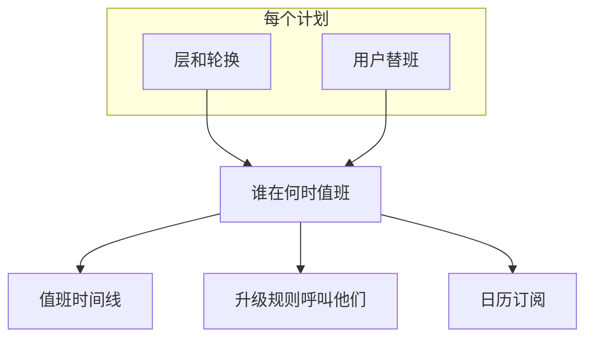

# 值班时间线

值班时间线在一张按周或按月的网格中显示您项目的所有值班计划：每个计划一行，每天一列。无需逐个打开计划，就能回答"本周我的团队或整个组织里谁在值班？"。

时间线上的班次正是 OneUptime 呼叫人员时使用的班次，包括用户替班：时间线、升级规则和日历订阅都从同一处读取它们。

## 打开时间线

- **值班** > **值班时间线** 会显示您可以查看的所有计划，按所属团队分组。 **值班计划** 上的 **时间线视图** 按钮会打开同一页面。
- **团队** > 某个团队 > **值班计划** 只显示该团队拥有的计划。

当团队列在计划的 **所有者** 页面上时，该团队就拥有该计划。没有所属团队的计划归入 **No owner team** 。关闭 **Group by team** 可在一个按名称排序的列表中查看所有计划。

## 阅读网格

| 网格上的元素 | 含义 |
| --- | --- |
| 色条 | 一个班次：谁在值班，从何时到何时。同一个人在所有计划中颜色相同。 |
| 淡色的色条 | 过去的班次。 |
| 标有 **⇄** 的色条 | 替班：有人在代班。其下方的细条会显示被代班的人，并加删除线。 |
| 带斜线的琥珀色块 | 覆盖空档：无人值班。此时升级到该计划的告警不会呼叫任何人。 |
| 红线 | 现在。 |
| 计划名称下方的一行 | 现在谁在值班，或 **No one on call now** 。 |

将指针悬停在任意色条或空档上，或用键盘移到其上，即可查看详情。

网格下方的 **On call this week** （月视图中为 **On call this month** ）列出该时间范围内值班的所有人。将指针悬停在名字上，可查看此人值班多长时间、涉及多少个计划。

## 更改时间范围和时区

- 在 **Week** 和 **Month** 之间切换，用箭头移动，用 **Today** 返回。
- 时间以您自己的时区显示。时区按钮会打开 **View timeline in timezone** ，以任何其他时区显示时间线，而不改变任何人的值班时间：每个计划仍在其自己的时区交接。
- 时间线涵盖过去 180 天和未来 365 天。

> [!NOTE]
> 过去的班次会根据每个计划的当前设置重新计算，因此显示的是现在设置的轮换，可能与当时实际被呼叫的人不同。如需了解人员实际值班的时长，请使用 **值班** > **报告** > **用户值班时间** 。

## 查找计划或人员

- **搜索** 会匹配计划名称、团队名称和值班人员。
- 团队筛选器可将视图缩小到一个团队或 **My teams** ； **Schedules I'm on** 只保留您参与的计划。
- 在网格上方点击 **with no one on call now** 或 **with coverage gaps this week** （月视图中为 **with coverage gaps this month** ），即可只查看这些计划。再次点击可查看全部。
- 点击网格下方的某个人或其某个色条，可突出显示此人的所有班次。 **Clear highlight** 会取消突出显示， **Clear filters** 会重置搜索和筛选器。

## 谁能看到什么

| 适用于 | 规则 |
| --- | --- |
| 权限 | 与 **值班计划** 相同的权限和标签限制，外加读取计划层的权限。 |
| 替班 | 替班代的是谁的班次，只向能读取用户替班的人显示。其他人仍能看到谁会被呼叫。 |
| 计划数量 | 一次最多 250 个计划，按名称排序。团队的 **值班计划** 页面会将其缩小到该团队拥有的计划。 |
| 套餐 | 在 OneUptime Cloud 上，时间线与值班计划一样需要 **Growth** 套餐。 |

## 后续步骤

:::cards
- [值班计划](/docs/on-call/schedules): 设置谁轮流值班、层和值班时段。
- [日历订阅源](/docs/on-call/calendar-feeds): 将您的班次放入 Google 日历、Outlook 或 Apple 日历。
- [升级规则](/docs/on-call/escalation-rules): 决定值班策略的每个级别呼叫谁。
:::
