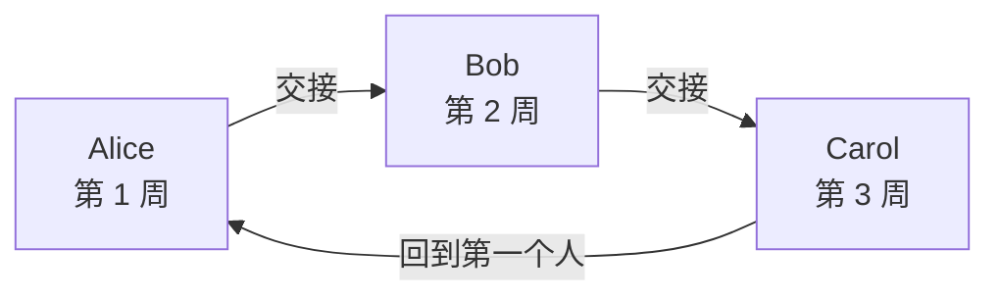
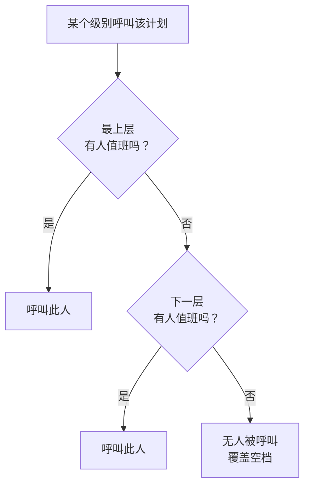

# 值班计划

值班计划决定任意时刻由谁值班。人员在计划中轮流值班：每人值班一段时间，然后由下一个人接替。将计划添加到值班策略的升级规则中，当该级别运行时，策略就会呼叫计划中正在值班的人。

> [!NOTE]
> 在 OneUptime Cloud 上，值班计划属于 **Growth** 及以上套餐。Growth 试用结束或套餐降级后，项目中仍保留的计划会继续通过引用它的升级规则呼叫其中的人员。因此在低于 **Growth** 的套餐中， **值班计划** 页面会显示套餐说明，并在其下方列出仍已设置的计划，您可以在那里删除它们。创建或更改计划需要 **Growth** 。

:::cards
- [谁轮流值班](#谁轮流值班): 创建带有第一个轮换的计划。
- [层](#层): 叠加轮换、限制值班时段并添加后备覆盖。
- [API 和 Terraform](#使用-api-或-terraform-创建计划): 以代码方式创建计划及其轮换。
:::

## 谁轮流值班

在 **值班计划** 页面创建计划时，表单会询问它的 **名称** 和 **谁轮流值班？** 。您选择的人会成为计划的第一层 **Layer 1** ，全天候值班。

:::steps
1. 前往 **值班** > **值班计划** ，然后点击 **创建值班计划** 。
2. 输入 **名称** 。
3. 在 **谁轮流值班？** 下点击 **添加用户** ，按轮换顺序选择人员。
4. 如有需要，打开 **更多字段** ，修改每次值班时长、时区、描述或标签。
5. 点击 **创建值班计划** 。新计划随后会在其 **层** 页面打开，您可以在那里更改轮换或添加更多层。
:::

人员一次一个轮流值班，计划创建后第一个人立即开始值班：



**谁轮流值班？** 是可选的。留空时，计划在没有层的情况下开始：在您于其 **层** 页面添加层之前，不会有人值班。只有可以添加层的人才会看到这个问题。

其他所有内容都在 **更多字段** 下，打开之前处于折叠状态：

| 字段 | 作用 |
| --- | --- |
| **每次值班时长** | **1 天** 、 **1 周** 、 **2 周** 或 **1 个月** ，不更改则为 **1 周** 。有人轮流值班时就会询问。每人值班这么长时间，然后在计划创建时的那个时刻由下一个人接替。 |
| **时区** | 交接时间和值班时段所使用的时区。初始为您的时区。 |
| **描述** | 关于计划的备注。 |
| **标签** | 用于查找和分组计划的标签。 |

当有人轮流值班且 **更多字段** 下没有任何更改时，其折叠的标题会说明将会发生什么：每人值班一周，然后由下一个人接替。

## 层

计划的轮换由其 **层** 页面上的层组成。层从上往下读取：有人值班的最上层就是呼叫的那一层，因此请把主轮换放在顶部，把后备覆盖放在下面。



**添加层** 会添加一个与第一层起始方式相同的层：从现在开始值班，每人一周，全天候。展开某一层即可向其中添加人员，并更改它的开始时间、交接频率、首次交接时间以及值班时段：

| 字段 | 设置内容 |
| --- | --- |
| **Layer name** | 该层覆盖的内容，例如"工作日主值班"。 |
| **Rotation starts at** | 该层轮换开始的日期和时间。 |
| **Rotate every** | 值班多久交给层中的下一个人。 |
| **First hand-off time** | 第一次交接给下一个人的时间，在开始时或之后。之后的交接按每个轮换间隔进行。 |
| **Restrictions** | 该层值班的时段：按计划的时区为 **无限制** 、 **一天中的特定时间** 或 **一周中的特定时间** 。在这些时段之外，由下层接替。 |

要更改哪一层排在前面，请在层的菜单中使用 **Move layer up (higher priority)** 或 **Move layer down (lower priority)** 。

每个人在各处保持同一种颜色，便于您一眼跟踪：在每一层、在最终计划及其替班中，以及在 **值班时间线** 上。

## 使用 API 或 Terraform 创建计划

值班计划是 `/api/on-call-duty-policy-schedule` 资源；其层和层中的人员是 `/api/on-call-duty-schedule-layer` 和 `/api/on-call-duty-schedule-layer-user` 资源。

- 在 `miscDataProps` 中带 `firstLayerUsers` （按轮换顺序排列的用户 ID 列表）创建计划，会像仪表板一样为它创建第一层：从现在开始全天候值班的 **Layer 1** 。 `firstLayerRotation` 以 `{"_type": "Recurring", "value": {"intervalType": "Week", "intervalCount": 1}}` 这样的轮换指定每次值班时长；不提供时为一周。每个用户都必须是项目成员，调用方必须有权创建层，否则不会创建计划。
- 不带它们创建的计划和以前一样没有层；Terraform 的计划资源不会发送它们。
- 不带 `rotation` 创建的层和以往一样每天交接。

```bash
curl -X POST https://oneuptime.com/api/on-call-duty-policy-schedule \
  -H "apikey: $ONEUPTIME_API_KEY" \
  -H "Content-Type: application/json" \
  -d '{
    "data": {
      "projectId": "<project-id>",
      "name": "Primary on-call",
      "timezone": "Europe/Berlin"
    },
    "miscDataProps": {
      "firstLayerUsers": ["<user-id-1>", "<user-id-2>", "<user-id-3>"],
      "firstLayerRotation": {"_type": "Recurring", "value": {"intervalType": "Week", "intervalCount": 1}}
    }
  }'
```

## 后续步骤

:::cards
- [升级规则](/docs/on-call/escalation-rules): 让值班策略的某个级别呼叫此计划。
- [值班时间线](/docs/on-call/schedule-timeline): 并排查看所有计划及覆盖空档。
- [日历订阅源](/docs/on-call/calendar-feeds): 将班次放入 Google 日历、Outlook 或 Apple 日历。
:::
