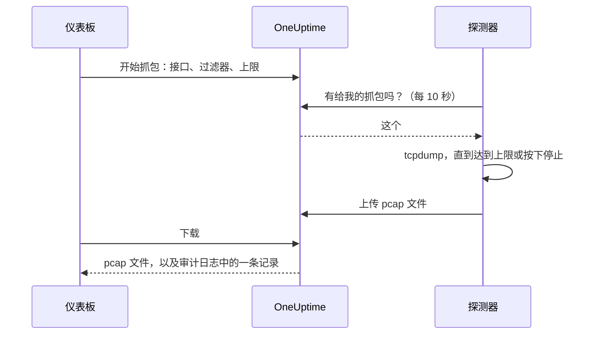

# 抓包

直接从仪表板抓取某个探测器看到的流量，然后在 Wireshark 中打开文件。探测器本来就位于你要排查的网络中：无需打开 VPN，也无需登录跳板机。

在运行探测器的人开启之前，每个探测器上的抓包都是关闭的，而且抓包只在你项目自己的探测器上运行。

:::cards
- [工作原理](#工作原理): 从开始抓包到 Wireshark 中的文件。
- [开启抓包](#开启抓包): 运行探测器的人在 Docker、Docker Compose 和 Kubernetes 中要设置什么。
- [开始抓包](#开始抓包): 选择接口，缩小到你需要的范围，然后下载文件。
- [参考](#参考): 上限、过滤器、权限、审计日志以及文件保留多久。
- [故障排除](#故障排除): 失败的抓包所显示的消息是什么意思。
:::

## 工作原理



1. **开始。** 有权开始抓包的人选择探测器的接口、过滤器和上限，然后点击 **开始抓包**。OneUptime 在保存抓包之前，会按探测器允许的范围检查过滤器和上限。
2. **领取。** 探测器每十秒向 OneUptime 请求一次工作，就像它请求监视器一样。它领取抓包并启动 `tcpdump`。
3. **抓取。** 抓包在最先达到的上限处停止：持续时间、数据包上限或文件大小。**停止** 会提前结束抓包，并保留已经抓到的内容。
4. **上传。** 探测器上传 pcap 文件。OneUptime 将其存为项目的私有文件。
5. **下载。** 抓包显示 **已完成** 和 **下载** 按钮。文件可以在 Wireshark、tcpdump 或任何读取 pcap 文件的工具中打开。

## 开始之前

- **你项目自己的探测器。** 全局探测器承载其他项目的流量，因此从不抓包。要安装自己的探测器，请参阅 [自定义探针](/docs/probe/custom-probe)。
- **本版本或更新版本的探测器。** 旧版探测器不会报告它们可以在哪些接口上抓包。
- **合适的权限。** 开始和停止抓包需要 **Start Packet Capture**，下载文件需要 **Download Packet Capture**。项目所有者和管理员两者都有。请参阅 [权限](#权限)。
- **镜像端口，用于到达不了探测器的流量。** 探测器只能看到自己主机接口上的流量。要抓取其他设备之间的流量，请将它们的交换机端口镜像（SPAN）到探测器主机上的一个空闲接口。

## 开启抓包

由运行探测器的人在探测器运行的地方开启抓包：仪表板按设计无法开启。探测器需要三样东西：

| 设置 | 原因 |
| --- | --- |
| `PROBE_PACKET_CAPTURE_ENABLED=true` | 开启抓包。任何其他值或不设置都会保持关闭。 |
| 主机网络 | 让探测器看到主机自己的接口和镜像端口。没有它，探测器只能看到其容器的网络。 |
| `NET_RAW` 能力 | 让 tcpdump 能够抓包。Docker 默认授予它。Kubernetes 的 Pod Security restricted 标准会去掉它，所以请添加。 |

:::tabs
@tab Docker
```bash
docker run --name oneuptime-probe --network host \
  --cap-add NET_RAW \
  -e PROBE_KEY=<probe-key> \
  -e PROBE_ID=<probe-id> \
  -e ONEUPTIME_URL=https://oneuptime.com \
  -e PROBE_PACKET_CAPTURE_ENABLED=true \
  -d oneuptime/probe:release
```
@tab Docker Compose
```yaml
services:
  oneuptime-probe:
    image: oneuptime/probe:release
    container_name: oneuptime-probe
    network_mode: host
    cap_add:
      - NET_RAW
    environment:
      - PROBE_KEY=<probe-key>
      - PROBE_ID=<probe-id>
      - ONEUPTIME_URL=https://oneuptime.com
      - PROBE_PACKET_CAPTURE_ENABLED=true
    restart: always
```
@tab Kubernetes
```yaml
apiVersion: apps/v1
kind: Deployment
metadata:
  name: oneuptime-probe
spec:
  selector:
    matchLabels:
      app: oneuptime-probe
  template:
    metadata:
      labels:
        app: oneuptime-probe
    spec:
      hostNetwork: true
      dnsPolicy: ClusterFirstWithHostNet
      containers:
        - name: oneuptime-probe
          image: oneuptime/probe:release
          securityContext:
            capabilities:
              add: ["NET_RAW"]
          env:
            - name: PROBE_KEY
              value: "<probe-key>"
            - name: PROBE_ID
              value: "<probe-id>"
            - name: ONEUPTIME_URL
              value: "https://oneuptime.com"
            - name: PROBE_PACKET_CAPTURE_ENABLED
              value: "true"
```
:::

探测器启动时，其日志会显示 `Packet capture is on: captures of up to 30 minutes and 25 MB can be started on this probe from the dashboard.` 一分钟之内，仪表板中该探测器的页面就会提供 **开始抓包**。

要在此探测器上设置比所有探测器共同遵守的上限更低的上限，请添加以下任一变量：

| 变量 | 默认值 | 作用 |
| --- | --- | --- |
| `PROBE_PACKET_CAPTURE_MAX_DURATION_IN_SECONDS` | `1800` | 此探测器运行的最长抓包，5 到 1800 秒。 |
| `PROBE_PACKET_CAPTURE_MAX_FILE_SIZE_IN_MB` | `25` | 此探测器生成的最大抓包文件，1 到 25 MB。 |

> [!NOTE]
> 通过 Docker Compose 或 Helm chart 自托管 OneUptime 时附带的探测器是全局探测器，因此从不抓包。请在你想抓包的网络中运行自定义探测器。

## 开始抓包

:::steps
### 打开探测器或设备

打开 **监视器 → 设置 → 探测器** 并点击你的探测器：它的 **抓包** 卡片会列出它的抓包。或者打开一台网络设备并进入它的 **Traffic** 页面：在那里开始的抓包会在设备自己的探测器上运行，并且一开始就按设备的地址过滤。

### 点击开始抓包

在你开始之前，表单会说明抓包包含什么：经过线路的密码、令牌和个人数据都会进入文件。

### 选择接口

**所有接口 (any)** 会在探测器的每个接口上抓包。抓取镜像流量时，请选择交换机将流量镜像到的那个接口。

### 选择抓哪些数据包

填写 **主机或网络**、**端口** 和 **协议** 来缩小抓包范围，或留空以保留所有数据包。表单会显示它们组成的过滤器，例如 `host 10.0.0.5 and tcp port 443`。点击 **改为编写 BPF 过滤器** 来编写你自己的过滤器。

### 检查上限

**更多字段** 包含 **持续时间**、**数据包上限** 和 **文件大小上限 (MB)**。其摘要说明抓包何时停止：`在 1 分钟、100,000 个数据包或 10 MB 中先到者处停止。`

### 在表单中点击开始抓包

在探测器领取之前，抓包显示 **待处理**，之后显示 **正在运行** 以及进度。点击 **停止** 可提前结束。
:::

当抓包显示 **已完成** 时，点击 **下载**，然后在 Wireshark 中打开 `.pcap` 文件。在 **所有接口 (any)** 上的抓包是 Linux cooked capture，Wireshark 读取它与读取其他抓包一样。

## 参考

### 上限

| 上限 | 默认值 | 范围 |
| --- | --- | --- |
| 持续时间 | 1 分钟 | 5 秒到 30 分钟 |
| 数据包上限 | 100,000 | 1 到 1,000,000 |
| 文件大小上限 | 10 MB | 1 到 25 MB |

- 抓包在最先达到的上限处停止。达到大小上限的文件会在最后一个完整数据包之后截断，因此总能打开。
- 一个探测器同时最多运行 2 个抓包。
- 探测器在 5 分钟内没有领取的抓包会失败，并说明原因。
- 探测器会再次按这些上限以及它自己更低的上限约束每个抓包。

### 过滤器

表单的字段会组成一个 [BPF 过滤器](https://www.tcpdump.org/manpages/pcap-filter.7.html)，即 tcpdump 和 Wireshark 的抓包过滤语言：

| 主机或网络 | 端口 | 协议 | 过滤器 |
| --- | --- | --- | --- |
| `10.0.0.5` | | 任意协议 | `host 10.0.0.5` |
| `10.0.0.0/24` | `443` | TCP | `net 10.0.0.0/24 and tcp port 443` |
| | `5060` | UDP | `udp port 5060` |
| | `8000-8080` | 任意协议 | `portrange 8000-8080` |
| `10.0.0.5` | | ICMP | `host 10.0.0.5 and (icmp or icmp6)` |

你自己编写的过滤器是一行，最多 500 个字符，由字母、数字、空格和 `. : / ( ) [ ] ! & | < > = + - * % ^ _` 组成。OneUptime 在保存前检查它，tcpdump 在探测器上编译它。探测器将它作为一个参数传给 tcpdump，从不经过 shell。

### 权限

| 权限 | 允许 | 默认拥有者 |
| --- | --- | --- |
| **Start Packet Capture** | 开始抓包以及停止抓包 | Project Owner, Project Admin |
| **Download Packet Capture** | 下载抓包文件 | Project Owner, Project Admin |
| **Delete Packet Capture** | 删除抓包及其文件 | Project Owner, Project Admin |
| **Read Packet Capture** | 查看抓包：何时运行、在哪个探测器上、使用哪个过滤器 | Project Owner, Project Admin, Project Member, Viewer |

要给团队 **Start Packet Capture** 或 **Download Packet Capture**，请在 **设置 → 团队** 下打开该团队，并在其 **权限** 页面上添加该权限。请参阅 [权限](/docs/permissions/index)。

### 审计日志与隐私

- 开始抓包会在审计日志中记录为 **Packet Capture** 的 **Create**，删除抓包记录为 **Delete**。每次下载都会记录为 **Download**，包括谁下载了哪个抓包。
- 文件是项目的私有文件。只有拥有 **Download Packet Capture** 时使用的 **下载** 按钮才会提供它。
- 抓包及其文件在开始 7 天后删除。删除抓包会立即删除其文件。

## 故障排除

:::details “此探测器上的抓包已关闭”
探测器在没有 `PROBE_PACKET_CAPTURE_ENABLED=true` 的情况下运行。请使用 [开启抓包](#开启抓包) 中的设置重启它。
:::

:::details "The probe is not allowed to capture packets on eth0"
tcpdump 无法打开该接口。请给探测器的容器授予 `NET_RAW` 能力：Docker 使用 `--cap-add NET_RAW`，Docker Compose 使用 `cap_add`，Kubernetes 使用 `securityContext.capabilities.add`。
:::

:::details "The interface does not exist on the probe"
自探测器上次报告以来该接口已消失，或者探测器在没有主机网络的情况下运行，只能看到其容器的接口。请使用主机网络运行它，然后重新选择接口。
:::

:::details "tcpdump could not use the filter"
tcpdump 无法编译该过滤器。消息中包含 tcpdump 自己的说法，例如 `syntax error`。请对照 [pcap-filter 手册](https://www.tcpdump.org/manpages/pcap-filter.7.html) 检查过滤器。
:::

:::details "The probe did not pick up this capture within 5 minutes"
探测器已断开连接，或者在抓包开始后其上的抓包被关闭了。请检查探测器的 **连接状态** 及其日志。
:::

:::details “没有数据包匹配过滤器。”
抓包已运行，但接口上没有任何内容匹配过滤器。请检查流量是否经过此接口：其他设备之间的流量只有通过镜像端口才能到达探测器。
:::

:::details "This probe is already running 2 packet captures"
一个探测器同时运行 2 个抓包。请等待其中一个完成，或停止一个，然后重新开始你的抓包。
:::

## 后续步骤

:::cards
- [自定义探针](/docs/probe/custom-probe): 在你想抓包的网络中安装探测器。
- [网络设备监控](/docs/monitor/network-device-monitor): 监控你抓取其流量的设备。
- [权限](/docs/permissions/index): 给团队授予抓包权限。
:::
