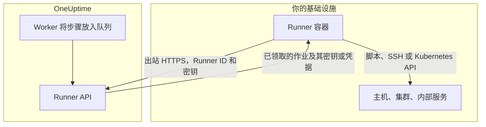
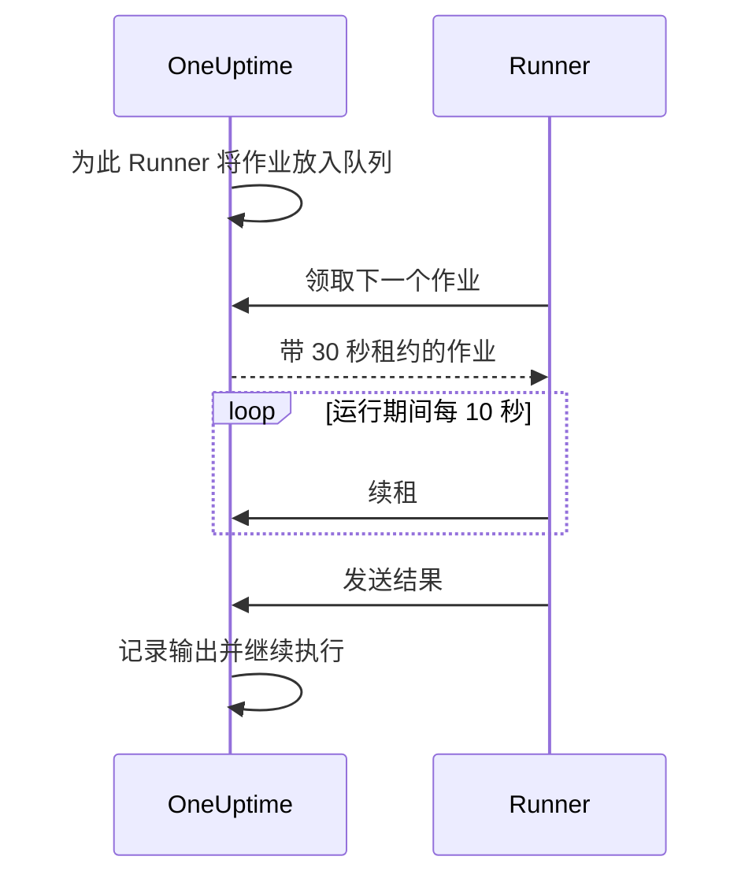

# Runbook 代理

**Runbook 代理** 在仪表板中称为 **Runner** ，是一个小型的自托管进程，它 **在你自己的基础设施中** 运行 Runbook 的 JavaScript、Bash、SSH 和 Kubernetes 步骤。OneUptime Worker 从不运行你的脚本：它把脚本放入队列，由步骤作者选择的 Runner 领取每个作业、运行它并发回结果。本页面向安装和运维 Runner 的人员。

:::cards
- [安装 Runner](#安装-runner): 五步完成，从仪表板到已连接的容器。
- [为步骤指定 Runner](#为步骤指定-runner): 把步骤绑定到应运行它的 Runner。
- [超时](#超时): 领取超时和执行超时，以及两者如何配合。
- [环境变量](#环境变量): 容器启动时读取的内容。
:::

## 工作原理



1. 你在 OneUptime 中创建一个 Runner。OneUptime 为它生成一个 ID 和一个密钥。
2. 你在自己基础设施中的一台主机上运行 Runner 容器，并提供该 ID、密钥和你的 OneUptime URL。
3. Runner 每 5 秒向 OneUptime 请求一次工作，每 60 秒报告一次自己仍在运行。
4. 编写 JavaScript、Bash、SSH 或 Kubernetes 步骤时，你从下拉列表中选择 Runner。步骤会绑定到该 Runner。
5. 步骤运行时，Worker 会把一个 `targetAgentId` 设置为该 Runner 的作业放入队列。只有该 Runner 能领取它。
6. Runner 在本地运行作业（Bash 使用 `bash -c <script>`，JavaScript 使用 `isolated-vm` 沙箱，SSH 和 Kubernetes 使用步骤的凭据建立 SSH 连接或调用集群的 API 服务器），记录结果并发回。Worker 用该结果继续执行 Runbook。

Runner 只需要到你的 OneUptime 实例的 **出站 HTTPS** 。它不接受任何入站连接。

Runner 只持有自己的 ID 和密钥。其他一切都随它领取的作业一起到来：填入了分配给它的 [Runbook 密钥](/docs/runbooks/credentials#供脚本使用的密钥) 的脚本，或 SSH、Kubernetes 步骤指定的 [凭据](/docs/runbooks/credentials)。因此，任何持有 Runner 密钥的人都能以该 Runner 的身份行事：请像对待分配给它的凭据一样对待这个密钥。

## 为什么脚本在 Runner 上运行

在 OneUptime Worker 上运行脚本有两个问题：

- **信任边界。** 任何能编写 Runbook 的人都能在 Worker 上运行代码，并访问 Worker 能访问的一切。
- **可达范围。** 大多数有用的步骤作用于 _你的_ 基础设施（“重启这个服务”“在我们的内部数据库中查一条记录”），而不是 OneUptime 的。

有了 Runner，这些步骤在你掌控的主机上运行，由你决定这台主机可以做什么。HTTP 请求和 AI 步骤仍在 Worker 上运行，因为它们不需要你网络中的任何东西。

## 开始之前

- 你基础设施中的 **一台装有 Docker 的主机** ，能通过 HTTPS 访问你的 OneUptime URL，并能访问步骤要操作的系统。
- **能创建 Runner 的角色。** Project Owner、Project Admin、Project Member 和 Runbook Admin 可以创建 Runner。只有 Project Owner、Project Admin 或 Runbook Admin 能看到 Runner 的密钥，而安装命令中包含该密钥。

## 安装 Runner

### 1. 创建代理记录

前往 **运行手册 → Runbook 代理** ，创建一个新的代理。点击 **创建Runner** ，填写两个步骤：

| 字段 | 步骤 | 说明 |
| --- | --- | --- |
| **名称** | **Runner** | 易读的名称，通常写明它在哪里运行、能访问什么，例如 `prod-eu-west-1`。编写步骤时你选择的就是这个名称。 |
| **描述** | **Runner** | 可选。用一句话说明这台主机能访问什么。 |
| **标签** | **Runner** （在 **更多字段** 下） | 可选。 |
| **执行运行手册** | **功能** | 默认开启。允许此 Runner 领取 Runbook 步骤。 |
| **执行 AI 代码修复** | **功能** | 默认关闭。允许它为 AI 代码修复打开拉取请求；参见 [Fix Tasks](/docs/ai/ai-agent)。 |
| **执行 AI 补救命令** | **功能** | 默认关闭。允许 AI 自动修复在其上运行经过策略检查的命令。为持有 SSH 凭据的 Runner 开启此项需要读取 Runbook 凭据的权限；参见 [运行 OneUptime AI 命令的 Runner](/docs/runbooks/credentials#运行-oneuptime-ai-命令的-runner)。 |

Runner 会在下一次心跳时获取功能的变更，无需重启。

### 2. 复制安装命令

在 Runner 所在行点击 **显示设置说明** 。 **Runbook 代理设置** 对话框会显示一条 `docker run` 命令，其中已经包含该 Runner 的 ID 和密钥。同样的命令也位于 Runner 自身页面的 **设置说明** 下。

只有 Project Owner、Project Admin 或 Runbook Admin 能读取密钥。其他人看到的不是命令，而是“您无权查看此 Runbook 代理的密钥”。

### 3. 在你基础设施中的主机上运行

在你环境中满足以下条件的主机上运行该命令：

- 能通过 HTTPS 访问你的 OneUptime 实例，并且
- 能完成步骤所需的操作，例如通过 SSH 访问其他主机、调用集群的 API 服务器或与数据库通信。

```bash
docker run --name oneuptime-runner --restart unless-stopped \
  -e ONEUPTIME_RUNNER_ID=<runner-id> \
  -e ONEUPTIME_RUNNER_KEY=<runner-key> \
  -e ONEUPTIME_URL=https://oneuptime.yourdomain.com \
  -d oneuptime/runner:release
```

### 4. 确认代理已连接

回到 **运行手册 → Runbook 代理** 。容器启动后一分钟内，Runner 的 **状态** 应显示为 **已连接** ，并有新的 **最后一次出现** 时间。在 Runner 自身的页面上， **Runbook 代理状态** 卡片会显示它的 **Runbook 代理版本** 和 **主机** 。如果一直显示 **从未连接** 或 **已断开** ，请参见 [故障排除](#故障排除)。

### 5. 保持代理为最新版本

当代理运行的版本比你的 OneUptime 旧时，其页面上的 **Runbook 代理版本** 旁会出现警告标记。选择它即可查看升级方法：拉取新镜像，删除容器，然后重新运行第 2 步中的安装命令。由 Kubernetes 代理的 Chart 安装的代理则改为通过该 Chart 升级。

```bash
docker pull oneuptime/runner:release
docker rm -f oneuptime-runner
```

## 为步骤指定 Runner

:::steps
### 添加在 Runner 上运行的步骤

在 Runbook 的 **步骤** 中添加 JavaScript、Bash、SSH 或 Kubernetes 步骤。

### 选择 Runner

步骤的 **Runner** 下拉列表会列出项目中的所有 Runner 以及它们是否已连接。如果项目中还没有 Runner，步骤会提示这一点，并引导你前往 **Runbooks › Runners** 。

### 保存步骤

点击 **Save Steps** 。执行到达该步骤时，Worker 会为该 Runner 的 ID 放入一个作业，只有该 Runner 能领取它。
:::

Bash 通过 `bash -c` 运行。JavaScript 在 Runner 上的 `isolated-vm` 沙箱中运行，无法访问文件系统或进程；它可以用 `axios` 调用公开的 HTTP API，但不能调用私有网络上的地址。SSH 和 Kubernetes 步骤使用步骤指定的 [凭据](/docs/runbooks/credentials)，该凭据必须已分配给同一个 Runner。

需要多个 Runner？分别创建，并为每个步骤指定合适的 Runner。若要冗余，可以再运行一个 Runner 并把步骤分配给两者，或者准备一个步骤指向另一个 Runner 的备用 Runbook。

## 运维说明

### 超时

在 Runner 上运行的每个步骤都有两个超时：

| 超时 | 默认值 | 控制内容 |
| --- | --- | --- |
| **Claim timeout** | 2 分钟 | Worker 等待所选 Runner 领取作业的时长。如果 Runner 没有及时领取，步骤因超时而失败，Runbook 继续（或停止，取决于 **失败时继续** ）。 |
| **Execution timeout** | 30 秒 | Runner 在停止步骤之前允许其运行的时长。Bash 会收到 `SIGKILL`；JavaScript 的沙箱会被销毁。 |

两者都可以按步骤设置。打开 **Runbooks › 你的 Runbook › 步骤** ，展开步骤，在其设置中填写 **Execution timeout** 和 **Claim timeout** （以秒为单位）。留空则使用默认值。每个超时都接受 1 秒到 1 小时；超出该范围的值会在步骤运行时被限制到范围内。

Worker 的总等待时间是 `claim timeout + execution timeout + a few seconds`。请选择适合该步骤的值。

缩短 claim timeout 时要记住两点：

- Runner 按轮询周期请求工作（`ONEUPTIME_RUNNER_POLL_INTERVAL_MS`，默认 5 秒）。短于一个周期的 claim timeout 可能在完全健康的 Runner 看到作业之前就已过期，此时步骤失败时给出的消息与 Runner 离线时相同。
- Runner 默认一次运行一个作业（`ONEUPTIME_RUNNER_CONCURRENCY`）。当一个长步骤占用它时，指向同一 Runner 的其他步骤会一直等到各自的 claim timeout 到期。如果你把某个 execution timeout 调高到几分钟，请相应调高共用该 Runner 的步骤的 claim timeout，或者给它们分配另一个 Runner。

### 租约和心跳



Runner 领取作业时会获得一个短租约（默认 30 秒）。步骤运行期间，Runner 每 10 秒续租一次。如果 Runner 在脚本运行中途崩溃或断网，租约就会过期，Worker 会将作业标记为 `TimedOut`，而不是一直等待。

租约过期时，Bash 子进程 **不会** 被自动取消（JavaScript 沙箱如果能结束，也会被允许运行完），但 Worker 不再等待它们，并且在另一次领取接管之后，Runner 无法再提交结果。如果“恰好运行一次”对你很重要，请把脚本设计成可以安全地重新运行。

### 如果 OneUptime Worker 在步骤中途重启

一次 Runbook 执行从开始到结束都在一个 Worker 上运行，因此部署或崩溃可能会在步骤进行中打断它。接下来会发生什么，取决于执行是否会被重新领取：

- **执行恢复。** 领取它的 Worker 会找到你的步骤已经创建的作业，并 **重新接上它** 。它会等待这个作业，而不是再给你的 Runner 发一份脚本副本。如果 Runner 已经完成，会直接使用记录下来的结果。每次执行中，一个步骤最多只会被发送给 Runner 一次。
- **执行不恢复。** 如果执行再也没有被领取，清理任务会在它超出当前步骤的领取和执行时间窗口后，将其标记为 `Failed`，并附上点明该步骤的消息。执行永远不会卡在 `Running`。

唯一无法得知的是：Worker 消失之前，脚本运行到了哪一步。正在运行中的步骤会被报告为失败，并附注它可能只运行了一部分：再次运行 Runbook 之前，请先检查目标系统。

### 没有在线的代理

如果步骤运行时所选 Runner 处于离线状态，作业会以 `Pending` 等待到 claim timeout 结束，然后步骤失败，消息为“No runbook agent picked up this step before the wait window expired.”在正式运行 Runbook 之前，可以在 **Runbook 代理** 页面上检查覆盖情况。

### 输出上限

stdout 和 stderr 合计每个步骤上限为 **50 KB** 。更长的输出会被截断并加上标记。如果需要完整日志，请在脚本中把它写入日志存储或对象存储，并用 `echo` 输出其 URL。

### 取消

从执行页面或 API 取消一次 Runbook 执行，会立即把它处于 `Pending`、`Claimed` 和 `Running` 的所有作业标记为 `Cancelled`。已经在运行脚本的 Runner 会把工作做完，但服务器不会接受结果，Runbook 中之后的步骤也不会再被发出。

### 并发

每个 Runner 默认一次运行一个作业。要允许更多，请在容器上设置 `ONEUPTIME_RUNNER_CONCURRENCY`，但要记住，Runner 与该主机上运行的其他一切共享这台主机。

## 环境变量

Runner 在启动时读取以下变量：

| 变量 | 必需 | 默认值 | 说明 |
| --- | --- | --- | --- |
| `ONEUPTIME_URL` | 是 | — | 你的 OneUptime 实例的基础 URL，例如 `https://oneuptime.yourdomain.com`。 |
| `ONEUPTIME_RUNNER_ID` | 是 | — | 安装命令中的 Runner ID。 |
| `ONEUPTIME_RUNNER_KEY` | 是 | — | 安装命令中的 Runner 密钥。 |
| `ONEUPTIME_RUNNER_POLL_INTERVAL_MS` | 否 | `5000` | Runner 请求新作业的频率。低于 `1000` 的值会回退为默认值。 |
| `ONEUPTIME_RUNNER_HEARTBEAT_INTERVAL_MS` | 否 | `60000` | Runner 报告自己仍在运行的频率。低于 `5000` 的值会回退为默认值。 |
| `ONEUPTIME_RUNNER_JOB_HEARTBEAT_INTERVAL_MS` | 否 | `10000` | Runner 为正在运行的作业续租的频率。低于 `1000` 的值会回退为默认值。 |
| `ONEUPTIME_RUNNER_CONCURRENCY` | 否 | `1` | 此 Runner 上同时运行的最大作业数。 |
| `ONEUPTIME_RUNNER_ENABLE_RUNBOOKS` | 否 | — | 设为 `false` 可让此 Runner 停止领取 Runbook 步骤，无论仪表板如何设置。它只能关闭该功能。 |
| `ONEUPTIME_RUNNER_ENABLE_CODE_FIXES` | 否 | — | 设为 `false` 可让此 Runner 停止领取 AI 代码修复，无论仪表板如何设置。 |
| `ONEUPTIME_RUNNER_ENABLE_AI_COMMANDS` | 否 | — | 设为 `false` 可让此 Runner 停止运行 AI 补救命令，无论仪表板如何设置。 |

## 轮换代理密钥

如果密钥泄露，请重置它。旧密钥会立即失效。

:::steps
### 重置密钥

从 **运行手册 → Runbook 代理** 打开 Runner，点击 **重置 Runbook 代理密钥** 并确认。在拿到新密钥之前，Runner 将无法连接。

### 用新密钥运行容器

从 Runner 的 **设置说明** 中复制新命令，删除旧容器，然后在同一台主机上运行新命令：

```bash
docker rm -f oneuptime-runner
```

### 确认它重新连接

在 **运行手册 → Runbook 代理** 下，Runner 的 **状态** 会在一分钟内恢复为 **已连接** 。
:::

## 权限

代理管理位于现有的 Runbooks 权限组中：

- `CreateRunner`、`EditRunner`、`DeleteRunner`、`ReadRunner` —— 管理代理记录。
- `RunbookAdmin`、`RunbookMember`、`RunbookViewer`（角色）—— `RunbookAdmin` 构建 Runbook、其规则以及运行它们的 Runner，并运行 Runbook。`RunbookMember` 打开 Runbook 及其执行并运行它们（启动执行、完成或跳过其步骤、取消执行），但不创建、更改或删除任何 Runbook 或 Runner。`RunbookViewer` 只读取 Runbook 及其执行，什么也不运行。`RunbookAdmin` 包含上述所有细粒度权限。

触发 Runbook（从而把其步骤发送给 Runner）需要一个运行 Runbook 的角色——`ProjectOwner`、`ProjectAdmin`、`ProjectMember`、`RunbookAdmin` 或 `RunbookMember`——或 `CreateRunbookExecution`；完成、跳过或取消执行还接受 `EditRunbookExecution`。角色只运行其范围所及的 Runbook。

只有 Project Owner、Project Admin 和 Runbook Admin 能读取 Runner 的密钥。

## 面向代理的 API

供好奇的读者参考：Runner 使用以下挂载在 `/runner-ingest` 下的端点。合并之前的路径 `/runbook-agent-ingest` 仍会为尚未重新部署的代理提供服务，因此升级服务器不会使它们失效。它们使用 JSON 请求体中的 Runner ID 和密钥（`agentId` 和 `agentKey`），或请求头 `x-agent-id` 和 `x-agent-key` 进行认证。

| 端点 | 用途 |
| --- | --- |
| `POST /heartbeat` | 存活信号。更新 Runner 的最后出现时间、版本和主机信息，并返回项目授予它的功能。 |
| `POST /claim-next-job` | 以原子方式领取指向此 Runner ID 的、最早的 `Pending` 作业。没有任务时返回 `{ job: null }`。 |
| `POST /job/:jobId/heartbeat` | 为作业续租。租约已过期或作业已结束时返回 404。 |
| `POST /job/:jobId/result` | 提交最终结果。如果租约已经转移，则忽略。 |
| `POST /disconnect` | 正常关闭时注销。 |

你不需要手动调用它们：随附的 Runner 会调用。在这里记录它们，是为了在我们的代理不符合你的限制条件时，你可以自己构建代理。

## 故障排除

:::details Runner 一直显示从未连接或已断开
- 用 `docker logs oneuptime-runner` 查看容器日志中的认证或网络错误。
- 确认主机能访问你的 OneUptime URL，例如使用 `curl`。
- 确认 ID 和密钥在复制时没有带空格，并且 `ONEUPTIME_URL` 是你打开 OneUptime 时使用的地址。

**从未连接** 表示 Runner 从未报到过。 **已断开** 表示它报到过，但过去 5 分钟内没有。
:::

:::details 步骤失败，提示“No runbook agent picked up this step before the wait window expired.”
步骤的 Runner 没有在其 claim timeout 内领取作业。检查 Runner 是否为 **已连接** 、是否为它开启了 **执行运行手册** ，以及它是否正被一个长步骤占用：除非你调高 `ONEUPTIME_RUNNER_CONCURRENCY`，否则它一次只运行一个作业。短于轮询间隔的 claim timeout 也会以同样方式失败。
:::

:::details 步骤失败，提示“The runbook agent stopped responding while this step was running.”
Runner 领取了作业，然后停止续租：它崩溃了、重启了或断网了。确认它已在线，然后在再次运行 Runbook 之前检查目标系统。
:::

:::details Runner 日志显示“No capability is enabled”
此 Runner 的所有功能都已关闭。在 OneUptime 中 Runner 的页面上开启 **执行运行手册** 。它会在下一次心跳时获取该变更。
:::

## 后续步骤

:::cards
- [编写 Runbook](/docs/runbooks/authoring): 编写在你的 Runner 上运行的步骤。
- [Runbook 凭据](/docs/runbooks/credentials): 为 SSH 和 Kubernetes 步骤提供受管访问权限。
- [Runbook 配置与安全](/docs/runbooks/configuration): 限制、权限和加固。
:::
