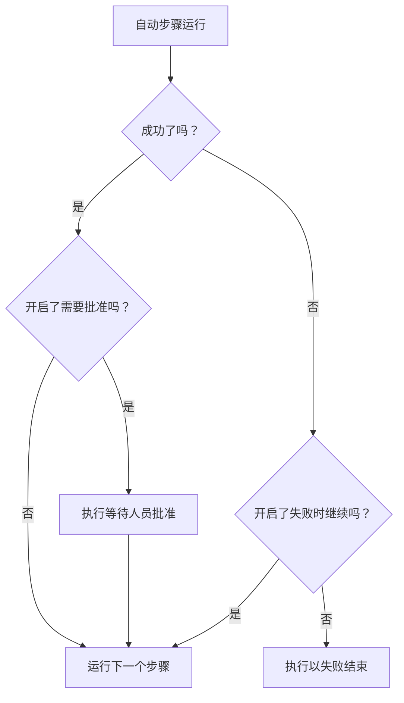

# 编写 Runbook

你在 Runbook 的 **步骤** 页面上把它编写成一份有序的步骤列表。本页介绍如何创建 Runbook、如何设置七种步骤类型中的每一种，以及失败和审批如何改变一次执行的流程。

:::cards
- [创建 Runbook](#创建-runbook): 从空白 Runbook 到已保存的步骤。
- [步骤类型](#步骤类型): Manual、JavaScript、HTTP request、Bash、SSH、Kubernetes 和 AI。
- [失败处理与审批](#失败处理与审批): 步骤失败或成功时会发生什么。
- [完整示例](#完整示例): 五个步骤完成一次数据库故障转移。
:::

## 开始之前

- **能编写 Runbook 的角色。** Project Owner、Project Admin 和 Runbook Admin 可以创建 Runbook 并保存其步骤。使用细粒度权限时，你需要 **Create Runbook** 和 **Edit Runbook** 。参见 [权限](/docs/runbooks/configuration#权限)。
- **用于 JavaScript、Bash、SSH 和 Kubernetes 步骤的 Runner。** 这些步骤在你自己基础设施中的 [Runner](/docs/runbooks/agents) 上运行，从不在 OneUptime Worker 上运行。请先安装一个。
- **用于 SSH 和 Kubernetes 步骤的凭据，以及读取凭据的权限。** 参见 [Runbook 凭据](/docs/runbooks/credentials)。只有当你有权读取 Runbook 凭据时，步骤才能指定凭据：需要 Project Owner、Project Admin 或 **Read Runbook Credential** 。Runbook Admin 不包含此权限。
- **用于 AI 步骤的 LLM 提供商。** 参见 [LLM 提供商](/docs/ai/llm-provider)。

## 创建 Runbook

:::steps
### 打开运行手册

打开 **产品 → 运行手册** 。Runbook 位于 **仪表板与自动化** 分组中。

### 新建 Runbook

点击 **创建Runbook** ，输入 **名称** ，并可选地输入说明 Runbook 用途的 **描述** 。 **更多字段** 下有默认开启的 **已启用** 开关和 **标签** 。新的 Runbook 会出现在列表中：打开它。

### 添加步骤

进入 **步骤** 。在 **Start your runbook** 下选择第一个步骤的类型；在最后一个步骤下方， **Add another step** 提供同样的七种类型。每个步骤打开时都带有 **标题** 、 **描述** （Markdown，向响应人员显示）和该类型的设置。Runbook 有了一个步骤后，卡片顶部的 **添加步骤** 会添加一个 Manual 步骤。

### 调整步骤顺序

步骤 **按顺序** 运行。要调整顺序，拖动步骤标题左侧的手柄；使用键盘时，聚焦手柄，按空格键，用方向键移动步骤，再按一次空格键。

### 保存步骤

点击 **Save Steps** 。保存之前，编辑器会显示 **未保存的更改** 。保存后你会看到 **已保存** ，Runbook 即可 [运行](/docs/runbooks/running)。
:::

## 步骤的组成

每个步骤都有以下字段：

| 字段 | 用途 |
| --- | --- |
| **标题** | 显示在步骤列表和每次执行中的简短名称。 |
| **描述** | 给响应人员的可选上下文，使用 Markdown。在 Manual 步骤中，它就是人员阅读的说明。 |
| **失败时继续** | 仅限自动步骤。开启后，步骤失败不会停止执行：下一个步骤照常运行。 |
| **需要批准** | 仅限自动步骤。开启后，Runbook 会在此步骤之后暂停，等待人员批准，然后才运行下一个步骤。该开关名为 **运行下一步之前需要批准** 。 |
| 类型相关设置 | 脚本、URL、Runner、凭据或提示词。参见 [步骤类型](#步骤类型)。 |

## 步骤类型

| 类型 | 运行位置 | 需要 |
| --- | --- | --- |
| [Manual](#manual) | 人员 | 无 |
| [JavaScript](#javascript) | Runner | 一个 Runner |
| [HTTP request](#http-request) | OneUptime Worker | 无 |
| [Bash](#bash) | Runner | 一个 Runner |
| [SSH](#ssh) | Runner | 一个 Runner 和一个 SSH 凭据 |
| [Kubernetes](#kubernetes) | Runner | 一个 Runner 和一个 Kubernetes 凭据 |
| [AI](#ai) | OneUptime Worker | 一个 LLM 提供商 |

### Manual

供人员处理的清单项。执行到达 Manual 步骤时会暂停，并保持在 `WaitingForManualStep`（ **等待您处理** ），直到有人点击 **Mark complete** 或 **跳过** 。等待人员处理的执行永远不会超时。

用于只有人才能检查或完成的事情：“在负载均衡器的仪表板中确认流量已切换到备用区域。”

### JavaScript

一段在 `isolated-vm` 沙箱中运行的 JavaScript，运行在你自己基础设施中的 [Runbook 代理](/docs/runbooks/agents) 上，而不是 OneUptime Worker 上。

| 字段 | 作用 | 默认值 |
| --- | --- | --- |
| **Runner** | 运行该步骤的 Runner。只有这个 Runner 可以领取该作业。 | — |
| **Script** | 要运行的 JavaScript。用 `return` 返回一个值即可记录它；`console.log` 的每一行也会被记录。抛出的错误会使步骤失败。 | — |
| **Execution timeout** | Runner 在销毁沙箱之前允许代码运行的时长。 | 30 秒 |
| **Claim timeout** | Worker 等待 Runner 领取作业的时长。 | 2 分钟 |

```javascript
const start = Date.now();
// ... your logic ...
console.log("replica lag checked");
return { durationMs: Date.now() - start };
```

沙箱有 128 MB 内存，不能访问文件系统或进程。它可以用 `axios` 发送 HTTP 请求，但只能发往公网地址：发往私有网络、Runner 自身主机或云元数据端点的请求会被拒绝。要访问你网络中的服务，请使用带 `curl` 的 [Bash](#bash) 步骤。

### HTTP request

由 OneUptime Worker 发出的出站 HTTP 调用。不需要 Runner。

| 字段 | 作用 | 默认值 |
| --- | --- | --- |
| **Method** | `GET`、`POST`、`PUT`、`PATCH`、`DELETE` 或 `HEAD`。 | `GET` |
| **URL** | 要调用的端点。 | 空 |
| **Headers (JSON)** | 一个 JSON 对象，例如 `{ "Authorization": "Bearer ..." }`。不是有效 JSON 的请求头会使步骤失败。 | 无 |
| **Body** | 能解析为 JSON 时按 JSON 发送，否则按文本发送。 | 无 |
| **Request timeout** | 在步骤失败之前等待端点响应的时长。 | 30 秒 |

步骤在收到 `2xx` 或 `3xx` 响应时成功，收到其他响应时失败，错误为 `HTTP <status>`。不跟随重定向。响应的状态、请求头和正文会被记录，最多 50 KB。

> [!NOTE]
> Worker 从不调用环回地址或链路本地地址，例如云元数据端点。在 OneUptime Cloud 上，它只调用公网地址。自托管的 OneUptime 也能访问私有网络，除非 `DATA_SOURCE_BLOCK_PRIVATE_ADDRESSES` 为 `true`。要从 OneUptime Cloud 调用你网络中的服务，请使用带 `curl` 的 [Bash](#bash) 步骤。

适用于：打开 PagerDuty 事件、向 Slack Webhook 发帖、调用云服务商的 API 或你自己的公开 API。

### Bash

一个 bash 脚本，在你自己基础设施中的 [Runbook 代理](/docs/runbooks/agents) 上通过 `bash -c <script>` 运行。Bash 从不在 OneUptime Worker 上运行。

| 字段 | 作用 | 默认值 |
| --- | --- | --- |
| **Runner** | 运行该步骤的 Runner。只有这个 Runner 可以领取该作业。 | — |
| **Bash 脚本** | 脚本。输出（stdout 和 stderr）最多记录 50 KB，非零退出码会使步骤失败。 | — |
| **Execution timeout** | Runner 在用 `SIGKILL` 终止脚本之前允许其运行的时长。对于确实需要几分钟的步骤，请调高它。 | 30 秒 |
| **Claim timeout** | Worker 等待 Runner 领取作业的时长。 | 2 分钟 |

脚本在 Runner 的容器中运行，可以使用镜像自带的工具，例如 `curl`、`wget` 和 `ssh` 客户端，并拥有其所在主机的网络访问权限。例如，检查只有你的网络才能访问的服务：

```bash
set -euo pipefail
HTTP_CODE=$(curl -s -o /tmp/resp.txt -w "%{http_code}" "http://payments.internal:8080/health")
echo "HTTP $HTTP_CODE"
cat /tmp/resp.txt
if [[ "$HTTP_CODE" != "200" ]]; then
  echo "Health check failed"
  exit 1
fi
```

如果执行到达此步骤时所选 Runner 处于离线状态，步骤会等待至 **claim timeout** （默认 2 分钟），然后因超时而失败。在依赖 Bash 步骤之前，请在 **运行手册 → Runbook 代理** 下添加一个代理。

> [!TIP]
> 不要把密码和令牌写进脚本。把它们保存为 Runbook 密钥，并在 Bash 或 JavaScript 脚本中写 `{{runbookSecrets.NAME}}`：Runner 收到的脚本中会填入该值。参见 [供脚本使用的密钥](/docs/runbooks/credentials#供脚本使用的密钥)。

### SSH

在 Runner 能通过 SSH 访问的主机上运行一条命令。与在 Bash 步骤中使用 `ssh host cmd` 不同，这里的访问权限是受管的 [凭据](/docs/runbooks/credentials)，而不是 Runner 磁盘上的私钥：它静态加密存储、分配给特定 Runner，并且永远无法通过 API 读回。

| 字段 | 作用 |
| --- | --- |
| **Runner** | 打开连接的 Runner。它必须能通过网络访问该主机。 |
| **Credential** | 一个 SSH 凭据，包含主机、端口、用户以及密钥或密码。它必须已分配给你选择的 Runner，否则步骤会失败，而不是以错误的访问权限运行。 |
| **Command** | 以凭据中的用户身份在远程主机上运行。输出最多记录 50 KB，非零退出码会使步骤失败。 |
| **Execution timeout** | 涵盖连接、认证和运行命令的总时长，因此挂起的命令无法让步骤一直保持打开。默认 30 秒。 |
| **Claim timeout** | Worker 等待 Runner 领取作业的时长。默认 2 分钟。 |

### Kubernetes

重启或扩缩集群中的工作负载。这些操作有意限定为一个封闭集合：能修改任意对象的步骤就等于一个集群管理员 Shell，而这种步骤类型的存在，是为了让常见的修复操作足够安全，可以用于自动修复。

| 字段 | 作用 |
| --- | --- |
| **Runner** | 调用集群 API 服务器的 Runner。它必须能访问 API 服务器。 |
| **Credential** | 一个 Kubernetes 凭据：API 服务器的 URL、服务账号令牌和集群的 CA。请将该服务账号绑定到只允许你的 Runbook 所需操作的角色。 |
| **操作** | **Restart workload** 修改 Pod 模板，让控制器重新创建 Pod，效果与 `kubectl rollout restart` 相同。 **Scale workload** 设置副本数。 |
| **Workload kind** | **部署** 、 **StatefulSet** 或 **DaemonSet** 。 |
| **命名空间** 和 **Workload name** | 要操作的工作负载。 |
| **副本** | 仅在扩缩时使用。允许为零：清空一个工作负载是合理的修复手段。DaemonSet 在每个节点上运行一个 Pod，无法扩缩；请改为重启它。 |
| **Execution timeout** | Runner 等待 API 服务器接受更改的时长。默认 30 秒。 |
| **Claim timeout** | Worker 等待 Runner 领取作业的时长。默认 2 分钟。 |

如果 API 服务器拒绝更改，步骤上会显示它自己的消息，因此权限错误会告诉你需要扩大哪个角色绑定。

### AI

在执行过程中请 AI 进行分析、总结或做出决定。回答会成为该步骤在执行中的输出。AI 步骤在 OneUptime Worker 上运行，不需要 Runner。

| 字段 | 作用 |
| --- | --- |
| **Prompt** | 希望 AI 做什么。例如：“查看前面步骤的输出，判断继续修复是否安全。” |
| **LLM provider** | 可选。 **Project default** 使用项目的默认提供商。当步骤需要特定模型时（例如处理不能离开你网络的数据的自托管模型），请固定一个提供商。参见 [LLM 提供商](/docs/ai/llm-provider)。 |
| **Include previous step context** | 开启后，AI 会看到此步骤之前运行过的所有步骤：标题、类型、状态、输出和错误消息。每个步骤的输出最多提供 4,000 个字符。 |
| **Include trigger context** | 开启后，AI 会看到启动这次执行的内容：关联的事件、警报或计划维护事件（描述、严重性、当前状态、受影响的监视器、根本原因、状态时间线和公开备注），或手动运行 Runbook 的人。 |

将 AI 步骤与 **需要批准** 结合使用，可以让人始终参与其中：AI 进行分析，人员阅读回答并批准，然后下一个（修复）步骤才会运行。

**AI 永远看不到的内容。** AI 步骤的回答会作为步骤输出保存在执行中，而任何有 Runbook 读取权限的人都能读取执行，这比能看到事件的人群更广。因此，触发上下文不包含 **私有内部备注** 和 **Slack 与 Microsoft Teams 的频道消息** 。前面步骤的输出会被扫描是否含有机密信息（令牌、密钥、凭据），这些内容在发送给模型之前会被遮盖。嵌入的图片和很长的编码数据（例如粘贴到事件描述中的截图）也会被省略，并以一条简短说明代替。

AI 步骤与其他 AI 功能一样计量和计费。当步骤没有提示词、项目关闭了 AI 功能、没有可用的 LLM 提供商，或固定的提供商对项目不再可用时，步骤会失败，并给出说明原因的消息。如果仍希望运行 Runbook 的其余部分，请开启 **失败时继续** 。

## 失败处理与审批



默认情况下，步骤失败会停止执行，并将执行标记为 `Failed`，以该步骤的错误作为原因。开启 **失败时继续** 后，失败会被记录，下一个步骤照常运行，适合“先试这三件事，然后通知”这类 Runbook。 **需要批准** 在步骤成功之后生效：执行会停在该步骤上，直到有人点击 **Approve & continue** 或 **跳过** 。

## 保存与编辑

对步骤的更改在点击 **Save Steps** 时生效。每次执行都基于启动时拍下的快照运行，因此进行中的执行会保留启动时的步骤，编辑也永远不会改写过去运行的历史。

## 完整示例

一个用于“DB primary unreachable”的 Runbook：

| # | 类型 | 作用 |
| --- | --- | --- |
| 1 | JavaScript | 从你的配置服务获取当前的主库主机并记录日志。 |
| 2 | Manual | “确认备库的复制延迟低于 5 秒。” |
| 3 | HTTP request | 向你的故障转移编排器 API 发送 `POST`。 |
| 4 | Manual | “确认写入现在转到了新的主库。” |
| 5 | HTTP request | 向 Slack Webhook `POST` 一条解除消息。 |

响应人员看着步骤 1 运行，勾选步骤 2，看着步骤 3 运行，勾选步骤 4，执行以步骤 5 结束。每个步骤的输出都会被记录下来，供事后复盘使用。

## 后续步骤

:::cards
- [运行 Runbook](/docs/runbooks/running): 启动一次执行，并完成、批准或跳过其步骤。
- [Runbook 规则](/docs/runbooks/rules): 在匹配的事件上自动启动此 Runbook。
- [Runbook 代理](/docs/runbooks/agents): 安装你的脚本步骤所需的 Runner。
- [Runbook 凭据](/docs/runbooks/credentials): 为 SSH 和 Kubernetes 步骤提供受管访问权限。
:::
