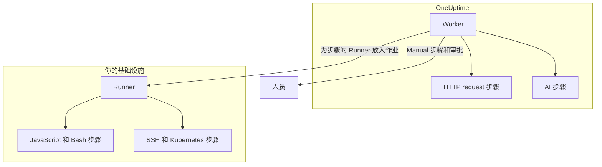

# Runbook 配置与安全

这是面向运维人员和安全审查人员的参考：每类步骤在哪里运行、步骤受哪些限制和超时约束、谁可以做什么，以及 Runbook 是如何加固的。

:::cards
- [每种步骤类型的运行位置](#每种步骤类型的运行位置): Worker、Runner 或人员。
- [输出上限和超时](#输出上限和超时): 步骤受到的每一项限制。
- [权限](#权限): 细粒度权限、三个 Runbook 角色，以及角色能触及哪些 Runbook。
- [加固说明](#加固说明): 沙箱、网络访问和 Runner 认证。
:::

## 每种步骤类型的运行位置

| 步骤类型 | 运行位置 | 方式 |
| --- | --- | --- |
| Manual | 人员 | 执行一直等待，直到有人完成或跳过该步骤。 |
| JavaScript | Runner | 在 `isolated-vm` 沙箱中。 |
| HTTP request | OneUptime Worker | 一次出站 HTTP 调用。 |
| Bash | Runner | `bash -c <script>`。 |
| SSH | Runner | 使用 [凭据](/docs/runbooks/credentials) 建立的 SSH 连接。 |
| Kubernetes | Runner | 使用凭据调用集群的 API 服务器。 |
| AI | OneUptime Worker | 调用项目的 LLM 提供商。 |

## Runner 步骤如何分发

JavaScript、Bash、SSH 和 Kubernetes 步骤 **从不在 OneUptime Worker 上运行** 。它们作为作业分发给特定的 [Runbook 代理](/docs/runbooks/agents)：一个你安装在自己基础设施中某台主机上的小进程。

分发模型：

1. Runbook 步骤的作者在编写步骤时从下拉列表中选择一个 Runner。
2. 步骤运行时，Worker 在 `RunnerJob` 中插入一行，`targetAgentId` 设为该 Runner 的 ID，状态为 `Pending`。
3. 正是这个 Runner（且只有它）以原子方式领取作业，在本地运行——Bash 通过 `bash -c <script>`，JavaScript 在 `isolated-vm` 沙箱中，SSH 和 Kubernetes 使用步骤的凭据——并发回结果。
4. Worker 用该结果继续执行 Runbook。

不再有 `RUNBOOK_BASH_ENABLED` 环境标志。这些步骤在某个部署中能否工作，完全取决于项目中是否有已连接且开启了 **执行运行手册** 的 Runner。

## 输出上限和超时

| 限制 | 值 | 适用于 |
| --- | --- | --- |
| 每个步骤的输出 | **50 KB** 。更长的输出会被截断并加上标记。 | 每个自动步骤 |
| 执行超时 | 默认 **30 秒** | JavaScript、Bash、SSH 和 Kubernetes 步骤 |
| 请求超时 | 默认 **30 秒** | HTTP request 步骤 |
| 领取超时 | 默认 **2 分钟** ：Worker 等待所选 Runner 领取作业、超过即判定失败的时长 | JavaScript、Bash、SSH 和 Kubernetes 步骤 |
| 超时范围 | **1 秒到 1 小时** | 每个超时 |
| 等待人员 | 无限制 | Manual 步骤和审批 |

在 Runbook 的 **步骤** 页面上按步骤设置超时；字段留空即保留默认值。超出范围的值会在步骤运行时被限制到范围内，因此输错的配置既不能关闭超时，也不能无限期占用 Worker 的槽位。

## 权限

Runbook 权限位于 `Runbook` 权限组中：

- `CreateRunbook`、`EditRunbook`、`DeleteRunbook`、`ReadRunbook` —— 管理 Runbook 模板。
- `CreateRunbookExecution`、`EditRunbookExecution`、`DeleteRunbookExecution`、`ReadRunbookExecution` —— 启动、勾选、删除和读取执行。
- `CreateRunbookRule`、`EditRunbookRule`、`DeleteRunbookRule`、`ReadRunbookRule` —— 管理自动触发规则。
- `CreateRunner`、`EditRunner`、`DeleteRunner`、`ReadRunner` —— 管理在你自己基础设施中运行步骤的 Runner。（在更名为 Runner 之前它们叫 `*RunbookAgent`；现有授权已迁移，无需重新分配。）
- `RunbookAdmin`、`RunbookMember`、`RunbookViewer`（角色）—— `RunbookAdmin` 构建 Runbook、其规则以及运行它们的 Runner，并运行 Runbook。`RunbookMember` 打开 Runbook 及其执行并运行它们（启动执行、完成或跳过其步骤、取消执行），但不创建、更改或删除任何 Runbook 或 Runner。`RunbookViewer` 只读取 Runbook 及其执行，什么也不运行。`RunbookAdmin` 包含上述所有细粒度权限。

角色运行其范围所及的 Runbook。限定于某些标签的 `RunbookMember`、`RunbookAdmin` 或 `ProjectMember` 授权，可以启动并推进带有这些标签的 Runbook 的执行；限定于 **Owned** 的授权，可以启动并推进其团队拥有的 Runbook 的执行；团队对某个标签的屏蔽会把这些 Runbook 排除在外。`CreateRunbookExecution` 和 `EditRunbookExecution` 针对的是不带标签的执行，因此能触及项目中的每个 Runbook。批准一个会启动 Runbook 的修复建议，也按同样方式检查。

凭据和密钥不在 `RunbookAdmin` 范围内。管理它们需要 `ProjectOwner` 或 `ProjectAdmin`，或者 `CreateRunbookCredential`、`EditRunbookCredential`、`DeleteRunbookCredential`、`ReadRunbookCredential` 和 `CreateRunbookSecret`、`EditRunbookSecret`、`DeleteRunbookSecret`、`ReadRunbookSecret` 权限。参见 [Runbook 凭据](/docs/runbooks/credentials)。

**运行手册 → 设置** 下的所有者规则和标签规则同样不在 `RunbookAdmin` 范围内。管理它们需要 `ProjectOwner` 或 `ProjectAdmin`，或者 `CreateRunbookOwnerRule` 和 `CreateRunbookLabelRule` 权限及其对应的编辑、删除和读取权限。

关于角色和细粒度权限如何组合，参见 [用户、团队与权限](/docs/permissions/index)。

## 队列与 Worker

Runbook 执行在 `Runbook` BullMQ 队列上运行。每个 Worker 进程最多同时运行 25 个执行；这个数字固定在代码中，不通过环境变量设置。

通过 API 勾选手动步骤后，执行会重新入队，从下一个步骤继续。它以 `Scheduled` 状态等待，直到 Worker 再次领取，队列中的执行永远不会因为等待而失败。

## 加固说明

- **JavaScript、Bash、SSH 和 Kubernetes** 在你掌控的 Runner 主机上运行，而不是在 OneUptime Worker 上。JavaScript 在独立的 `isolated-vm` 隔离环境中运行，拥有 128 MB 内存，无法访问 Runner 的文件系统或进程；它可以用 `axios` 发送 HTTP 请求，但发往私有网络、环回地址和链路本地地址的请求会被拒绝。Bash 通过 `bash -c` 运行，其超时在 Runner 上强制执行。
- **HTTP 步骤** 使用宽松的状态校验，因此 4xx 或 5xx 响应会被记录为失败的步骤，而不是作为异常抛出，记录的输出反映的是上游实际返回的内容。不跟随重定向。Worker 从不调用环回地址或链路本地地址，例如云元数据端点；在 OneUptime Cloud 上，它还会拒绝私有网络地址，自托管的 OneUptime 在设置 `DATA_SOURCE_BLOCK_PRIVATE_ADDRESSES=true` 时也会拒绝。
- **AI 步骤** 永远看不到事件的私有备注，也看不到 Slack 和 Microsoft Teams 的消息；前面步骤的输出会被扫描是否含有机密信息，并在到达模型之前被遮盖。嵌入的图片和很长的编码数据不会进入提示词。参见 [AI](/docs/runbooks/authoring#ai)。
- **Runner 认证** 使用 ID 和密钥，作为环境变量设置在 Runner 容器上。在服务器端，Runner 的权威身份来自与所提供的 ID 和密钥对应的数据库行：即使密钥泄露，客户端也无法冒充另一个 Runner。
- **凭据和密钥** 静态加密存储，从不由 API 返回，只在分配到的 Runner 领取步骤时交给它们。

## 数据库表

| 表 | 内容 |
| --- | --- |
| `Runbook` | 模板：名称、slug、描述、`isEnabled`、标签，以及以 JSON 存储的步骤。 |
| `RunbookExecution` | 每次运行一行，带有可为空的外键 `incidentId`、`alertId` 和 `scheduledMaintenanceId`，以及一个 JSON 数组 `stepExecutions`，保存步骤和每个步骤状态的快照。 |
| `RunbookRule` | 自动触发规则，带有判别字段 `triggerEntityType`（Incident、Alert、ScheduledMaintenance）、与要启动的 Runbook 的多对多关系，以及匹配依据：JSON 列 `criteria`（条件），外加指向监视器、事件严重性、警报严重性、标签和监视器标签的多对多链接，以及标题、描述、监视器名称和监视器描述的匹配模式。 |
| `Runner` | 每个已安装的 Runner 一行：名称、密钥、`lastAlive`、`connectionStatus`、主机信息和功能。 |
| `RunnerJob` | 每个分发给 Runner 的步骤一行：`targetAgentId`（步骤作者选择的 Runner）、步骤类型、脚本或负载、状态（`Pending` → `Claimed` → `Running` → `Succeeded`、`Failed`、`TimedOut` 或 `Cancelled`）、领取截止时间、租约、输出和退出码。 |
| `RunbookCredential` | SSH 和 Kubernetes 凭据，其机密字段已加密，以及它们分配到的 Runner。 |
| `RunbookSecret` | 已加密的 Runbook 密钥，以及可以接收它们的 Runner。 |

## 运维建议

- **确保你在步骤上选择的 Runner 是健康的。** 如果需要冗余，可以再运行一个 Runner 并把步骤分配给两者，或者准备一个指向另一个 Runner 的备用 Runbook。
- **记录 URL，而不是大块数据。** 如果某个步骤产生超过几 KB 的输出，请把它写入对象存储或日志系统，并返回 URL。
- **幂等性很重要。** 如果 Worker 在步骤中途重启而执行随后恢复，HTTP request 或 AI 步骤会再次运行。Runner 上的步骤每次执行最多分发一次，但脚本可能在失败前已部分运行，而你也可能再次运行 Runbook。请把步骤设计成可以安全重试。

## 后续步骤

:::cards
- [Runbook 代理](/docs/runbooks/agents): 安装、运维 Runner 并排查问题。
- [Runbook 凭据](/docs/runbooks/credentials): 受管的 SSH 和 Kubernetes 访问权限，以及供脚本使用的密钥。
- [用户、团队与权限](/docs/permissions/index): 角色、标签和团队如何决定谁能运行什么。
:::
