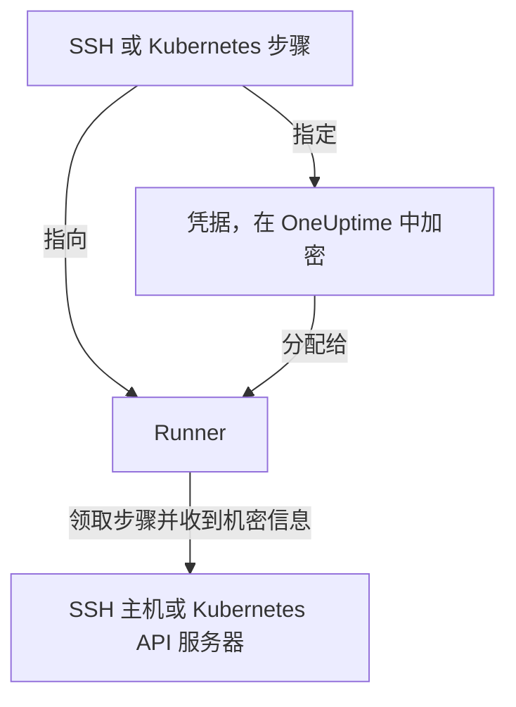

# Runbook 凭据

凭据是 Runbook 访问 **不是** Runner 自身主机的系统的方式：通过 SSH 访问的服务器，或 Kubernetes 集群。没有凭据时，“重启服务”意味着编写一个 Shell 脚本，并手动把密钥或 kubeconfig 放到 Runner 的主机上，让它留在 OneUptime 管控之外的磁盘上。凭据把同样的访问权限变成一个受管对象：静态加密存储、分配给特定的 Runner，并由步骤按名称引用。

在 **运行手册 → Runbook 代理 → 凭据** 下管理凭据。

:::cards
- [创建凭据](#创建凭据): 它的访问权限，以及可以使用它的 Runner。
- [另一端的最小权限](#另一端的最小权限): 限制密钥或令牌能做的事。
- [供脚本使用的密钥](#供脚本使用的密钥): 为 Bash 或 JavaScript 脚本提供密码或令牌。
:::

## 凭据的使用方式



SSH 或 Kubernetes 步骤会指定一个凭据和一个 Runner。当该 Runner 领取步骤时，OneUptime 会检查凭据是否已分配给它，解密其中的机密信息，并只在对这次领取的响应中交出。机密信息从不保存在作业上，也永远无法通过 API 读取。

## 开始之前

- **能管理凭据的角色。** Project Owner 和 Project Admin，或拥有 **Create Runbook Credential** 权限的任何人。Runbook Admin 角色不包含此权限。把 SSH 凭据分配给运行 OneUptime AI 命令的 Runner 还需要 **Read Runbook Credential** ；参见 [运行 OneUptime AI 命令的 Runner](#运行-oneuptime-ai-命令的-runner)。
- **包含该功能的套餐。** 在 OneUptime Cloud 上，Runbook 凭据需要 **Growth** 或更高套餐。
- **一个 [Runner](/docs/runbooks/agents)** ，能通过网络访问目标主机或集群的 API 服务器。

## 创建凭据

:::steps
### 打开凭据

打开 **运行手册 → Runbook 代理 → 凭据** ，点击 **创建Runbook Credential** 。

### 命名并选择类型

在 **Credential** 步骤中输入 **名称** （例如 `prod-cluster`）、可选的 **描述** 以及 **类型** ： **SSH** 或 **Kubernetes** 。类型之后不能更改；如需更改，请创建新的凭据。

### 填写访问信息

:::tabs
@tab SSH
在 **SSH 主机** 下输入 **主机名** 、 **端口** （留空则为 22）和 **用户名** 。在 **SSH 认证** 下粘贴 **Private Key (PEM)** 及其 **Private Key Passphrase** （如果有），或为不支持密钥访问的主机输入 **密码** 。能选择时，密钥是最佳选择。
@tab Kubernetes
在 **Kubernetes** 下输入 **API Server URL** （例如 `https://10.0.0.1:6443`）、 **Service Account Token** 和 **CA Certificate (PEM)** ，以便 Runner 验证 API 服务器。只有当 API 服务器出示的证书已被 Runner 信任时，才可以把 CA 留空。
:::

### 分配给 Runner

在 **Runbook 代理** 步骤中选择可以使用该凭据的 Runner，然后点击 **创建Runbook Credential** 。未分配给任何 Runner 的凭据不能被任何步骤使用。

### 在步骤中使用

在 [SSH 或 Kubernetes 步骤](/docs/runbooks/authoring#步骤类型) 中选择其中一个 Runner，然后在 **Credential** 下选择该凭据。步骤只会列出与其类型相同的凭据，并且保存一个指定了凭据的步骤需要读取 Runbook 凭据的权限。
:::

## 保存的内容

| 类型 | 字段 |
| --- | --- |
| SSH | 主机名、端口（默认 22）、用户名，以及 PEM 私钥（可带口令）或密码。 |
| Kubernetes | API 服务器 URL、服务账号令牌和集群的 CA 证书。 |

## 机密值只能写入

私钥、口令、密码和服务账号令牌都静态加密存储，API **从不返回它们** ：不返回给仪表板，不返回给工作流，也不出现在导出中。表格可以告诉你凭据 *是什么* ，但永远不会显示其中的内容。

因此，机密值没有“查看”，只有“替换”：重新输入一个值就是轮换它的方式。如果你丢失了原始值，请在目标系统上签发新密钥，然后更新凭据。

## 将凭据分配给 Runner

凭据只能由你分配的 Runner 使用，并且步骤必须指向其中一个。如果步骤指定的凭据没有分配给它的 Runner， **步骤会失败而不是运行** ：一个悄无声息什么也不做的 Runner，看起来和一个成功的 Runner 毫无二致。

分配就是访问边界，所以请保持范围尽量小：一个只负责重启某个集群的 Runner，不需要你数据库主机的 SSH 密钥。

### 运行 OneUptime AI 命令的 Runner

在开启了 **执行 AI 补救命令** 的 Runner 上，OneUptime AI 会从分配给该 Runner 的 SSH 凭据中挑选，用于它在那里运行的命令。因此，无论先保存哪一方，SSH 凭据都只能经由有权读取 Runbook 凭据的人（ **Read Runbook Credential** ，或 Project Owner、Project Admin）到达这样的 Runner：

- **分配凭据。** 创建包含此类 Runner 的 SSH 凭据，或把此类 Runner 添加到凭据中，都需要该权限。没有该权限时，保存会被拒绝并指出该 Runner：请把凭据分配给不运行 AI 补救命令的 Runner，或请有该权限的人来分配。
- **打开开关。** 为持有 SSH 凭据的 Runner 开启 **执行 AI 补救命令** 需要同样的权限。

从凭据中移除 Runner、按凭据现有的 Runner 原样保存凭据，以及 Kubernetes 凭据，都不需要额外权限：OneUptime AI 的 kubectl 命令使用绑定到其集群的凭据运行。没有该权限的人所做的凭据分配和开关开启，在一个项目中会逐个保存，因此两者不能一起通过检查；在另一次保存进行时到达的保存会等待它完成，如果等待太久，会以 *Try again in a moment* 被拒绝。请再次保存。

工作流的步骤以 Project Admin 的身份执行，但不会借用 Project Admin 读取 Runbook 凭据的权限：只有当最后保存工作流步骤的人拥有该权限时，步骤才拥有它。参见 [工作流步骤可以做什么](/docs/workflows/configuration#工作流步骤可以做什么)。

## 另一端的最小权限

OneUptime 无法限制你的凭据在目标系统上能做什么：这是目标系统的职责，而且值得去做：

- **SSH** ——优先使用密钥而不是密码，只给用户它需要的命令（在可行时使用强制命令或受限 Shell），不要复用管理员的个人密钥。
- **Kubernetes** ——将服务账号绑定到一个 Role，只允许对你的 Runbook 涉及的工作负载、在它们所在的命名空间中执行 `patch`。 **Restart workload** 修改工作负载本身， **Scale workload** 修改其 `scale` 子资源：不需要更多权限。

例如，一个只能重启和扩缩一个 Deployment、别的什么也做不了的服务账号：

```yaml title="oneuptime-runbooks-rbac.yaml"
apiVersion: v1
kind: ServiceAccount
metadata:
  name: oneuptime-runbooks
  namespace: checkout
---
apiVersion: rbac.authorization.k8s.io/v1
kind: Role
metadata:
  name: oneuptime-runbooks
  namespace: checkout
rules:
  # Restart workload: patches the Deployment's pod template.
  - apiGroups: ["apps"]
    resources: ["deployments"]
    resourceNames: ["checkout-api"]
    verbs: ["patch"]
  # Scale workload: patches the Deployment's scale subresource.
  - apiGroups: ["apps"]
    resources: ["deployments/scale"]
    resourceNames: ["checkout-api"]
    verbs: ["patch"]
---
apiVersion: rbac.authorization.k8s.io/v1
kind: RoleBinding
metadata:
  name: oneuptime-runbooks
  namespace: checkout
subjects:
  - kind: ServiceAccount
    name: oneuptime-runbooks
    namespace: checkout
roleRef:
  apiGroup: rbac.authorization.k8s.io
  kind: Role
  name: oneuptime-runbooks
```

对于 StatefulSet 或 DaemonSet，请改用 `statefulsets` 或 `daemonsets`。DaemonSet 无法扩缩，因此不需要 `scale` 规则。

## 供脚本使用的密钥

Bash 和 JavaScript 步骤没有 **Credential** 字段。要在不把密码、令牌或 API 密钥写进 Runbook 的情况下把它提供给脚本，请将其保存为 **Runbook 密钥** 。密钥在 **运行手册 → 设置 → 密钥** 下管理，由 Project Owner 和 Project Admin 或拥有 **Create Runbook Secret** 权限的人管理。

:::steps
### 创建密钥

点击 **创建Runbook Secret** 。在 **密钥** 步骤中输入 **名称** （字母、数字、连字符和下划线）、可选的 **描述** 以及 **密钥值** 。在 **访问** 步骤中，在 **有权访问此密钥的 Runbook 代理** 下选择 Runner。

### 在脚本中使用

在需要该值的位置写 `{{runbookSecrets.NAME}}`：

```bash
curl -s -X POST \
  -H "Authorization: Bearer {{runbookSecrets.CDN_API_TOKEN}}" \
  "https://api.cdn.example.com/v1/purge"
```

当分配了该密钥的 Runner 领取步骤时，它收到的脚本中已填入该值。
:::

与凭据的机密字段一样，密钥的值静态加密存储，API 从不返回： **更新密钥值** 会替换它。在 OneUptime Cloud 上，Runbook 密钥同样需要 **Growth** 或更高套餐。

| | 凭据 | Runbook 密钥 |
| --- | --- | --- |
| 使用者 | SSH 和 Kubernetes 步骤 | Bash 和 JavaScript 脚本 |
| 内容 | 一台主机及其密钥，或一个集群的 URL 和令牌 | 任意单个值 |
| 管理位置 | **运行手册 → Runbook 代理 → 凭据** | **运行手册 → 设置 → 密钥** |
| 到达 Runner 的方式 | 在领取指定它的步骤时的响应中 | 填入它所领取步骤的脚本中 |
| 能否通过 API 再次读取 | 只能读取其非机密字段 | 永远无法读取其值 |

## 谁能看到它们

创建、编辑和删除凭据需要 Runbook 凭据权限（或 Project Owner/Admin）。读取凭据只会显示其非机密字段。

请注意，Runner 的 **代理密钥** 等同于分配给该 Runner 的凭据：任何持有该密钥的东西都能以该 Runner 的身份领取工作并收到凭据。因此，代理密钥只能由 Project Owner、Project Admin 和 Runbook Admin 读取：请像对待凭据本身一样对待它们。

## 后续步骤

:::cards
- [编写 Runbook](/docs/runbooks/authoring): 编写使用凭据的 SSH 和 Kubernetes 步骤。
- [Runbook 代理](/docs/runbooks/agents): 安装要分配凭据的 Runner。
- [Runbook 配置与安全](/docs/runbooks/configuration): 整个 Runbook 体系的权限和加固。
:::
