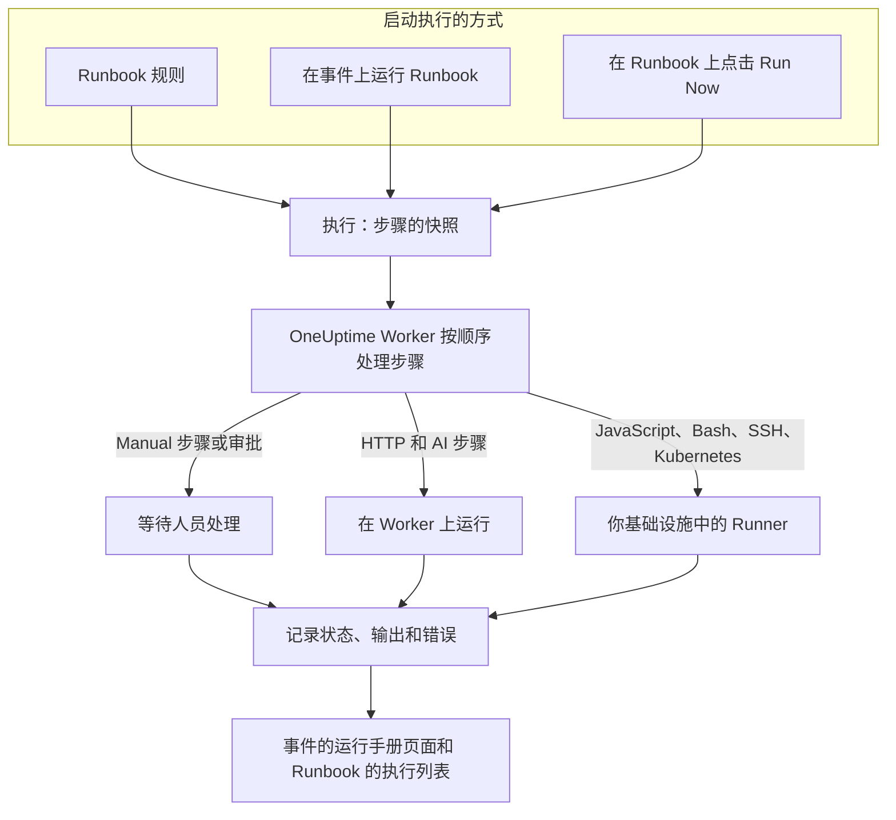

# Runbook 概览

Runbook 是可重复使用的响应流程：一份由手动步骤和自动步骤组成的有序列表，你可以在事件、警报或计划维护事件上运行它。它把“现在该怎么办？”的讨论变成一份清单，任何值班人员都能在凌晨 3 点照着执行，脚本、API 调用和审批都已事先写好。Runbook 面向处理事件的值班工程师，以及将这种响应自动化的平台团队。

:::cards
- [编写 Runbook](/docs/runbooks/authoring): 创建 Runbook 并编写其步骤。
- [Runbook 规则](/docs/runbooks/rules): 在新的事件、警报和维护事件上启动 Runbook。
- [运行 Runbook](/docs/runbooks/running): 启动一次执行，完成并批准其步骤，或取消它。
- [Runbook 代理](/docs/runbooks/agents): 安装在你自己的基础设施中运行脚本的 Runner。
:::

## Runbook 如何运行



每次运行 Runbook 都会创建一次 **执行** 。执行开始时，Runbook 的步骤会被复制到其中，OneUptime 按顺序逐一处理。Manual 步骤或需要审批的步骤会暂停执行，直到有人处理。

HTTP 和 AI 步骤在 OneUptime Worker 上运行。JavaScript、Bash、SSH 和 Kubernetes 步骤在你安装于自己基础设施中的 [Runner](/docs/runbooks/agents) 上运行，因此你的脚本永远不会在 OneUptime 的服务器上运行。每个步骤的状态、输出和错误消息都会记录在执行中，执行会一直保留在它所针对的事件、警报或计划维护事件上。

## 核心概念

| 概念 | 含义 |
| --- | --- |
| **Runbook** | 模板。一个有名称、可重复使用的流程，包含有序的步骤列表和 **运行此 Runbook** 开关。 |
| **步骤** | Runbook 中的一项。它有类型（Manual、JavaScript、HTTP request、Bash、SSH、Kubernetes 或 AI）、标题、描述和与类型相关的设置。 |
| **Runbook 规则** | 一条规则，自动将一个或多个 Runbook 关联到符合其条件（监视器、严重性、标签、监视器标签、标题或描述）的事件、警报或计划维护事件。 |
| **执行** | Runbook 的一次运行。在规则触发、有人在事件上点击 **运行 Runbook** 或在 Runbook 本身上点击 **Run Now** 时创建。它保存步骤的快照以及每个步骤的状态和输出。 |
| **快照** | 保存在每次执行中的 Runbook 步骤的冻结副本。之后编辑 Runbook 不会改写过去运行的历史。 |
| **Runner** | 你在自己基础设施中的主机上运行的小型代理。它运行指定它的 JavaScript、Bash、SSH 和 Kubernetes 步骤。也称为 Runbook 代理。 |
| **凭据** | SSH 和 Kubernetes 步骤使用的受管 SSH 或 Kubernetes 访问权限。静态加密存储，只交给你分配的 Runner。 |
| **密钥** | 单个值，例如 API 令牌，Bash 或 JavaScript 脚本以 `{{runbookSecrets.NAME}}` 的形式使用它。静态加密存储，只交给你分配的 Runner。 |

## 步骤类型

为每个步骤选择合适的类型。[编写 Runbook](/docs/runbooks/authoring) 介绍了每种类型的设置。

| 步骤类型 | 运行位置 | 适用场景 | 示例 |
| --- | --- | --- | --- |
| **Manual** | 人员 | 需要人来检查、判断或执行 OneUptime 无法完成的操作。 | “确认流量已切换到备用区域。” |
| **JavaScript** | Runner | 需要在沙箱中进行小型、受限的计算。 | 计算副本延迟并决定是否继续。 |
| **HTTP request** | OneUptime Worker | 调用现有 API：云服务商、PagerDuty、Slack Webhook、你自己的服务。 | 向故障转移编排器发送 `POST`。 |
| **Bash** | Runner | 需要在你自己的基础设施上执行 Shell 命令。 | 运行 `kubectl rollout restart` 或恢复脚本。 |
| **SSH** | Runner | 需要用受管的 SSH 凭据在远程主机上运行一条命令。 | 在 Web 服务器上重启服务。 |
| **Kubernetes** | Runner | 需要重启或扩缩 Deployment、StatefulSet 或 DaemonSet。 | 在 `production` 中重启 `checkout-api`。 |
| **AI** | OneUptime Worker | 希望在执行过程中由项目的 LLM 提供商给出分析、摘要或判断。 | “查看上面的诊断结果。现在故障转移安全吗？” |

一个 Runbook 可以混合所有类型。Runbook 的优势在于把人工检查与自动化和 AI 分析交织在一起。

## 启动执行的方式

| 方式 | 位置 | 执行关联到 |
| --- | --- | --- |
| Runbook 规则 | **事件** 、 **警报** 或 **计划维护** → **规则** → **Runbook 规则** | 新的事件、警报或计划维护事件 |
| **运行 Runbook** | 事件、警报或计划维护事件的 **运行手册** 页面 | 该事件、警报或计划维护事件 |
| **Run Now** | Runbook 的 **概览** 页面 | 无：一次临时运行 |
| 自动修复规则 | 参见 [AI SRE](/docs/ai/ai-sre) | 事件或警报 |

如果 Runbook 在 **设置** 页面上关闭了 **运行此 Runbook** 开关，以上任何方式都不会启动它。已经开始的执行会继续进行。

## Runbook 在仪表板中的位置

Runbook 位于 **产品** 下的 **仪表板与自动化** 分组中。

| 页面 | 在这里做什么 |
| --- | --- |
| **产品 → 运行手册** | 浏览、创建和打开 Runbook。 |
| Runbook 的 **步骤** | 编写步骤并调整顺序，然后选择 **Save Steps** 。 |
| Runbook 的 **概览** | 查看最近的执行和结果，并点击 **Run Now** 。 |
| Runbook 的 **执行** | 该 Runbook 的所有运行，可按状态或开始日期筛选。 |
| Runbook 的 **所有者** | 添加对它负责的人员和团队。 |
| Runbook 的 **设置** | 在不删除 Runbook 的情况下关闭 **运行此 Runbook** 。 |
| **运行手册 → 执行** | 项目中所有 Runbook 的所有运行。 |
| **运行手册 → Runbook 代理** 和 **运行手册 → Runbook 代理 → 凭据** | 安装 [Runner](/docs/runbooks/agents) 并管理 [凭据](/docs/runbooks/credentials)。 |
| **运行手册 → 设置** | 管理供脚本使用的 [密钥](/docs/runbooks/credentials#供脚本使用的密钥)，以及为新 Runbook 添加所有者和标签的 **所有者规则** 和 **标签规则** 。 |
| **事件 / 警报 / 计划维护 → 规则 → Runbook 规则** | 创建自动启动 Runbook 的规则。 |
| 事件、警报或维护事件 → **运行手册** | 查看与之关联的执行，并点击 **运行 Runbook** 启动新的执行。 |

## 完整示例

假设每个标题中含有“db-primary”的事件都应启动一个五步的数据库故障转移 Runbook。

:::steps
### 创建 Runbook

在 **运行手册** 中点击 **创建Runbook** ，将其命名为“DB primary failover”。打开它，进入 **步骤** ，添加以下步骤，然后点击 **Save Steps** ：

| # | 类型 | 标题 |
| --- | --- | --- |
| 1 | JavaScript | 记录故障转移前的副本延迟 |
| 2 | Manual | 在 DBA 仪表板中确认副本健康 |
| 3 | HTTP request | 向故障转移编排器发送 `POST` |
| 4 | Manual | 确认写入已转到新的主库 |
| 5 | HTTP request | 向 Slack 的 `#db-incidents` 发送解除通知 |

### 添加规则

在 **事件 → 规则 → Runbook 规则** 中，创建一条只有一个条件、指定要启动的 Runbook 的规则：

```text
Conditions:  Incident Title starts with db-primary
Runbooks:    [DB primary failover]
```

### 让它运行

某个监视器打开了事件 `INC-4821 · db-primary connection timeout`。规则匹配，执行开始：

- 步骤 1（JavaScript）在你为它选择的 Runner 上运行。返回值（例如 `{ lagMs: 412 }`）会被记录。
- 步骤 2（Manual）暂停执行，执行显示 **等待您处理** 。值班人员查看仪表板并点击 **Mark complete** 。
- 步骤 3（HTTP request）运行，`POST` 的响应被记录。
- 步骤 4（Manual）再次暂停执行，直到有人完成它。
- 步骤 5（HTTP request）运行，执行变为 **已完成** 。

### 回顾

执行会保留在事件的 **运行手册** 页面上。撰写事后复盘时，每个步骤的输出、错误和耗时一键即可查看。
:::

## 常见用途

- **数据库故障转移**：用 JavaScript 记录状态，请值班 DBA 确认副本健康（Manual），调用编排器（HTTP request），确认 DNS（Manual），发送解除通知（HTTP request）。
- **清除缓存**：一次 HTTP 请求，然后一个 Manual 步骤“确认缓存命中率正在恢复”。
- **影响客户的事件**：Manual“在状态页面发布更新”，用 HTTP 请求通知支持团队，用 JavaScript 获取受影响账户的列表。
- **计划维护前的预检**：对指标做快照，与相关方确认变更窗口（Manual），在负载均衡器上开启维护模式（HTTP request）。
- **先诊断，再修复**：Bash 步骤收集诊断信息，开启了 **需要批准** 的 AI 步骤阅读这些信息并推荐修复方案，只有在人员批准后，Kubernetes 步骤才会重启工作负载。
- **始终运行的例行检查**：一条没有条件的规则，在每个事件上记录系统状态，供事后复盘使用。

## Runbook 与 OneUptime 其他功能的关系

- **监视器** 打开事件和警报， **Runbook 规则** 把它们变成 Runbook 执行：检测、触发、响应、记录。
- **[值班策略](/docs/on-call/schedules)** 决定呼叫谁。Runbook 决定这个人醒来后做什么。
- Slack 和 Microsoft Teams 等 **[工作区连接](/docs/workspace-connections/slack)** 是发布更新的 HTTP 请求步骤的天然目标。
- **[状态页面](/docs/status-pages/index)** 常常作为面向客户的 Runbook 中的一个 Manual 步骤来更新。

## 后续步骤

:::cards
- [编写 Runbook](/docs/runbooks/authoring): 创建你的第一个 Runbook 及其步骤。
- [Runbook 代理](/docs/runbooks/agents): 在编写 JavaScript、Bash、SSH 或 Kubernetes 步骤之前安装 Runner。
- [Runbook 规则](/docs/runbooks/rules): 在创建事件时自动启动 Runbook。
- [Runbook 配置与安全](/docs/runbooks/configuration): 限制、超时、权限和加固。
:::
