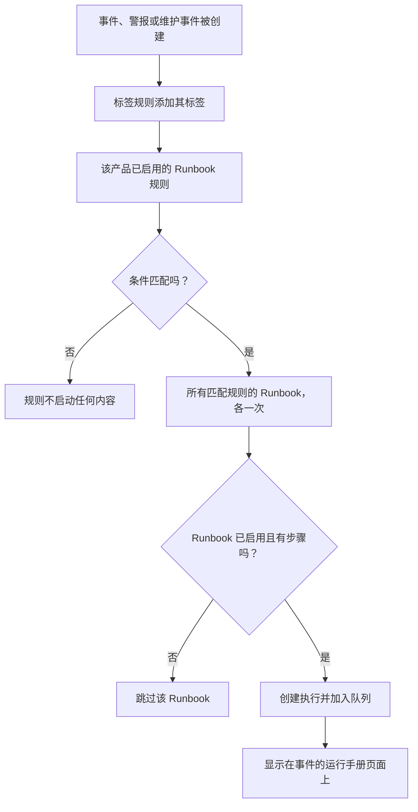

# Runbook 规则

Runbook 规则会在 **事件** 、 **警报** 或 **计划维护事件** 被创建时自动启动 Runbook，这样在故障当中就没有人需要记着去运行它们。每个产品在其 **规则** 菜单中都有自己的规则页面：

- 事件 → 规则 → **Runbook 规则**
- 警报 → 规则 → **Runbook 规则**
- 计划维护 → 规则 → **Runbook 规则**

这三个页面编辑的是同一种规则，只是分别筛选出各自产品的规则。

:::cards
- [创建 Runbook 规则](#创建-runbook-规则): 四个步骤：名称、条件和要启动的 Runbook。
- [条件](#条件): 规则可以使用的每个条件项和运算符。
- [匹配逻辑](#匹配逻辑): 多条规则、监视器条件和标签规则。
- [示例](#示例): 三条可以直接复制的规则。
:::

## 规则如何启动 Runbook



规则触发时，对它指定的每个 Runbook 都会发生以下过程：

1. 加载 Runbook。
2. 它的步骤作为 **快照** 复制到一次新的 Runbook 执行中。
3. 执行被放入 Runbook Worker 的队列。
4. 执行关联到来源实体：它会出现在事件、警报或计划维护事件的 **运行手册** 页面上，以及 Runbook 的 **执行** 列表中。

无论是否由规则启动，所有运行都可以在 **运行手册 → 执行** 中查看，并可按状态、Runbook 或开始日期筛选。

## 开始之前

- **一个可以运行的 Runbook。** 它至少需要一个步骤，并在其 **设置** 页面上开启 **运行此 Runbook** 。参见 [编写 Runbook](/docs/runbooks/authoring)。
- **管理规则的权限。** Project Owner、Project Admin 和 Runbook Admin 可以创建 Runbook 规则，拥有 **Create Runbook Rule** 权限的任何人也可以。

## 创建 Runbook 规则

:::steps
### 打开 Runbook 规则

在 **事件** 、 **警报** 或 **计划维护** 中，打开 **规则 → Runbook 规则** ，然后点击 **创建Runbook Rule** 。

### 为规则命名

在 **基本信息** 中输入 **名称** ，例如“数据库事件时启动 DB 故障转移”，并可选地输入 **描述** 。

### 添加条件

在 **匹配条件** 中点击 **添加条件** ，选择条件项和运算符，然后输入或选择值。如有需要，可添加更多条件，并选择 **匹配全部** 或 **匹配任一** 。若不添加任何条件，则会在此类每个新事件上启动 Runbook。

### 选择 Runbook

在 **运行手册** 中选择一个或多个 **要启动的运行手册** ，然后点击 **创建Runbook Rule** 。规则创建后立即生效，并以 **已启用** 状态显示在列表中。
:::

## 规则的组成

| 字段 | 用途 |
| --- | --- |
| **名称** | 规则的简短、易读的名称。 |
| **描述** | 给团队成员的可选上下文。 |
| **已启用** | 新规则默认开启。在规则的编辑表单中关闭它，即可暂停规则而不删除。 |
| **条件** | 规则匹配的内容，位于 **匹配条件** 步骤中。留空则匹配该类型的每个事件。 |
| **要启动的运行手册** | 规则触发时启动的一个或多个 Runbook。 |

## 条件

每个条件将事件、警报或计划维护事件的某一项与你提供的值进行比较。Runbook 规则提供的条件项与该产品的其他规则相同：事件的 Runbook 规则与事件的隐私规则或值班规则匹配相同的内容。

| 条件项 | 检查的内容 |
| --- | --- |
| **监视器** | 事件或计划维护事件影响的监视器，或触发警报的监视器。 |
| **事件 严重性** / **警报 严重性** | 事件或警报的严重性。计划维护事件没有严重性，因此其规则不提供此项。 |
| **事件标签** / **警报标签** | 事件、警报或维护事件本身的标签（计划维护规则中此条件项同样名为 **事件标签** ），包括创建时标签规则添加的标签。 |
| **监视器标签** | 其监视器的标签。为监视器加上 `production` 或 `staging` 标签，即可只在一个环境中运行 Runbook。 |
| **事件标题** / **警报标题** | 其标题（计划维护规则中此条件项同样名为 **事件标题** ）。 |
| **事件描述** / **警报描述** | 其描述（计划维护规则中仪表板使用相同的名称）。 |
| **监视器名称** / **监视器描述** | 其监视器的名称或描述。 |

为每个条件选择一个运算符：

- 列表类条件项（ **监视器** 、严重性和标签）对所选值使用 **包含任一** 、 **包含全部** 或 **不包含任何** 。
- 文本类条件项使用 **包含** （新条件的默认值）、 **不包含** 、 **等于** 、 **不等于** 、 **开头为** 、 **结尾为** ，或者用于不区分大小写的正则表达式或 `*` 通配符的 **匹配模式** / **不匹配模式** 。文本比较不区分大小写。

有两个或更多条件时，选择 **匹配全部** （每个条件都必须为真）或 **匹配任一** （至少一个为真）。

## 匹配逻辑

- 没有条件的规则适用于该类型的每个事件（一条全局的“始终运行”规则）。
- 多条规则可以匹配同一个事件。每个匹配都会触发，它们的 Runbook 的并集会运行：每个 Runbook 都有自己的执行，两条匹配规则都指定的 Runbook 只运行一次。
- 监视器条件一次检查一个监视器。在 **匹配全部** 下，“ **监视器名称** 包含 `api`”和“ **监视器标签** 包含任一 _Production_”需要同一个监视器同时满足两者，而不是各有一个监视器分别满足。
- Runbook 规则在标签规则之后运行，因此标签规则给新事件、警报或维护事件打上的标签可以启动 Runbook。
- 创建时就已解决的事件或警报不会启动 Runbook：它在被记录之前就已经结束了。参见 [声明时即已确认或已解决](/docs/incidents/declaring-incidents#声明时即已确认或已解决)。
- 针对另一个产品严重性的条件（例如事件规则中的 **警报 严重性** ）永远不可能为真，因此 API 会拒绝保存。
- 规则只在事件创建时评估一次。之后编辑事件的标题、严重性或标签不会再次触发规则。

## 示例

### 数据库事件时进行 DB 故障转移

```text
Name:        Start DB failover for DB incidents
Trigger:     Incident
Conditions:  Incident Title matches pattern (?:^|\b)(db|database|postgres|mysql|mongo)
Runbooks:    [DB failover playbook, Notify DBA team]
```

每当创建标题中含有“db”“database”“postgres”等字样的事件时，这会创建两次 Runbook 执行。

### 仅针对生产环境的严重事件

```text
Name:        Flush the CDN cache for critical production incidents
Trigger:     Incident
Conditions:  Match all
             Monitor Labels has any of Production
             Incident Severities has any of Critical
Runbooks:    [Flush CDN cache]
```

在带有 _Production_ 标签的监视器发生严重事件时运行，在 staging 上什么也不做。

### 始终运行的例行检查规则

```text
Name:        Always-run pre-flight check
Trigger:     Incident
Conditions:  (none)
Runbooks:    [Capture pre-incident state]
```

在每个事件上触发：适合为事后复盘记录系统状态、指标等快照。

## 已停用的 Runbook

如果规则指定的 Runbook 已关闭（在 Runbook 的 **设置** 页面上关闭了 **运行此 Runbook** ，即 `isEnabled = false`），规则仍会匹配，但 Runbook 执行会被跳过。重新打开开关即可恢复。没有步骤的 Runbook 也会以同样方式被跳过。

## 测试规则

在生产环境中依赖一条规则之前，先创建一个满足规则条件的测试事件（或测试警报），并检查预期的 Runbook 是否出现在其 **运行手册** 页面上。

> [!NOTE]
> Runbook 规则只作用于新事件。与标签规则和所有者规则不同，它们不能 [在现有记录上运行](/docs/configuration/run-rules-now)：那样会为已经结束的事件启动 Runbook。

## 故障排除

:::details 规则匹配了，但没有 Runbook 运行
按以下顺序检查：

- 规则处于 **已启用** 状态。
- 每个 Runbook 都在其 **设置** 页面上开启了 **运行此 Runbook** ，并且至少有一个已保存的步骤。
- 事件或警报在创建时并非已解决状态。
- Runbook 的执行并不只是在等待：从事件的 **运行手册** 页面打开它。Manual 步骤或审批会显示 **等待您处理** 。
:::

:::details 规则从不匹配
规则看到的是事件创建时的样子，以及那一刻标签规则添加的标签。之后更改的标签、严重性或标题不会被看到。有多个条件时，请核对 **匹配全部** 与 **匹配任一** ，并记住所有监视器条件都必须适用于同一个监视器。
:::

:::details API 以“can only be used by”拒绝规则
严重性条件项属于某一个产品。事件规则中的 **警报 严重性** ，或警报规则中的 **事件 严重性** ，永远不可能匹配，因此规则会被拒绝，并显示类似“Alert Severities can only be used by alert runbook rules.”的消息。请删除该条件。仪表板只提供每个产品自己的条件项。
:::

## 后续步骤

:::cards
- [运行 Runbook](/docs/runbooks/running): 规则启动执行时，响应人员会看到什么。
- [编写 Runbook](/docs/runbooks/authoring): 编写由你的规则启动的 Runbook。
- [声明事件](/docs/incidents/declaring-incidents): 事件是如何创建的，以及规则何时看到它们。
:::
