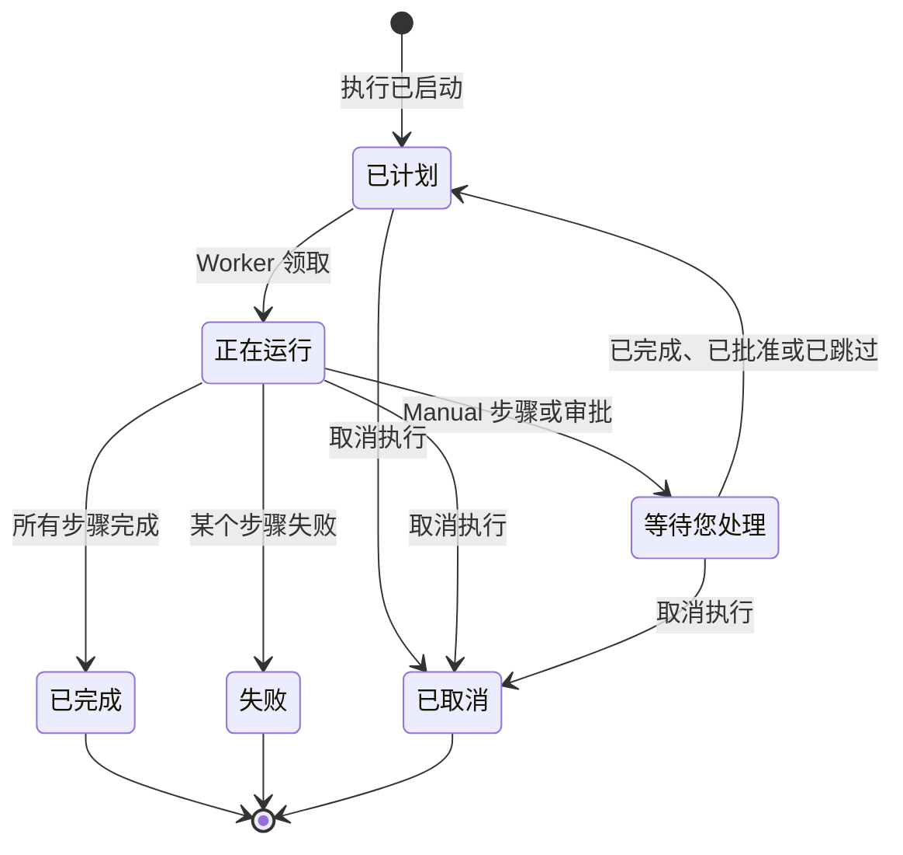

# 运行 Runbook

Runbook 的每次运行都是一次 **执行** ：一份 Runbook 步骤的快照，按顺序逐一处理，并记录每个步骤的状态和输出。本页面向处理事件、启动执行并推动其进行的人员：执行如何开始、执行页面显示什么，以及如何完成、批准、跳过和取消步骤。

:::cards
- [启动执行](#启动执行): 从事件、警报或维护事件启动，或从 Runbook 本身启动。
- [执行视图](#执行视图): 执行进行中每个步骤显示的内容。
- [完成、批准和跳过步骤](#完成批准和跳过步骤): 哪个步骤在什么时候接受决定。
- [故障排除](#故障排除): 无法开始或无法结束的执行。
:::

## 执行的流转

新的执行处于 **已计划** 状态，直到某个 Worker 领取它并将其标记为 **正在运行** 。在 Manual 步骤处，或在需要审批的步骤之后，它会以 **等待您处理** 暂停，一旦有人处理就重新进入队列。等待人员处理的执行永远不会超时。执行最终以 **已完成** 、 **失败** 或 **已取消** 结束。

## 启动执行

Runbook 执行有三种创建方式：

1. **通过规则自动启动**：当匹配的事件、警报或计划维护事件被创建时，[Runbook 规则](/docs/runbooks/rules) 会启动执行。自动修复规则也可以启动执行；参见 [AI SRE](/docs/ai/ai-sre)。
2. **从事件手动启动**：在事件、警报或计划维护事件上点击 **运行 Runbook** 。执行会关联到该事件。
3. **从 Runbook 页面手动启动**：在 Runbook 的 **概览** 页面上点击 **Run Now** 。这次运行不会关联到任何事件、警报或计划维护事件。

手动启动的方法：

:::tabs
@tab 从事件启动
1. 打开事件、警报或计划维护事件，进入其 **运行手册** 页面。
2. 点击 **运行 Runbook** 。 **运行 Runbook** 对话框会列出项目中已启用的 Runbook。
3. 点击 Runbook 旁边的 **Run** 。这次运行会出现在该事件的列表中：点击 **查看** 打开它。
@tab 从 Runbook 启动
1. 从 **运行手册** 打开 Runbook。
2. 在其 **概览** 上点击 **Run Now** 。
3. 执行页面会打开。
:::

启动执行需要 Project Owner、Project Admin、Project Member、Runbook Admin 或 Runbook Member，或者 **Create Runbook Execution** 权限。Runbook Viewer 和 Viewer 看到的 **Run Now** 处于锁定状态，并附有原因。参见 [权限](/docs/runbooks/configuration#权限)。

## 执行视图

打开一次执行即可看到它的清单。页面顶部显示执行的 **状态** 、 **Progress** （已完成的步骤数与总步骤数）、 **已开始** （开始时间）和 **触发者** （由什么启动）。每个步骤显示：

- **状态徽章** ——待处理、正在运行、等待您处理、完成、已跳过、失败或已取消。
- **标题和描述** ——在执行开始时从 Runbook 复制而来。
- **Output** （可折叠）——stdout、返回值、HTTP 响应或 AI 的回答。
- 步骤失败时的 **错误消息** 。
- 在执行正在等待的步骤上： **Mark complete** （Manual 步骤）或 **Approve & continue** （开启了 **需要批准** 的步骤），以及 **跳过** 。
- 执行暂停期间，在之后不需要审批的自动步骤上显示 **跳过** 。

执行进行期间，页面每 30 秒自动刷新一次。点击 **刷新** 可立即查看最新状态。

## 完成、批准和跳过步骤

只有执行正在等待的那个步骤可以被完成、批准或跳过，从而让执行继续进行。Manual 步骤或开启了 **需要批准** 的步骤，在执行到达之前不能勾选或跳过：它们的作用就是让执行停下来，所以只有当执行停在那里时（对于审批，是步骤已经运行、你能看到其输出时）才接受决定。

执行暂停期间，你也可以跳过之后不需要审批的自动步骤，这样执行继续时它就不会运行。执行仍会停在等待你的那个步骤上。步骤运行期间不能跳过：请等执行暂停，或取消执行。每个步骤都会记录是谁完成或跳过了它。

| 步骤 | 完成或批准 | 跳过 |
| --- | --- | --- |
| 执行正在等待的步骤 | 是 | 是 |
| 之后未开启 **需要批准** 的自动步骤 | 否 | 是，在执行暂停期间 |
| 之后的 Manual 步骤，或开启了 **需要批准** 的步骤 | 否 | 否 |
| 步骤运行期间的任何步骤 | 否 | 否 |

完成、批准、跳过和取消需要与启动执行相同的角色，或者 **Edit Runbook Execution** 权限。

## 交替使用手动和自动步骤

经典流程：

| # | 步骤 | 会发生什么 |
| --- | --- | --- |
| 1 | Bash：记录系统状态 | 执行一开始就在它的 Runner 上运行。 |
| 2 | Manual：“用状态页面横幅通知客户。” | 执行暂停，直到有人点击 **Mark complete** 。 |
| 3 | HTTP request：通过 PagerDuty 呼叫 DBA | 在 Worker 上运行。 |
| 4 | Manual：“确认备用数据库现在是主库。” | 执行再次暂停。 |
| 5 | HTTP request：向 Slack Webhook 发送解除通知 | 运行，执行变为 **已完成** 。 |

步骤 2 和 4 会暂停执行，直到有人勾选它们。步骤 1、3 和 5 自动运行。整个运行是一次执行、一条时间线、一个可信的事实来源。

## 取消一次执行

在执行页面上点击 **取消执行** 。状态变为 `Cancelled`，之后的步骤都不会开始。已经在运行的步骤不会被中断，但其结果不会被记录：该步骤保持 `Cancelled`。仍在等待 Runner 的作业会被取消；已经在运行脚本的 Runner 会把它运行完，但结果不会被接受。

## 输出限制

每个步骤的输出上限为 **50 KB** ，以免失控的脚本撑大数据库。更长的输出会被截断并加上标记。如果需要更大的产物，请在脚本中把它写入对象存储或日志系统，并输出其 URL。

## 再次运行 Runbook

执行是一次性的、不可更改的记录。要再次运行，请在已结束的执行上点击 **再次运行** ，或在 Runbook 上点击 **Run Now** 。两者都会根据 Runbook 当前的步骤创建一次新的执行，且不关联任何事件。要在某个事件上再次运行，请在该事件的 **运行手册** 页面上使用 **运行 Runbook** 。原来的执行保持不变，用于审计追踪。

## 查找过去的执行

| 位置 | 显示内容 |
| --- | --- |
| Runbook 的 **执行** | 该 Runbook 的所有运行，带有状态和开始日期筛选，以及 **触发者** 列。 |
| **运行手册 → 执行** | 项目中所有 Runbook 的所有运行。 |
| 事件、警报或维护事件的 **运行手册** 页面 | 关联到它的运行。一旦有运行，事件的概览中也会显示。 |

## 故障排除

:::details Run Now 被锁定
你的角色可以读取 Runbook，但不能运行它们：按钮显示“您没有在此项目中启动 Runbook 执行的权限。”请申请 Runbook Member 角色或 **Create Runbook Execution** 权限。
:::

:::details 启动执行时失败，提示“Runbook is disabled”或“Runbook has no steps to run”
Runbook 的 **运行此 Runbook** 开关在其 **设置** 页面上被关闭了，或者它没有已保存的步骤。请打开开关或添加步骤，然后点击 **Save Steps** 。
:::

:::details 步骤因缺少 Runner 或凭据而失败
消息类似于“Bash step is missing a Runner. Pick one under Runbooks → Runners.”该步骤在保存时没有选择 **Runner** ，或者 SSH 或 Kubernetes 步骤在保存时没有选择 **Credential** 。打开 Runbook 的 **步骤** ，选择缺少的内容，点击 **Save Steps** ，然后再次运行 Runbook。
:::

:::details 步骤因没有 Runbook 代理领取而失败
消息是“No runbook agent picked up this step before the wait window expired.”该步骤的 Runner 没有在其 claim timeout 内领取作业。在 **运行手册 → Runbook 代理** 中检查 Runner 是否为 **已连接** ，以及 **执行运行手册** 是否已开启。参见 [Runbook 代理](/docs/runbooks/agents#故障排除)。
:::

:::details 执行已经等待了好几个小时
等待人员处理的执行永远不会超时。打开它，在显示 **等待您处理** 的步骤上进行操作，或点击 **取消执行** 。
:::

:::details 某个步骤提示它可能只运行了一部分
运行该步骤的 OneUptime Worker 重启或停止响应，执行被标记为失败，而不是一直挂起。再次运行 Runbook 之前，请先检查目标系统。
:::

## 后续步骤

:::cards
- [编写 Runbook](/docs/runbooks/authoring): 在需要人来决定的地方添加 Manual 步骤和审批。
- [Runbook 规则](/docs/runbooks/rules): 在新事件上自动启动执行。
- [Runbook 代理](/docs/runbooks/agents): 让你的步骤所需的 Runner 保持在线。
:::
