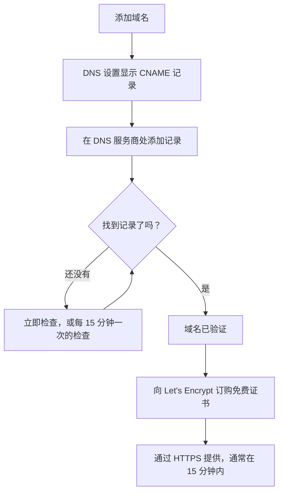

# 状态页品牌与域名

状态页是客户会看的唯一一个 OneUptime 界面，所以它应该看起来像您自己的页面，并放在您自己的域名上，例如 `status.yourcompany.com`。本页逐张卡片介绍 **品牌** 页面，然后把状态页放到您的域名上：添加域名，添加一条 DNS 记录，免费的 SSL 证书就会自动随之而来。

:::cards
- [品牌页面](#品牌页面): 徽标、标题、网站图标、链接、页脚、颜色和语言。
- [自定义 HTML、CSS 和 JavaScript](#自定义-htmlcss-和-javascript): 内置设置覆盖不到的一切。
- [自定义域名](#自定义域名): 您自己的主机名，附带免费证书。
- [状态列](#解读域名的状态列): 每个域名在通往 HTTPS 的路上走到了哪一步。
:::

## 各项品牌设置的位置

打开一个状态页，其侧边菜单的 **品牌** 区块中有三个项目：

| 页面 | 在那里设置什么 |
| ---- | ------------------ |
| **品牌** | 徽标和封面图片、页面标题和描述、网站图标、页眉链接、概览页面描述、版权行和页脚链接。折叠在 **更多设置** 下的：历史图表颜色、语言和搜索引擎索引。 |
| **自定义域名** | 您自己的域名、它的 DNS 记录以及免费的 SSL 证书。 |
| **HTML、CSS 和 JavaScript** | 页眉 HTML、页脚 HTML、自定义 CSS、自定义 JavaScript。 |

有三项看起来像品牌设置的内容，实际位于 **状态页面 → 您的页面 → 高级 → 高级设置**（`{id}/settings`），因为它们决定的是页面显示什么，而不是页面的外观：总体正常运行时间百分比、哪些监视器状态会计入不可用时间，以及“Powered by OneUptime”这一行。三者都是那里 **状态页显示的内容** 卡片中的行。

品牌设置以前分散在 **基本品牌**、**页眉**、**页脚**、**概览页面** 和 **语言** 几个独立的界面中。它们的旧地址（`{id}/header-style`、`{id}/footer-style`、`{id}/overview-page-branding` 和 `{id}/languages`）现在都会打开 **品牌** 页面，所以旧的书签和链接仍然有效。

## 品牌页面

**状态页面 → 您的页面 → 品牌 → 品牌**（`{id}/branding`）。每张卡片单独保存。在徽标、标题和网站图标之后，卡片按状态页从上到下的顺序排列：页眉的链接、概览顶部的文字，然后是页脚。很少有人修改的内容折叠在底部的 **更多设置** 下。

### 徽标和封面图片

第一张卡片 **徽标和封面图片** 有一个 **Edit Images** 按钮，会打开两个步骤：

| 步骤 | 字段 |
| ---- | ------ |
| **徽标** | 徽标上传（占位符 `Upload logo`）和 **Logo Alt Text**（占位符 `Logo of My Company`）。替代文本留空时，会改用状态页的标题。 |
| **封面图片** | **封面**，用于页眉后方宽横幅的上传（占位符 `Upload cover image`），以及 **Cover Image Alt Text**。如果封面纯属装饰，替代文本请留空。 |

徽标、封面图片和网站图标是上传到状态页自身项目中的文件，每次保存其中任何一个时都会检查这一点，无论是通过仪表板、API、Terraform 还是工作流。上传到其他项目的文件会被拒绝，提示与已不存在的文件相同："The logo's file could not be found. Upload the logo again."、"The cover image's file could not be found. Upload the cover image again." 或 "The favicon's file could not be found. Upload the favicon again." 从页面重新上传图片即可解决。

您的状态页只显示其自身项目的图片；无法显示的图片会被省略，就像页面没有图片一样。仪表板、API 和 Terraform 读取页面图片的方式相同：来自其他项目的图片会作为没有图片返回。页面发送的电子邮件（发给订阅者，以及发给私有用户、关于其登录的邮件）以同样的方式显示徽标：页面无法显示的徽标也会从邮件中省略，而不是显示为一张损坏的图片。

### 标题、描述和网站图标

- **标题和描述**：卡片注明这些内容也用于 SEO。**编辑** 会打开 **页面标题**（占位符 `Please enter page title here.`）和 **页面描述**。搜索引擎和链接预览会显示它们，所以请为客户而不是为您的团队撰写。
- **网站图标**：**Edit Favicon** 会打开 **网站图标** 上传：浏览器标签页中的小图标。

### 页眉链接

**页眉链接** 表包含状态页页眉中的链接，例如您的网站、文档或支持门户。每个链接都有 **标题** 和 **链接**（一个 URL，占位符 `https://link.com`），您可以拖动它们来调整顺序。没有链接时，表格会显示 **此状态页没有状态页眉链接**，下方是 **创建状态页面 页眉 链接**。

### 概览页面描述

**概览页面描述** 是状态页概览上的第一项内容，位于公告、总体状态和您的资源之上。**编辑描述** 会打开一个 markdown 字段。用它写一句背景说明：这个页面涵盖什么，以及去哪里获取支持。您放进去的图片会显示给页面的每位访客。

### 页脚

- **版权信息**：**Edit Copyright** 会打开一个字段 **版权信息**，占位符为 `Acme, Inc.`。
- **页脚链接**：与页眉链接相同的 **标题** 和 **链接** 组合，通过拖动排序。没有链接时，会显示“此状态页没有状态页脚链接。”

页眉链接用于导航；页脚链接用于细则，例如法律声明、隐私和条款。

### 更多设置

页面的最后一个区块折叠在 **更多设置** 下，因为很少有人会修改其中的内容。折叠时，其标题会列出它的四个区块（**默认条形颜色**、**条形颜色规则**、**语言** 和 **搜索引擎索引**），并显示与新状态页初始设置不同的每一项：不同于每个页面初始绿色的默认条形颜色、任何条形颜色规则、不是英语的默认语言、更短的语言列表，或已关闭的搜索引擎索引。点击即可展开：它是一张卡片，四个区块上下排列，每个都有自己的标题和按钮，用分隔线隔开。

**历史图表颜色。** 这是状态页上仅有的内置颜色设置。

- **历史图表的默认条形颜色**：**Edit Default Bar Color** 会打开 **默认条形颜色** 选择器。每个新状态页都从绿色开始。设置了条形颜色规则时，它也是没有任何规则匹配的那一天的颜色。页面没有数据的日子始终显示为灰色。
- **Rules for Bar Colors of History Chart**：一张有序的规则表，通过拖动排序。每条规则都有 **当正常运行时间百分比大于或等于** 和 **则，使用此条形颜色**；表格的列名为 `When Uptime Percent >=` 和 `Then, Bar Color is`。新规则的颜色已经预先选好，是其他规则尚未使用的颜色；请改为您想要的颜色。顺序很重要，所以请按您希望的评估顺序排列规则。没有规则时，每天的条形采用当天最低的监视器状态的颜色。

图表覆盖多少天不在这里设置。那是 **高级 → 高级设置** 上 **状态页显示的内容** 卡片中的 **正常运行时间历史记录**，范围为 1 到 90 天。哪些监视器状态算作宕机，则是同一卡片同一行中的 **计为停机时间**。

**语言。** **语言** 区块设置访客在页面页脚看到的语言切换器。**编辑语言** 会打开两个字段：

| 字段 | 作用 |
| ----- | ------------ |
| **默认语言** | 首次访问者看到的语言，从一个以该语言本身和英语同时命名每种语言的列表中选择（`Deutsch (German)`）。默认为英语，访客随时可以在页脚切换。 |
| **已启用的语言** | 一个多选框，占位符 `All languages`。留空则提供所有支持的语言；只选几种，页脚就只列出这些语言。 |

OneUptime 内置十七种语言：英语、德语、法语、西班牙语、意大利语、葡萄牙语、荷兰语、丹麦语、挪威语、瑞典语、俄语、日语、韩语、简体中文、繁体中文、印地语和波斯语。

**搜索引擎索引。** 一个开关 **允许搜索引擎索引此状态页** 决定 Google、Bing 等搜索引擎能否收录该页面。它默认开启。没有 **编辑** 按钮：开关在切换的那一刻就会保存。关闭后，页面会附带 `noindex, nofollow`（一个 robots 元标签和一个 `X-Robots-Tag` 响应头）提供；拥有链接的任何人仍然可以打开它。搜索引擎可能需要几周时间才能移除已经收录的页面。

> [!TIP]
> 当页面仅供内部使用或仍在搭建中时，请关闭 **允许搜索引擎索引此状态页**，以免一个半成品页面开始出现在您品牌名称的搜索结果中。

## 正常运行时间百分比和停机状态

两者都位于 **状态页面 → 您的页面 → 高级 → 高级设置**（`{id}/settings`）上 **状态页显示的内容** 卡片的 **正常运行时间历史记录** 行中。没有 **编辑** 按钮：每一项都在您更改的那一刻保存。

- **显示总体正常运行时间百分比**：一个开关，默认关闭。开启时，旁边的 **精度** 决定百分比显示几位小数：`99%`、`99.9%`、`99.99%`（默认）或 `99.999%`。在 OneUptime Cloud 上，开启百分比需要 **Scale** 套餐；它的精度在任何套餐上都可以更改。
- **计为停机时间**：以彩色标签显示的监视器状态，这些状态下的时间会在此页面上计入不可用时间。例如，您可以在这里决定降级状态是否计入不可用时间。至少会保留一个状态处于选中状态。

它们以前是两张独立的卡片 **总体正常运行时间百分比** 和 **停机监视器状态**，各自藏在一个 **编辑** 按钮后面。卡片的其余部分请参阅 [选择页面上显示什么](/docs/status-pages/index#选择页面上显示什么)。

## 自定义 HTML、CSS 和 JavaScript

**状态页面 → 您的页面 → 品牌 → HTML、CSS 和 JavaScript**（`{id}/custom-code`）有四张卡片，每张单独编辑，并存储在状态页的一列中：

| 卡片 | 列 | 包含的内容 |
| ---- | ------ | ------------- |
| **页眉 HTML** | `headerHTML` | 添加到页面页眉的 HTML（占位符 `Insert Custom HTML here.`）。 |
| **页脚 HTML** | `footerHTML` | 添加到页面页脚的 HTML。 |
| **自定义 CSS** | `customCSS` | 整个页面的样式（占位符 `Insert Custom CSS here.`）。 |
| **自定义 JavaScript** | `customJavaScript` | 页面运行的脚本（占位符 `Insert Custom JavaScript here.`）。 |

> [!IMPORTANT]
> 自定义 HTML、CSS 和 JavaScript 只在已验证的自定义域名上提供。它们在默认地址 `/status-page/:id` 上是关闭的，因为该地址与 OneUptime 的已登录源相同。

在 OneUptime Cloud 上，添加或更改其中任何一项都需要 **Growth** 套餐。清空任何一项在所有套餐上都可以，所以试用期间添加的自定义代码随时都可以删除。

**没有主题选择器。** OneUptime 状态页没有主题或品牌色设置：任何地方唯一的内置颜色设置，就是 **品牌** 页面 **更多设置** 下的 **默认条形颜色** 和历史图表条形颜色规则。字体、背景色、强调色和布局调整都通过 **自定义 CSS** 实现。如果您一直在找“品牌色”字段，答案就在这里：没有这样的字段，这个文本框就是实现它的方式。

> [!WARNING]
> 自定义 JavaScript 在访客的浏览器中运行，而且是在人们恰恰认为出了问题时才会打开的页面上运行。请保持它短小，尽量自行托管它加载的内容，并在依赖它之前进行测试。

## 自定义域名

默认情况下，状态页可以通过其 **概览** 界面上的预览 URL 访问。要把它放到您自己的主机名上，请前往 **状态页面 → 您的页面 → 品牌 → 自定义域名**（`{id}/domains`）。

**自定义域名** 卡片说明了该怎么做：把每个域名的 CNAME 记录指向您安装的状态页 CNAME 记录，OneUptime 就会为该域名签发 SSL 证书并替您续期。尚未设置任何内容时，表格会显示 **未找到自定义域名**，下方是 **创建状态页面 域**。表格有两列 **域名** 和 **状态**，以及 **域名**、**CNAME 有效** 和 **SSL 已预配** 的过滤器。

把页面放到您的域名上需要三步，只有前两步需要您来做：

1. **添加域名**：一个子域名和一个您已验证的域名。
2. **添加它的 CNAME 记录**：在您的 DNS 服务商处添加。添加域名后，**DNS 设置** 对话框会立即显示该记录。
3. **免费的 SSL 证书会自动签发**：一旦找到记录就会签发。没有需要点击的按钮。



### 开始之前

- **父域名必须已验证。** **域名** 下拉列表只列出在 **项目设置 → 域名** 中验证过的域名，您在那里用 TXT 记录证明自己拥有某个域名。字段旁边的 **添加域名** 链接会在新标签页中打开该页面。
- **您的安装需要一个状态页 CNAME 记录。** OneUptime Cloud 已经有了。在自托管安装中，请把它设为指向您 OneUptime 服务器的主机名（A 记录），并确保服务器在 80 端口上响应，Let's Encrypt 会在那里进行检查。没有它时，卡片和 **DNS 设置** 对话框会显示 "Custom Domains not enabled for this OneUptime installation"，而不是显示记录。

:::tabs
@tab Docker Compose
```ini title="config.env"
STATUS_PAGE_CNAME_RECORD=oneuptime.yourcompany.com
```
@tab Kubernetes
```yaml title="values.yaml"
statusPage:
  cnameRecord: oneuptime.yourcompany.com
```
:::

### 添加域名

:::steps
#### 打开 创建状态页面 域

在 **自定义域名** 上点击 **创建状态页面 域**。对话框只有一页。

#### 输入子域名

在 **子域名**（占位符 `status (leave blank for root)`）中只输入标签，例如 `status`，而不是完整的主机名。留空或输入 `@` 可使用根域名（apex）。

#### 选择域名

在 **域名**（占位符 `Select domain`）中选择一个您已验证的域名。未验证的域名不会出现在列表中，因为它会被拒绝。

#### 使用免费证书，或上传您自己的证书

**更多字段** 默认折叠，其标题会说明该域名将使用哪种证书："我们为此域名签发免费的 SSL 证书并自动续期。" 只有在使用您自己的证书时才需要展开它：打开 **上传自定义证书**，然后以 PEM 格式粘贴 **证书** 和 **证书私钥**。此时两者都是必填项。

#### 创建域名

点击 **创建状态页面 域**。对话框关闭，新域名的 **DNS 设置** 会打开，其中显示要添加的记录。
:::

域名的完整名称在添加时就固定了，因此 **编辑** 只能更改它的证书。若要使用另一个子域名，请添加该域名并删除旧的域名。

### DNS 设置和验证

**DNS 设置** 对话框显示要在 DNS 服务商处添加的记录，每行一个字段，每个字段都有复制按钮：

| 字段 | 输入什么 |
| ----- | ------------- |
| **类型** | `CNAME` |
| **名称** | 您添加的完整域名，例如 `status.yourcompany.com` |
| **值** | 您安装的状态页 CNAME 记录 |

> [!NOTE]
> 对于没有子域名的根域名，对话框会添加一条说明：许多 DNS 服务商不允许在那里使用 CNAME 记录。请改用您服务商的 ALIAS、ANAME 或 CNAME 拉平记录，填写相同的值。

OneUptime 每 15 分钟检查一次每个未验证的域名，一旦您的记录生效就会完成验证，无论您是否回来查看。要立即检查，请点击 **立即检查**：

- **尚未找到记录。** 对话框保持打开，并说明它查找的是哪条记录。新的 DNS 记录可能需要一段时间才会出现：稍后再点击 **立即检查**，或交给每 15 分钟一次的检查。
- **已找到记录。** 对话框会显示“您的 CNAME 记录已验证。”以及证书接下来会发生什么。免费证书会在那一刻订购。

在域名通过验证并且证书就位之前，它所在的行有一个 **DNS 设置** 操作，会打开同一个对话框。对于证书订购一直失败或证书已过期的已验证域名，那里的 **立即检查** 会重新订购，并显示上一次订购失败的原因。每个域名每 15 分钟最多订购一次；在此期间，OneUptime 会自行不断重试。

### SSL 证书

每个自定义域名都会获得 Let's Encrypt 签发的免费证书，签发和续期都是自动的。不需要点击任何东西：

- **立即检查** 会在找到记录的那一刻订购证书。随后对话框会说明证书通常在 15 分钟内生效。
- 当每 15 分钟一次的检查验证了某个域名时，它会在同一次检查中为该域名订购证书。
- 续期是自动的，会在证书到期前很早进行。如果在续期证书时您的 DNS 短暂无响应，证书会继续提供，并在之后的尝试中续期。DNS 检查失败绝不会移除仍然有效的证书。

新证书会在签发后 15 分钟内提供，因为证书就是以这个频率写入响应您域名的服务器的。状态列说的是 _通常_ 在 15 分钟内：当许多域名同时等待时，它们会被分批处理。

每个 OneUptime 证书都通过一个共享的 Let's Encrypt 账户订购，而 Let's Encrypt 会限制一个账户在短时间内可以下的新订单数量，以及同一域名的订单可以失败的次数。OneUptime 会让它所有的订单（新域名、**立即检查**、重新签发和续期）合计保持在这些限制之内，并且续期始终优先，这样大量新域名永远不会耽误让现有域名保持在线的续期。

如果订购失败，域名的状态列会显示出来，下一行附有原因，**DNS 设置** 中的 **立即检查** 也会显示。OneUptime 会自行继续尝试，每连续失败一次就多等一会儿，这样一个订单一直失败的域名不会耗尽其他所有域名需要的订单。常见原因是您的域名上有不允许 `letsencrypt.org` 的 CAA 记录，以及在自托管安装中 Let's Encrypt 无法通过 80 端口访问服务器；在自托管安装中，worker 日志里有详细信息。修复原因后，点击 **立即检查** 即可立即重新订购。每个域名每 15 分钟最多下一个订单；在此期间点击会显示上一次订购的结果。

如果您在 **更多字段** 下上传了自己的证书，OneUptime 会改为提供该证书，在保存后 15 分钟内生效。请在它到期之前，通过编辑域名上传替换证书。

### 重新签发证书

自动续期能覆盖常见情况，但有时您需要立刻获得一张全新的证书：一把您不想再保留的私钥、一张您自己的扫描器不认可的证书，或者一个在上游发生了变化的域名。一旦为某个域名订购了免费证书，它所在的行就会显示 **Reissue SSL** 操作。

它的对话框 **Reissue SSL Certificate for this Status Page** 会向 Let's Encrypt 为该域名申请一张新证书，并用它替换正在提供的证书。在此期间，您的状态页会继续使用现有证书保持在线，新证书会在 15 分钟内提供。点击 **Reissue SSL Certificate** 即可订购。

> [!NOTE]
> 每个域名每 24 小时只能重新签发一次。Let's Encrypt 会限制同一域名的签发频率，而每个 OneUptime 证书都通过一个共享账户订购，包括让其他所有人的页面保持在线的自动续期。在这个时间段内，对话框会告诉您还剩多长时间，而不会下单。如果当时正在为该域名订购证书，或者安装的 Let's Encrypt 订单暂时用完了，对话框会说明这一点，不会订购任何内容，这次点击也不会计为您的重新签发。

使用您上传证书的域名不会出现这个操作：没有可以重新签发的 Let's Encrypt 证书，所以请改为通过编辑域名上传新证书。在域名的第一张证书订购之前也不会出现，而第一张证书会在其 CNAME 记录验证后自动订购。

同样的按钮和同样的 24 小时限制，也出现在 **仪表板 → 您的仪表板 → 品牌 → 自定义域名** 下的仪表板自定义域名上，它们的工作方式与状态页自定义域名相同：请参阅 [共享与公开仪表板](/docs/dashboards/sharing#自定义域名)。

### 解读域名的状态列

**状态** 列以七种状态之一，说明每个域名在通往 HTTPS 的路上走到了哪一步。订购失败时，原因位于下一行。

| 状态列显示的内容 | 含义 |
| --------------------------- | ------------- |
| 等待 DNS：请添加 CNAME 记录。 | 尚未找到 CNAME 记录。打开 **DNS 设置** 查看记录，在您的 DNS 服务商处添加它，然后点击 **立即检查** 或等待每 15 分钟一次的检查。 |
| 正在签发免费证书，通常在 15 分钟内完成。 | 记录已验证，证书正在订购或写入。无需任何操作。 |
| 暂时无法签发免费证书。我们会继续尝试。 | 记录已验证，但订购其证书失败了，原因见下一行。修复原因后，打开 **DNS 设置** 并点击 **立即检查**，即可立即重新订购。 |
| 证书已过期。我们会继续尝试续期。 | 由于续期失败，域名的证书已过期。打开 **DNS 设置** 并点击 **立即检查**，即可立即续期并查看原因。 |
| 证书已签发，将自动续期。 | 完成。域名通过 HTTPS 提供其证书，由 OneUptime 负责续期。 |
| 证书已签发，但续期失败。我们会继续尝试。 | 域名仍在提供有效的证书，但上一次续期失败了，原因见下一行。OneUptime 会在证书到期前很早再次尝试。 |
| 正在使用您上传的证书。 | 记录已验证，域名使用您上传的证书提供服务。 |

:::details 添加记录很久之后，域名仍停留在“等待 DNS”
检查记录的名称是否为完整域名，例如 `status.yourcompany.com`，以及它的值是否与您安装的 CNAME 记录完全一致。在根域名上，请使用 ALIAS、ANAME 或拉平的 CNAME 记录。然后在 **DNS 设置** 中点击 **立即检查**。
:::

:::details 状态列显示无法签发免费证书
在您的域名上查找没有包含 `letsencrypt.org` 的 CAA 记录；在自托管安装中，检查您的服务器是否在 80 端口上响应。修复原因后，在 **DNS 设置** 中点击 **立即检查** 重新订购。
:::

### 谁可以检查和重新签发

**立即检查**、订购域名证书和 **Reissue SSL** 都会更改域名，因此需要编辑该域名的权限：**Edit Status Page Domain**，或包含该权限的角色（Project Owner、Project Admin、Project Member、Status Page Admin 或 Status Page Member）。

只能读取该域名的人，例如 Viewer 或 Status Page Viewer，仍然可以看到 **状态** 列以及 **DNS 设置** 中要添加的记录。对他们来说，**立即检查** 和 **Reissue SSL** 处于锁定状态，并会说明需要哪项权限。无论如何，OneUptime 都会继续自行检查每个域名并订购其证书。

API 密钥也是如此。只能读取状态页域名的密钥无法在 `/status-page-domain` 上调用 `verify-cname`、`order-ssl` 或 `reissue-ssl`。如有需要，请授予它 **Read Status Page Domain** 和 **Edit Status Page Domain**。

## Powered by OneUptime

“Powered by OneUptime”这一行不是品牌设置。它是 **状态页面 → 您的页面 → 高级 → 高级设置**（`{id}/settings`）上 **状态页显示的内容** 卡片的最后一个开关：**显示“由 OneUptime 提供支持”品牌标识**，默认开启。关闭它即可隐藏这一行；它会立即保存。在 OneUptime Cloud 上，隐藏它需要 **Scale** 套餐。

## 后续步骤

:::cards
- [状态页概览](/docs/status-pages/index): 页面显示什么，以及谁可以查看。
- [状态页资源与分组](/docs/status-pages/resources-and-groups): 选择访客在页面上实际看到的内容。
- [订阅者与公告](/docs/status-pages/subscribers): 带有您徽标并链接到您域名的电子邮件。
- [公共 API](/docs/status-pages/public-api): 以 JSON 形式读取页面，在您自己的域名上也可以。
:::
