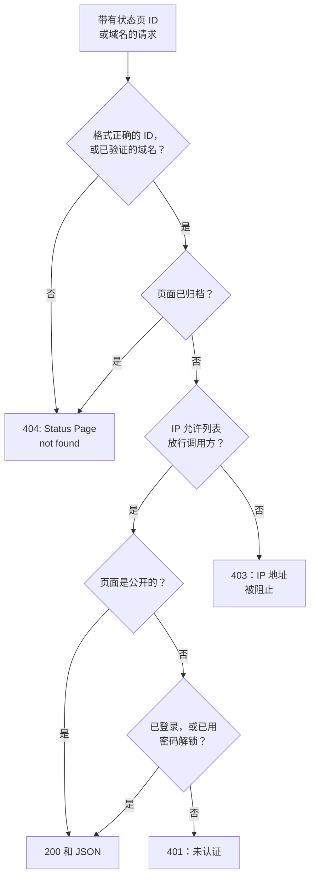

# 公共 API

每个状态页都会响应一小组只读的 JSON 端点：它的概览、可用率、事件、片段、计划维护事件和公告。这些正是状态页自己加载的端点，所以返回的内容与访客看到的完全一致，公开页面也不需要 API 密钥。可以用它们在你自己的应用、聊天机器人或墙上的显示屏中展示状态。

:::cards
- [端点](#端点): 页面显示的每类内容都有一个端点。
- [读取概览](#读取概览): 一个请求取得整个页面，提供 curl、Node.js 和 Python 示例。
- [指定日期范围的可用率](#指定日期范围的可用率): 按资源和分组统计的可用率，最长 90 天。
- [错误](#错误): 每个状态码的含义。
:::

## 请求如何得到响应

每个请求都通过 ID 或某个自定义域名来指定状态页。OneUptime 找到该页面，套用与访客相同的访问规则，然后以 JSON 响应。



私有页面只响应已登录该页面或已用密码解锁它的浏览器：API 读取的是与页面相同的会话。脚本请使用公开页面。参见[限制谁能看到这个页面](/docs/status-pages/index#限制谁能看到这个页面)。

格式正确但不属于任何状态页的 ID，会走与私有页面相同的路径，得到 `401`。如果公开页面返回 `401`，请检查 ID。

## 开始之前

- **状态页 ID。** 在控制台中打开该页面（**状态页面 → 所有状态页面**，然后选择该页面）。其 **概览** 上的 **状态页详情** 卡片会显示 **状态页 ID**。
- **基础 URL。** 下面所有端点都位于 `/status-page-api` 之下：

| 页面运行位置 | 基础 URL |
| ------------------- | -------- |
| OneUptime Cloud | `https://oneuptime.com/status-page-api` |
| 自托管 OneUptime | `https://<your-oneuptime-host>/status-page-api` |
| 页面的自定义域名 | `https://status.example.com/status-page-api` |

下面路径中写着 `{statusPageIdOrDomain}` 的地方，可以传入页面 ID 或它的某个已验证的自定义域名，例如 `status.example.com`。可用率端点只接受 ID，对域名会返回 `401`。

## 端点

| 端点 | 方法 | 返回 |
| -------- | ------- | ------- |
| `/overview/{statusPageIdOrDomain}` | `GET`、`POST` | 概览显示的一切：总体状态、资源和分组、进行中的事件和片段、计划维护、当前公告，以及可用率条背后的数据。 |
| `/uptime/{statusPageId}` | `POST` | 指定日期范围内，每个资源和每个分组的可用率百分比。 |
| `/incidents/{statusPageIdOrDomain}` | `GET`、`POST` | 页面列出的事件，以及它们的公开备注和状态变化。 |
| `/incidents/{statusPageIdOrDomain}/{incidentId}` | `POST` | 一个事件。 |
| `/episodes/{statusPageIdOrDomain}` | `POST` | 页面列出的事件片段。 |
| `/episodes/{statusPageIdOrDomain}/{episodeId}` | `POST` | 一个片段。 |
| `/scheduled-maintenance-events/{statusPageIdOrDomain}` | `GET`、`POST` | 页面列出的计划维护事件，以及它们的公开备注和状态变化。 |
| `/scheduled-maintenance-events/{statusPageIdOrDomain}/{scheduledMaintenanceId}` | `POST` | 一个计划维护事件。 |
| `/announcements/{statusPageIdOrDomain}` | `GET`、`POST` | 页面列出的公告。 |
| `/announcements/{statusPageIdOrDomain}/{announcementId}` | `POST` | 一条公告。 |

这些端点遵循页面自身的设置，即 **状态页显示的内容** 卡片中的设置（参见[选择页面上显示什么](/docs/status-pages/index#选择页面上显示什么)）：

- 关闭的列表会拒绝对应的端点，例如返回 `Incidents are not enabled on this status page.`
- 每个列表回溯的天数由它的 **显示最近 … 天** 设置决定（默认 14）。事件列表还包括所有尚未解决的事件，计划维护列表还包括所有即将开始或正在进行的事件。
- 按 ID 请求时，事件、片段、维护事件或公告无论多旧都会返回，因此指向旧条目的链接仍然有效。页面根本不显示的条目（例如不在页面上的监控器的事件）会返回空列表，片段则返回 `404`。

**页面返回哪些事件。** 事件端点返回页面上监控器的事件，去掉限定到其他状态页的事件；如果页面只显示限定到它自己的事件，还会去掉所有没有限定到此页面的事件（参见[每个受众一个状态页](/docs/status-pages/one-status-page-per-audience)）。事件限定到哪些页面，永远不会出现在响应中。

## 读取概览

概览就是取得整个页面的一个请求。它与状态页绘制的数据相同，最多是 15 秒前的数据。

:::tabs
@tab curl
```bash
curl https://oneuptime.com/status-page-api/overview/YOUR_STATUS_PAGE_ID
```
@tab Node.js
```javascript title="status.mjs"
// Node.js 18 or later: fetch is built in. Run with `node status.mjs`.
const statusPageId = "YOUR_STATUS_PAGE_ID";

const response = await fetch(
  `https://oneuptime.com/status-page-api/overview/${statusPageId}`,
);
const body = await response.json();

if (!response.ok) {
  throw new Error(`${response.status}: ${body.error}`);
}

console.log(body.overallStatus?.name); // "Operational"
```
@tab Python
```python title="status.py"
# Python 3, standard library only. Run with `python3 status.py`.
import json
import urllib.request

STATUS_PAGE_ID = "YOUR_STATUS_PAGE_ID"
url = f"https://oneuptime.com/status-page-api/overview/{STATUS_PAGE_ID}"

with urllib.request.urlopen(url, timeout=10) as response:
    overview = json.load(response)

print((overview.get("overallStatus") or {}).get("name"))  # Operational
```
:::

总体状态是页面上监控器和监控器分组当前状态中最差的那个，也就是优先级最高的那个。一个监控器状态如下所示：

```json
{
  "_id": "cc80b385-4190-42a3-ae8b-9b391e90d79f",
  "name": "Operational",
  "color": { "_type": "Color", "value": "#2ab57d" },
  "isOperationalState": true,
  "priority": 1
}
```

### 概览返回的内容

| 键 | 内容 |
| --- | ------------- |
| `overallStatus` | 页面的总体状态，即上面那样的监控器状态；页面上什么都没有时，是项目中优先级最低的状态。 |
| `statusPage` | 页面的公开设置：标题、描述、品牌，以及显示的内容。 |
| `statusPageResources` | 每个资源：显示名称、描述、分组、监控器或监控器分组，以及显示选项。 |
| `resourceGroups` | 分组；嵌套分组带有 `parentStatusPageGroupId`。 |
| `monitorStatuses` | 项目的所有监控器状态，按优先级从低到高排列。 |
| `monitorGroupCurrentStatuses`、`monitorsInGroup` | 页面上每个监控器分组的当前状态，以及其中的监控器。 |
| `monitorStatusTimelines`、`uptimeDailyAggregate`、`monitorGroupMergedDowntime`、`statusPageHistoryChartBarColorRules` | 绘制可用率条所用的数据，以及页面的条形颜色规则。 |
| `activeIncidents`、`incidentPublicNotes`、`incidentStateTimelines`、`incidentStates` | 页面显示的未解决事件、它们的公开备注和状态变化，以及项目的事件状态。 |
| `timelineIncidents` | 可用率条时间窗口内的事件（包括已解决的），用于条形的提示信息。 |
| `activeEpisodes`、`episodePublicNotes`、`episodeStateTimelines` | 事件片段的相同内容。 |
| `scheduledMaintenanceEvents`、`scheduledMaintenanceEventsPublicNotes`、`scheduledMaintenanceStateTimelines`、`scheduledMaintenanceStates` | 即将开始或正在进行的计划维护事件，以及它们的公开备注和状态变化。 |
| `activeAnnouncements` | 正在显示的公告：已经开始且尚未结束。 |

## 指定日期范围的可用率

`POST /uptime/{statusPageId}` 返回页面上每个资源和分组在两个日期之间的可用率。两个日期都是可选的：

| 字段 | 默认值 | 说明 |
| ----- | ------- | ----- |
| `startDate` | 14 天前 | ISO 8601 格式的日期和时间。 |
| `endDate` | 现在 | 不能早于 `startDate`。范围最长 90 天。 |

:::tabs
@tab curl
```bash
curl -X POST https://oneuptime.com/status-page-api/uptime/YOUR_STATUS_PAGE_ID \
  -H "Content-Type: application/json" \
  -d '{"startDate": "2026-09-01T00:00:00Z", "endDate": "2026-09-30T23:59:59Z"}'
```
@tab Node.js
```javascript title="uptime.mjs"
// Node.js 18 or later. Run with `node uptime.mjs`.
const statusPageId = "YOUR_STATUS_PAGE_ID";

const response = await fetch(
  `https://oneuptime.com/status-page-api/uptime/${statusPageId}`,
  {
    method: "POST",
    headers: { "Content-Type": "application/json" },
    body: JSON.stringify({
      startDate: "2026-09-01T00:00:00Z",
      endDate: "2026-09-30T23:59:59Z",
    }),
  },
);
const uptime = await response.json();

for (const group of uptime.groupUptimes) {
  console.log(group.statusPageGroupName, group.uptimePercent);
}
```
@tab Python
```python title="uptime.py"
# Python 3, standard library only. Run with `python3 uptime.py`.
import json
import urllib.request

STATUS_PAGE_ID = "YOUR_STATUS_PAGE_ID"

request = urllib.request.Request(
    f"https://oneuptime.com/status-page-api/uptime/{STATUS_PAGE_ID}",
    data=json.dumps(
        {"startDate": "2026-09-01T00:00:00Z", "endDate": "2026-09-30T23:59:59Z"}
    ).encode(),
    headers={"Content-Type": "application/json"},
    method="POST",
)

with urllib.request.urlopen(request, timeout=10) as response:
    uptime = json.load(response)

for group in uptime["groupUptimes"]:
    print(group["statusPageGroupName"], group["uptimePercent"])
```
:::

响应：

```json
{
  "statusPageResourceUptimes": [
    {
      "statusPageResourceId": {
        "_type": "ObjectID",
        "value": "cfffa3c3-fdf3-4cd7-9585-d6d408a14663"
      },
      "uptimePercent": 99.98,
      "statusPageResourceName": "Checkout API",
      "currentStatus": {
        "_id": "cc80b385-4190-42a3-ae8b-9b391e90d79f",
        "name": "Operational",
        "color": { "_type": "Color", "value": "#2ab57d" },
        "isOperationalState": true,
        "priority": 1
      }
    }
  ],
  "groupUptimes": [
    {
      "statusPageGroupId": {
        "_type": "ObjectID",
        "value": "df7632c4-c5c0-453c-88bf-9ee3d68d45f2"
      },
      "parentStatusPageGroupId": null,
      "uptimePercent": 99.98,
      "statusPageResourceUptimes": [
        {
          "statusPageResourceId": {
            "_type": "ObjectID",
            "value": "8175534f-aa77-456c-ad5b-b8e7b85876aa"
          },
          "uptimePercent": 99.98,
          "statusPageResourceName": "Web app",
          "currentStatus": {
            "_id": "cc80b385-4190-42a3-ae8b-9b391e90d79f",
            "name": "Operational",
            "color": { "_type": "Color", "value": "#2ab57d" },
            "isOperationalState": true,
            "priority": 1
          }
        }
      ],
      "statusPageGroupName": "Web",
      "currentStatus": {
        "_id": "cc80b385-4190-42a3-ae8b-9b391e90d79f",
        "name": "Operational",
        "color": { "_type": "Color", "value": "#2ab57d" },
        "isOperationalState": true,
        "priority": 1
      }
    }
  ],
  "startDate": "2026-09-01T00:00:00.000Z",
  "endDate": "2026-09-30T23:59:59.000Z"
}
```

| 键 | 内容 |
| --- | ------------- |
| `statusPageResourceUptimes` | 不属于任何分组的资源，即访客在页面顶部看到的那些。 |
| `groupUptimes` | 每个分组一项。分组的 `uptimePercent` 和 `currentStatus` 覆盖它下面的所有资源，包括嵌套分组；它的 `statusPageResourceUptimes` 只列出直接位于该分组中的资源。用 `parentStatusPageGroupId` 重建树。 |
| `uptimePercent` | 按资源或分组自身的精度取整。资源或分组不显示可用率百分比时为 `null`。 |
| `currentStatus` | 资源或分组不显示当前状态时为 `null`。 |

当一段时间的监控器状态属于页面的 **计为停机时间** 状态之一时，这段时间计为停机。

## 事件、片段、维护和公告

列表端点既响应 `POST`，也响应 `GET`；单个条目的端点和片段端点响应 `POST`。

:::tabs
@tab curl
```bash
# The incidents the page lists
curl https://oneuptime.com/status-page-api/incidents/YOUR_STATUS_PAGE_ID

# One scheduled maintenance event
curl -X POST https://oneuptime.com/status-page-api/scheduled-maintenance-events/YOUR_STATUS_PAGE_ID/EVENT_ID
```
@tab Node.js
```javascript title="incidents.mjs"
// Node.js 18 or later. Run with `node incidents.mjs`.
const statusPageId = "YOUR_STATUS_PAGE_ID";

const response = await fetch(
  `https://oneuptime.com/status-page-api/incidents/${statusPageId}`,
);
const { incidents } = await response.json();

for (const incident of incidents) {
  console.log(incident.title, incident.currentIncidentState?.name);
}
```
@tab Python
```python title="incidents.py"
# Python 3, standard library only. Run with `python3 incidents.py`.
import json
import urllib.request

STATUS_PAGE_ID = "YOUR_STATUS_PAGE_ID"
url = f"https://oneuptime.com/status-page-api/incidents/{STATUS_PAGE_ID}"

with urllib.request.urlopen(url, timeout=10) as response:
    incidents = json.load(response)["incidents"]

for incident in incidents:
    print(incident["title"], (incident.get("currentIncidentState") or {}).get("name"))
```
:::

| 端点 | 响应中的键 |
| -------- | -------------------- |
| 事件 | `incidents`、`incidentPublicNotes`、`incidentStateTimelines`、`incidentStates`、`statusPageResources`、`monitorsInGroup` |
| 片段 | `episodes`、`episodePublicNotes`、`episodeStateTimelines`、`incidentStates`、`statusPageResources`、`monitorsInGroup` |
| 计划维护事件 | `scheduledMaintenanceEvents`、`scheduledMaintenanceEventsPublicNotes`、`scheduledMaintenanceStateTimelines`、`scheduledMaintenanceStates`、`statusPageResources`、`monitorsInGroup` |
| 公告 | `announcements`、`statusPageResources`、`monitorsInGroup` |

单个条目的请求会用相同的键响应，其中只包含那一条记录。

## 错误

出错时会返回一个状态码，以及说明原因的 JSON 正文：

```json
{ "error": "You can only get uptime for 90 days. Please select a date range within 90 days." }
```

| 状态 | 何时出现 |
| ------ | ---- |
| `400` | 请求了页面不显示的内容（例如已关闭的列表），或者可用率的范围超过 90 天，或结束时间早于开始时间。 |
| `401` | 页面是私有的，而请求既没有已登录的会话，也没有该页面的密码。格式正确但不属于任何状态页的 ID 也会得到 `401`。 |
| `403` | 页面的 IP 允许列表中没有调用方的地址。 |
| `404` | ID 格式不正确、没有匹配的已验证自定义域名，或者页面已归档。页面不显示的片段也会得到 `404`。 |

## 读取状态页的其他方式

- **RSS。** 每个状态页都提供 `/rss`，这是其事件、公告和计划维护事件的订阅源。参见[可嵌入徽章与 RSS 订阅源](/docs/status-pages/index#可嵌入徽章与-rss-订阅源)。
- **llms.txt。** 每个状态页都在 `/rss` 旁边提供 `/llms.txt`，它为 AI 代理指出 RSS 订阅源和概览 JSON 的位置。
- **MCP。** AI 代理可以通过 OneUptime 的 MCP 服务器 `https://oneuptime.com/mcp` 读取页面，无需 API 密钥，只要把页面 ID 或域名作为 `statusPageIdOrDomain` 传入。此功能默认开启；可在页面侧边菜单的 **人工智能 → MCP** 中用 **启用 MCP 服务器** 关闭。参见 [MCP 服务器](/docs/ai/mcp-server)。
- **REST API。** 要创建或修改状态页、资源、订阅者和公告，请使用 API 密钥调用 [OneUptime API](/docs/api-reference/api-reference)。

## 后续步骤

:::cards
- [状态页概览](/docs/status-pages/index): 状态页显示什么，以及谁能看到它。
- [状态页资源与分组](/docs/status-pages/resources-and-groups): 这些端点返回的资源和分组。
- [每个受众一个状态页](/docs/status-pages/one-status-page-per-audience): 为什么一个页面列出的事件，另一个页面却不列出。
- [状态页品牌与域名](/docs/status-pages/branding-and-domains): 在你自己的域名上提供页面和这些端点。
:::
