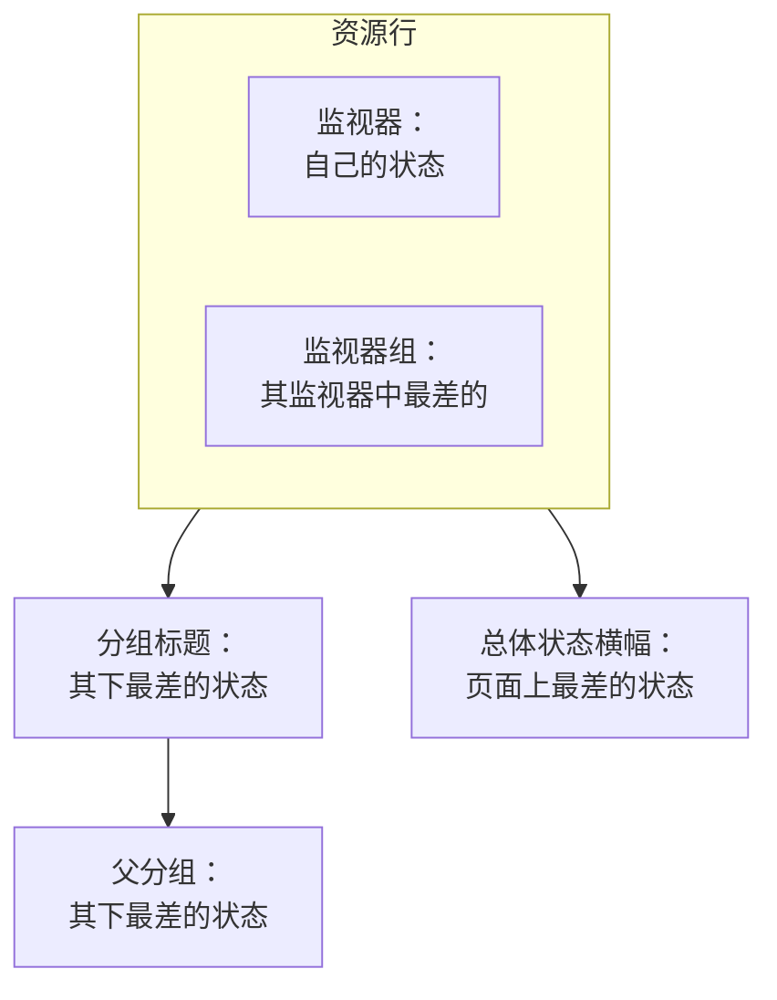

# 状态页资源与分组

资源是状态页上的一行：一个监视器或一个监视器组，带有客户能看懂的名称、当前状态，以及（如果需要）正常运行时间和历史记录。分组是容纳资源的区块，这样一个有四十个监视器的页面就能读成“API”“Web 应用”“数据管道”，而不是一份没有尽头的列表。两者都在同一个界面中创建：打开一个状态页，在其侧边菜单中选择 **资源**。

:::cards
- [添加监视器](#添加监视器): 用访客读到的名称把监视器放到页面上。
- [分组](#分组): 把页面拆分为区块，并相互嵌套。
- [监视器规则](#用监视器规则自动添加监视器): 让规则替您添加每个匹配的监视器。
- [从 CSV 导入分组](#从-csv-导入分组): 一次性搭建很深的层级。
:::

访客根据这些行判断“是我的问题还是他们的问题”，所以请按客户谈论您产品的方式来命名：用 **Checkout API**，而不是 `prod-checkout-lb-healthcheck-us-east-1`。

## 状态如何在页面上逐级上传

每一行显示其监视器的当前状态。它上面的每一级显示其下所有内容中最差的状态，最差的状态是指您项目的监视器状态中优先级最高的那个。

资源决定的不只是它那一行的颜色：

- **已归档的监视器不会显示。** 已归档的监视器不再被检查，所以它最后的状态是冻结的；页面会省略它的行（也不把它计入监视器组的状态），而不是把这个冻结的状态当作实时状态显示。该行会被保留，所以取消归档后它会立即回来。
- **资源决定页面显示哪些事件。** 当事件的某个监视器直接或通过监视器组成为页面上的资源时，事件就会显示在这里，页面的订阅者也会收到通知。把同一个监视器放到多个页面上，它的事件会到达所有这些页面，除非某个事件被限定在其中部分页面。请参阅 [每个受众一个状态页](/docs/status-pages/one-status-page-per-audience)。
- **监视器组的行代表其中的每个监视器，对订阅者也是如此。** 在允许订阅者选择资源的页面上，订阅某个监视器组的人会收到该组中任何监视器的事件、计划维护和公告通知，就像他们选择了那个监视器一样。请参阅 [订阅者与公告](/docs/status-pages/subscribers#让订阅者自己选资源和事件类型)。

## 资源界面

在开启了监视器组的项目中，这个菜单项叫 **资源**，在其他项目中叫 **监视器**；它们是同一个界面。分组以前有自己的页面，旧地址 `/groups` 现在会打开这个界面。

界面分为两部分：

| 部分 | 包含的内容 |
| ---- | ------------- |
| **分组导航器**（左侧） | 以树形显示页面上的所有分组，上方有 **Search groups...** 框，下方有计数，例如 `3 groups · 12 resources`。较长的列表末尾有一个 **Show N more of M** 按钮。 |
| **Top of page** | 导航器的第一行：不属于任何分组的资源，访客会在所有分组之上最先看到它们。在没有分组的页面上，右侧窗格的标题改为 **All resources**。 |
| **资源窗格**（右侧） | 所选分组的资源。它的标题栏有 **Edit Group**、主按钮 **添加监视器** 和 **More actions** 菜单。 |
| 卡片标题 | **New Group**，以及包含 **Import groups from CSV** 和 **刷新** 的三点菜单。 |

**空状态会告诉您该做什么。** 空分组会显示 **No monitors here yet**，以及 **添加监视器**、**Add Multiple**，并且只在页面一个分组都没有时显示 **Create a Group**。没有匹配结果的搜索会显示 **No resources match your search**。

## 添加监视器

:::steps
### 选择行放在哪里

在分组导航器中，选择资源所属的分组；如果是不属于任何分组的行，则选择 **Top of page**。

### 点击 添加监视器

**Add a monitor to {group}** 对话框会打开。它只有一页。

### 选择监视器

在 **监视器**（占位符 **选择监视器**）中选择它。**显示名称** 是访客读到的文本，会自动填入监视器的名称，并在您选择另一个监视器时随之更改，直到您自己输入名称为止。它与监视器本身的名称分开存储，因此在这里重命名不会影响监控。

### 设置显示选项（如需要）

**更多字段** 默认折叠。其中包含 **描述**（显示在行下方的可选 markdown，适合用一句话说明该服务实际做什么；其中的图片会显示给每位访客）和 [显示选项](#资源的显示选项)。保持折叠时，资源会使用它们的默认值。

### 保存资源

点击 **添加监视器**。该行会出现在分组中，也会出现在状态页上。
:::

在网格分组中，对话框还会在 **更多字段** 上方询问监视器所在的行和列；请参阅 [列表布局与网格布局](#列表布局与网格布局)。

> [!TIP]
> 若要把多项检查显示为一行，请添加监视器组。当 **监视器组** 开关打开时（**项目设置** > **高级** > **功能标志**，切换后立即保存），下拉列表下方会出现一个链接 **Add a Monitor Group instead.** 点击它，**监视器** 会变成 **监视器 组**（**选择监视器组**）；**Add a Monitor instead.** 可以切换回来。

### 一次添加多个

**Add Multiple**（也可以使用 **More actions** 菜单中的 **Add multiple monitors**）会打开 **Add Multiple Monitors**。它同样只有一页：一个 **监视器** 多选框，然后是同样折叠的 **更多字段**，其中的显示选项会应用到您选择的每个监视器。每个资源从其监视器获取显示名称和描述，**Add Monitors** 会一次全部添加。这是填充新页面最快的方式。

多选框有一个 **标签** 选项卡：点击一个标签，带有该标签的所有监视器会被一次选中。

### 按标签添加两次是安全的

状态页上每个监视器只出现一次。添加是幂等的，因此在给几个新监视器加上标签之后再次选择同一个标签，只会添加新的监视器：已经在页面上的监视器保持原样，保留您给它们设置的显示名称和选项。

批量添加结束时的摘要也会这样说明：新添加的监视器列在 **已添加** 下，原本就在的列在 **Already Added** 下。不会有任何内容被报告为失败，也不会为它们写入任何内容。

在其他任何创建资源的地方，同样的规则也适用。在单个添加表单中添加已在页面上的监视器，或在编辑表单中让现有资源指向它，都会被拒绝，提示 *"This monitor is already added to this status page"*，即使现有资源位于另一个分组中也是如此，因为访客仍然会看到这个监视器两次。若要在另一个分组中显示某个监视器，请删除它现有的资源，然后在您想要的位置添加它。

## 资源的显示选项

**更多字段** 区块在单个添加表单和批量添加对话框中是一样的。它在两者中都默认折叠，在 **编辑资源** 中也是如此，其折叠的标题会显示其中哪些项与默认值不同。这里的所有设置都是按资源设置的：同一分组中的两行可以有不同的设置。

| 字段 | 默认值 | 作用 |
| ----- | ------- | ------------ |
| **工具提示**（`displayTooltip`） | 空 | 在状态页上的资源旁显示为工具提示。可用于说明范围：“美国和欧盟客户”。 |
| **显示当前资源状态**（`showCurrentStatus`） | 开 | 在行旁显示实时状态，例如正常运行、降级或离线。 |
| **显示正常运行时间百分比**（`showUptimePercent`） | 关 | 在资源旁显示正常运行时间百分比。 |
| **选择正常运行时间精度**（`uptimePercentPrecision`） | 一位小数 | 在 **显示正常运行时间百分比** 打开后出现，此时为必填。 |
| **显示状态历史记录图表**（`showStatusHistoryChart`） | 开 | 显示资源按天的正常运行时间历史条形。 |

**显示名称**（`displayName`）和 **描述**（`displayDescription`）也只用于显示：它们从不更改监视器本身。

## 正常运行时间百分比和历史图表

**显示正常运行时间百分比** 和 **显示状态历史记录图表** 都读取同一个全页面设置：它们覆盖多少天。这就是 **状态页面 → 您的页面 → 高级 → 高级设置** 上 **状态页显示的内容** 卡片中的 **正常运行时间历史记录**。它接受 1 到 90 天，默认为 90 天。所以请按资源打开开关，然后为整个页面设置一次时间范围。

**精度是一个需要判断的问题。** **选择正常运行时间精度** 提供 `99% (No Decimal)`、`99.9% (One Decimal)`、`99.99% (Two Decimal)` 和 `99.999% (Three Decimal)`。小数位越多看起来越精确，也越容易引发关于第三位小数的争论；如果您公布的 SLA 是三个九，就与之保持一致，不要更多。

分组有这些开关的独立副本（见下文），因此分组可以显示汇总的百分比，而其中的监视器保持安静，反之亦然。

历史图表条形的颜色在 **品牌** 页面的 **更多设置** 下设置，哪些监视器状态算作“宕机”则在 **高级设置** 上 **状态页显示的内容** 卡片中的 **计为停机时间** 设置；两者都在 [状态页品牌与域名](/docs/status-pages/branding-and-domains) 中介绍。

## 分组

大多数分组只需要一个名称。

:::steps
### 点击 New Group

**Create New Status Page Group** 会打开：两个字段，然后是两个折叠的区块。

### 为分组命名

输入 **分组名称**：访客看到的区块标题。

### 如果它属于另一个分组，就嵌套它

选择一个 **Parent Group**，或保留 **No parent group (top level)**。分组菜单中的 **Add a sub group** 会替您填好这一项。

### 创建分组

点击 **Create Status Page Group**。分组会出现在导航器中，可以放入监视器了。
:::

这两个字段是 **分组名称**（`name`）和 **Parent Group**（`parentStatusPageGroupId`）。两个折叠的区块包含其余的所有设置：

- **布局**：折叠时的标题显示 **List** 或 **Grid**。其中包含 **查看模式** 和网格的轴（请参阅 [列表布局与网格布局](#列表布局与网格布局)），在网格分组上会自动展开。
- **更多字段**：资源选项在分组级别的副本：
  - **分组描述**（`description`）：可选的 markdown，显示在标题下方。其中的图片会显示给每位访客。
  - **默认在状态页上展开**（`isExpandedByDefault`）：默认开启；决定该区块对访客是展开还是折叠。
  - **显示当前分组状态**（`showCurrentStatus`）：默认开启。在分组标题旁显示状态。
  - **显示正常运行时间百分比**（`showUptimePercent`）：默认关闭，开启后出现 **选择正常运行时间精度**。

要修改分组，请使用窗格标题栏中的 **Edit Group**，或导航器行菜单中的 **Edit group**：**Edit Status Page Group** 会打开，并带有 **保存更改** 按钮。窗格标题栏会以标签显示已开启的设置（**Grid**、**Collapsed by default**、**Uptime %** ），让您不打开表单也能看出分组的设置。

### 管理分组

| 位置 | 操作 |
| ----- | ------- |
| 导航器的行菜单 | **Edit group**、**Move up**、**Move down**、**显示 ID**、**Delete group** |
| 窗格的 **More actions** 菜单 | **Edit this group**、**Add a sub group**、**Move group up**、**Move group down**、**Show group ID**、**刷新**、**Delete this group** |

没有名称就保存的分组会显示为 **Untitled group**，这很好地提醒您本来想输入点什么。

## 嵌套分组

分组可以嵌套：在子分组上设置 **Parent Group**，或在导航器中使用 **Add a sub group inside this group**。表单的帮助文本描述了它适合的结构（类似 业务单元 › 区域 › 市场），每一级都会显示其下所有内容的汇总状态和正常运行时间。

当分组有子分组时，资源窗格会显示一行 **Sub groups** 标签，直接链接到每个子分组，这样您无需回到导航器就能浏览层级。

嵌套在大型页面上才有价值：在产品中再分区域的托管服务商，或在业务单元中再分市场的零售商。在只有十二个监视器的页面上，一个扁平的层级更友好。

## 列表布局与网格布局

分组表单的 **布局** 区块设置分组的 **查看模式**（`viewMode`），它会改变分组在状态页上的显示方式。

| 如果您想… | 选择 |
| --------------- | ---- |
| 显示一个简单的纵向服务列表，每行一个 | **List**（默认） |
| 把同一个服务在多个区域或租户中的情况显示为矩阵 | **Grid** |

选择 **Grid** 后会出现另外四个字段：

| 字段 | 输入什么 |
| ----- | ------------- |
| **行轴标签** | 行维度的名称，占位符 `Service`。 |
| **行轴值** | 行，用 **Add Row** 逐个添加（占位符 `e.g. Auth`）。 |
| **列轴标签** | 列维度，占位符 `Region`。 |
| **列轴数值** | 列，用 **Add Column** 添加（占位符 `e.g. US-East`）。 |

网格分组中的每个监视器占据一个单元格，因此 **添加监视器** 和批量添加对话框会使用您自己的轴标签，连同监视器一起询问行和列。

> [!IMPORTANT]
> 请在添加监视器之前设置好轴。没有行或列的网格分组会显示一条通知，说明还没有地方放置监视器，并提供一个 **Set up the grid** 按钮，在 **布局** 区块打开分组的表单；在您完成设置之前，它的 **添加监视器** 按钮会被隐藏。

## 访客看到的顺序

顺序由您决定，而不是按字母排序：

| 对象 | 如何调整顺序 |
| ---- | ----------------- |
| 分组内的资源 | 拖动一行。窗格上也会提示：**Drag a row to change the order visitors see**。 |
| 分组之间 | 导航器行菜单中的 **Move up** / **Move down**，或 **More actions** 中的 **Move group up** / **Move group down**。 |
| 不属于任何分组的资源 | 它们在 **Top of page** 中，始终显示在所有分组之上，所以请把大家最先查看的内容放在这里。 |

**有两种情况无法拖动。** 在 **Search in {group}...** 框中搜索时会关闭排序（窗格会显示 `N of M shown · drag to reorder is off while filtering`），所以请先清除搜索。另外，网格分组从不通过拖动排序，因为监视器的位置由它的行和列决定。

把被问得最多的服务放在最上面。在故障期间来到页面的访客，通常看完第一屏就不再往下读了。

## 用监视器规则自动添加监视器

监视器规则会替您把监视器添加到页面：只需描述一次监视器，每个匹配的监视器都会进入您选择的分组。规则位于资源界面旁边的 **资源 → Monitor Rules** 下。

:::steps
### 打开 Monitor Rules

打开状态页，在其侧边菜单的 **资源** 区块中选择 **Monitor Rules**，然后点击 **创建Status Page Monitor Rule**。

### 为规则命名

在 **基本信息** 中输入 **名称**。**已启用** 默认开启。

### 说明它匹配哪些监视器

在 **匹配条件** 中，至少填写 **监视器标签**（带有其中任一标签的监视器即匹配）、**监视器名称** 和 **监视器描述** 中的一项。监视器必须通过您填写的每一项条件。两种模式接受不区分大小写的正则表达式（`^api-.*`）或通配符 `*`（`*checkout*`）；`.*` 匹配所有监视器。

### 选择分组

在 **组** 中选择 **Add Monitors To Group**，或留空以把监视器添加为不属于任何分组。接下来是与资源相同的显示选项；在规则中，**显示正常运行时间百分比** 默认开启。

### 保存规则

规则会立即对已有的每个监视器运行，列表会在 **Adds Monitors To** 下显示它向哪个分组添加监视器。
:::

此后，每当有监视器被创建，或某个监视器的标签、名称或描述发生变化，规则都会针对该监视器再次运行。规则只会移除它自己添加的资源：关闭或删除规则会把这些资源从页面上移除，而您手动添加的监视器永远不会被改动。已经在页面上的监视器永远不会被添加两次。

## 从 CSV 导入分组

手动搭建很深的层级非常繁琐。卡片标题三点菜单中的 **Import groups from CSV** 会打开 **Import Groups from CSV** 对话框。

:::steps
### 下载模板

点击 **Download CSV Template** 获取 `status-page-groups-template.csv`。

### 填写模板

每个分组一行。只有 `name` 是必填的；各列见下表。

### 上传并预览

点击 **Choose CSV File**，选择您的文件，然后点击 **Preview Import**，在写入任何内容之前检查将要创建什么。

### 导入

运行导入。**Import results** 表会把每一行列为 **已创建**、**失败** 或 **已跳过**，并附上原因，这样有问题的行绝不会悄无声息地消失。
:::

| 列 | 设置什么 |
| ------ | ------------ |
| `name` | 分组名称。必填。 |
| `parentName` | 此分组嵌套于其中的分组名称。 |
| `description` | 分组描述。 |
| `isExpandedByDefault` | 该区块对访客是否默认展开。 |
| `showCurrentStatus` | 是否在分组标题旁显示状态。 |
| `showUptimePercent` | 是否在分组旁显示正常运行时间百分比。 |
| `uptimePercentPrecision` | 该百分比使用几位小数。 |
| `viewMode` | `List` 或 `Grid`。 |
| `rowAxisLabel` | 网格分组的行维度名称。 |
| `rowAxisValues` | 网格分组的行值。 |
| `columnAxisLabel` | 网格分组的列维度名称。 |
| `columnAxisValues` | 网格分组的列值。 |

导入创建的是分组，而不是资源：之后请用 **添加监视器**、**Add Multiple** 或监视器规则添加监视器。

## 故障排查

:::details "This monitor is already added to this status page"
一个页面上每个监视器只列出一次，即使跨分组也是如此。该监视器已经有一个资源，可能在另一个分组中，或由监视器规则添加。请在导航器中搜索它，删除那个资源，然后在您想要的位置添加该监视器。
:::

:::details 我添加的监视器没有显示在状态页上
检查该监视器是否已归档：已归档监视器的行会被省略，直到您取消归档。还要检查分组：设置为默认折叠的分组（**默认在状态页上展开** 关闭）会隐藏它的行，直到访客展开它。
:::

:::details 网格分组中没有 添加监视器 按钮
网格还没有行或列。点击 **Set up the grid**，在 **布局** 区块中添加轴值，**添加监视器** 就会回来。
:::

:::details 我无法拖动行
清空 **Search in {group}...** 框：窗格被过滤时排序处于关闭状态。网格分组从不通过拖动排序。
:::

## 后续步骤

:::cards
- [状态页品牌与域名](/docs/status-pages/branding-and-domains): 徽标、网站图标、历史图表颜色以及您自己的域名。
- [订阅者与公告](/docs/status-pages/subscribers): 这些资源变化时谁会收到通知。
- [每个受众一个状态页](/docs/status-pages/one-status-page-per-audience): 同一个监视器出现在多个页面上，以及只到达其中部分页面的事件。
- [公共 API](/docs/status-pages/public-api): 以 JSON 形式读取资源、分组和正常运行时间。
:::
