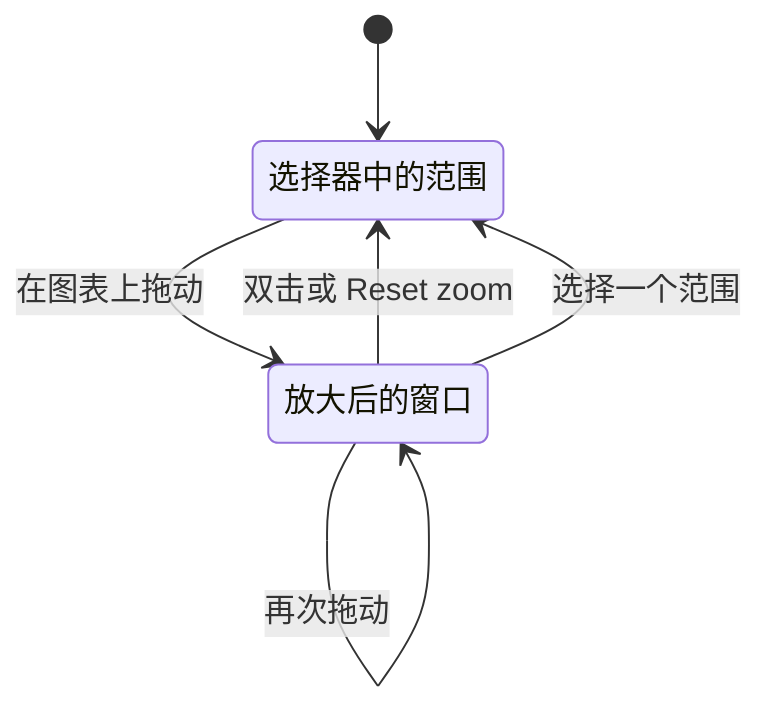

# 放大时间范围

在图表上拖动即可把页面放大到那个时刻，双击即可返回。本页介绍这些手势、放大的行为方式，以及哪些图表会放大什么。

:::cards
- [放大和返回](#放大和返回): 两种手势，以及 Reset zoom 按钮。
- [放大的行为方式](#放大的行为方式): 嵌套放大、自动刷新、点击和拖动。
- [适用范围](#适用范围): 拖动会改变时间范围的页面和图表。
- [不能放大的图表](#不能放大的图表): 条带、仪表和迷你走势图。
:::

## 放大和返回

OneUptime 中的每个时间序列图表同时也是时间范围选择器。当图表上出现你想查看的峰值时，不必打开选择器输入日期：

:::steps
1. 在任意图表上 **拖过峰值**。页面的时间范围会移到你拖出的窗口，与在时间范围选择器中选择它完全相同。每个图表，以及根据页面时间范围计算的每个磁贴或表格，都会针对它重新查询，因此你在所有图表上看到的是同一个时刻。
2. **双击任意图表** 即可返回。页面会回到你开始放大之前的时间范围。
:::

显示当前状态的面板保持在当前时刻，就像你自己选择范围时一样：清单计数、健康状况、资源消耗最多的对象、最近的警告、未解决的事件和告警，以及仪表板的实时列表。

放大期间，页面的时间范围选择器旁边会出现 **Reset zoom** 按钮。它的作用与双击相同，也是键盘用户和触摸屏上的返回方式。

## 放大的行为方式

- **想放大多深都可以，一次重置就能全部退出。** 从 "Past 1 Hour" 深入到十分钟、再深入到一分钟之后，一次双击（或 **Reset zoom**）就会回到整整一小时，而不是一次退一级。
- **任何图表都能重置任何放大。** 在 CPU 图表上拖动，在内存图表上双击：被放大的是页面，而不是图表。
- **自己选择范围就会重新开始。** 在选择器中选择预设或自定义范围就是新的起点：放大结束，**Reset zoom** 随之消失。
- **放大后的窗口是固定的。** "Past 30 Minutes" 会随时钟向前滚动；放大是固定窗口，所以即使开启了自动刷新，它也会停止滚动。重置放大即可重新开始滚动。
- **放大永远不会超过当前时刻。** 图表最新的桶通常仍在填充中；结束于该桶的拖动会在当前时间处截断。
- **可以在图表外松开鼠标**，拖动依然有效。
- **不必等图表加载完成就能返回。** 刚放大后，图表仍在获取你拖出的窗口时，或者该窗口结果为空时，双击图表都会立即重置放大。
- **在未放大的页面上双击不会有任何作用。**

### 点击和拖动

- **在折线图、面积图和柱状图上，单纯的点击不是放大。** 这涵盖了大多数图表：指标卡片和指标浏览器、资源概览、SLO、监视器，以及仪表板上的所有图表。只有跨越多个桶的拖动才会放大，因此点击某个点、某根柱子或某个图例项的行为与以前相同。放大期间，点击图表绘图区会稍后才生效，以便与用于重置的双击区分开。日志洞察中的错误模式时间线和异常的 Occurrence Trend 也只在拖动时放大。
- **在浏览器的数量图表上，点击一根柱子会放大到该柱子。** 日志、追踪、异常和安全事件浏览器的数量图表，以及日志和追踪分析图表，会放大到你拖过的那些柱子，或你点击的那一根柱子。这些图表会显示 **Click or drag to zoom**。

### 图表上的提示

大多数可以放大的图表会在绘图区上方注明手势，即 **Drag to zoom** 或 **Click or drag to zoom**，放大期间还会提醒你 **double-click to reset**。指标卡片、指标浏览器和浏览器的数量图表始终显示提示。在资源概览和 SLO 的图表卡片以及部分仪表板小部件上，只有当你指向卡片或用 Tab 键移入时才会出现。

## 适用范围

在以下位置，放大会改变整个页面的时间范围：

- 资源概览及其洞察页面：Kubernetes 集群，Docker、Podman 和 Docker Swarm 主机，主机及其进程，服务和 systemd 单元，VMware、Proxmox、Ceph、存储阵列、数据库、云资源和无服务器函数；
- 服务和 RUM 应用；
- 网络设备的指标和流量；
- 指标卡片，包括资源的指标选项卡和监视器的指标；
- 指标浏览器；
- SLO 历史图表；
- 日志洞察，包括错误模式的“发生时间”时间线，该面板会遮住页面的选择器，因此有自己的 **Reset zoom**；
- 日志、追踪、异常和安全事件的数量图表，以及日志和追踪分析图表，它们会改变所属浏览器的时间范围；
- [仪表板](/docs/dashboards/authoring)，拖动会改变整个仪表板的时间范围。

拥有自己窗口的图表只放大该窗口，因此绝不会改变页面上的其他内容。这包括监视器表单中的指标预览（监视器会继续按自己的滚动窗口评估）、异常的 Occurrence Trend、在弹出窗口或 Investigate 面板中打开的图表，以及 AI 聊天回答中的图表。双击其中任何一个，或点击它的 **Reset zoom** 按钮，都会恢复它自己的窗口。

事件、告警或片段页面上的遥测快照也有自己的窗口。在它的图表（指标图表，或快照显示的日志、追踪或异常数量图表）上拖动会放大整个快照，因此它的指标、日志、追踪和异常选项卡都会显示你拖出的时间片。快照徽章旁边的 **Reset zoom**，或在该图表上双击，会恢复快照的窗口。

## 不能放大的图表

有少数可视化没有可供拖动的时间轴、太小而无法拖动，或者始终显示自己的固定窗口，因此不能放大：

- 正常运行时间历史条带（每天一根柱子），无法显示比一天更细的粒度；
- 占比和比例条、仪表和进度条；
- 火焰图、服务地图和流程图；
- 指标列表中的小型趋势迷你图，点击会打开该指标，打开后即可得到可以放大的图表；
- 有自己固定窗口的小型迷你图，例如网络设备过去一小时的往返时间，它的 **Open metrics** 链接会带你到可以放大的图表。

## 后续步骤

:::cards
- [创建仪表板](/docs/dashboards/authoring): 放大适用于仪表板上的每个图表。
- [搜索语法](/docs/telemetry/search-syntax): 找到那个时刻后，过滤浏览器中的数据。
- [指标监控](/docs/monitor/metrics-monitor): 对你正在查看的指标发出告警。
:::
