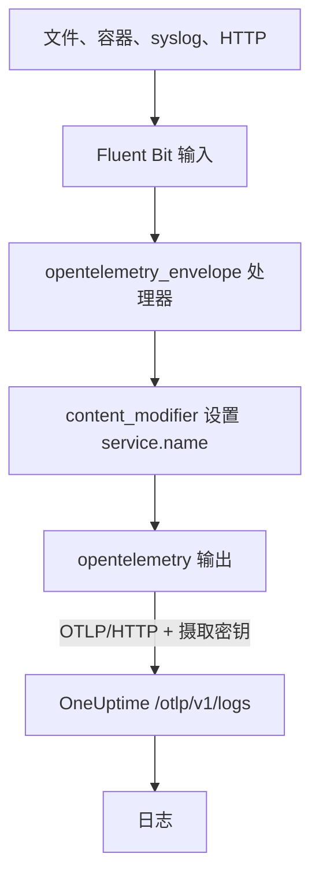

# Fluent Bit

[Fluent Bit](https://docs.fluentbit.io/manual) 是一个轻量级代理，可以从文件、systemd、容器、syslog、HTTP 以及许多其他来源收集日志。它的 [OpenTelemetry 输出](https://docs.fluentbit.io/manual/pipeline/outputs/opentelemetry)会把收集到的数据发送到 OneUptime 的 OpenTelemetry（OTLP）端点，之后就可以在 **产品 → 日志** 中搜索这些日志。

:::cards
- [配置 Fluent Bit](#配置-fluent-bit): 添加 OpenTelemetry 输出并为服务命名。
- [完整示例](#完整示例): 一份可以直接上手的完整配置文件。
- [自托管 OneUptime](#自托管-oneuptime): 让 Fluent Bit 发送到你自己的实例。
:::

## 工作原理



Fluent Bit 会把每条记录包进一个 OpenTelemetry 信封，使其能够携带 `service.name` 这样的资源属性。然后 OpenTelemetry 输出把记录发送到 OneUptime，并在 `x-oneuptime-token` 请求头中带上你的摄取密钥。OneUptime 会把它们归到 `service.name` 指定的服务下，并在首次发送时创建该服务。

## 开始之前

- **安装 Fluent Bit**：参见[安装指南](https://docs.fluentbit.io/manual/installation/getting-started-with-fluent-bit)。本页的配置使用 Fluent Bit 的 YAML 格式和 `opentelemetry_envelope` 处理器，因此请使用较新的版本。
- **一个 OneUptime 项目。** 在 OneUptime Cloud 上，遥测数据按摄取的 GB 计费（参见[价格](https://oneuptime.com/pricing)），而且 Free 套餐的项目需要先添加付款方式才能发送遥测数据。
- **一个遥测摄取密钥。** 如果还没有，请按以下步骤创建：

:::steps
### 打开摄取密钥

前往 **产品 → 项目设置**，在侧边菜单中展开 **遥测与 APM**，然后选择 **摄取密钥**。


### 创建密钥

点击 **创建摄取密钥**。对话框已经填好了密钥名称，并选择了 **服务器**（应用或 Collector 发送数据时使用的密钥类型），因此直接点击 **创建摄取密钥** 即可创建，也可以先改名。

### 复制机密

新密钥会在它自己的页面中打开。复制它的 **密钥**：这就是下面配置中的 `YOUR_TELEMETRY_INGESTION_TOKEN`。


:::

## 配置 Fluent Bit

Fluent Bit 从 `/etc/fluent-bit/fluent-bit.yaml` 这样的文件读取 YAML 配置。

:::steps
### 添加 OpenTelemetry 输出

添加一个发送到 OneUptime 的 `opentelemetry` 输出。如果想在本地查看记录，测试期间可以保留 `stdout` 输出：

```yaml title="fluent-bit.yaml"
pipeline:
  outputs:
    - name: stdout
      match: "*"
    - name: opentelemetry
      match: "*"
      host: "oneuptime.com"
      port: 443
      metrics_uri: "/otlp/v1/metrics"
      logs_uri: "/otlp/v1/logs"
      traces_uri: "/otlp/v1/traces"
      tls: On
      header:
        - x-oneuptime-token YOUR_TELEMETRY_INGESTION_TOKEN
```

### 把日志包进 OpenTelemetry 信封并为服务命名

给每个输入添加 `opentelemetry_envelope` 处理器，后面再跟一个设置 `service.name` 的 `content_modifier`。把 `YOUR_SERVICE_NAME` 换成日志在 OneUptime 中显示的名称：

```yaml title="fluent-bit.yaml"
pipeline:
  inputs:
    - name: tail # or any other input
      path: /var/log/my-app/*.log

      processors:
        logs:
          - name: opentelemetry_envelope

          - name: content_modifier
            context: otel_resource_attributes
            action: upsert
            key: service.name
            value: YOUR_SERVICE_NAME
```

### 重启 Fluent Bit

重启 Fluent Bit 服务，或者用 `fluent-bit -c /etc/fluent-bit/fluent-bit.yaml` 启动它。几秒钟内，日志就会出现在 **产品 → 日志** 中，服务也会列在 **产品 → 服务** 下。
:::

## 完整示例

这份配置在端口 `8888` 上通过 HTTP 接收日志，并转发到 OneUptime：

```yaml title="fluent-bit.yaml"
service:
  flush: 1
  log_level: info

pipeline:
  inputs:
    - name: http
      listen: 0.0.0.0
      port: 8888

      processors:
        logs:
          - name: opentelemetry_envelope

          - name: content_modifier
            context: otel_resource_attributes
            action: upsert
            key: service.name
            value: YOUR_SERVICE_NAME

  outputs:
    - name: stdout
      match: "*"
    - name: opentelemetry
      match: "*"
      host: "oneuptime.com"
      port: 443
      metrics_uri: "/otlp/v1/metrics"
      logs_uri: "/otlp/v1/logs"
      traces_uri: "/otlp/v1/traces"
      tls: On
      header:
        - x-oneuptime-token YOUR_TELEMETRY_INGESTION_TOKEN
```

把 `http` 输入换成你需要的输入，例如日志文件用 `tail`，journal 用 `systemd`，并在每个输入上保留这两个处理器。

## 自托管 OneUptime

把 `host` 设为你的 OneUptime 实例的主机。如果它通过普通 HTTP 而不是 HTTPS 提供服务，还要把 `port` 设为它监听的端口（通常是 `80`），并删除 `tls`：

```yaml title="fluent-bit.yaml"
pipeline:
  outputs:
    - name: stdout
      match: "*"
    - name: opentelemetry
      match: "*"
      host: "your-oneuptime-instance.com"
      port: 80
      metrics_uri: "/otlp/v1/metrics"
      logs_uri: "/otlp/v1/logs"
      traces_uri: "/otlp/v1/traces"
      header:
        - x-oneuptime-token YOUR_TELEMETRY_INGESTION_TOKEN
```

## 故障排除

:::details Fluent Bit 记录了来自 OpenTelemetry 输出的 `401`
摄取密钥缺失、未知或已过期。检查 `header` 这一行：它是 `x-oneuptime-token`、一个空格，然后是该密钥的 **密钥**。
:::

:::details Fluent Bit 记录了 `402` 或 `422`
`402`：在 OneUptime Cloud 上，项目处于 Free 套餐且没有付款方式。请在 **项目设置 → 账单和发票 → 账单** 中添加。`422`：密钥已被禁用，或者是浏览器密钥。请在密钥的设置中重新打开 **已启用**，或者创建一个 **服务器** 密钥。
:::

:::details 日志归到了意料之外的服务下
服务来自 `service.name`。检查每个输入是否都有 `opentelemetry_envelope` 处理器，并且后面跟着设置它的 `content_modifier`。
:::

:::details 什么都没有收到，Fluent Bit 记录了连接错误
检查 HTTPS 端点是否设置了 `tls: On` 和 `port: 443`，以及运行 Fluent Bit 的主机能否通过该端口访问你的 OneUptime 主机。
:::

如果对配置有任何问题或需要帮助，请发送邮件至 support@oneuptime.com。

## 后续步骤

:::cards
- [日志管道](/docs/telemetry/log-pipelines): 解析并丰富 Fluent Bit 发送的日志。
- [搜索语法](/docs/telemetry/search-syntax): 在日志浏览器中查找日志。
- [OpenTelemetry](/docs/telemetry/open-telemetry): 所有遥测数据的端点、密钥和限制。
- [Fluentd](/docs/telemetry/fluentd): 改用 Fluentd。
:::
