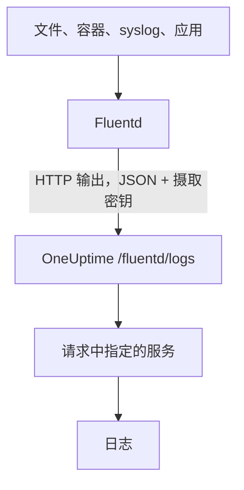

# Fluentd

[Fluentd](https://www.fluentd.org/) 可以从文件、容器、syslog、应用以及[许多其他来源](https://www.fluentd.org/datasources)收集日志。它内置的 [HTTP 输出](https://docs.fluentd.org/output/http)会把日志发送到 OneUptime 的 Fluentd 端点，之后就可以在 **产品 → 日志** 中搜索这些日志。

:::cards
- [配置 Fluentd](#配置-fluentd): 添加一个指向 OneUptime 的 HTTP 输出。
- [如何读取记录](#如何读取记录): 哪些字段会成为消息、严重级别和属性。
- [自托管 OneUptime](#自托管-oneuptime): 让 Fluentd 发送到你自己的实例。
:::

## 工作原理



Fluentd 以 JSON 格式批量发送记录，摄取密钥放在 `x-oneuptime-token` 请求头中，服务名称放在 `x-oneuptime-service-name` 中。OneUptime 会把每条记录变成该服务的一条日志，并在首次发送时创建该服务。

## 开始之前

- **安装 Fluentd**：参见[安装指南](https://docs.fluentd.org/installation)。
- **一个 OneUptime 项目。** 在 OneUptime Cloud 上，遥测数据按摄取的 GB 计费（参见[价格](https://oneuptime.com/pricing)），而且 Free 套餐的项目需要先添加付款方式才能发送遥测数据。
- **一个遥测摄取密钥。** 如果还没有，请按以下步骤创建：

:::steps
### 打开摄取密钥

前往 **产品 → 项目设置**，在侧边菜单中展开 **遥测与 APM**，然后选择 **摄取密钥**。


### 创建密钥

点击 **创建摄取密钥**。对话框已经填好了密钥名称，并选择了 **服务器**（应用或 Collector 发送数据时使用的密钥类型），因此直接点击 **创建摄取密钥** 即可创建，也可以先改名。

### 复制机密

新密钥会在它自己的页面中打开。复制它的 **密钥**：这就是下面配置中的 `YOUR_SERVICE_TOKEN`。


:::

## 配置 Fluentd

Fluentd 的配置文件通常是 `/etc/fluent/fluentd.conf`，旧的 td-agent 包则是 `/etc/td-agent/td-agent.conf`。

:::steps
### 添加 HTTP 输出

添加一个把记录发送到 OneUptime 的 `<match>` 段。把 `YOUR_SERVICE_TOKEN` 换成你的摄取密钥，把 `YOUR_SERVICE_NAME` 换成日志要显示的名称（任意名称都可以）：

```text title="fluentd.conf"
# Match all patterns
<match **>
  @type http

  endpoint https://oneuptime.com/fluentd/logs
  open_timeout 2

  headers {"x-oneuptime-token":"YOUR_SERVICE_TOKEN", "x-oneuptime-service-name":"YOUR_SERVICE_NAME"}

  content_type application/json
  json_array true

  <format>
    @type json
  </format>
  <buffer>
    flush_interval 10s
    chunk_limit_size 900k
  </buffer>
</match>
```

`json_array true` 让缓冲区的每个块都以一个 JSON 数组发送，`flush_interval 10s` 则每 10 秒发送一次缓冲区。`chunk_limit_size 900k` 让每个请求都小于 1 MB，这是 OneUptime 在这个端点上接受的上限。

### 重启 Fluentd

重启 Fluentd 服务，让它加载新的输出。

### 确认日志已到达

下一次刷新之后几秒钟内，日志就会出现在 **产品 → 日志** 中。服务会列在 **产品 → 服务** 下；如果它之前不存在，OneUptime 会创建它。
:::

## 完整示例

这份配置在端口 `24224` 上通过 Fluentd 的 forward 协议接收记录，并把它们全部发送到 OneUptime：

```text title="fluentd.conf"
####
## Source descriptions:
##

## built-in TCP input
## @see https://docs.fluentd.org/input/forward
<source>
  @type forward
  port 24224
  bind 0.0.0.0
</source>

<match **>
  @type http

  endpoint https://oneuptime.com/fluentd/logs
  open_timeout 2

  headers {"x-oneuptime-token":"YOUR_SERVICE_TOKEN", "x-oneuptime-service-name":"YOUR_SERVICE_NAME"}

  content_type application/json
  json_array true

  <format>
    @type json
  </format>
  <buffer>
    flush_interval 10s
    chunk_limit_size 900k
  </buffer>
</match>
```

要把不同的来源作为不同的服务发送，请为每个标签使用一个 `<match>` 段，并各自设置 `x-oneuptime-service-name`。

## 如何读取记录

OneUptime 从每条记录中读取以下字段：

| 日志字段 | 从记录中以下字段里最先出现的一个读取 | 说明 |
| --- | --- | --- |
| 正文 | `message`、`log`、`msg`、`body`、`text` | 日志行。这些字段都没有的记录会整条以 JSON 保存。 |
| 严重级别 | `level`、`severity`、`loglevel`、`log_level`、`priority`、`severityText`、`severity_text` | 例如 `trace`、`debug`、`info`、`notice`、`warn`、`error`、`critical` 和 `fatal` 这样的名称，不区分大小写。其他任何值都会保存为 `Unspecified`。 |
| 追踪 ID | `trace_id`、`traceId`、`traceid` | 把日志关联到它的追踪。 |
| Span ID | `span_id`、`spanId`、`spanid` | 把日志关联到它的 span。 |
| 服务 | `x-oneuptime-service-name` 请求头 | 未设置该请求头时为 `Fluentd`。 |
| 时间 | — | OneUptime 收到记录的时间。 |

其他每个字段都会成为一个名为 `fluentd.` 加字段名的属性，可以用来搜索和筛选：例如 `container_name` 字段在日志浏览器中就是 `@fluentd.container_name`。嵌套对象会用点号展开，例如 `fluentd.kubernetes.pod_name`，列表则以 JSON 保存。

Fluentd 日志会像其他日志一样经过你的[日志管道](/docs/telemetry/log-pipelines)、丢弃过滤器和脱敏规则。

## 自托管 OneUptime

把 `endpoint` 中的 `https://oneuptime.com` 换成你的 OneUptime 实例的 URL：`http(s)://YOUR_ONEUPTIME_HOST/fluentd/logs`。

## 故障排除

:::details Fluentd 记录了来自 HTTP 输出的 `401`
摄取密钥缺失、未知或已过期。检查 `headers` 中 `x-oneuptime-token` 的值。
:::

:::details Fluentd 记录了 `402` 或 `422`
`402`：在 OneUptime Cloud 上，项目处于 Free 套餐且没有付款方式。请在 **项目设置 → 账单和发票 → 账单** 中添加。`422`：密钥已被禁用，或者是浏览器密钥。请在密钥的设置中重新打开 **已启用**，或者创建一个 **服务器** 密钥。
:::

:::details Fluentd 记录了 `413`
请求超过了 1 MB，这是 OneUptime 在这个端点上接受的上限。请像上面的配置那样，在 `<buffer>` 部分设置 `chunk_limit_size 900k`。
:::

:::details 日志归到了 `Fluentd` 服务下
缺少 `x-oneuptime-service-name` 请求头。在每个 `<match>` 段的 `headers` 中加上它。
:::

:::details 日志正文显示了整条记录的 JSON
OneUptime 从记录中 `message`、`log`、`msg`、`body` 或 `text` 里最先出现的一个读取正文，这些都没有时就保存整条记录。把保存日志行的字段重命名为其中之一，例如使用 Fluentd 的 `record_transformer` 过滤器。
:::

如果对配置有任何问题或需要帮助，请发送邮件至 support@oneuptime.com。

## 后续步骤

:::cards
- [日志管道](/docs/telemetry/log-pipelines): 解析并丰富 Fluentd 发送的日志。
- [搜索语法](/docs/telemetry/search-syntax): 在日志浏览器中查找日志。
- [Fluent Bit](/docs/telemetry/fluentbit): 一个通过 OpenTelemetry 发送的更轻量的代理。
- [日志监控](/docs/monitor/logs-monitor): 出现匹配的日志时发出告警。
:::
