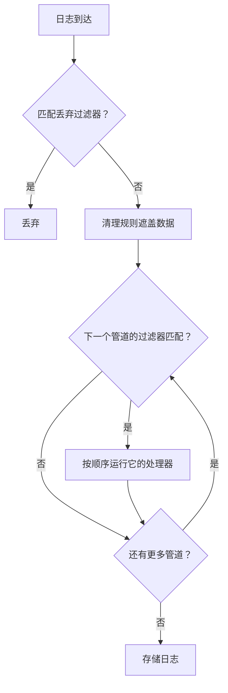

# 日志管道

日志管道在 OneUptime 摄取日志时、存储之前对日志进行转换。管道有一个决定它适用于哪些日志的 **过滤器**，以及一个有序的 **处理器** 列表，每个处理器都会修改这些日志：从消息中提取字段、修正严重程度、重命名属性，或给日志打上类别标签。

管道位于 **日志 → 设置 → 管道**。

:::cards
- [管道的运行方式](#管道的运行方式): 管道在摄取过程中的位置，以及它们的运行顺序。
- [创建管道](#创建管道): 匹配一些日志，并为它们添加处理器。
- [Key=Value Parser](#keyvalue-parser): 把防火墙和 logfmt 日志行变成属性。
- [示例：Sophos XGS 防火墙](#示例sophos-xgs-防火墙): 端到端解析防火墙 syslog。
:::

## 管道的运行方式

管道会在 OneUptime 摄取的每条日志上运行（OpenTelemetry 日志、syslog 和 Fluentd 都一样），运行时机在丢弃过滤器和清理规则之后、日志存储之前：



- **管道按顺序运行**，即列表中的顺序，可以通过拖动行来更改。管道只处理其过滤器匹配的日志，并且所有过滤器匹配的管道都会运行，而不只是第一个。
- **处理器也按顺序运行**，每个处理器看到的是前一个处理器的结果，因此解析器必须排在读取其提取字段的处理器之前。后面管道的过滤器也会看到前面管道所做的更改。
- **处理发生在摄取时。** 更改管道会影响之后到达的日志，大约一分钟内生效；已存储的日志不会重新处理。
- **处理器从不丢弃或清空日志。** 解析器无法读取的行会原样通过。要丢弃日志，请使用 **日志 → 设置 → 丢弃过滤器**。
- **只有已启用的管道和处理器会运行。** 在其页面上将其关闭即可暂停，而不会丢失其设置。

## 处理器类型

| 处理器 | 作用 |
| --- | --- |
| Grok Parser | 使用命名模式，从形状固定的行（如 nginx 访问日志行）中提取字段。 |
| Key=Value Parser | 把由 `key=value` 对组成的行（Sophos XGS、Fortinet、logfmt）拆分为属性，顺序不限。 |
| 严重性重映射器 | 把属性中的原始级别（如 `warn`）映射到日志的标准严重程度。 |
| 属性重映射器 | 重命名或复制属性，例如把 `src_ip` 改为 `source_ip`。 |
| 类别处理器 | 当日志匹配过滤器时，为其打上类别名称，例如 "Payment Error"。 |

## 开始之前

- 正在进入 OneUptime 的日志，通过 [OpenTelemetry](/docs/telemetry/open-telemetry)、[syslog](/docs/telemetry/syslog)、[Fluentd](/docs/telemetry/fluentd) 或探针发送。
- 更改管道的权限。项目所有者和管理员拥有此权限；其他人需要 **Create Log Pipeline** 和 **Create Log Pipeline Processor** 权限。

## 创建管道

:::steps
### 新建管道

前往 **日志 → 设置 → 管道**，点击 **创建日志 管道**。为它设置 **名称**，例如 *解析防火墙日志*，然后创建。管道的页面随即打开。

### 选择适用的日志

在 **筛选条件** 下点击 **编辑**，添加针对 **严重程度**、**日志正文**、**服务 ID** 或自定义属性的条件。用 **所有条件** 或 **任一条件** 连接它们，然后点击 **保存更改**。没有条件的管道适用于所有日志。

### 添加处理器

在 **处理器** 下点击 **添加处理器**，输入 **处理器名称**，选择 **处理器类型** 并填写其设置。Grok 和 Key=Value 解析器带有测试器：粘贴一行示例即可查看它们会提取什么。点击 **创建处理器**。

### 排列顺序

拖动处理器来更改它们的运行顺序，并以同样的方式在 **管道** 列表中拖动管道。新日志大约在一分钟内得到处理。
:::

### 过滤条件

每个条件把一个字段与一个值进行比较。在构建器背后，过滤器是一个查询，例如 `severityText = 'Error' AND body LIKE 'timeout'`，可以通过 **Preview query** 查看。

| 运算符 | 查询中 | 说明 |
| --- | --- | --- |
| 等于 | `=` | 精确匹配，区分大小写。 |
| 不等于 | `!=` | 精确匹配，区分大小写。 |
| 包含 | `LIKE` | 忽略大小写。值中的 `%` 是通配符。 |
| 属于 | `IN` | 以逗号分隔的精确值列表。 |

严重程度的值为 `Fatal`、`Error`、`Warning`、`Information`、`Debug`、`Trace` 和 `Unspecified`，因此 `severityText = 'Error'` 能匹配，而 `'ERROR'` 永远不会。自定义属性写作 `attributes.<key>`，例如 `attributes.networkDevice.name = 'hq-firewall'`。

## Key=Value Parser

防火墙和其他网络设备把每个事件记录为一行 `key=value` 对。一行包含哪些字段、顺序如何，取决于事件，因此单个 grok 模式无法描述它们。Key=Value Parser 不需要模式：它遍历整行，把找到的每一对都变成日志属性，无论顺序如何。成为属性后，你就可以对它们进行搜索和过滤，在 [日志监控](/docs/monitor/logs-monitor) 中使用它们，并通过 [分组依据](/docs/monitor/logs-monitor) 按隧道、接口或用户各发出一次告警。

### 配置

| 设置 | 默认值 | 说明 |
| --- | --- | --- |
| Source Field | `body` | 要解析的字段：日志消息用 `body`，属性则如 `attributes.raw_line`。 |
| Target Prefix | 无 | 提取出的键的命名空间。`sophos` 会把 `con_name` 存储为 `sophos.con_name`。除非前缀已经以 `.`、`_`、`-` 或 `:` 结尾，否则会添加分隔符。 |
| Pair Delimiter | 任意空白字符 | 分隔一对与下一对的字符。Sophos、Fortinet 和 logfmt 请留空；其他格式可设为 `,`、`;` 或 `\|`。 |
| Key-Value Delimiter | `=` | 分隔键和值的字符，例如 `status:up` 用 `:`。 |
| 冲突时覆盖 | 关 | 键是否可以替换日志中已有的属性。默认关闭：键来自日志行本身，否则一行日志可能会改写摄取时设置的属性，例如它来自哪台设备。 |

两个分隔符必须不同、不能互相包含，也不能包含引号或反斜杠；每个最多 8 个字符。处理器表单会在保存前检查这些规则，其测试器 **Test With a Sample Line** 会准确显示一行示例将生成的属性。

### 解析规则

- **带引号的值** 会保留其中的空格和分隔符：`message="IPSec Connection HQ-Branch1 terminated"` 是一个值。双引号和单引号都可以，值中的 `\"` 是字面引号。从未闭合的引号（因 syslog 大小限制而被截断的行）会一直延续到行尾。
- **不带引号的值** 一直延续到下一个对分隔符，因此 `url=https://example.com/?a=b` 会保留其中的 `=`。
- **空值**（`key=` 和 `key=""`）存储为空字符串。
- **值始终是文本。** `latency=11` 存储为 `"11"`，与未指定类型的 grok 捕获相同。
- **键** 以字母或下划线开头，包含字母、数字和 `. _ - @`。第一对之前的文本（如 RFC 3164 syslog 头）以及没有分隔符的零散单词会被跳过。粘在第一个键上的 syslog 优先级（`<30>device_name="SFW"`）会被去掉，键则保留。
- **重复的键保留第一个值**；之后的值会被忽略。
- **限制：** 超过 32 KiB 的行不会被解析，一行最多取 100 对，超过 256 个字符的键会被跳过，超过 4,096 个字符的值会被截断。

### 示例：Sophos XGS 防火墙

当 Sophos XGS 防火墙把 syslog 发送到 [探针](/docs/monitor/network-device-monitor) 时，每条消息都会存储为该网络设备的日志，syslog 消息即为其正文。要解析它：

:::steps
#### 为防火墙创建管道

前往 **日志 → 设置 → 管道** 并创建一个管道。为它设置一个匹配防火墙日志的过滤器，例如自定义属性 `networkDevice.name` 等于 `hq-firewall`（`attributes.networkDevice.name = 'hq-firewall'`），或者 **日志正文** 包含 `log_component=`，以匹配所有 Sophos 日志行。

#### 添加解析器

打开管道并点击 **添加处理器**。选择 **Key=Value Parser**，**Source Field** 保持为 `body`，并把 **Target Prefix** 设置为 `sophos`（可选，但能把防火墙的字段放在一起）。

#### 测试并保存

把防火墙的一行日志粘贴到 **Test With a Sample Line** 中检查结果，然后点击 **创建处理器**。
:::

一个 Sophos IPsec 事件：

```text
device_name="SFW" timestamp="2024-05-02T11:03:12+0200" device_model="XGS2100" device_serial_id="X1234" log_id="010101600001" log_type="Event" log_component="IPSec" log_subtype="System" severity="Information" con_name="HQ-Branch1" src_ip="10.171.4.117" dst_ip="10.171.4.118" status="Terminated" message="IPSec Connection HQ-Branch1 between 10.171.4.117 and 10.171.4.118 for Child HQ-Branch1 terminated."
```

会变成以下属性（以及其他属性）：

| 属性 | 值 |
| --- | --- |
| `sophos.log_component` | `IPSec` |
| `sophos.con_name` | `HQ-Branch1` |
| `sophos.status` | `Terminated` |
| `sophos.src_ip` | `10.171.4.117` |
| `sophos.message` | `IPSec Connection HQ-Branch1 between 10.171.4.117 and 10.171.4.118 for Child HQ-Branch1 terminated.` |

SD-WAN SLA 日志行的字段集合和顺序都不同，但同一个处理器也能处理它：

```text
log_id=158825619025 log_type="SD-WAN" log_component="SLA" profile_name="Branch-Internet" gw_name="WAN2" latency=11 jitter=2 packet_loss=0 gw_status="up" sla_status="SLA met"
```

得到 `sophos.gw_name = WAN2`、`sophos.latency = 11`、`sophos.packet_loss = 0`、`sophos.gw_status = up` 和 `sophos.sla_status = SLA met`。较旧的 SFOS 版本使用旧格式记录日志（`device="SFW" date=2017-01-31 time=18:02:03 timezone="IST" ... connectionname="Tunnel A"`）；它的解析方式相同，只是隧道名称在 `connectionname` 中，而不是 `con_name`。

要把这些 SLA 日志行变成每个网关的延迟、抖动和丢包指标，请参阅 [日志记录规则](/docs/telemetry/log-recording-rules) 中的示例。

### 示例：Fortinet FortiGate

FortiGate 日志使用相同的风格：

```text
date=2024-01-01 time=10:00:00 devname="FG100" logid="0100032001" type="event" subtype="vpn" level="notice" action="tunnel-down" vpntunnel="HQ-to-Branch2" msg="IPsec tunnel down"
```

使用默认设置和 `fortigate` 前缀，会得到 `fortigate.devname = FG100`、`fortigate.subtype = vpn`、`fortigate.action = tunnel-down`、`fortigate.vpntunnel = HQ-to-Branch2` 和 `fortigate.time = 10:00:00`。时间值中的冒号是值的一部分，而不是分隔符。

### 每个隧道只告警一次

解析出字段后，[日志监控](/docs/monitor/logs-monitor) 就可以统计故障次数，并为每个隧道分别发出告警：过滤 `sophos.log_component` = `IPSec` 且正文包含 `terminated` 的日志，并按 `sophos.con_name` 分组。参阅 [按组告警](/docs/monitor/logs-monitor)。

## Grok Parser

从形状固定的行中提取结构化字段。grok 模式是带有命名引用的正则表达式：`%{IPV4:client_ip}` 的意思是“匹配一个 IPv4 地址并将其存储为 `client_ip`”。模式不必匹配整行，不匹配的行会保持不变。

| 设置 | 默认值 | 说明 |
| --- | --- | --- |
| **Source Field** | `body` | 要解析的字段，与 Key=Value Parser 的相同。 |
| **Target Prefix** | 无 | 提取出的字段的命名空间，添加方式相同。 |
| **Grok Pattern** | — | 模式。表单会列出可用的命名模式。 |

除非指定类型，否则捕获会存储为文本：`%{NUMBER:status:int}` 会把它存储为数字。类型有 `int`、`long`、`float`、`double`、`boolean` 和 `string`。保存之前，请在 **Test Your Pattern** 中用一行示例检查模式。

| 日志正文 | 模式 | 添加的属性 |
| --- | --- | --- |
| `10.0.1.5 - GET /health 200` | `%{IPV4:client_ip} - %{WORD:method} %{NOTSPACE:path} %{NUMBER:status:int}` | client_ip, method, path, status |

当日志行由顺序会变化的 `key=value` 对组成时，请改用 Key=Value Parser。

## 严重性重映射器

从属性中读取原始值，并将其映射到标准严重程度。把 **源属性** 设置为保存级别的属性（默认为 `level`），然后添加 **映射**：每个映射把应用程序发出的值（如 `warn`）与一个严重程度（如 Warning）配对。匹配时忽略大小写。没有映射的值会让日志的严重程度保持不变。

## 属性重映射器

把一个属性（**源键**）的值移动到另一个属性（**目标键**），例如把 `src_ip` 移到 `source_ip`。

| 设置 | 默认值 | 效果 |
| --- | --- | --- |
| **保留源** | 关 | 关闭时重命名属性：源键会被删除。开启时复制属性并保留源键。 |
| **冲突时覆盖** | 开 | 开启时，如果目标已存在则替换它。关闭时保持目标不变并跳过重映射。 |

## 类别处理器

按顺序评估规则列表，并把第一个过滤器匹配的规则名称存储到目标属性中，这样你就可以一次搜索所有 "Payment Error" 日志。设置 **目标属性**（默认为 `category`），然后添加 **类别规则**：每条规则包含一个 **Category name** 和 **When logs match** 下的条件。第一个匹配的规则生效；不匹配任何规则的日志保持不变。

## 后续步骤

:::cards
- [日志监控](/docs/monitor/logs-monitor): 根据管道提取的属性发出告警。
- [日志记录规则](/docs/telemetry/log-recording-rules): 把解析出的日志字段变成指标。
- [Syslog](/docs/telemetry/syslog): 把防火墙和服务器的 syslog 发送到 OneUptime。
- [搜索语法](/docs/telemetry/search-syntax): 在日志浏览器中按新属性搜索。
:::
