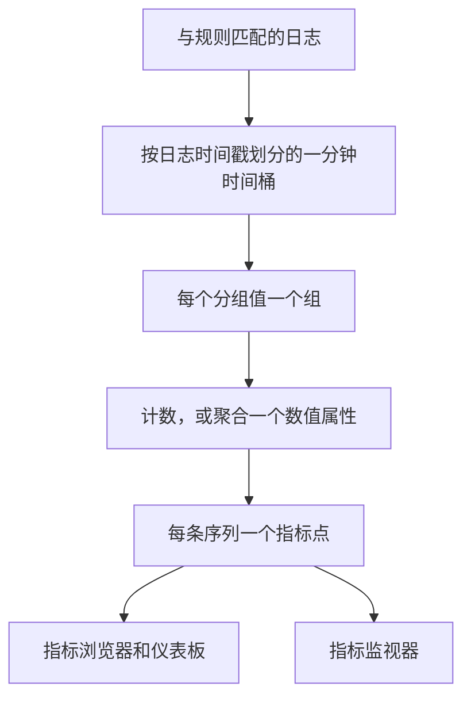
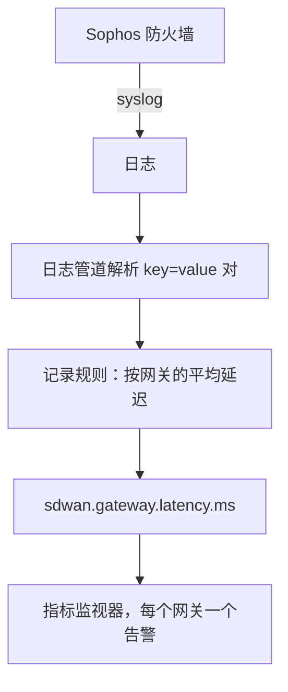

# 日志记录规则

**Log Recording Rule** 把日志变成指标。它每分钟取出与过滤器匹配的日志，并每分钟向指标存储写入一个数字：匹配的日志数量，或这些日志所带数值属性的总和、平均值、最小值、最大值或百分位数。按最多五个日志属性拆分结果，每个值就会得到一条序列：每个网关、每台主机、每个客户各一条。

:::cards
- [规则的工作方式](#规则的工作方式): 时间桶、时机、补算和空缺。
- [创建规则](#创建规则): 规则编辑器的各个字段。
- [示例：SD-WAN 网关延迟](#示例来自-sophos-防火墙的-sd-wan-网关延迟): 从防火墙 syslog 到按网关的告警。
- [权限](#权限): 谁可以创建、更改和读取规则。
:::

## 概述

输出是一个普通指标。可以在 **指标浏览器** 和仪表板中绘制图表，用 **指标** 监视器对它发出告警，包括通过 **分组依据** 按序列告警。

当你关心的数字只存在于日志中时，请使用日志记录规则：防火墙的 SLA 摘要、记录自身耗时的批处理作业、访问日志中的响应大小，或者只是某个服务每分钟写入多少条错误日志。

日志记录规则位于 **日志 → 设置 → 记录规则**。用于指标和 span 的同类规则位于 **指标 → 设置 → 记录规则** 和 **追踪 → 设置 → 记录规则**。

## 规则的工作方式



- **每条序列每分钟一个点。** 日志按时间戳归入一分钟的时间桶。每个时间桶为分组属性值的每种不同组合生成一个点。
- **在该分钟结束 30 秒后计算。** 这段短暂的等待让稍晚到达的日志仍能落入其所属的分钟。比这更晚到达的日志不会被计入。
- **没有空缺，也不会重复计算。** 每条规则都会记住它最后写入的分钟（在规则列表中显示为 **Computed Until**）。在 worker 重启或其他停机之后，它会补算错过的分钟，最多回溯 60 分钟，并且同一分钟绝不会写入两次。
- **不分组的计数规则从不出现空缺。** 没有匹配日志的分钟会写入 `0`。其他所有规则在没有可聚合内容的分钟里什么也不写，因此图表和监视器看到的是“无数据”，而不是凭空捏造的零。
- **与其他派生指标一样写入。** 这些点是以规则的 **输出指标名称** 命名的 Gauge 数据点，携带分组属性和 `oneuptime.derived.log_rule_id`（规则的 ID），并且与指标和追踪记录规则的点遵循相同的保留期：15 天。

更改规则的定义会从它下一次写入的分钟开始生效；已写入的点不会被重写。关闭规则会使其停止；重新开启后，它会补算关闭期间错过的分钟，同样最多 60 分钟。

## 创建规则

:::steps
### 打开记录规则

前往 **日志 → 设置 → 记录规则**，然后选择 **创建Log Recording Rule**。

### 为规则命名

输入 **名称**。它下方的 **输出指标名称** 会随着你的输入从名称生成；选择旁边的 **编辑** 可以自己输入。

### 选择日志和计算内容

在 **Which Logs** 下，用遥测服务、严重程度、正文文本和属性过滤器缩小规则的范围。选择一种 **聚合**，除计数外，还要选择要聚合的 **Numeric Attribute**。

### 拆分结果并保存

可以选择添加 **分组依据** 属性和 **Unit**。检查编辑器底部的那一行，然后保存。几分钟内，规则列表就会显示 **Computed Until** 时间。
:::

| 字段 | 作用 |
| --- | --- |
| 名称 | 规则计算的内容，例如 *SD-WAN gateway latency*。 |
| 输出指标名称 | 规则写入的指标。由名称生成（*SD-WAN gateway latency* 写入 `sd_wan_gateway_latency`），除非你选择 **编辑** 并自行输入。它在项目的记录规则中必须唯一。 |
| Which Logs | 可选的过滤器，全部以 AND 组合：遥测服务、严重程度、正文包含的文本，以及属性过滤器（某个属性等于某个值）。 |
| 聚合 | `Count of logs`，或对数值属性的聚合（见下文）。 |
| Numeric Attribute | 用于除计数外的所有聚合：其值被聚合的属性，例如 `latency`。 |
| 分组依据 | 可选：最多 5 个属性键。它们的值的每种不同组合对应一条序列。 |
| Unit | 可选：输出指标的单位，例如 `ms`。在绘制该指标的所有位置显示。 |
| 描述 | 位于 **更多字段** 下：规则的用途。 |
| 已启用 | 位于 **更多字段** 下：默认开启。只有已启用的规则才会被计算。 |

编辑器底部的那一行说明规则将写入什么，例如 `avg(latency) by gw_name, profile_name`。

一条规则最多可以按 10 个属性和 100 个遥测服务进行过滤。

### 聚合方式

| 聚合 | 每分钟的点 |
| --- | --- |
| Count of logs | 与过滤器匹配的日志数量。 |
| 平均值 | 数值属性值的平均值。 |
| 总和 | 属性值相加的结果。 |
| 最小值 | 最小的值。 |
| 最大值 | 最大的值。 |
| p50 (median) | 中位数。 |
| p75 | 第 75 百分位数。 |
| p90 | 第 90 百分位数。 |
| p95 | 第 95 百分位数。 |
| p99 | 第 99 百分位数。 |

### 数值属性

数值属性的值必须是一个普通数字。它可以以数字形式到达（`latency=11` 被解析为数字），也可以以文本形式到达（`"11"`、`"11.5"`、`"1e3"`）。值缺失或不是数字的日志（`"11ms"`、`"n/a"`、空字符串）会被 **跳过**。它绝不会被计为 `0`，因此格式错误的日志不会拉低平均值。

### 属性键

属性过滤器的键与日志浏览器的过滤器一样，不区分大小写进行匹配。数值属性和分组键必须与日志中携带的完全一致，包括日志管道添加的任何前缀。键字段会建议项目日志中携带的键，因此请从列表中选择，而不要手动输入。

键可以包含字母、数字和 `. _ : / -`。

### 分组与序列上限

每增加一个分组键，规则写入的序列数就会成倍增加，因此请按标识你想单独查看或单独告警的对象的属性分组（网关、主机、客户），而不要按每条日志都不同的属性分组，例如请求 ID 或客户端 IP 地址。

一条规则每分钟最多写入 1,000 条序列。超过后，会保留匹配日志最多的序列，丢弃该分钟的其余序列。不带某个分组属性的日志仍会被计入；它的序列在写入时不含该属性。

## 示例：来自 Sophos 防火墙的 SD-WAN 网关延迟

开启了 SD-WAN 日志的 Sophos XGS 防火墙每隔几分钟就会按 SD-WAN 配置文件和网关发送一份 SLA 摘要：

```text
log_type="SD-WAN" log_component="SLA" profile_name="Branch-Internet" gw_name="WAN2" latency=11 jitter=2 packet_loss=0 gw_status="up" sla_status="SLA met"
```

本示例把这些摘要变成每个网关的延迟指标，并在某个网关的延迟持续偏高时发出告警。



:::steps
### 摄取日志，并把字段变成属性

1. 把防火墙的 syslog 发送到 OneUptime，参见 [Syslog](/docs/telemetry/syslog)。
2. 在 **日志 → 设置 → 管道** 下，添加一个管道，其中的处理器把正文中的 `key=value` 对解析为日志属性，使每份摘要都带有 `log_type`、`log_component`、`profile_name`、`gw_name`、`latency`、`jitter` 和 `packet_loss` 属性。[Key=Value Parser](/docs/telemetry/log-pipelines#keyvalue-parser) 可以完成这项工作。
3. 打开 **日志** 浏览器，在一条 SLA 日志上检查属性名称。如果你的管道添加了前缀，请在下文中使用带前缀的名称。

### 创建记录规则

在 **日志 → 设置 → 记录规则** 下创建一条规则：

- **名称：** SD-WAN gateway latency
- **输出指标名称：** 选择 **编辑** 并输入 `sdwan.gateway.latency.ms`
- **Which Logs：** 属性过滤器 `log_type` = `SD-WAN` 和 `log_component` = `SLA`
- **聚合：** 平均值，**Numeric Attribute：** `latency`
- **分组依据：** `gw_name` 和 `profile_name`
- **Unit：** `ms`

通过 API、MCP 或 Terraform 创建时，同一规则的 **定义** 为：

```json
{
  "filter": {
    "attributeFilters": [
      { "key": "log_type", "value": "SD-WAN" },
      { "key": "log_component", "value": "SLA" }
    ]
  },
  "aggregationType": "Avg",
  "valueAttribute": "latency",
  "groupByAttributes": ["gw_name", "profile_name"],
  "unit": "ms"
}
```

对另外两项 SLA 测量值，用 `jitter`（`sdwan.gateway.jitter.ms`，单位 `ms`）和 `packet_loss`（`sdwan.gateway.packet_loss.percent`，单位 `%`）重复上述步骤。按 `gw_status` = `down` 过滤并按 `gw_name` 分组的 **Count of logs** 规则，会统计每个网关的网关宕机报告数。

几分钟内，规则列表就会显示 **Computed Until** 时间，`sdwan.gateway.latency.ms` 也会出现在指标浏览器中：选中它，按 `gw_name` 分组，每个网关就有一条延迟曲线。

### 当某个网关的延迟持续偏高时告警

创建一个 **指标** 监视器（参见 [指标监控](/docs/monitor/metrics-monitor)）：

1. **指标查询：** `sdwan.gateway.latency.ms`，聚合为 **平均值**，**分组依据** 为 `gw_name` 和 `profile_name`。
2. **滚动时间窗口：** Past 15 Minutes。防火墙每隔几分钟报告一次，因此窗口中每个网关都有多个点。
3. **聚合策略：** **All Values**。窗口中的每个点都必须越过阈值，因此一份缓慢的摘要不会呼叫任何人。若要在平均值偏高时告警，请改用 **平均值**。
4. **标准：** Metric value **Greater Than** `150` 时打开告警。
5. 可以在告警标题中使用分组值，例如 `SD-WAN latency high on {{gw_name}} ({{profile_name}})`。

设置分组依据后，每个网关都是独立的序列：WAN2 变慢只会为 WAN2 打开告警，并在 WAN2 恢复时自行解决。参见 [按序列告警](/docs/monitor/metrics-monitor)。
:::

## 须知

- **时间戳来自日志。** 日志会落入它自身时间戳所在的分钟。时钟偏差较大的设备，其日志会落入错误的分钟，甚至完全落在窗口之外。
- **不回填。** 新规则从它首次运行之前的那一分钟开始；更早的日志不会被计算。
- **删除规则** 会使其停止。它已写入的点会保留到过期为止。
- **记录规则以项目对日志的完整视图运行。** 任何能读取输出指标的人，都能看到根据规则过滤器匹配的每条日志计算出的数字，因此创建和编辑日志记录规则仅限于项目所有者、管理员和拥有 **Create / Edit Log Recording Rule** 权限的人。

## 权限

| 权限 | 允许 |
| --- | --- |
| Create Log Recording Rule | 创建规则。 |
| Edit Log Recording Rule | 更改规则，以及将其关闭。 |
| Delete Log Recording Rule | 删除规则。 |
| Read Log Recording Rule | 查看规则及其计算内容。 |

项目所有者和管理员可以执行以上所有操作。项目成员、查看者和遥测角色可以读取规则。

## 后续步骤

:::cards
- [指标监控](/docs/monitor/metrics-monitor): 对规则写入的指标发出告警。
- [日志管道](/docs/telemetry/log-pipelines): 提取规则所聚合的属性。
- [Syslog](/docs/telemetry/syslog): 把防火墙和服务器日志发送到 OneUptime。
:::
