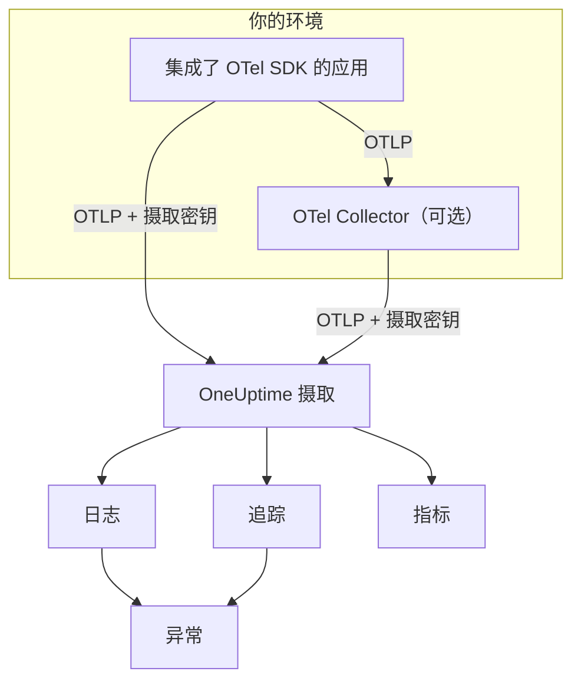

# OpenTelemetry

OneUptime 通过 OpenTelemetry Protocol（OTLP）摄取日志、指标和追踪。用摄取密钥把任意 OpenTelemetry SDK 或 OpenTelemetry Collector 指向 OneUptime，数据就会出现在 **日志**、**追踪**、**指标** 和 **异常** 中。本页先让一个服务在几分钟内开始发送数据，然后介绍生产环境中需要了解的端点、限制和错误。

:::cards
- [快速开始](#快速开始): 创建密钥，设置四个环境变量并添加 SDK。
- [使用 Collector](#通过-opentelemetry-collector-发送): 把 OneUptime 作为导出器添加到你已在运行的 Collector。
- [端点与限制](#端点与限制): URL、端口、编码、大小限制和状态码。
- [故障排除](#故障排除): 收不到数据时应检查什么。
:::

## 工作原理

你的应用把 OTLP 直接导出到 OneUptime，或者导出到负责转发的 OpenTelemetry Collector。每个请求都在 `x-oneuptime-token` 请求头中携带摄取密钥，OneUptime 用这个密钥找到你的项目。



- **服务会自动创建。** 资源属性 `service.name`（用 `OTEL_SERVICE_NAME` 设置）就是数据所属服务的名称。OneUptime 会在首次发送时创建该服务，并在 **产品 → 服务** 中列出。
- **错误会变成异常。** span 上的异常事件以及日志中记录的异常，会在 **异常** 中归并为问题，参见[来自日志的异常](#来自日志的异常)。

## 开始之前

- 一个你可以在其中创建摄取密钥的 OneUptime 项目：项目所有者和管理员可以创建，拥有 **Create Telemetry Ingestion Key** 权限的任何人也可以。
- 一个可以添加 OpenTelemetry SDK 的应用，或者一个 OpenTelemetry Collector。
- 从应用或 Collector 到 `oneuptime.com`（或你自己的 OneUptime 主机）的出站 HTTPS（端口 443）。

> [!NOTE]
> 在 OneUptime Cloud 上，遥测数据按摄取的 GB 计费。Free 套餐的项目需要先添加付款方式才能发送遥测数据，创建密钥的对话框会显示价格。

## 快速开始

:::steps
### 创建摄取密钥

1. 前往 **产品 → 项目设置**。
2. 在侧边菜单中展开 **遥测与 APM**，然后选择 **摄取密钥**。
3. 点击 **创建摄取密钥**。对话框会填好名称，并选择 **服务器** 密钥类型，这是应用或 Collector 发送数据时使用的类型。可以按需改名，然后点击 **创建摄取密钥**。


新密钥会在它自己的页面中打开。复制它的 **密钥**，这就是你通过 `x-oneuptime-token` 发送的令牌。


### 设置 OpenTelemetry 环境变量

所有 OpenTelemetry SDK 都读取同一组标准环境变量，因此这一步在任何语言中都一样。

| 环境变量 | 值 | 作用 |
| --- | --- | --- |
| `OTEL_EXPORTER_OTLP_ENDPOINT` | `https://oneuptime.com/otlp` | 发送目标。SDK 会自行追加 `/v1/traces`、`/v1/metrics` 和 `/v1/logs`。 |
| `OTEL_EXPORTER_OTLP_HEADERS` | `x-oneuptime-token=YOUR_ONEUPTIME_INGESTION_KEY` | 在每个请求中发送你的摄取密钥。 |
| `OTEL_EXPORTER_OTLP_PROTOCOL` | `http/protobuf` | 基于 HTTP 的 OTLP。有些 SDK 默认使用 gRPC，而 gRPC 使用另一个端点。 |
| `OTEL_SERVICE_NAME` | `my-service` | 数据在 OneUptime 中所属的服务。 |

```bash
export OTEL_EXPORTER_OTLP_ENDPOINT="https://oneuptime.com/otlp"
export OTEL_EXPORTER_OTLP_HEADERS="x-oneuptime-token=YOUR_ONEUPTIME_INGESTION_KEY"
export OTEL_EXPORTER_OTLP_PROTOCOL="http/protobuf"
export OTEL_SERVICE_NAME="my-service"
```

自托管？把 `https://oneuptime.com` 替换为你的 OneUptime 实例 URL，例如 `https://oneuptime.example.com/otlp`。要给异常加上环境标签，还需要把 `OTEL_RESOURCE_ATTRIBUTES` 设置为 `deployment.environment=production`。

### 为应用添加 OpenTelemetry

选择你的语言。每种配置都读取上面的环境变量，因此代码中不会出现端点或密钥。

:::tabs
@tab Node.js
安装 SDK、自动插桩和 OTLP/HTTP 导出器：

```bash
npm install @opentelemetry/sdk-node @opentelemetry/auto-instrumentations-node \
  @opentelemetry/exporter-trace-otlp-proto @opentelemetry/exporter-metrics-otlp-proto \
  @opentelemetry/exporter-logs-otlp-proto @opentelemetry/sdk-metrics @opentelemetry/sdk-logs
```

在单独的文件中创建 SDK：

```javascript title="instrumentation.js"
const { NodeSDK } = require("@opentelemetry/sdk-node");
const { getNodeAutoInstrumentations } = require("@opentelemetry/auto-instrumentations-node");
const { OTLPTraceExporter } = require("@opentelemetry/exporter-trace-otlp-proto");
const { OTLPMetricExporter } = require("@opentelemetry/exporter-metrics-otlp-proto");
const { OTLPLogExporter } = require("@opentelemetry/exporter-logs-otlp-proto");
const { PeriodicExportingMetricReader } = require("@opentelemetry/sdk-metrics");
const { BatchLogRecordProcessor } = require("@opentelemetry/sdk-logs");

// The exporters read OTEL_EXPORTER_OTLP_ENDPOINT and OTEL_EXPORTER_OTLP_HEADERS.
const sdk = new NodeSDK({
  traceExporter: new OTLPTraceExporter(),
  metricReader: new PeriodicExportingMetricReader({
    exporter: new OTLPMetricExporter(),
  }),
  logRecordProcessors: [new BatchLogRecordProcessor(new OTLPLogExporter())],
  instrumentations: [getNodeAutoInstrumentations()],
});

sdk.start();
```

在应用代码之前加载它：

```bash
node --require ./instrumentation.js app.js
```
@tab Python
安装 OpenTelemetry 发行版和导出器，然后安装应用所用库的插桩：

```bash
pip install opentelemetry-distro opentelemetry-exporter-otlp
opentelemetry-bootstrap -a install
```

通过 `opentelemetry-instrument` 启动应用。它会导出追踪、指标和日志；日志变量还会发送用 Python `logging` 模块写入的记录：

```bash
OTEL_PYTHON_LOGGING_AUTO_INSTRUMENTATION_ENABLED=true opentelemetry-instrument python app.py
```
@tab Go
添加 SDK 和 OTLP/HTTP 导出器：

```bash
go get go.opentelemetry.io/otel go.opentelemetry.io/otel/sdk go.opentelemetry.io/otel/sdk/metric \
  go.opentelemetry.io/otel/exporters/otlp/otlptrace/otlptracehttp \
  go.opentelemetry.io/otel/exporters/otlp/otlpmetric/otlpmetrichttp
```

在程序启动时创建 tracer 和 meter 提供程序：

```go title="main.go"
package main

import (
	"context"
	"log"

	"go.opentelemetry.io/otel"
	"go.opentelemetry.io/otel/exporters/otlp/otlpmetric/otlpmetrichttp"
	"go.opentelemetry.io/otel/exporters/otlp/otlptrace/otlptracehttp"
	sdkmetric "go.opentelemetry.io/otel/sdk/metric"
	sdktrace "go.opentelemetry.io/otel/sdk/trace"
)

func main() {
	ctx := context.Background()

	// Both exporters read OTEL_EXPORTER_OTLP_ENDPOINT and OTEL_EXPORTER_OTLP_HEADERS.
	traceExporter, err := otlptracehttp.New(ctx)
	if err != nil {
		log.Fatal(err)
	}
	tracerProvider := sdktrace.NewTracerProvider(sdktrace.WithBatcher(traceExporter))
	defer tracerProvider.Shutdown(ctx)
	otel.SetTracerProvider(tracerProvider)

	metricExporter, err := otlpmetrichttp.New(ctx)
	if err != nil {
		log.Fatal(err)
	}
	meterProvider := sdkmetric.NewMeterProvider(
		sdkmetric.WithReader(sdkmetric.NewPeriodicReader(metricExporter)),
	)
	defer meterProvider.Shutdown(ctx)
	otel.SetMeterProvider(meterProvider)

	// Your application code.
}
```

提供程序从环境中读取 `OTEL_SERVICE_NAME`。对于日志，请添加 `otlploghttp` 并配合 `otelslog` 之类的日志桥接，它读取同样的变量。
@tab Java
下载 OpenTelemetry Java 代理并挂载到你的应用上，无需修改代码：

```bash
curl -L -O https://github.com/open-telemetry/opentelemetry-java-instrumentation/releases/latest/download/opentelemetry-javaagent.jar
java -javaagent:opentelemetry-javaagent.jar -jar my-app.jar
```

该代理会为常见框架和库插桩，并导出追踪、指标以及通过 Logback 或 Log4j 写入的日志。
@tab .NET
添加适用于 ASP.NET Core 的 OpenTelemetry 包：

```bash
dotnet add package OpenTelemetry.Extensions.Hosting
dotnet add package OpenTelemetry.Exporter.OpenTelemetryProtocol
dotnet add package OpenTelemetry.Instrumentation.AspNetCore
dotnet add package OpenTelemetry.Instrumentation.Http
```

在启动时注册 OpenTelemetry。`UseOtlpExporter()` 会发送追踪、指标和日志，并读取 `OTEL_EXPORTER_OTLP_*` 变量：

```csharp title="Program.cs"
using OpenTelemetry;
using OpenTelemetry.Metrics;
using OpenTelemetry.Trace;

var builder = WebApplication.CreateBuilder(args);

builder.Services.AddOpenTelemetry()
    .WithTracing(tracing => tracing
        .AddAspNetCoreInstrumentation()
        .AddHttpClientInstrumentation())
    .WithMetrics(metrics => metrics
        .AddAspNetCoreInstrumentation()
        .AddHttpClientInstrumentation())
    .WithLogging()
    .UseOtlpExporter();

var app = builder.Build();
app.Run();
```

在用 Serilog？参见 [Serilog](/docs/telemetry/serilog)，把它的日志发送到 OneUptime。
:::

### 确认数据已到达

询问 OneUptime 是否接受你的密钥：

```bash
curl -i -H "x-oneuptime-token: YOUR_ONEUPTIME_INGESTION_KEY" \
  https://oneuptime.com/otlp/v1/validate
```

可用的密钥会返回 `200`，并带有 `"valid": true`。其他情况都返回 `401`，消息会说明问题所在：未知、已停用或已过期。

然后运行应用并使用一分钟。打开 **产品 → 服务**：你的服务会以 `OTEL_SERVICE_NAME` 中设置的名称列出，并带有它的日志、追踪、指标和异常。**产品 → 日志**、**产品 → 追踪** 和 **产品 → 指标** 会显示所有服务的同一批数据。
:::

:::details 不用 SDK 发送一条测试日志
OTLP/HTTP 也接受 JSON，所以你可以用 `curl` 发送日志。`severityNumber` 设为 `9` 表示这是一条信息级日志：

```bash
curl -i https://oneuptime.com/otlp/v1/logs \
  -H "Content-Type: application/json" \
  -H "x-oneuptime-token: YOUR_ONEUPTIME_INGESTION_KEY" \
  -d '{
    "resourceLogs": [{
      "resource": {
        "attributes": [
          { "key": "service.name", "value": { "stringValue": "my-service" } }
        ]
      },
      "scopeLogs": [{
        "logRecords": [{
          "severityNumber": 9,
          "body": { "stringValue": "Hello from curl" }
        }]
      }]
    }]
  }'
```

返回 `200` 表示日志已被接受。几秒钟内它就会出现在 **产品 → 日志** 中的 `my-service` 服务下。
:::

## 通过 OpenTelemetry Collector 发送

如果你已经有 Collector，或者想在一个地方对数据进行批处理、过滤或补充，又或者想让摄取密钥不出现在应用中，就使用 Collector。应用导出到 Collector，只有 Collector 与 OneUptime 通信。

:::steps
### 把 OneUptime 添加为导出器

添加一个指向 OneUptime 的 `otlphttp` 导出器，并让每条流水线都经过它：

```yaml title="otel-collector-config.yaml"
receivers:
  otlp:
    protocols:
      grpc:
        endpoint: 0.0.0.0:4317
      http:
        endpoint: 0.0.0.0:4318

processors:
  batch: {}

exporters:
  otlphttp:
    endpoint: https://oneuptime.com/otlp
    headers:
      x-oneuptime-token: YOUR_ONEUPTIME_INGESTION_KEY

service:
  pipelines:
    traces:
      receivers: [otlp]
      processors: [batch]
      exporters: [otlphttp]
    metrics:
      receivers: [otlp]
      processors: [batch]
      exporters: [otlphttp]
    logs:
      receivers: [otlp]
      processors: [batch]
      exporters: [otlphttp]
```

保留导出器的默认设置：它发送用 gzip 压缩的 protobuf，OneUptime 两者都接受。不要在导出器上设置 `Content-Type` 请求头。OneUptime 根据这个请求头选择解码器，所以在 protobuf 字节前加上 JSON 内容类型会导致摄取失败。

### 运行 Collector

:::tabs
@tab Docker
```bash
docker run -d --name otel-collector \
  -p 4317:4317 -p 4318:4318 \
  -v "$(pwd)/otel-collector-config.yaml:/etc/otelcol-contrib/config.yaml" \
  otel/opentelemetry-collector-contrib:latest
```
@tab Linux
```bash
otelcol-contrib --config otel-collector-config.yaml
```
:::

Collector 在端口 `4317`（gRPC）和 `4318`（HTTP）上监听 OTLP，这是 SDK 默认发送的端口。

### 让应用指向 Collector

在应用中把 `OTEL_EXPORTER_OTLP_ENDPOINT` 设置为 Collector 的地址，例如 `http://localhost:4318`，并删除 `OTEL_EXPORTER_OTLP_HEADERS`，密钥由 Collector 添加。每个应用都保留 `OTEL_SERVICE_NAME`。

数据到达 OneUptime 的方式与快速开始完全相同。如果没有到达，Collector 自己的日志会说明原因，参见[故障排除](#故障排除)。
:::

已经在向其他供应商导出？在现有导出器旁边添加 `otlphttp` 导出器，并在每条流水线的 `exporters` 中同时列出两者，比较期间就能同时发往两边。如果还想采集主机指标和日志文件，参见 [Host OpenTelemetry Collector](/docs/telemetry/host-otel-collector) 指南。

## 端点与限制

| 设置 | OTLP/HTTP（推荐） | OTLP/gRPC |
| --- | --- | --- |
| 端点 | `https://oneuptime.com/otlp` | `https://oneuptime.com:443` |
| 认证 | `x-oneuptime-token` 请求头 | `x-oneuptime-token` 元数据 |
| 编码 | Protobuf（`application/x-protobuf`）或 JSON（`application/json`） | Protobuf |
| 压缩 | 不压缩、`gzip`、`deflate` 或 `zstd` | 不压缩或 `gzip` |
| 请求大小 | `/otlp` 上每个请求最多 4 MB | 每条消息最多 4 MB |

通过 HTTP 时，每种信号在端点下都有自己的路径。SDK 和 Collector 会替你追加；只有当某个工具要求完整 URL 时才需要自己设置。

| 信号 | OTLP/HTTP URL |
| --- | --- |
| 追踪 | `https://oneuptime.com/otlp/v1/traces` |
| 指标 | `https://oneuptime.com/otlp/v1/metrics` |
| 日志 | `https://oneuptime.com/otlp/v1/logs` |
| 性能剖析 | `https://oneuptime.com/otlp/v1/profiles` |

对于持续性能剖析，大多数剖析器会改为发送到兼容 Pyroscope 的端点，参见[持续性能剖析](/docs/telemetry/profiles)。导出 OTLP 剖析数据的 Collector 必须把导出器的 `profiles_endpoint` 设置为 `https://oneuptime.com/otlp/v1/profiles`，因为默认情况下它会把剖析数据发送到 OneUptime 不提供的开发路径。

### 基于 gRPC 的 OTLP

OneUptime 在与 Web 应用相同的主机上、通过 TLS 在端口 443 提供 OTLP/gRPC。把 `OTEL_EXPORTER_OTLP_PROTOCOL` 设置为 `grpc`，把 `OTEL_EXPORTER_OTLP_ENDPOINT` 设置为 `https://oneuptime.com:443`，并发送同样的 `x-oneuptime-token` 请求头。在 Collector 中，使用 `otlp` 导出器，配置 `endpoint: oneuptime.com:443` 和同样的 `headers`。

在自托管安装中，gRPC 只能通过 HTTPS 到达 OneUptime：明文 HTTP（h2c）连接会被拒绝。如果你的实例通过普通 HTTP 提供服务，请使用 OTLP/HTTP。

密钥的两项设置只对 OTLP/HTTP 生效：**Requests Per Minute Limit** 和 **Pinned Service Name**。通过 gRPC 发送的数据保留发送时的 `service.name`，也不计入限额。

### 响应

数据一进入队列，OneUptime 就会响应导出请求，数据会在几秒后出现。

| 响应 | gRPC 状态 | 含义 | 处理方法 |
| --- | --- | --- | --- |
| `200` | `OK` | 已接受。 | 无需处理。 |
| `401` | `UNAUTHENTICATED` | 密钥缺失、未知或已过期。 | 将 `x-oneuptime-token` 的值与该密钥的 **密钥** 进行核对。 |
| `402` | `PERMISSION_DENIED` | 仅限 OneUptime Cloud：项目使用 Free 套餐且没有付款方式。 | 在 **项目设置 → 账单和发票 → 账单** 中添加。 |
| `413` | — | 请求超过大小限制。 | 发送更小的批次。 |
| `415` | — | 不支持的 `Content-Encoding`。 | 使用 `gzip`、`deflate` 或 `zstd`，或者不压缩。 |
| `422` | `PERMISSION_DENIED` | 密钥已停用，或者是在允许来源之外使用的浏览器密钥。 | 重新启用密钥，或使用服务器密钥发送。 |
| `429` | — | 已达到密钥的 **Requests Per Minute Limit**。 | 一开始无需处理：导出器会在 `Retry-After` 时间之后重试。如果经常发生，请提高限额。 |
| `503` | `UNAVAILABLE` | OneUptime 正在启动，或摄取队列不可用。 | 无需处理：OTLP 导出器会自行重试 `503`。 |

`401`、`402`、`413`、`415` 和 `422` 对 OTLP 导出器来说是永久性错误：导出器会丢弃该批次并记录错误，而不会重试。

### 重启与升级

OneUptime 重启或升级期间，会以 `503` 和 `Retry-After: 5` 响应导出请求，直到准备就绪，导出器会重新发送这些请求。Collector 的导出器默认会持续重试五分钟（`retry_on_failure`），并把未能发送的数据保存在它的 `sending_queue` 中，所以请保持两者开启。OneUptime 未在接收数据的时间，永远不会被算作你的服务器、主机或其他资源的停机：参见[OneUptime 未接收数据时](/docs/monitor/when-oneuptime-is-not-receiving#启动时)。

### 摄取密钥

每个密钥的页面位于 **项目设置 → 遥测与 APM → 摄取密钥**，包含以下设置：

| 设置 | 作用 |
| --- | --- |
| **密钥类型** | **服务器**（默认）用于应用、Collector 和代理。**Browser** 用于随网页分发的密钥：只能写入，且只接受来自其 **Allowed Origins** 的请求。密钥创建后无法更改。 |
| **Allowed Origins** | 浏览器密钥可使用的网页来源，例如 `https://app.example.com`。对服务器密钥无效。 |
| **Pinned Service Name** | 设置后，会替换通过 OTLP/HTTP 用此密钥发送的所有数据的 `service.name`。 |
| **已启用** | 关闭后会立即停止接受用此密钥发送的数据，而无需删除密钥。 |
| **过期时间** | 超过此日期后密钥会被拒绝。留空表示永不过期。 |
| **Requests Per Minute Limit** | 使用此密钥的所有客户端合计，每分钟可被接受的 OTLP/HTTP 请求数上限。留空时，服务器密钥不限，浏览器密钥为 6,000。 |
| **Last Used At** | 最近一次用此密钥接受数据的时间。可用来找出可以安全轮换或删除的密钥。 |

密钥页面上的 **重置密钥** 会替换密钥值。所有仍在使用旧密钥发送的应用和 Collector 都会被拒绝，直到你更新它们。

## 自托管 OneUptime

本页的所有内容在你自己的安装中同样适用。凡是本页写 `https://oneuptime.com` 的地方，都换成你的 OneUptime URL：

- `OTEL_EXPORTER_OTLP_ENDPOINT` 为 `https://YOUR-ONEUPTIME-HOST/otlp`；如果你通过普通 HTTP 提供 OneUptime，则为 `http://YOUR-ONEUPTIME-HOST/otlp`。
- 自带的 Ingress 在 `/otlp` 上接受最大 4 MB 的请求。你在 OneUptime 前面运行的代理可能限制更低（ingress-nginx 的 `proxy-body-size` 默认为 1 MB），所以也要为 `/otlp` 调高限制，否则导出器会收到 `413`。
- 如果设置了 `DISABLE_TELEMETRY_INGESTION=true`，OneUptime 会接受每次导出但不存储任何内容。自托管实例完全看不到数据时，请先检查这一项。

## 来自日志的异常

OneUptime 会在你的 **logs** 中查找异常，并把它们汇入追踪错误所进入的同一个 **异常** 视图。每条日志本来就属于某个服务或主机，因此异常会归到它名下。日志异常和追踪异常共用指纹分组，所以同一个错误同时由追踪和日志上报时，会合并为一个问题。

日志变成异常有两种方式：

| 检测方式 | 适用的日志 | 工作方式 |
| --- | --- | --- |
| **异常属性**（推荐） | 任意日志 | 带有 OpenTelemetry `exception.type`、`exception.message` 或 `exception.stacktrace` 属性的日志记录会直接变成异常。大多数日志集成在你记录异常时都会设置这些属性：Logback 和 Log4j appender、Serilog、Python 日志插桩。这种方式精确，并适用于任何语言。 |
| **正文中的堆栈跟踪** | 不带追踪 ID 和 span ID 的错误级和致命级日志 | OneUptime 会在正文的前 16 KB 中查找 JavaScript、Python、Java、Go、Ruby、C#/.NET 或 PHP 堆栈跟踪，并从中提取类型、消息和帧。在 span 内写入的日志会被跳过，因为该 span 本身会上报异常。 |

正文扫描适用于 Collector 读取的纯文本日志，例如原始 stdout、journald 或 syslog。多行堆栈跟踪必须作为一条日志记录到达，因此请在 Collector 中启用多行合并，参见 [Host OpenTelemetry Collector](/docs/telemetry/host-otel-collector) 指南。

检测默认开启。在自托管安装中，在 `app` 服务上设置 `TELEMETRY_LOG_EXCEPTION_EXTRACTION_ENABLED=false` 即可关闭；如果你运行了 Helm chart 的专用 worker，也要在 `worker` 上设置。

## 故障排除

:::details 没有出现数据，导出器记录了 `401`
密钥缺失、未知或已过期。检查 `OTEL_EXPORTER_OTLP_HEADERS` 是否为 `x-oneuptime-token=` 后接该密钥的 **密钥**，值中没有引号或空格，并确认该密钥属于你正在查看的项目。[确认数据已到达](#确认数据已到达)中的验证请求会告诉你是哪一种情况。
:::

:::details 导出器记录了 `422`
密钥已停用，或者是浏览器密钥。在密钥设置中重新打开 **已启用**，或者创建一个 **服务器** 密钥：浏览器密钥只接受来自其允许来源之一上的网页的请求。
:::

:::details 导出器记录了 `402`
项目使用 OneUptime Cloud 的 Free 套餐且没有付款方式，而遥测数据按用量计费。在 **项目设置 → 账单和发票 → 账单** 中添加付款方式后，导出就会重新被接受。
:::

:::details 导出器记录了 `404`
SDK 发送到了错误的路径。`OTEL_EXPORTER_OTLP_ENDPOINT` 必须以 `/otlp` 结尾，末尾不要带斜杠，也不要带 `/v1/...`，这部分由 SDK 追加。如果你设置了 `OTEL_EXPORTER_OTLP_TRACES_ENDPOINT` 这样针对单个信号的变量，它需要完整 URL，例如 `https://oneuptime.com/otlp/v1/traces`。
:::

:::details 什么都没发生，SDK 记录了连接错误
SDK 很可能在通过 gRPC 向 HTTP 端点或 `localhost` 导出。设置 `OTEL_EXPORTER_OTLP_PROTOCOL=http/protobuf`，或者使用[基于 gRPC 的 OTLP](#基于-grpc-的-otlp)中介绍的 gRPC 端点。同时确认进程确实能读到这些环境变量：在容器中要设置在容器上，而不是你的 shell 里。
:::

:::details Collector 记录了带 `413` 的 `Exporting failed`
某个批次超过了大小限制。减小批次大小，例如在 `batch` 处理器上设置 `send_batch_max_size: 1000`。如果你在自己的代理后面自托管，也要检查该代理的请求体大小限制。
:::

:::details 数据进入了错误的服务，或进入了 Unknown Service
服务来自资源属性 `service.name`。请在每个应用中设置 `OTEL_SERVICE_NAME`。如果密钥设置了 **Pinned Service Name**，用该密钥进行的每次 OTLP/HTTP 导出都会改为归入这个名称。
:::

## 后续步骤

:::cards
- [搜索语法](/docs/telemetry/search-syntax): 在查看器中筛选日志、追踪、指标和异常。
- [日志流水线](/docs/telemetry/log-pipelines): 在日志到达时进行解析和补充。
- [日志监控](/docs/monitor/logs-monitor): 出现匹配的日志时发出告警。
- [Host OpenTelemetry Collector](/docs/telemetry/host-otel-collector): 用 Collector 采集主机指标和日志文件。
:::
