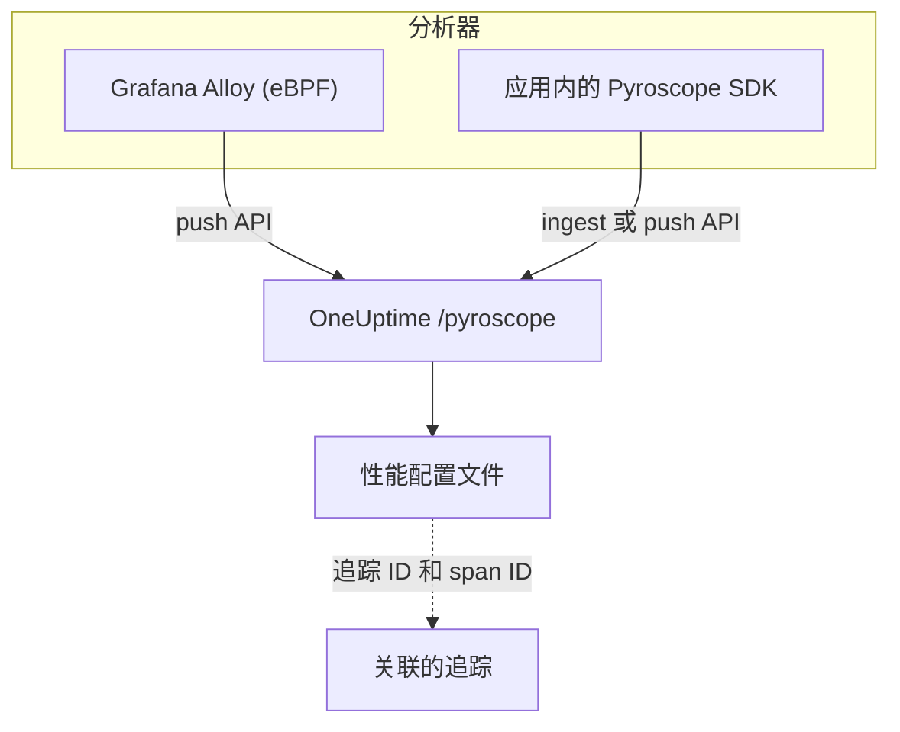

# 持续性能分析

持续性能分析按函数逐一展示应用如何消耗 CPU 时间和内存。OneUptime 提供 **兼容 Pyroscope 的摄取 API**，因此任何能推送到 Pyroscope 服务器的工具（Grafana Alloy eBPF 分析器或各语言的 Pyroscope SDK）都能推送到 OneUptime，你可以在日志、指标和追踪旁边以火焰图的形式查看结果。

:::cards
- [发送性能分析数据](#发送性能分析数据): 使用 eBPF 的 Grafana Alloy，或应用内的 Pyroscope SDK。
- [摄取端点](#摄取端点): 基础 URL，以及传递密钥的三种方式。
- [验证是否正常工作](#验证是否正常工作): 检查密钥、页面和上传状态。
- [查看性能分析数据](#在-oneuptime-中查看性能分析数据): 火焰图、热点函数、对比和追踪链接。
:::

## 工作原理

分析器对你的进程进行采样，每隔几秒就携带摄取密钥把一份性能分析数据上传到 OneUptime 的 `/pyroscope` 端点。OneUptime 把每份数据存储在它所指定的服务下，并在 **性能配置文件** 中绘制成火焰图。



## 开始之前

你需要一个 **服务器** 类型的遥测摄取密钥。如果还没有，请按以下步骤创建：

:::steps
### 打开摄取密钥

前往 **产品 → 项目设置**，在侧边菜单中展开 **遥测与 APM**，然后选择 **摄取密钥**。


### 创建密钥

点击 **创建摄取密钥**。对话框已填好密钥名称，并选择了 **服务器**（应用或收集器发送数据时使用的密钥类型），因此可以直接点击 **创建摄取密钥** 创建，也可以先改名。

### 复制密钥值

新密钥会在它自己的页面中打开。复制它的 **密钥**：这就是下文示例中称为 `YOUR_ONEUPTIME_INGESTION_TOKEN` 的摄取令牌。


:::

## 摄取端点

| 设置 | 值 |
| --- | --- |
| 基础 URL（Pyroscope 服务器地址） | `https://oneuptime.com/pyroscope` |
| 认证请求头 | `x-oneuptime-token: YOUR_ONEUPTIME_INGESTION_TOKEN` |

客户端会在基础 URL 后追加自己的路径（大多数 Pyroscope SDK 为 `/ingest`，Grafana Alloy 和 v0.14 起的 .NET SDK 为 `/push.v1.PusherService/Push`），因此你只需配置基础 URL，末尾不加斜杠。

OneUptime 会从以下任一位置读取摄取令牌，请使用你的客户端支持的方式：

| 方式 | 适用场景 |
| --- | --- |
| `x-oneuptime-token` 请求头 | 允许添加自定义请求头的客户端。 |
| `Authorization: Bearer <token>` | 带有 `authToken` / `auth_token` 选项的 SDK，它们发送的就是这种形式。 |
| HTTP 基本认证，把令牌作为 **密码**（用户名任意） | 只提供基本认证用户名和密码的客户端。 |

> [!NOTE]
> 自托管 OneUptime？把 `https://oneuptime.com` 替换为你自己的主机，例如 `https://YOUR-ONEUPTIME-HOST/pyroscope`。

## 支持的性能分析数据格式

| 格式 | 发送方 | 是否支持 |
| --- | --- | --- |
| pprof（二进制 protobuf，可选 gzip 压缩） | Go、Node.js 和 .NET 的 Pyroscope SDK；Grafana Alloy | 是 |
| Folded / collapsed 文本 | Python、Ruby 和 Rust 的 Pyroscope SDK（其默认上传格式） | 是 |
| JFR（Java Flight Recorder） | Pyroscope Java 代理 | 暂不支持，Java 服务请使用 Grafana Alloy |

## 发送性能分析数据

Grafana Alloy 无需修改代码即可分析主机上的每个进程，是推荐的入门方式。Pyroscope SDK 则在你的应用内部运行。

:::tabs
@tab Grafana Alloy
[Grafana Alloy](https://grafana.com/docs/alloy/latest/) 使用 eBPF 从 Linux 主机上的每个进程收集 CPU 性能分析数据，应用内无需代理，也无需修改代码。它适用于 Go、Rust、C/C++、Java、Python、Ruby、PHP、Node.js 和 .NET。

创建 Alloy 配置：

```hcl title="alloy-config.alloy"
discovery.process "all" {
  refresh_interval = "60s"
}

discovery.relabel "alloy_profiles" {
  targets = discovery.process.all.targets

  rule {
    action       = "replace"
    source_labels = ["__meta_process_exe"]
    target_label  = "service_name"
  }
}

pyroscope.ebpf "default" {
  targets    = discovery.relabel.alloy_profiles.output
  forward_to = [pyroscope.write.oneuptime.receiver]

  collect_interval = "15s"
  sample_rate      = 97
}

pyroscope.write "oneuptime" {
  endpoint {
    url = "https://oneuptime.com/pyroscope"
    headers = {
      "x-oneuptime-token" = "YOUR_ONEUPTIME_INGESTION_TOKEN",
    }
  }
}
```

用 Docker 运行它。eBPF 需要使用主机 PID 命名空间的特权容器：

```yaml title="docker-compose.yml"
services:
  alloy:
    image: grafana/alloy:latest
    privileged: true
    pid: host
    volumes:
      - ./alloy-config.alloy:/etc/alloy/config.alloy
      - /proc:/proc:ro
      - /sys:/sys:ro
    command:
      - run
      - /etc/alloy/config.alloy
```

或者直接在主机上运行：

```bash
alloy run alloy-config.alloy
```

relabel 规则会用进程的可执行文件名来命名每份性能分析数据的服务。
@tab Go
Go SDK 上传 pprof。把它的服务器地址指向 OneUptime 基础 URL，并把摄取令牌作为认证令牌传入：

```go
import "github.com/grafana/pyroscope-go"

pyroscope.Start(pyroscope.Config{
    ApplicationName: "my-service",
    ServerAddress:   "https://oneuptime.com/pyroscope",
    AuthToken:       "YOUR_ONEUPTIME_INGESTION_TOKEN",
    ProfileTypes: []pyroscope.ProfileType{
        pyroscope.ProfileCPU,
        pyroscope.ProfileAllocObjects,
        pyroscope.ProfileAllocSpace,
        pyroscope.ProfileInuseObjects,
        pyroscope.ProfileInuseSpace,
        pyroscope.ProfileGoroutines,
    },
})
```
@tab Node.js
Node.js SDK 上传 pprof：

```javascript
const Pyroscope = require("@pyroscope/nodejs");

Pyroscope.init({
  serverAddress: "https://oneuptime.com/pyroscope",
  appName: "my-service",
  authToken: "YOUR_ONEUPTIME_INGESTION_TOKEN",
});

Pyroscope.start();
```
@tab Python
Python SDK 上传 folded 文本：

```python
import pyroscope

pyroscope.configure(
    application_name="my-service",
    server_address="https://oneuptime.com/pyroscope",
    auth_token="YOUR_ONEUPTIME_INGESTION_TOKEN",
)
```
@tab .NET
Pyroscope .NET 分析器是原生 CLR 分析器：无需修改代码，完全通过环境变量启用。从 [pyroscope-dotnet releases](https://github.com/grafana/pyroscope-dotnet/releases) 下载与你的镜像匹配的版本（`glibc` 或 Alpine 用的 `musl`，`x86_64` 或 `aarch64`），并把它加载到运行时中：

```dockerfile title="Dockerfile"
FROM alpine:3.20 AS pyroscope-profiler
ARG PYROSCOPE_DOTNET_VERSION=1.5.1
ADD https://github.com/grafana/pyroscope-dotnet/releases/download/pyroscope-${PYROSCOPE_DOTNET_VERSION}/pyroscope.${PYROSCOPE_DOTNET_VERSION}-glibc-x86_64.tar.gz /tmp/pyroscope.tar.gz
RUN mkdir -p /pyroscope && tar -xzf /tmp/pyroscope.tar.gz -C /pyroscope

FROM mcr.microsoft.com/dotnet/aspnet:10.0
# ... your application ...
COPY --from=pyroscope-profiler /pyroscope /pyroscope
ENV CORECLR_ENABLE_PROFILING=1
ENV CORECLR_PROFILER={BD1A650D-AC5D-4896-B64F-D6FA25D6B26A}
ENV CORECLR_PROFILER_PATH=/pyroscope/Pyroscope.Profiler.Native.so
ENV LD_PRELOAD=/pyroscope/Pyroscope.Linux.ApiWrapper.x64.so
ENV LD_LIBRARY_PATH=/pyroscope
```

然后把它指向 OneUptime，例如在你的 Kubernetes / Helm 环境中：

```bash
PYROSCOPE_APPLICATION_NAME=my-service
PYROSCOPE_PROFILING_ENABLED=1
PYROSCOPE_SERVER_ADDRESS=https://oneuptime.com/pyroscope
PYROSCOPE_BASIC_AUTH_USER=oneuptime
PYROSCOPE_BASIC_AUTH_PASSWORD=YOUR_ONEUPTIME_INGESTION_TOKEN
```

摄取令牌放在基本认证的密码中。用户名可以是任意非空值，但除非两者都设置，否则分析器根本不会发送凭据。如果想改为通过请求头发送令牌，请设置 `PYROSCOPE_HTTP_HEADERS={"x-oneuptime-token":"YOUR_ONEUPTIME_INGESTION_TOKEN"}`。

令牌的传递方式取决于分析器的版本。1.5 及更高版本会忽略 `PYROSCOPE_AUTH_TOKEN`，因此如果你从旧版本升级后仍保留该设置，每次上传都会被以 `401` 拒绝：

| pyroscope-dotnet 版本 | 上传到 | 令牌设置 |
| --- | --- | --- |
| v0.13 及更早 | `/pyroscope/ingest` | `PYROSCOPE_AUTH_TOKEN` |
| v0.14 至 1.4 | `/pyroscope/push.v1.PusherService/Push` | `PYROSCOPE_AUTH_TOKEN` |
| 1.5 及更高 | `/pyroscope/push.v1.PusherService/Push` | `PYROSCOPE_BASIC_AUTH_USER=oneuptime` 和 `PYROSCOPE_BASIC_AUTH_PASSWORD=<token>`（两者都必须设置），或 `PYROSCOPE_HTTP_HEADERS={"x-oneuptime-token":"<token>"}` |

1.0 之前的版本使用 `v<version>-pyroscope` 标签，而不是 `pyroscope-<version>`（例如 `https://github.com/grafana/pyroscope-dotnet/releases/download/v0.13.0-pyroscope/pyroscope.0.13.0-glibc-x86_64.tar.gz`）；分析器的 GUID 和文件名在每个版本中都相同。

CPU 分析默认开启。墙钟时间、内存分配、异常和锁竞争分析需要手动开启：把 `PYROSCOPE_PROFILING_WALLTIME_ENABLED`、`PYROSCOPE_PROFILING_ALLOCATION_ENABLED`、`PYROSCOPE_PROFILING_EXCEPTION_ENABLED` 或 `PYROSCOPE_PROFILING_LOCK_ENABLED` 设置为 `true`。静态标签放在 `PYROSCOPE_LABELS`（`key:value,key:value`）中。

分析器每 15 秒上传一次，并且 **不会** 压缩上传内容，因此繁忙的服务每次上传可能有好几 MB。OneUptime 自身的入口在 `/pyroscope` 上最多接受 16 MB；如果 OneUptime 前面还有其他代理（例如 ingress-nginx，其默认 `proxy-body-size` 为 1 MB），也要提高它对 `/pyroscope` 的请求体大小限制，否则大的上传会在到达 OneUptime 之前被以 `413` 拒绝。
@tab Java
Pyroscope Java 代理以 JFR 格式上传性能分析数据，而 OneUptime 目前还不能摄取这种格式。请改用 Grafana Alloy（**Grafana Alloy** 选项卡）分析 Java 服务，它无需代理或修改代码即可捕获 JVM 的 CPU 性能分析数据。
:::

**Ruby** 和 **Rust** 的用法与 Go、Node.js 和 Python 相同：安装 [对应语言的 Pyroscope SDK](https://grafana.com/docs/pyroscope/latest/configure-client/)，把服务器地址设置为 `https://oneuptime.com/pyroscope`，并把摄取令牌作为认证令牌传入（如果你的 SDK 版本只提供基本认证，则作为基本认证密码传入）。

## 支持的性能分析类型

一份 pprof 可以声明多种样本类型；每份上传的数据都存储在其中一种类型下：有 CPU 时间（以纳秒为单位的 `cpu`）就用它，否则用墙钟时间，再否则依次用使用中的字节数和已分配的字节数，最后用它声明的第一种类型。任何类型都会被存储且可以查看；下列类型在 OneUptime UI 中拥有专门的分组、单位和标签：

| 性能分析类型 | 显示为 | 单位 |
| --- | --- | --- |
| `cpu`、`samples` | CPU 时间 | 纳秒 |
| `wall` | 墙钟时间 | 纳秒 |
| `inuse_space`、`alloc_space`、`heap` | 内存（字节） | 字节 |
| `inuse_objects`、`alloc_objects` | 内存（对象数） | 个数 |
| `mutex`、`contention`、`block` | 锁竞争 | 纳秒 |
| `goroutine` | Goroutines（Go） | 个数 |

其他类型（例如自定义样本类型）会以其原始名称显示在“其他”下。

## 验证是否正常工作

:::steps
### 检查令牌

摄取端点对缺失或无效的令牌返回 `401`，但大多数分析器不会在你能看到的地方显示它（例如 .NET 分析器只在 debug 级别记录 HTTP 响应）。直接询问验证端点：

```bash
curl -i -H "x-oneuptime-token: YOUR_ONEUPTIME_INGESTION_TOKEN" \
  https://oneuptime.com/otlp/v1/validate
```

有效的令牌返回 `200` 和 `{"valid": true, ...}`，并且其 `keyType` 必须是 `Server`：浏览器密钥也有效，但不能发送性能分析数据。未知、已撤销、已禁用或已过期的令牌返回 `401`。

### 打开性能分析页面

在 OneUptime 仪表板中前往 **产品 → 性能配置**。按照 Alloy 15 秒的收集间隔（或 SDK 10 到 15 秒的上传间隔），代理启动后一两分钟内就会出现第一批数据及其火焰图。

### 检查服务

性能分析数据会关联到 SDK 的 `application_name` / `appName` / `PYROSCOPE_APPLICATION_NAME` 所指定的遥测服务（在上面的 Alloy relabel 规则下，则是进程的可执行文件名）。

### 仍然没有？查看上传状态

对于 .NET 分析器，在应用上设置 `DD_TRACE_DEBUG=1` 一分钟：它会为每次上传记录一行 `PyroscopePprofSink <status>`。`200` 表示 OneUptime 已接受；`401` 是令牌问题；`404` 通常表示 `PYROSCOPE_SERVER_ADDRESS` 缺少 `/pyroscope` 后缀；`413` 表示 OneUptime 前面的代理因上传大小而拒绝了它（参见 [发送性能分析数据](#发送性能分析数据) 下的 **.NET** 选项卡）。如果你自己运行 OneUptime，入口（nginx）的访问日志也会为每个 `/pyroscope` 请求记录相同的状态。
:::

## 在 OneUptime 中查看性能分析数据

**产品 → 性能配置** 会打开一个概览，显示时间在你的各个服务中花在了哪里，**所有配置文件** 列出了每一次上传。选择要分析的内容：**全部**、**CPU 时间**、**内存** 或 **锁**，或者 **墙钟时间**、**Goroutines** 等特定类型。

性能分析数据的页面有三个视图：

| 视图 | 显示内容 |
| --- | --- |
| **火焰图** | 每个条形代表调用栈中的一个函数，其宽度与它消耗的时间或资源成正比。点击函数可放大并查看它的调用者和被调用者。 |
| **Top functions** | 性能分析数据中的函数，按自身时间或总时间排序。**Only my code** 会隐藏库的栈帧。 |
| **Diff vs. baseline** | 与更早的时段（**对比 1 小时前**、**对比昨天** 或 **对比上周**）比较，并列出 **Most regressed** 和 **Most improved** 的函数。 |

**Download pprof** 会保存这份数据，供 `go tool pprof` 等本地工具使用。

### 与追踪关联

当性能分析数据携带追踪 ID 和 span ID（例如作为 `trace_id` / `span_id` 样本标签）时，你可以从一个缓慢的追踪 span 直接跳转到对应的 CPU 或内存性能分析数据，准确了解当时正在执行的代码；**Open linked trace** 则反向跳转。

span 的 **个人资料** 选项卡还包含与嵌套在其下的 span 相关联的样本，因为分析器常常把请求的 CPU 时间归到子 span 上，而不是请求 span 本身。

## 数据保留

性能分析数据的保留时间与项目的遥测保留期相同：**项目设置 → 遥测与 APM → 数据保留** 设置 **默认保留期（天）**，除非你更改，否则为 15 天。保留期结束后，数据会自动删除。包含保留期覆盖的套餐还可以让性能分析数据比其他遥测数据保留得更长或更短，或在服务的 **设置** 页面上按服务设置保留期。

## 后续步骤

:::cards
- [性能剖析监控](/docs/monitor/profiles-monitor): 按数量和类型，对服务发送的性能分析数据发出告警。
- [OpenTelemetry](/docs/telemetry/open-telemetry): 发送性能分析数据所关联的追踪。
- [Kubernetes 代理](/docs/telemetry/kubernetes-agent): 用代理的 eBPF 分析器分析整个集群。
:::
