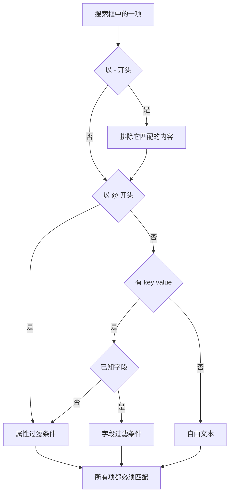

# 搜索语法

日志、追踪、指标和异常浏览器上方的搜索框使用同一种查询语言。查询是一组用空格分隔的过滤条件，并且 **每个过滤条件都必须匹配**：过滤条件之间没有隐式的 OR。搜索时可以把本页当作参考。

:::cards
- [两种过滤条件](#两种过滤条件): 内置字段、属性和自由文本。
- [匹配值](#匹配值): 通配符、包含、比较和列表。
- [排除](#排除): 在任意过滤条件前加 `-` 来反转它。
- [各信号的字段](#各信号的字段): 每个浏览器中可以按哪些字段过滤。
:::

## 查询的解读方式

```text
severity:error @platform.team:a* -@http.method:GET timeout
```

它的意思是：错误级别的日志，其 `platform.team` 属性以 `a` 开头，`http.method` 属性不是 `GET`，并且消息中提到 `timeout`。

| 项 | 类型 | 匹配 |
| --- | --- | --- |
| `severity:error` | 字段 | 日志的严重程度为 Error。 |
| `@platform.team:a*` | 属性 | `platform.team` 属性以 `a` 开头。 |
| `-@http.method:GET` | 排除的属性 | `http.method` 属性是除 `GET` 以外的任何值。 |
| `timeout` | 自由文本 | 消息包含 `timeout`。 |

每个以空格分隔的项都单独解读，然后全部用 AND 组合：



## 两种过滤条件

| 形式 | 过滤对象 | 示例 |
| --- | --- | --- |
| `field:value` | 该信号的内置字段 | `severity:error` |
| `@attribute:value` | 行上的 OpenTelemetry 属性 | `@http.status_code:500` |
| 单独的词 | 消息（日志）、span 名称（追踪）、指标名称（指标）或异常消息（异常） | `connection refused` |

键不是已知字段的单独 `key:value` 会被当作属性，因此 `k8s.pod:api-0` 和 `@k8s.pod:api-0` 含义相同。加上 `@` 前缀总是表示“在属性中查找”，只有一个例外：在异常浏览器中，`@type:`、`@service:`、`@env:` 和 `@class:` 仍然过滤这些字段。

只是碰巧包含冒号的文本仍然是文本：`https://example.com` 和 `12:30` 会作为词语搜索，而不会被读成过滤条件。

## 匹配值

此表中的所有写法都适用于任何属性和大多数内置字段；[各信号的字段](#各信号的字段) 注明了以更简单的方式读取值的字段。

| 输入 | 匹配 |
| --- | --- |
| `@k:abc` | 正好是 `abc` |
| `@k:a*` | 以 `a` 开头的任何值，如 `abc`、`alpha` |
| `@k:*c` | 以 `c` 结尾的任何值 |
| `@k:a*c` | 以 `a` 开头并以 `c` 结尾 |
| `@k:a?c` | `?` 正好是一个字符：匹配 `abc`、`axc`，但不匹配 `ac` |
| `@k:*` | 该属性存在且不为空 |
| `@k:~abc` | 任意位置包含 `abc` |
| `@k:!abc` | 除 `abc` 以外的任何值 |
| `@k:>100` | 大于 100。也可以用 `>=`、`<`、`<=` |
| `@k:(a OR b)` | 两个值中的任一个。`@k:[a, b]` 与之相同 |
| `@k:(a* OR b*)` | 两个模式中的任一个 |

通配符匹配和包含匹配忽略大小写；精确匹配则区分大小写，因为它与存储时的原样值进行比较。

### 含空格的值

用双引号把值括起来：

```text
name:"SELECT wp_options"
@k8s.container.name:"my container"
```

引号保护的是 **空格**，而不是通配符：`@k:"a b*"` 仍然匹配以 `a b` 开头的任何值。

### 字面量 `*`、`?` 和其他标点

反斜杠使下一个字符成为字面量：

| 输入 | 匹配 |
| --- | --- |
| `@k:a\*b` | 正好是 `a*b` |
| `@k:\~abc` | 正好是 `~abc` |
| `@k:\>5` | 正好是 `>5` |

包含 `%` 或 `_` 的值无需转义，它们始终是字面量。

## 排除

前置的 `-` 会反转任何过滤条件，包括上面这些：

| 输入 | 匹配 |
| --- | --- |
| `-severity:debug` | 除 debug 以外的所有内容 |
| `-@platform.team:a*` | `platform.team` **不** 以 `a` 开头的任何行，包括根本没有 `platform.team` 的行 |
| `-@k:*` | 该属性不存在或为空 |
| `-@k:(a OR b)` | 两个值都不是 |
| `-@k:>100` | 100 或更小 |
| `-@k:~abc` | 不包含 `abc` |

在追踪浏览器中，`-` 只排除属性。`-status:error` 会被读作要在 span 名称中查找的文本，因此什么也找不到；请改为指定你想要的值，例如 `status:(ok OR unset)`。

## 各信号的字段

字段名称不区分大小写：`statusMessage:` 和 `statusmessage:` 是同一个字段。

### 日志

| 字段 | 别名 | 说明 |
| --- | --- | --- |
| `severity` | `level` | `fatal`、`error`、`warning`（或 `warn`）、`info`（或 `information`）、`debug`、`trace`、`unspecified`，大小写均可 |
| `service` | | 服务名称，需写全名，大小写均可 |
| `trace` | | 追踪 ID |
| `span` | | Span ID |
| `message` | `msg`、`log`、`body` | 日志行。单独的词也搜索这里 |

### 追踪

追踪字段接受单个值或“任一”列表，例如 `status:(ok OR unset)`，`duration` 还接受 `>` 和 `<`。通配符、`~`、`!` 和前置的 `-` 在这里只对属性有效。

| 字段 | 说明 |
| --- | --- |
| `service` | 服务名称 |
| `name` | Span 名称。单个值匹配其中任意部分。单独的词也搜索这里 |
| `status` | `ok`、`error`、`unset` (unset = 未设置错误状态，即 OpenTelemetry 默认值) |
| `kind` | `server`、`client`、`producer`、`consumer`、`internal` |
| `duration` | 毫秒：`duration:>500`、`duration:<200` 或精确值 |
| `statusMessage` | 状态消息文本。单个值匹配其中任意部分 |
| `hasException` | `true` 或 `false` |
| `trace`、`span` | ID |

### 指标

| 字段 | 说明 |
| --- | --- |
| `name` | 指标名称。普通值匹配其中任意部分，因此 `name:http.server` 能找到 `http.server.request.duration`。单独的词也搜索这里 |
| `service` | 服务名称。普通值匹配其中任意部分 |

### 异常

| 字段 | 别名 | 说明 |
| --- | --- | --- |
| `type` | `exceptionType` | 异常类型，例如 `type:TypeError` |
| `env` | `environment` | 环境，来自资源属性 `deployment.environment` |
| `service` | | 服务名称。普通值匹配其中任意部分 |
| `class` | `errorClass` | 错误由谁造成：`code-fault`、`user-error`、`expected-denial`、`infrastructure` 或 `unknown` |

单独的词搜索异常消息。

**Security Events** 浏览器使用相同的语言，但有自己的字段，例如 `severity`、`tactic` 和 `user`，参见 [安全事件](/docs/telemetry/security-events)。

## 组合过滤条件

过滤条件用 AND 组合。可以在它们之间写 `AND`，但不会改变任何东西：

```text
severity:error service:api          # both must hold
severity:error AND service:api      # identical
```

过滤条件 **之间** 没有 OR 或 NOT：写在那里的 `OR` 和 `NOT` 会被跳过，因此 `NOT severity:debug` 与 `severity:debug` 含义相同。用前置的 `-` 来排除（`-severity:debug`）；要让同一个键匹配两个值中的任一个，请使用“任一”形式：

```text
@http.method:(GET OR POST)
```

同一个键上的两个过滤条件用 AND 组合，范围或两端的模式就是这样写的：

```text
@http.status_code:>=500 @http.status_code:<=599
@k:a* @k:*z
```

## 筛选标签与搜索框

在 `key:value` 项上按 Enter 会应用它，通常以结果上方的筛选标签形式出现。筛选标签按输入时的原样携带值，因此通配符仍是通配符。筛选标签无法携带的项（例如排除的 `-key:value`）会留在搜索框中，并从那里进行过滤。点击分面侧栏中的值会添加同类筛选标签，其值经过转义：碰巧包含 `*` 的存储值会按该字面值过滤，而不是作为模式。

筛选标签是已保存视图和页面 URL 的一部分，因此过滤条件在刷新、书签和分享链接中都会保留。

## 须知

- 对于通配符、包含以及前缀/后缀过滤，属性 **键** 不区分大小写匹配，因此不必记住它摄取时是 `requestId` 还是 `requestid`。
- `-@k:...` 过滤条件也会匹配从未有过该属性的行：根本不带 `platform.team` 的行当然不会以 `a` 开头。
- 数值比较适用于以文本存储的属性值；不是数字的值永远不满足比较。

## 后续步骤

:::cards
- [放大时间范围](/docs/telemetry/charts-and-time-ranges): 把浏览器聚焦到关键时刻。
- [日志管道](/docs/telemetry/log-pipelines): 把日志行的各部分变成可以搜索的属性。
- [日志监控](/docs/monitor/logs-monitor): 你搜索的日志出现时发出告警。
- [OpenTelemetry](/docs/telemetry/open-telemetry): 发送可供搜索的日志、指标和追踪。
:::
