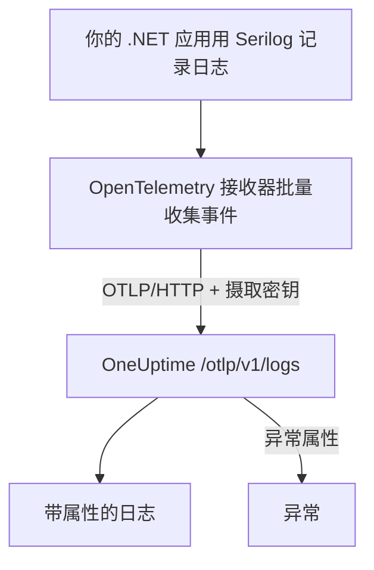

# Serilog (.NET)

[Serilog](https://serilog.net) 是 .NET 中最常用的结构化日志库。借助官方的 [`Serilog.Sinks.OpenTelemetry`](https://github.com/serilog/serilog-sinks-opentelemetry) 接收器（sink），应用通过 Serilog 记录的每个事件都会经由 OpenTelemetry Protocol（OTLP）发送到 OneUptime，并可以在 **产品 → 日志** 中搜索，连同其结构化属性、严重级别和追踪关联。

无需安装任何 OneUptime 专用的包：接收器连接的就是 OneUptime 为所有 OpenTelemetry 数据提供的同一个 OTLP 端点。控制台应用、Worker 服务、ASP.NET Core 应用以及其他任何运行在 .NET 上的程序都适用。

:::cards
- [设置接收器](#设置接收器): 安装两个包，并在代码或 `appsettings.json` 中配置。
- [异常](#异常): 记录下来的异常会成为异常中的问题。
- [故障排除](#故障排除): 收不到日志时要检查什么。
:::

## 工作原理



接收器会批量收集日志事件，并在后台发送。每个具名属性都会成为日志的一个属性；用 Serilog 记录的异常到达时，会带着 OneUptime 用来生成问题的属性。

## 开始之前

- 一个 OneUptime 项目。在 OneUptime Cloud 上，遥测数据按摄取的 GB 计费（参见[价格](https://oneuptime.com/pricing)），而且 Free 套餐的项目需要先添加付款方式才能发送遥测数据。
- 一个正在使用或可以使用 Serilog 的 .NET 应用。
- 一个用于认证日志的遥测摄取密钥。如果还没有，请按以下步骤创建：

:::steps
### 打开摄取密钥

前往 **产品 → 项目设置**，在侧边菜单中展开 **遥测与 APM**，然后选择 **摄取密钥**。


### 创建密钥

点击 **创建摄取密钥**。对话框已经填好了密钥名称，并选择了 **服务器**（应用或 Collector 发送数据时使用的密钥类型），因此直接点击 **创建摄取密钥** 即可创建，也可以先改名。

### 复制机密

新密钥会在它自己的页面中打开。复制它的 **密钥**：这就是下面示例中的 `YOUR_TELEMETRY_INGESTION_TOKEN`。


:::

## 你需要从 OneUptime 获取的信息

| 设置 | 值 |
| ------------- | ------------------------------------------------------------ |
| OTLP 端点 | `https://oneuptime.com/otlp` |
| 认证请求头 | `x-oneuptime-token: YOUR_TELEMETRY_INGESTION_TOKEN` |
| 服务名称 | 服务要显示的名称，例如 `my-service` |

> [!NOTE]
> 自托管 OneUptime？把 `https://oneuptime.com/otlp` 换成 `https://YOUR-ONEUPTIME-HOST/otlp`（如果不终止 TLS，则用 `http://...`）。其他一切保持不变。

协议设为 `HttpProtobuf` 时，接收器会在端点后追加 `/v1/logs` 路径，因此它最终发送到的 URL 是 `https://oneuptime.com/otlp/v1/logs`。你只需要提供基础的 `/otlp` 端点。

## 设置接收器

:::steps
### 安装 NuGet 包

把 Serilog 和 OpenTelemetry 接收器添加到项目中：

```bash
dotnet add package Serilog
dotnet add package Serilog.Sinks.OpenTelemetry
```

如果要通过 `appsettings.json` 配置接收器，还要添加 `Serilog.Settings.Configuration`。对于 ASP.NET Core 应用，添加 `Serilog.AspNetCore`，它会把 Serilog 接入主机和请求管道：

```bash
dotnet add package Serilog.Settings.Configuration
dotnet add package Serilog.AspNetCore
```

### 配置接收器

把接收器指向你的 OneUptime OTLP 端点，将协议设为 `HttpProtobuf`，以请求头传入摄取令牌，并给日志加上 `service.name`。可以在代码、`appsettings.json` 或 ASP.NET Core 主机中配置：

:::tabs
@tab 在代码中
```csharp title="Program.cs"
using Serilog;
using Serilog.Sinks.OpenTelemetry;

Log.Logger = new LoggerConfiguration()
    .MinimumLevel.Information()
    .Enrich.FromLogContext()
    .WriteTo.Console() // optional: keep local logs too
    .WriteTo.OpenTelemetry(options =>
    {
        // Base OTLP endpoint. The sink appends /v1/logs automatically.
        options.Endpoint = "https://oneuptime.com/otlp";
        options.Protocol = OtlpProtocol.HttpProtobuf;

        // Authenticate with your OneUptime telemetry ingestion token.
        options.Headers = new Dictionary<string, string>
        {
            ["x-oneuptime-token"] = "YOUR_TELEMETRY_INGESTION_TOKEN"
        };

        // Identify your service in OneUptime.
        options.ResourceAttributes = new Dictionary<string, object>
        {
            ["service.name"] = "my-service",
            ["deployment.environment"] = "production"
        };
    })
    .CreateLogger();

try
{
    Log.Information("Application starting up");
    // ... your application code ...
}
finally
{
    // Flush any buffered logs before the process exits.
    Log.CloseAndFlush();
}
```
@tab appsettings.json
把接收器的设置写进 `appsettings.json`：

```json title="appsettings.json"
{
  "Serilog": {
    "Using": ["Serilog.Sinks.OpenTelemetry"],
    "MinimumLevel": "Information",
    "WriteTo": [
      {
        "Name": "OpenTelemetry",
        "Args": {
          "endpoint": "https://oneuptime.com/otlp",
          "protocol": "HttpProtobuf",
          "headers": {
            "x-oneuptime-token": "YOUR_TELEMETRY_INGESTION_TOKEN"
          },
          "resourceAttributes": {
            "service.name": "my-service",
            "deployment.environment": "production"
          }
        }
      }
    ]
  }
}
```

然后从配置构建日志记录器：

```csharp title="Program.cs"
using Serilog;
using Microsoft.Extensions.Configuration;

IConfiguration configuration = new ConfigurationBuilder()
    .AddJsonFile("appsettings.json")
    .Build();

Log.Logger = new LoggerConfiguration()
    .ReadFrom.Configuration(configuration)
    .CreateLogger();
```
@tab ASP.NET Core
对于 ASP.NET Core（.NET 6 及以上的最小托管），使用 `Serilog.AspNetCore`，让 Serilog 替换默认的日志记录器，同时记录框架日志和请求日志：

```csharp title="Program.cs"
using Serilog;
using Serilog.Sinks.OpenTelemetry;

var builder = WebApplication.CreateBuilder(args);

builder.Host.UseSerilog((context, services, configuration) =>
{
    configuration
        .ReadFrom.Configuration(context.Configuration)
        .Enrich.FromLogContext()
        .WriteTo.OpenTelemetry(options =>
        {
            options.Endpoint = "https://oneuptime.com/otlp";
            options.Protocol = OtlpProtocol.HttpProtobuf;
            options.Headers = new Dictionary<string, string>
            {
                ["x-oneuptime-token"] = "YOUR_TELEMETRY_INGESTION_TOKEN"
            };
            options.ResourceAttributes = new Dictionary<string, object>
            {
                ["service.name"] = "my-service"
            };
        });
});

var app = builder.Build();

// Logs one summary event per HTTP request.
app.UseSerilogRequestLogging();

app.MapGet("/", () => "Hello World");
app.Run();
```
:::

> [!IMPORTANT]
> 接收器会批量收集日志事件并异步发送。在应用退出之前务必调用 `Log.CloseAndFlush()`（或释放日志记录器），否则最后一批日志可能会丢失。在 ASP.NET Core 中，`Serilog.AspNetCore` 会在正常关闭时替你完成这一步。

> [!TIP]
> 不要把令牌放进源代码管理。从环境变量或密钥存储中读取，并在启动时注入配置，而不是提交到 `appsettings.json`。

### 写入日志

照常使用 Serilog。结构化属性会被保留，并成为 OneUptime 中可搜索的属性：

```csharp
Log.Information("Order {OrderId} placed by {CustomerId} for {Amount:C}",
    orderId, customerId, amount);

Log.Warning("Payment gateway slow: {LatencyMs}ms", latencyMs);
```

每个具名属性（`OrderId`、`CustomerId`、`Amount`、`LatencyMs`）都会作为日志属性发送，因此可以在 **产品 → 日志** 浏览器中按它们筛选和搜索。

### 确认日志已到达

运行应用并写入几条日志事件。几秒钟内，它们会出现在 **产品 → 日志** 中，以及 **产品 → 服务** 下你的服务页面上；服务以你设置的 `service.name`（`my-service`）命名。它们的结构化属性可以用作筛选条件。
:::

## 异常

用 Serilog 记录异常时，接收器会给日志记录附加 OpenTelemetry 的 `exception.type`、`exception.message` 和 `exception.stacktrace` 属性：

```csharp
try
{
    ProcessPayment();
}
catch (Exception ex)
{
    Log.Error(ex, "Failed to process payment for order {OrderId}", orderId);
}
```

OneUptime 会检测这些属性，按指纹把错误归并为 **异常** 中的问题，并关联到正确的服务。同时由追踪和日志报告的错误会合并成一个问题。检测的工作方式参见[来自日志的异常](/docs/telemetry/open-telemetry#来自日志的异常)。

## 追踪关联

如果你的应用还用 OpenTelemetry .NET SDK 做了追踪埋点，那么在活动 span 内产生的 Serilog 事件会自动带上当前的 `TraceId` 和 `SpanId`（这属于接收器默认的 `IncludedData`）。这样 OneUptime 就能把一行日志直接关联到它所在的追踪，你可以从日志跳到所在的请求，再跳回来。

要同时发送追踪和指标，参见 [OpenTelemetry 快速开始](/docs/telemetry/open-telemetry#快速开始) 中的 .NET 设置。

## 故障排除

:::details 没有出现日志
仔细检查 `x-oneuptime-token` 的值，确认它属于你正在查看的项目。确认端点是 `https://oneuptime.com/otlp`（只写基础路径，不要自己追加 `/v1/logs`）。要查看接收器失败的原因，可在启动时用 `Serilog.Debugging.SelfLog.Enable(Console.Error)` 打开 Serilog 自身的错误输出：它会打印 OneUptime 返回的状态码。
:::

:::details 日志只在应用退出时出现，或者最后的日志丢失
确保关闭时会执行 `Log.CloseAndFlush()`。接收器会批量收集事件，所以如果进程在刷新之前被强制结束，缓冲中的日志就会丢失。
:::

:::details 返回 401 Unauthorized，什么都没有摄取
密钥缺失、未知或已过期。确认请求头名称正好是 `x-oneuptime-token`，并且值是该密钥的 **密钥**。
:::

:::details 返回 402 或 422，什么都没有摄取
`402`：在 OneUptime Cloud 上，项目处于 Free 套餐且没有付款方式。请在 **项目设置 → 账单和发票 → 账单** 中添加。`422`：密钥已被禁用，或者是浏览器密钥。请在密钥的设置中重新打开 **已启用**，或者创建一个 **服务器** 密钥。
:::

:::details 日志归到了错误的服务名称下
在 `ResourceAttributes`（代码）或 `resourceAttributes`（appsettings.json）中设置 `service.name`。不设置的话，日志会归到接收器替代发送的占位名称下，而不是你的服务名称。
:::

:::details 连接自托管实例时出错
确认协议与端点的协议头一致（`https://` 或 `http://`），并且应用可以访问你的 OneUptime 主机。
:::

如有任何问题或需要帮助，请发送邮件至 support@oneuptime.com。

## 后续步骤

:::cards
- [OpenTelemetry](/docs/telemetry/open-telemetry): 也从 .NET 发送追踪和指标。
- [日志管道](/docs/telemetry/log-pipelines): 在日志到达时解析并丰富它们。
- [日志监控](/docs/monitor/logs-monitor): 出现匹配的日志时发出告警。
- [搜索语法](/docs/telemetry/search-syntax): 按 Serilog 属性筛选。
:::
