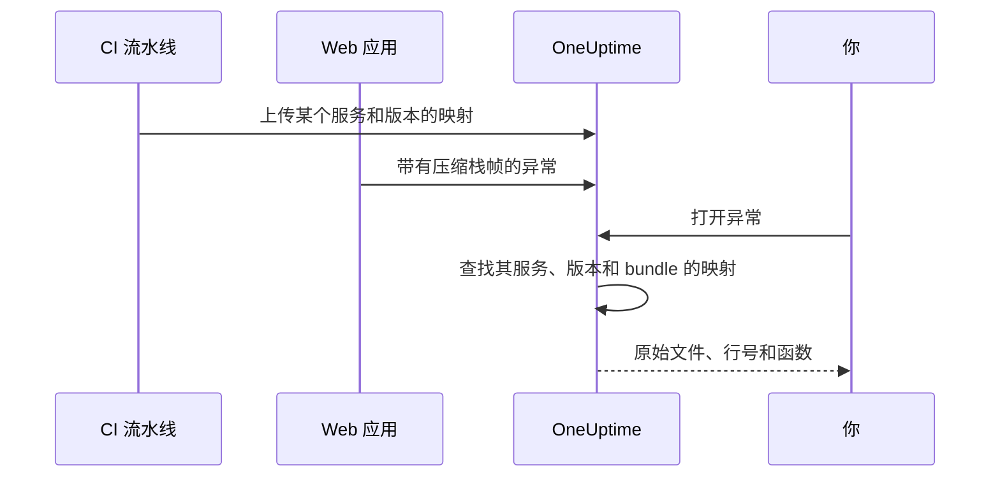

# 源代码映射

把前端构建的源代码映射上传到 OneUptime 后，**异常** 中的浏览器异常就会显示原始的文件名、行号和函数，而不是压缩后的名称。本页面向已经把浏览器遥测数据发送到 OneUptime 的前端开发者。

:::cards
- [匹配方式](#匹配方式): 服务名称、版本和 bundle 文件。
- [上传源代码映射](#上传源代码映射): 在 CI 中发送一个 `curl` 请求。
- [限制](#限制): 大小、数量和自托管设置。
- [查看解析后的堆栈跟踪](#查看解析后的堆栈跟踪): 解析后的栈帧是什么样子。
:::

## 概述

生产环境的前端 bundle 经过压缩，因此通过 OpenTelemetry Web SDK 捕获的浏览器异常到达时，其栈帧类似这样：

```text
TypeError: Cannot read properties of undefined (reading 'id')
    at e.onSelect (https://app.example.com/assets/main.a8f1b2.js:1:48291)
```

把构建的源代码映射上传到 OneUptime，异常仪表板就会把这些栈帧解析回原始的文件、行号和函数名；如果映射在构建时包含 `sourcesContent`，还会显示原始源代码的上下文行。

映射通过经过认证的 API 上传到 OneUptime，**绝不会从你的网站获取**，因此你可以（也应该）继续使用 `hidden-source-map`（webpack）或 `sourcemap: 'hidden'`（Vite / Rollup）进行构建，永远不要把 `.map` 文件发布在 bundle 旁边。



## 匹配方式

源代码映射按三个键存储：

| 键 | 必须匹配 |
|---|---|
| 服务名称 | 你的 Web 应用发送遥测数据时使用的 OpenTelemetry 资源属性 `service.name` |
| 服务版本 | 资源属性 `service.version`（你的版本标识） |
| Bundle 路径 | 生成该映射的压缩文件，例如 `main.a8f1b2.js` |

打开异常时，OneUptime 会查找为该异常的服务和版本上传的映射，按文件名把每个栈帧匹配到一个 bundle（路径后缀相同即可：`main.a8f1b2.js` 能匹配 `https://app.example.com/assets/main.a8f1b2.js`），并通过映射解析压缩后的行和列。解析在查看异常时延迟进行，绝不会发生在摄取路径上，因此在新版本的第一个错误出现几分钟 *之后* 才上传的映射，仍会追溯生效。

## 开始之前

- 一个 **服务器** 类型的遥测摄取密钥，在 **项目设置 → 遥测与 APM → 摄取密钥** 中创建。参见 [创建摄取密钥](/docs/telemetry/open-telemetry#创建摄取密钥)。
- 一个已经通过 OpenTelemetry Web SDK 向 OneUptime 发送异常的 Web 应用，参见 [浏览器端设置](/docs/rum/browser-setup)。
- 一个会输出源代码映射的构建；如果希望在每个栈帧周围显示源代码片段，需包含 `sourcesContent`（大多数打包工具的默认设置）。

## 上传源代码映射

:::steps
### 随遥测数据发送 `service.version`

你的 Web 应用必须发送 `service.version`，并且它必须与上传映射时使用的字符串相同：

```javascript
import { resourceFromAttributes } from "@opentelemetry/resources";

const resource = resourceFromAttributes({
  "service.name": "my-web-app",
  "service.version": "1.4.2", // same value you upload maps with
});
```

任何稳定的版本标识都可以（语义化版本、git 提交 SHA、构建号），只要上传的 `serviceVersion` 与资源属性 `service.version` 是同一个字符串即可。

### 每次生产构建后上传映射

在 CI 中上传，把摄取密钥放在 `x-oneuptime-token` 请求头中：

```bash
curl --fail -X POST "https://oneuptime.com/source-maps/v1/upload" \
  -H "x-oneuptime-token: YOUR_TELEMETRY_INGESTION_KEY" \
  -F "serviceName=my-web-app" \
  -F "serviceVersion=1.4.2" \
  -F "sourcemap=@dist/assets/main.a8f1b2.js.map" \
  -F "sourcemap=@dist/assets/vendor.9c3d4e.js.map"
```

对于自托管安装，请把 `oneuptime.com` 替换为你的 OneUptime 主机。也可以用 `Authorization: Bearer YOUR_KEY` 代替 `x-oneuptime-token` 请求头。

### 检查上传结果

上传成功后会返回一个列出已存储映射的 JSON 正文，CI 可以据此进行断言。这些映射也会列在 OneUptime 中该服务的 **Source Maps** 页面上。
:::

典型的 CI 步骤会上传构建输出的每个映射：

```bash
VERSION="$(git rev-parse --short HEAD)"

find dist -name "*.js.map" -print0 | while IFS= read -r -d '' map; do
  curl --fail -X POST "https://oneuptime.com/source-maps/v1/upload" \
    -H "x-oneuptime-token: $ONEUPTIME_INGESTION_KEY" \
    -F "serviceName=my-web-app" \
    -F "serviceVersion=$VERSION" \
    -F "sourcemap=@$map"
done
```

### 上传规则

- 每个上传文件的 bundle 路径是去掉末尾 `.map` 后的文件名：`main.a8f1b2.js.map` 会变成 `main.a8f1b2.js`。如果你的映射文件名不遵循这一约定，请每个请求只上传一个文件，并显式传入 `bundlePath` 字段。
- 为同一服务和版本重新上传同一个 bundle，会替换之前的映射，因此 CI 重试是安全的。
- 文件必须是 [source map v3](https://tc39.es/ecma426/) JSON（所有现代打包工具输出的都是这种格式，也支持带 `sections` 的索引映射）。
- 如果自托管的运维人员禁用了遥测摄取（`DISABLE_TELEMETRY_INGESTION`），上传会返回一个空的成功响应，并且不会存储任何内容，这与该模式下所有遥测摄取端点的行为相同。真正的上传总会返回一个列出已存储映射的 JSON 正文，因此 CI 可以区分这两种情况。

## 限制

每个 `.map` 文件最大可达 50 MB，但入口也把 **整个请求体** 限制为 50 MB，所以大的映射请每个请求上传一个。每个请求最多接受 50 个文件，一个版本（服务 + 版本号）总共最多可保存 1,000 个映射；超出的上传会被拒绝，并附带指明该限制的消息。如果构建输出的映射多于单个请求能接受的数量，只需发送多个请求即可：同一版本的上传会累积。

自托管安装可以更改这些值。五个值都是普通的环境变量，Helm chart 在 `values.yaml` 的 `sourceMaps` 下提供了它们：

| `values.yaml` | 环境变量 | 默认值 |
| --- | --- | --- |
| `sourceMaps.maxMapsPerRelease` | `SOURCE_MAP_MAX_MAPS_PER_RELEASE` | `1000` |
| `sourceMaps.maxFilesPerRequest` | `SOURCE_MAP_MAX_FILES_PER_REQUEST` | `50` |
| `sourceMaps.maxFileSizeBytes` | `SOURCE_MAP_MAX_FILE_SIZE_BYTES` | `52428800` |
| `sourceMaps.maxBytesPerResolve` | `SOURCE_MAP_MAX_BYTES_PER_RESOLVE` | `536870912` |
| `sourceMaps.retentionDays` | `SOURCE_MAP_RETENTION_DAYS` | `90` |

如果你的构建超出默认值，需要调高的是 `maxMapsPerRelease`；它只是对存储形态的限制，因为解析的开销由 `maxBytesPerResolve` 限定，而不是由一个版本保存了多少映射决定。`maxFilesPerRequest` 和 `maxFileSizeBytes` 只能 **调低**：multipart 正文在请求认证之前就会被解析，因此未认证的调用方受其上方的共享上限约束，更大的值会被收窄到上限，而不会被采用。

## 查看解析后的堆栈跟踪

在仪表板的 **异常** 下打开任意异常。通过源代码映射解析的栈帧会显示 **Source mapped** 徽章，并显示原始函数名和文件位置；展开栈帧会在压缩位置旁边显示原始源代码片段（当映射包含 `sourcesContent` 时）。

某个服务已上传的映射可以在 **产品 → 服务 → 你的服务 → Source Maps** 中查看和删除，那里列出了每个映射的版本、bundle、大小和上传时间。

## 保留

源代码映射在上传后保留 90 天，然后自动删除。只有当某个版本的异常还在你的遥测保留期内时，映射才有用，因此这个期限足以超过它所还原的那些异常。如果再次需要，请重新上传该版本的映射。

## 安全

- 映射通过经过认证的端点上传，并存储在你的 OneUptime 项目中；它们绝不会从你的网站获取，因此隐藏的源代码映射会一直保持隐藏。
- 映射的原始内容（使用 `sourcesContent` 构建时包含你的原始源代码）只有项目所有者和管理员，以及被授予 **Read Telemetry Source Map** 权限的人才能读取。其他团队成员只能看到他们已有权访问的异常的解析后栈帧，以及每个崩溃位置周围的几行源代码。
- 删除服务会同时删除其源代码映射。

## 故障排查

:::details 栈帧仍然是压缩后的
该异常的版本没有匹配的映射。请检查：你的应用发送的 `service.version` 是否与上传时使用的 `serviceVersion` 完全相同，`serviceName` 是否与 `service.name` 匹配，以及是否为该 bundle 文件上传了映射。服务的 **Source Maps** 页面列出了每个映射的版本和 bundle。
:::

:::details 上传因映射太大而被拒绝
单个映射最大可达 50 MB，整个请求也是如此。请像上面的 CI 循环那样，每个请求上传一个大的映射。
:::

## 后续步骤

:::cards
- [浏览器端设置](/docs/rum/browser-setup): 使用 OpenTelemetry Web SDK 发送浏览器追踪和异常。
- [异常监控](/docs/monitor/exceptions-monitor): 出现新异常时发出告警。
- [OpenTelemetry](/docs/telemetry/open-telemetry): 所有遥测数据的端点、密钥和限制。
:::
