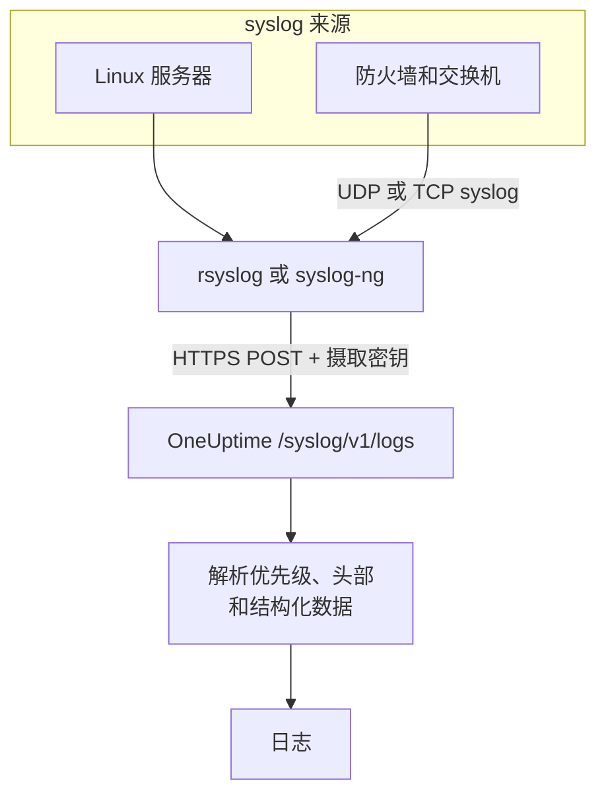

# Syslog

OneUptime 通过 HTTPS 接收 syslog。带上你的摄取密钥，把 RFC 5424 或 RFC 3164 消息发送到 `/syslog/v1/logs`，每条消息都会成为一条可搜索的日志，其优先级、设施（facility）、严重级别、主机、应用和结构化数据都会成为属性。可以用它从 rsyslog、syslog-ng 或任何能发出 HTTP 请求的中继转发日志。

:::cards
- [发送测试消息](#发送测试消息): 只需一个 `curl` 请求。
- [从 rsyslog 转发](#从-rsyslog-转发): 发送服务器或中继收到的所有内容。
- [解析出的属性](#解析出的属性): OneUptime 从每条消息中提取什么。
- [故障排除](#故障排除): 被拒绝的请求和意料之外的服务。
:::

## 工作原理



OneUptime 一读完请求中的消息就会应答，稍后再解析并保存它们。消息文本保留在日志正文中，其他所有内容都会成为属性。

> [!TIP]
> 用 OneUptime 探针监控的网络设备，可以不经中继、直接通过 UDP 把 syslog 发送到探针，日志随后会出现在 OneUptime 中该设备的页面上。参见[网络设备厂商指南(Sophos、Extreme、Cambium)](/docs/monitor/network-vendor-guides)。

## 开始之前

- **一个 OneUptime 项目**：在 OneUptime Cloud 上，遥测数据按摄取的 GB 计费，而且 Free 套餐的项目需要先添加付款方式才能发送遥测数据。
- **遥测摄取密钥**：在 **产品 → 项目设置 → 遥测与 APM → 摄取密钥** 下创建一个 **服务器** 密钥，并复制它的 **密钥**。你需要把它放在 `x-oneuptime-token` 请求头中发送。
- **syslog 转发工具**：任何能发送 HTTP POST 请求的工具（例如 `curl`、通过 `omhttp` 的 `rsyslog`，或使用 HTTP 目标的 `syslog-ng`）。
- **服务名称（可选）**：设置 `x-oneuptime-service-name` 请求头，把收到的日志归到某个特定的遥测服务下。省略时，OneUptime 会依次使用 syslog 的 `APP-NAME`、主机名或 `Syslog`。

## 端点

```http
POST https://oneuptime.com/syslog/v1/logs
```

| 请求头 | 是否必需 | 值 |
| --- | --- | --- |
| `x-oneuptime-token` | 是 | 你的摄取密钥。 |
| `Content-Type` | JSON 正文必需 | `application/json` |
| `x-oneuptime-service-name` | 否 | 日志所属的服务。 |
| `Content-Encoding` | 否 | 压缩正文时为 `gzip`。 |

如果你自托管 OneUptime，请把 `oneuptime.com` 换成你的主机。

## 请求正文

发送一个包含 `messages` 数组的 JSON。RFC 5424 和 RFC 3164（BSD）两种格式都支持，并且可以在同一个请求中混用：

```json
{
  "messages": [
    "<34>1 2025-03-02T14:48:05.003Z web-01 nginx 7421 ID47 [env@32473 host=\"web-01\"] 502 on /api/login",
    "<13>Feb  5 17:32:18 db-01 postgres[2419]: connection received from 10.0.0.12"
  ]
}
```

### 支持的正文格式

| 正文 | 发送方式 |
| --- | --- |
| 包含 `messages` 数组的 JSON 对象 | `Content-Type: application/json`，推荐。 |
| 由消息组成的 JSON 数组 | `Content-Type: application/json`。 |
| 包含一个 `message` 的 JSON 对象 | `Content-Type: application/json`。多行的值会被读取为多条消息。 |
| 以换行分隔的消息 | 用 gzip 压缩，并以 `Content-Encoding: gzip` 发送。 |

没有用 gzip 压缩的纯文本正文不会被读取，请求会以 `400` 被拒绝。用 gzip 压缩的正文总是被读取为以换行分隔的消息，所以不要压缩 JSON 正文。请让每个请求小于 1 MB：OneUptime 的入口没有为这个端点提高 nginx 默认的请求正文大小限制。

## 发送测试消息

```bash
curl \
  -X POST https://oneuptime.com/syslog/v1/logs \
  -H "Content-Type: application/json" \
  -H "x-oneuptime-token: YOUR_TELEMETRY_KEY" \
  -H "x-oneuptime-service-name: production-web" \
  -d '{
    "messages": [
      "<34>1 2025-03-02T14:48:05.003Z web-01 nginx 7421 ID47 [env@32473 host=\"web-01\"] 502 on /api/login"
    ]
  }'
```

返回 `200` 表示消息已被接受。打开 **产品 → 日志**：这条日志会出现在 `production-web` 服务中，正文为 `502 on /api/login`，严重级别为 `Error`，并带有[解析出的属性](#解析出的属性)中列出的属性。

## 从 rsyslog 转发

rsyslog 使用它的 HTTP 输出模块 `omhttp` 发送到 OneUptime。

:::steps
### 确认 `omhttp` 可用

下面的配置用 `module(load="omhttp")` 加载它。如果 rsyslog 报告无法加载该模块，请安装你的发行版中提供 `omhttp` 的软件包。

### 添加 OneUptime 目标

创建 `/etc/rsyslog.d/oneuptime.conf`。模板会把每条消息重新组装成一行 RFC 5424 格式，并包进 OneUptime 期望的 JSON 正文中：

```text title="/etc/rsyslog.d/oneuptime.conf"
module(load="omhttp")

template(name="OneUptimeJson" type="string"
         string="{\"messages\":[\"<%PRI%>1 %TIMESTAMP:::date-rfc3339% %HOSTNAME% %APP-NAME% %PROCID% %MSGID% - %msg:::json%\"]}")

action(
  type="omhttp"
  server="oneuptime.com"
  serverport="443"
  usehttps="on"
  restpath="syslog/v1/logs"
  httpheaders=[
    "x-oneuptime-token: YOUR_TELEMETRY_KEY",
    "x-oneuptime-service-name: rsyslog-demo"
  ]
  template="OneUptimeJson"
)
```

`restpath` 填写不带开头斜杠的路径。`omhttp` 默认发送 JSON 的 `Content-Type`，这正是此模板生成的格式。

### 检查配置并重启 rsyslog

```bash
sudo rsyslogd -N1
sudo systemctl restart rsyslog
```

`rsyslogd -N1` 会在不启动 rsyslog 的情况下校验配置。重启之后，新消息会出现在 **产品 → 日志** 的 `rsyslog-demo` 服务中。
:::

这个动作会转发 rsyslog 处理的每条消息：本地程序、rsyslog 读取时的 systemd 日志（journal），以及它从网络收到的一切。

### 中继网络设备的 syslog

防火墙、交换机和其他设备通常只能通过 UDP 或 TCP 发送 syslog。让它们发送到一个 rsyslog 中继，再由中继通过 HTTPS 转发。在中继的配置中，在 `action` 之前添加一个监听器：

```text title="/etc/rsyslog.d/oneuptime.conf"
module(load="imudp")
input(type="imudp" port="514")
```

把 `x-oneuptime-service-name` 设为 `perimeter-firewall` 这样的名称，或者去掉这个请求头，让每台设备的日志按主机名归类。许多设备会把消息写成 `key=value` 对；[Key=Value Parser](/docs/telemetry/log-pipelines#keyvalue-parser) 可以把它们变成属性。

:::details 批量发送，而不是每条消息一个请求
rsyslog 可以把消息批量组合并用 gzip 压缩，OneUptime 会把它读取为以换行分隔的消息。把模板和动作替换为：

```text title="/etc/rsyslog.d/oneuptime.conf"
template(name="OneUptimeLine" type="string"
         string="<%PRI%>1 %TIMESTAMP:::date-rfc3339% %HOSTNAME% %APP-NAME% %PROCID% %MSGID% - %msg%")

action(
  type="omhttp"
  server="oneuptime.com"
  serverport="443"
  usehttps="on"
  restpath="syslog/v1/logs"
  httpheaders=["x-oneuptime-token: YOUR_TELEMETRY_KEY"]
  template="OneUptimeLine"
  batch="on"
  batch.format="newline"
  compress="on"
)
```

请保留 `compress="on"`：OneUptime 只会从 gzip 压缩的正文中读取以换行分隔的消息。
:::

### 其他转发工具

- **syslog-ng**：使用它的 HTTP 目标，URL、请求头和 JSON 正文都相同。
- **Fluent Bit**：用 Fluent Bit 的 `syslog` 输入接收 syslog，再像其他日志一样转发。参见 [Fluent Bit](/docs/telemetry/fluentbit)。

## 解析出的属性

OneUptime 会自动为每条日志添加以下属性：

| 属性 | 值 | 测试消息中的值 |
| --- | --- | --- |
| `syslog.priority` | 优先级，`<PRI>` | `34` |
| `syslog.facility.code`、`syslog.facility.name` | 由优先级得出的设施 | `4`、`security` |
| `syslog.severity.code`、`syslog.severity.name` | 由优先级得出的严重级别 | `2`、`critical` |
| `syslog.version` | RFC 5424 版本 | `1` |
| `syslog.hostname` | `HOSTNAME` | `web-01` |
| `syslog.appName` | `APP-NAME`，或 RFC 3164 的标签 | `nginx` |
| `syslog.processId` | `PROCID` | `7421` |
| `syslog.messageId` | `MSGID` | `ID47` |
| `syslog.structured.raw` | 按原样保存的 RFC 5424 结构化数据 | `[env@32473 host="web-01"]` |
| `syslog.structured.*` | 结构化数据的每个参数，展开后保存 | `syslog.structured.env_32473.host` = `web-01` |
| `syslog.raw` | 原始消息，便于追溯 | 整行 |

这些属性可以在 **产品 → 日志** 浏览器中搜索，例如 `@syslog.severity.name:error` 或 `@syslog.hostname:web-01`。参见[搜索语法](/docs/telemetry/search-syntax)。

消息本身保留在日志正文中。Sophos XGS 和 Fortinet FortiGate 等防火墙会把消息写成 `key=value` 对（`log_component="IPSec" con_name="HQ-Branch1" status="Terminated"`）；在[日志管道](/docs/telemetry/log-pipelines#keyvalue-parser)中添加一个 **Key=Value Parser** 处理器，就能把这些键值对也变成属性。

### 严重级别

| syslog 严重级别 | 代码 | OneUptime 严重级别 |
| --- | --- | --- |
| Emergency、Alert | `0`、`1` | `Fatal` |
| Critical、Error | `2`、`3` | `Error` |
| Warning | `4` | `Warning` |
| Notice、Informational | `5`、`6` | `Information` |
| Debug | `7` | `Debug` |
| 消息中没有优先级 | — | `Unspecified` |

没有时间戳的消息会以 OneUptime 收到它的时间保存。

### 服务

每条日志都归属于一个遥测服务，该服务会在首次发送时由 OneUptime 创建。服务取以下各项中最先出现的一个：

1. `x-oneuptime-service-name` 请求头；
2. 消息的 `APP-NAME`（或标签）；
3. 消息的主机名；
4. `Syslog`。

## 故障排除

:::details HTTP 401
密钥缺失、未知或已过期。检查 `x-oneuptime-token` 请求头中是否带着应接收日志的项目里某个摄取密钥的 **密钥**。
:::

:::details HTTP 402 或 422
`402`：在 OneUptime Cloud 上，项目处于 Free 套餐且没有付款方式。请在 **项目设置 → 账单和发票 → 账单** 中添加。`422`：密钥已被禁用，或者是浏览器密钥。请在密钥的设置中重新打开 **已启用**，或者创建一个 **服务器** 密钥。
:::

:::details HTTP 400，或者没有出现日志
确认请求正文中确实有 syslog 行，并以 JSON 加上 `Content-Type: application/json` 发送。空正文以及没有用 gzip 压缩的纯文本正文都会以 HTTP 400 被拒绝。
:::

:::details HTTP 413
请求超过了入口所能接受的大小。每个请求少发一些消息。
:::

:::details 日志归到了意料之外的服务名称下
设置 `x-oneuptime-service-name` 以覆盖默认的判断逻辑（先用 `APP-NAME`，再用主机名）。
:::

## 后续步骤

:::cards
- [日志管道](/docs/telemetry/log-pipelines): 把 `key=value` 消息解析成属性。
- [日志记录规则](/docs/telemetry/log-recording-rules): 把 syslog 中的数字变成指标。
- [日志监控](/docs/monitor/logs-monitor): 收到匹配的 syslog 消息时发出告警。
:::
