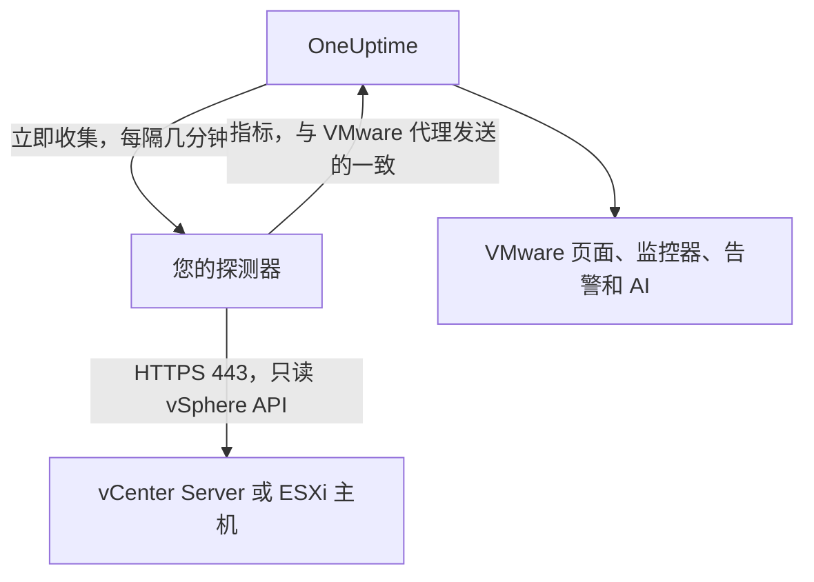

# 无需代理的 VMware

无需安装任何东西即可监控 vCenter Server 或独立 ESXi 主机：在 OneUptime 中输入 vCenter 的地址和一个只读账户，选择能够访问它的探测器，该探测器就会收集与 [VMware 代理](/docs/telemetry/vmware) 相同的数据。无需安装、升级或保持运行任何代理，也无需为其准备专用机器。

:::cards
- [开始之前](#开始之前)：一个能访问 vCenter 的探测器和一个只读账户。
- [连接 vCenter](#连接-vcenter)：四个字段、一次测试和一个名称。
- [故障排除](#故障排除)：每条消息的含义以及解决方法。
:::

## 工作原理

探测器每隔几分钟使用您保存的账户登录 vCenter，读取清单、性能计数器和 vSAN 统计信息，并将其发送到 OneUptime。这些数据的到达方式与 VMware 代理的完全相同，因此每个 VMware 页面、[VMware 监控器](/docs/monitor/vmware-monitor)、告警模板和 OneUptime AI 都以相同方式读取它们。探测器在两次收集之间保持 vCenter 会话，因此 vCenter 的事件日志不会被登录记录填满。

## 探测器还是代理？

| | 探测器（本页） | VMware 代理 |
|---|---|---|
| 您需要运行什么 | 您已在运行的探测器，或一个新探测器 | 代理，运行在专用机器上 |
| 账户保存在哪里 | 在 OneUptime 中加密保存，只发送给探测器 | 在代理的 `.env` 文件中 |
| 需要访问什么 | 从探测器通过 TCP 443 访问 vCenter | 从代理通过 TCP 443 访问 vCenter |
| 最大的 vCenter | 每次收集约 48 MiB 指标 | 无限制 |
| ESXi syslog 和 AI 代理 | 不包含 | 包含 |

两者发送相同的数据。您可以随时在 vCenter 的 **设置** 页面上将其从一种方式切换到另一种方式。

## 开始之前

- **一个能通过 TCP 443 访问 vCenter 的探测器。** 通常是位于 vCenter 网络中的 [自定义探测器](/docs/probe/custom-probe)。在 OneUptime Cloud 上，共享探测器永远不会收到 vCenter 密码，因此请添加您自己的探测器。在自托管实例上，实例自己的探测器也可以收集。
- **一个具有 Read-Only 角色的 vSphere 用户**，在顶层 vCenter 对象上授予，并勾选 **Propagate to children**。请按照 [创建只读 vSphere 用户](/docs/telemetry/vmware#create-the-read-only-vsphere-user) 操作：该账户与代理使用的账户相同。

> [!IMPORTANT]
> 如果没有勾选 **Propagate to children**，用户可以登录但什么也看不到，探测器会报告该账户无法读取 vCenter 的清单。

## 连接 vCenter

:::steps
### 打开 vCenter 列表
在 OneUptime 中打开 **VMware → 所有 vCenter**，然后点击 **连接 vCenter**。

### 输入地址和账户
输入您打开 vSphere Client 所用的地址，例如 `https://vcsa.example.com`，带域名的用户名，例如 `oneuptime@vsphere.local`，以及其密码。选择能够访问 vCenter 的探测器。

### 测试连接
在下一步中点击 **测试连接**。探测器登录、读取该账户可见的内容后注销，结果会显示它找到了多少个数据中心、集群、主机、虚拟机和数据存储。

### 信任 vCenter 的证书
vCenter 默认使用其自有证书颁发机构签发的证书，探测器不信任该证书。此时测试会显示该证书：将其指纹与 vCenter 自身的指纹核对，然后点击 **信任此证书**。

### 命名并连接
名称默认为 vCenter 的主机名。点击 **连接 vCenter** 保存。
:::

vCenter 的 **概览** 会显示一张 **数据收集** 卡片。在一分钟内开始的首次收集之前，它显示 **检查中**，之后显示 **正在收集**，清单也会随之填充。

## 证书

探测器从不跳过证书验证。每次连接都会完成完整的 TLS 握手，然后：

- 如果没有设置受信任的证书，vCenter 的证书必须来自探测器所在机器信任的证书颁发机构，并且适用于您输入的地址；
- 如果设置了受信任的证书，vCenter 必须出示正是该证书（以其 SHA-256 指纹识别）。不接受任何其他证书，即使是公开受信任的证书也不行。

要核对指纹，请在 vSphere Client 中打开 **Administration → Certificates → Certificate Management**，或在探测器所在机器上运行 `openssl s_client -connect vcsa.example.com:443 </dev/null | openssl x509 -noout -fingerprint -sha256`。

当 vCenter 的证书续期后，收集会以 **vCenter 的证书已更改** 停止，并显示新证书。在您于 vCenter 的 **概览** 或 **设置** 页面上信任它之前，不会向 vCenter 发送任何内容。

## 已保存的密码

密码经过加密且只写：任何人都无法读回，API 也从不返回它。它只发送给收集该 vCenter 的探测器，探测器将其保存在内存中。

已保存的密码只会发送到当初输入它时所针对的地址、经由当时的探测器、并且只发给当时的证书。更改地址、探测器或受信任的证书都会要求重新输入密码，因此任何能够编辑该 vCenter 的人都无法把密码发送到别处。信任探测器在已保存地址上找到的证书时，密码会保留。

## 在代理和探测器之间切换

打开 vCenter 的 **设置** 页面。其 **数据收集** 卡片为由代理发送数据的 vCenter 提供 **使用探测器收集**，为由探测器收集的 vCenter 提供 **使用 VMware 代理**。切换到代理会删除已保存的密码。

> [!WARNING]
> 探测器的首次收集成功后，请停止 VMware 代理。两者同时运行期间，每个指标都会收到两次。

## 参考

| 设置 | 默认值 | 说明 |
|---|---|---|
| 收集间隔 | 2 分钟 | 1 到 60 分钟。对大型 vCenter 可降低收集频率，以减轻其负载。 |
| 同时进行的收集 | 每个探测器 4 个 | 耗时超过其间隔的收集会被跳过，绝不会堆积。 |
| 最大收集量 | 约 48 MiB | 更大的 vCenter 需要使用 VMware 代理。 |
| 连接测试 | 90 秒内开始 | 没有探测器及时领取、或运行超过 2 分钟的测试，会被判定为失败。 |

## 故障排除

:::details vCenter 的证书不受信任
vCenter 出示的是其自有证书颁发机构签发的证书。将显示的指纹与 vCenter 的证书核对，然后点击 **信任此证书**。
:::

:::details vCenter 拒绝了登录
使用带域名的完整用户名，例如 `oneuptime@vsphere.local`，并检查密码以及账户是否被锁定。可在 vCenter 的 **设置** 页面上通过 **编辑连接** 修改。
:::

:::details 该用户无法读取 vCenter 的清单
在顶层 vCenter 对象上为该用户授予 Read-Only 角色，并勾选 **Propagate to children**。
:::

:::details 探测器收不到 vCenter 的响应
探测器所在网络无法通过 TCP 443 访问 vCenter。请在防火墙中放行该流量，或选择位于 vCenter 网络中的探测器。
:::

:::details 探测器未领取此任务
探测器处于离线状态，或运行的 OneUptime 版本早于 VMware 收集功能。请在 **自定义探针** 表中确认它已连接，并更新它。
:::

:::details 此 vCenter 太大，无法由探测器收集
其指标超出了探测器单次上传的大小上限。请对此 vCenter 使用 [VMware 代理](/docs/telemetry/vmware)。
:::

## 后续步骤

:::cards
- [VMware 监控器](/docs/monitor/vmware-monitor)：针对主机、虚拟机、数据存储和集群的告警。
- [自定义探测器](/docs/probe/custom-probe)：在 vCenter 网络中运行探测器。
- [VMware 代理](/docs/telemetry/vmware)：改用代理收集 vCenter。
:::
