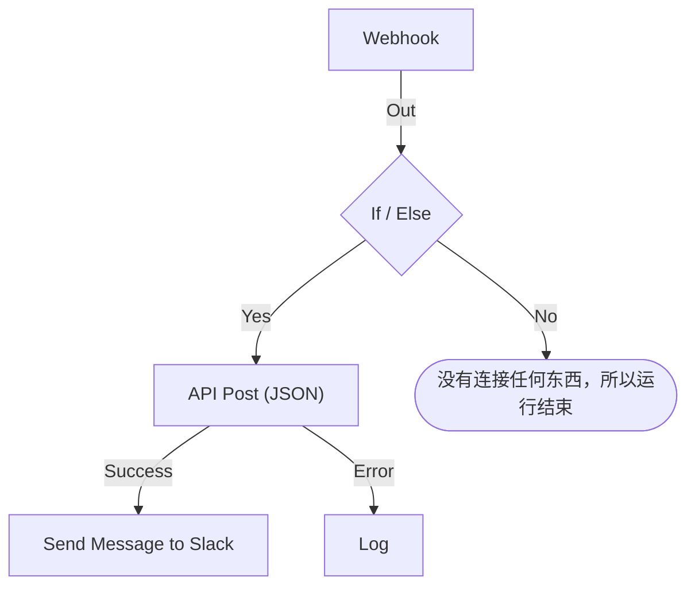

# 创建工作流

你在工作流的 **生成器** 中搭建它：这是一块画布，你在上面添加块、连接它们并填写它们的设置。本页介绍如何创建工作流、[添加块](#添加块)、[连接](#连接块) 和 [配置](#配置块) 块、[在块之间传递值](#使用前面块的值)，以及 [开启工作流](#开启它)。

要创建工作流，打开 **工作流** 并点击 **创建工作流**。**创建工作流** 对话框会先问你要如何开始，然后问名称。需要自己设置的模板（例如 Slack Webhook URL）会在额外的一步中询问这些设置，并把它们保存为工作流变量，这样你以后无需编辑工作流就能更改。

选择如何开始：

- 对话框顶部的 **从零开始** 会给你一块空白画布。大多数工作流都从这里开始。
- **或者从模板开始** 会显示几个 **推荐** 模板。要找其他模板，在搜索框旁选择一个类别，例如 **事件**、**监视器** 或 **Jira**，或者 **全部模板**，也可以在 **搜索模板…** 中输入。你输入的每个词都必须匹配。

点击一个模板，查看它做什么：它的触发器、它由哪些块组成，以及它会询问哪些设置。然后点击 **使用此模板**，或双击该模板。在搜索框中，方向键选择模板，**Enter** 使用它。`/` 会把你带回搜索框。

工作流创建时处于关闭状态，因此在你开启之前什么都不会运行。新工作流会在 **生成器** 中打开，也就是你设计它的画布。

## 画布

从零开始的工作流打开时只有一个写着 **Choose what starts this workflow** 的虚线块。这个块就是起点——点击它来选择触发器。从模板创建的工作流打开时，块已经就位。

每个工作流顶部恰好有一个 **触发器**。其他一切都是做某件事的 **组件**。要更换触发器，删除它：虚线占位块会回到原位，点击它即可选择另一个。删除块时，它的连线也会被删除，因此请把新触发器重新连接到第一个块。

更改会自动保存。工具栏中的一个标记会显示状态：更改发送途中显示 **正在保存…** ，之后显示 **已保存**，失败时显示 **无法保存**。画布没有保存按钮，也没有单独的发布步骤。

## 添加块

| 要添加                 | 点击                                                           | 打开的面板                    |
| ---------------------- | -------------------------------------------------------------- | ----------------------------- |
| 触发器                 | 虚线占位块                                                     | **Add Trigger**               |
| 其他任何块             | 画布上方工具栏中的 **添加组件**                                | **添加组件**                  |

两个面板都会先在 **Popular** 下显示大多数工作流使用的块，后面是其余的内置块。在 **OneUptime resources** 下点击一个资源，例如 **事件**，查看可以用它做什么；**Browse all resources** 会列出全部资源。也可以搜索：输入几个词，例如 `create incident`，最佳匹配会排在最前面。按 `/` 跳到搜索框，用方向键在结果之间移动，按 **Enter** 添加高亮的块。点击块也会添加它。

新块会放在画布最下方那个块的下面，新的触发器会取代顶部虚线块的位置。新块处于选中状态；如果它落在视野之外，画布会滚动到刚好能显示它的位置。它的设置不会自动打开：准备好配置时再点击这个块。在必填设置填好之前，它上面会显示 **Click to set up**。

把块拖到任意位置；拖动时画布会把它们对齐到网格。块的位置会被保存，因此下一个人看到的布局与你离开时相同。

## 块上有什么

| 字段                                  | 作用                                                                                                                                                                                                                                                                                                          |
| ------------------------------------- | ------------------------------------------------------------------------------------------------------------------------------------------------------------------------------------------------------------------------------------------------------------------------------------------------------------- |
| **Identifier**（在 **ID** 下）        | 块上显示的短 ID，例如 `log-1`。其他块就是用它来引用这个块的，所以如果你改了它，所有指向它的 `{{local.components.…}}` 引用都会失效。块的标题是组件自身的名称，无法更改。                                                                                                                                     |
| **设置**                              | 块完成工作所需的东西——URL、Slack 频道、消息文本。可选字段标有 **（可选）** ；其余都是必填的。开关两者都不标，因为它总有一个值。不常用的设置折叠在 **更多字段** 下，其标题会列出这些设置，并显示已填写的设置。                                                                                             |
| **Input**                             | 顶部边缘的点，来自前面块的连线从这里进入。触发器没有这个点——在它们之前不会运行任何东西。                                                                                                                                                                                                                      |
| **Outputs**                           | 沿底部边缘排列的点，正上方带有标签，连线从这里通向下一个块。许多块都有单独的 **Success** 和 **Error** 输出，这样你可以分别处理两种情况。                                                                                                                                                                   |

## 连接块

从一个块底部的点拖到下一个块顶部的点。你画的线决定接下来运行什么。

- 从 **Success** 连接，下一个块只在前一个块成功时运行。
- 从 **Error** 连接，下一个块只在前一个块失败时运行。
- 不连接某个输出，那条路径就直接结束。

一个输出可以连接到多个块。它们都会运行——但是依次运行，在同一个队列中，而不是并行。不要依赖分支之间的顺序，也不要假定它们在时间上会重叠。

每个块在一次运行中最多运行一次。通向已经运行过的块的连线——在画布上往回连，或在第一个分支到达该块之后从另一个分支连过去——会以错误停止运行，因此工作流不会陷入循环。

## 配置块

点击块会在对话框中打开它的设置，或者用 **Tab** 移到它上面再按 **Enter**。填写设置，然后点击 **保存**。

每个设置都有与其值相适应的输入控件：

| 设置的内容                                       | 你会得到                                                                       |
| ------------------------------------------------ | ------------------------------------------------------------------------------ |
| 文字：消息、提示词、要记录的值                   | 随输入而变高的输入框。**Enter** 另起一行。                                     |
| 短值：URL、ID、主题行                            | 单行输入框。                                                                   |
| 代码或 HTML                                      | 代码编辑器。                                                                   |
| JSON                                             | JSON 编辑器。                                                                  |
| 开或关                                           | 旁边带有名称的开关。点击开关或名称即可切换。                                   |

对话框会打开在你最可能想看的内容上。对于 **Webhook** 触发器，那是它的 URL，带有 **复制 URL** 按钮、它接受的方法和一个示例请求。对于 **Manual** 触发器，那是如何启动工作流。其他块都会打开在它的设置上。没有设置的块根本没有 **设置** 部分。

在它下面，从上到下依次是：

- **ID**、**Inputs** 和 **Outputs** 并排显示——块的标识符、从哪里到达它，以及之后运行什么。
- **Returns** —— 这个块传给后续步骤的数据。每个值都显示读取它的确切引用，并带有一个复制按钮。
- **How to use** —— 用一句话说明块做什么、配置步骤、可复制的示例，以及人们常犯的错误。示例根据你的工作流生成：在把数据放进消息的地方，它使用这个块的 ID 和触发器的值。**Learn more** 打开更长的说明，链接指向完整的指南。每个块都有这一部分，对话框顶部的 **How to use** 按钮可以直接跳到这里。

底部是：

- **删除** —— 移除这个块。它会先询问，并按类型和标识符说明是哪个块，例如 **Send Email (send-email-2)** ，这样你就知道几个相同的块中是哪一个会消失。
- **Run just this step** —— 只运行这一个块，不运行工作流的其余部分。它本应从其他步骤读取的值到达时为空，而它发送、写入或删除的一切都会真实发生。它会跳过该块之前的所有条件，因此只有允许编辑工作流的人才能使用它。

### 使用前面块的值

大多数设置都可以使用前面块的值或变量——数据就是这样从一个块流向下一个块的。每个这样的设置末尾都有一个 **{ }** 按钮。它会打开一个可用值的列表：每个前面的块按名称列出，并列出它返回的每个值——名称、内容和类型——然后是工作流的变量和全局变量。搜索列表，用鼠标或方向键加 **Enter** 选择一个，值就会插入到光标所在的位置。

在设置中，值显示为一个标签，例如 **Webhook › Request Body**。把指针悬停在上面，可以看到它代表的引用 `{{local.components.webhook-1.returnValues.request-body}}`，保存的就是这个引用。光标会一步跳过一个标签，**Backspace** 会整个删除它，复制它会复制引用。如果你熟悉语法，也可以直接输入 `{{`：同一个列表会在设置下方打开，并随着输入逐步缩小。

- **只提供将会存在的值。** 也就是触发器和在这个块之前运行的块。之后才运行的块还没有任何输出。在块连接之前，只显示触发器的值，列表也会这样说明。
- **记录会展开为它的字段。** Find One 或 On Create 块返回整条记录。选择它即可看到字段，块的 **Select Fields** 读取的字段排在最前面。JSON 值或一组标头会打开为一个字段，你在其中输入路径，例如 `title` 或 `alerts[0].status`。
- **块运行过一次之后，列表就知道它的值里有什么。** 每个值都会显示它在最近一次运行中包含的内容——`"production"` 或 `3 fields`——JSON 值或一组标头会展开为它当时拥有的字段，每个字段都带有内容。因此，你可以从 Webhook 的 **Request Body** 中选择 **incident.title**，而不必输入路径。搜索也能找到这些字段：输入 `title`，或输入 `{{` 和路径的开头。记录的字段也会显示它们包含的内容。字段来自最近一次运行，所以后来的请求省略的字段在那次运行中为空。看起来像密钥的值，例如 `Authorization` 标头、令牌或密码，显示时不带内容。
- **还没有收到请求的 Webhook 会如实说明，** 在它的值的顶部，并提供 **Copy test request**：一条向工作流的 Webhook URL 发送 `{"message": "Hello"}` 的 `curl` 命令。在列表打开时到终端中运行它，一旦它启动的那次运行结束（通常在几秒内），请求的字段就会出现在列表中。工作流必须处于启用状态，否则请求会被拒绝。只有允许查看 Webhook URL 的人才会看到这个按钮。还没有收到邮件的 Incoming Email 触发器会在同一位置说明这一点；向它的地址发一封邮件，它的标头和附件就会以同样的方式出现。
- **代码编辑器的工具栏中有 Insert value。** 在 JSON 中，它会补上值在文档中需要的引号。**Run Custom JavaScript** 通过它的 **Arguments** 读取值，因此它的代码没有选择器。
- **数字、密码、开关和日期保留自己的控件，** 旁边有 **{ }**。选中的值会替换控件，**abc** 会切回输入。

当标签读取的东西不存在时，它会变成橙色：已重命名或已删除的块、块不返回的值、之后才运行的块，或者不存在的变量。它的提示会说明是哪一种。引用语法参见 [变量](/docs/workflows/variables)。

## 边搭建边检查

每次你更改时，生成器都会检查整个图，并在工具栏的一个标记中报告发现的问题。点击标记会打开 **Problems with this workflow**，列出每个问题并带你到相应的块。在画布上，必填设置仍为空的块上会显示 **Click to set up**，有其他问题的块会在角上带一个徽标：红色表示错误，橙色表示警告。把指针悬停在徽标上即可读到问题所在。

它能发现那些直到运行出错才会暴露的错误：

- 没有触发器的工作流；
- 两个块使用相同的 ID，或者 ID 中带有句点；
- 没有任何东西连接到它的块；
- 留空的必填设置；
- 无效的 JSON；
- `{{ }}` 内的空格；
- 引用了不存在的步骤或返回值。

有一件事它无法检查：变量名是否存在。块的设置可以——引用不存在的变量会在那里显示为橙色标签。在其他任何地方，改了名的变量只会在运行的日志中显现出来。

## 你的第一个工作流

熟悉画布最快的方法，是一个手动启动、只有两个块的工作流：

:::steps
1. 点击虚线占位块，然后在 **Add Trigger** 面板中点击 **Manual**。
2. 点击 **添加组件**，然后点击 **Popular** 下的 **日志**。新块会放在触发器下面。把触发器的 **Execute** 点向下连接到 Log 块的输入点。
3. 点击写着 **Click to set up** 的 Log 块，在它的 **Value** 中输入 `Hello from `。点击 **{ }**，然后点击 **Manual** 下的 **JSON**。设置会显示 **Manual › JSON**，并保存 `{{local.components.manual-1.returnValues.value}}`。`manual-1` 是触发器的 **Identifier**，显示在触发器块上。点击 **保存**。
4. 在生成器顶部打开 **已启用**。已禁用的工作流根本无法运行，手动也不行；如果跳过这一步，**运行工作流** 会先要求你开启它。
5. 回到 **生成器**，点击 **运行工作流**，在 **JSON** 字段中输入 `{ "name": "Ada" }`，点击 **Run Workflow Manually**，然后用 **Run** 确认。
6. **工作流运行** 面板会自动打开并跟随这次运行。日志显示 `Value:`，后面跟着 `Hello from { "name": "Ada" }`。
:::

这个循环——添加、连接、配置、运行、读日志——就是你搭建每个工作流的方式。

> [!TIP]
> 在 **运行工作流** 中输入的 JSON 会以你输入的文本形式到达 Manual 触发器。要读取其中的字段，例如 `name`，添加一个 **Text to JSON** 块，把触发器的 **JSON** 放进它的 **Text**，然后从那个块的 **JSON** 中读取字段：`{{local.components.text-to-json-1.returnValues.json.name}}`。

## 开启它

新工作流一开始处于禁用状态，你复制或导入的任何工作流也是如此。工作流关闭时，生成器会在画布上方说明这一点，并显示 **开启工作流** 按钮。

**已启用** 开关位于 **生成器** 顶部，挨着 **添加组件** 和 **运行工作流**。它也在工作流的 **概览** 页面上，该页面的 **工作流详情** 卡片用绿色的 **已启用** 标记或红色的 **已禁用** 标记显示当前状态：点击 **编辑工作流** 并打开 **更多字段**。只有允许编辑工作流的人才能开启或关闭它；其他人看到的开关是灰色的。

已禁用的工作流无论怎样启动都根本无法运行：

| 启动方式                                                   | 工作流关闭时                                                                                                                                                                              |
| ---------------------------------------------------------- | ----------------------------------------------------------------------------------------------------------------------------------------------------------------------------------------- |
| 它的触发器：计划、OneUptime 事件或邮件                     | 被忽略。                                                                                                                                                                                  |
| **运行工作流** 或 **Run just this step**                   | 生成器会改为询问 **开启此工作流？** 。**开启并运行**（或 **开启并运行步骤**）会开启工作流，然后用你提供的值运行你要求的内容。                                                            |
| 调用它的 Webhook URL                                       | 以 HTTP 400 和 "This workflow is turned off, so it can't run. Turn it on with the Enabled switch at the top of its Builder, then try again." 拒绝。                                        |
| 另一个工作流的 **Execute Workflow** 块                     | 那个块会走它的 **Error** 路径，错误中会写明它调用的工作流。                                                                                                                               |

所以顺序是：搭建它，用 **运行工作流** 测试它，读运行的日志，如果还没准备好让它的触发器触发，就再把 **已启用** 关掉。要只测试一个块而不运行整个工作流，请在那个块的设置中使用 **Run just this step**。

要暂停工作流而不删除它，关闭 **已启用**。不会再启动新的运行。正在进行的运行会完成，但停在 **Sleep** 块上的运行会在醒来时被取消，并记录为错误。

## 整理

- 拖动块来移动它们。布局会被保存。
- 要删除一条线，把它的一端从点上拖开，放到画布的空白处。
- 要删除一个块，点击它，然后使用其设置对话框底部的 **删除**。选中一个块或一条线后按 Backspace 也会删除它。
- 无法只复制单个块。工作流 **设置** 页面上的 **复制工作流** 会复制整个工作流。副本的名称会自动填好，编号接在项目已有工作流之后（"Nightly Sync" 会复制为 "Nightly Sync 2"），副本打开时处于禁用状态。
- 把块从上到下排列，让它们按运行的方向阅读——输入在顶部边缘，输出在底部边缘，所以流程自然向下。

## 后续步骤

:::cards
- [触发器](/docs/workflows/triggers): 启动工作流的五种方式。
- [组件](/docs/workflows/components): 你可以添加的每一种块，以及它们的设置和输出。
- [变量](/docs/workflows/variables): 在块之间传递数据，并把密钥放在它们之外。
- [运行记录](/docs/workflows/runs-and-logs): 逐步检查每次运行做了什么。
:::
