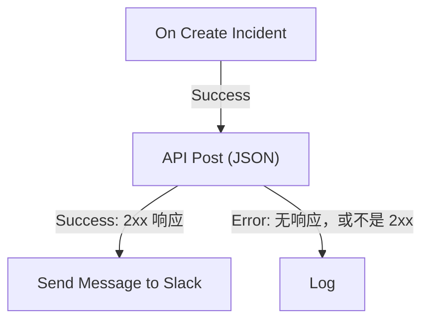

# 工作流组件

组件是你在触发器之后添加的块。每个组件只做一件事——发送消息、调用 API、检查条件、更改 OneUptime 记录——然后选择它的一个输出，进入连接到该输出的块。本页是目录：每个块需要什么、返回什么，以及何时选择哪个输出。

搭建时你很少需要一直开着本页。每个块的设置末尾都有 **How to use**：块做什么、配置步骤、根据你自己的工作流生成的示例，以及人们常犯的错误。关于添加和连接块，参见 [创建工作流](/docs/workflows/authoring)。

:::cards
- [发送消息](#slack): Slack、Microsoft Teams、Discord、Telegram、IRC 和邮件。
- [调用 API](#api): 向任意 HTTP API 发送请求并读取响应。
- [添加逻辑](#conditions): 按值分支、转换数据、等待或记录日志。
- [处理 OneUptime 记录](#oneuptime-数据组件): 查找、创建、更新和删除监视器、事件等。
:::

## 我该用哪个组件？

| 想要……                                                        | 使用                                                              |
| ------------------------------------------------------------- | ----------------------------------------------------------------- |
| 在聊天工具中发帖                                              | [Slack](#slack)、[Microsoft Teams](#microsoft-teams)、[Discord](#discord)、[Telegram](#telegram) 或 [IRC](#irc) |
| 通过你自己的邮件服务器发送邮件                                | [Email](#email)                                                   |
| 调用其他任何 API 或你自己的服务                               | [API](#api)                                                       |
| 总结、分类或起草文本                                          | [Generate Text with AI](#generate-text-with-ai)                   |
| 根据某个值走这条或那条路径                                    | [Conditions](#conditions)                                         |
| 在两个块之间转换数据                                          | [JSON](#json) 或 [Custom Code](#custom-code)                      |
| 在下一个块之前等待                                            | [Sleep](#sleep)                                                   |
| 启动另一个工作流                                              | [Execute Workflow](#execute-workflow)                             |
| 读取或更改事件、监视器和其他记录                              | [OneUptime 数据组件](#oneuptime-数据组件)                  |

专用块胜过通用块：Slack 块知道 Slack 的限制，记录块知道记录的字段，因此你得到的错误和日志比用一个 **API** 块做同样的事更清楚。

## 每个块的工作方式

当前一个块选择了连接到某个块的输出时，这个块就会运行。它读取自己的设置，完成工作，然后选择它的一个输出。接下来只运行连接到该输出的块。



- **设置** 是你要填写的内容。标有 **（可选）** 的设置可以留空。不常用的设置折叠在 **更多字段** 下。
- **Outputs** 是底部边缘的点。大多数块有 **Success** 和 **Error**；[Conditions](#conditions) 有 **Yes** 和 **No**。
- **Returns** 是块传给后续块的值，例如 API 的 **Response Body**。后续块用 `{{local.components.<block ID>.returnValues.<value ID>}}` 读取；设置中的 **{ }** 按钮会替你插入。参见 [变量](/docs/workflows/variables#组件输出来自前面块的数据)。

选择了 **Error** 的块不会让运行失败：运行会沿着 **Error** 路径继续，如果没有连接任何东西就在那里结束。而留空的必填设置，或者永远不可能生效的设置，会以错误停止运行。

## API

向任意 URL 发出 HTTP 请求。每种方法都有一个块：**API Get (JSON)**、**API Post (JSON)**、**API Put (JSON)**、**API Patch (JSON)** 和 **API Delete (JSON)**。

| 设置                | 作用                                                                                                                                 |
| ------------------- | ------------------------------------------------------------------------------------------------------------------------------------ |
| **URL**             | 要调用的地址，`http` 或 `https`。                                                                                                    |
| **Request Body**    | 要发送的 JSON。通常只有 `POST`、`PUT` 和 `PATCH` 请求需要。                                                                          |
| **Request Headers** | 要一并发送的标头，例如 API 密钥。位于 **更多字段** 下。它们的值在运行的日志中会被隐藏。                                              |

| 输出        | 何时                                                                                           |
| ----------- | ---------------------------------------------------------------------------------------------- |
| **Success** | 服务器以 2xx 状态响应。                                                                        |
| **Error**   | 请求失败：无法连接到服务器，或者它以其他状态响应。                                             |

无论哪种情况，块都会返回 **Response Status**、**Response Headers** 和 **Response Body**，失败时还会返回带有原因的 **Error**。要读取 JSON 响应中的字段，把它的名称加到引用后面，例如 `{{local.components.api-get-1.returnValues.response-body.id}}`。

重定向不会被跟随，所以请把块指向真正应答的地址。请求从 OneUptime 发出：解析为私有网络地址的 URL 会被拒绝，除非自托管管理员允许，运行会带着原因停止。参见 [出站网络访问](/docs/workflows/configuration#出站网络访问)。

## AI

### Generate Text with AI

根据提示词和可选的 JSON 上下文生成一条文本回复。块使用项目的默认 LLM 提供商，项目没有时使用安装的全局提供商。提供商在 **项目设置 → 人工智能 → LLM 提供商** 中集中配置；它们的密钥和端点从来不是块的设置。

| 设置                      | 作用                                                                                                                                                              |
| ------------------------- | ----------------------------------------------------------------------------------------------------------------------------------------------------------------- |
| **System Instructions**   | 关于模型角色、语气和约束的可选指导。                                                                                                                             |
| **Prompt**                | 任务。它会按你写的原样发送，所以可以用 Markdown，也可以包含变量和前面块的值。                                                                                     |
| **Context**               | 你有意一并发送的可选 JSON。它附加在一个明确的消息结尾标记之后，并被视为不可信的数据。                                                                             |
| **Temperature**           | 位于 **更多字段** 下。取值从 `0` 到 `1` 的随机程度；默认值是 `0.2`，适合可预测的自动化。当前的 Claude 模型（Opus 4.7 及更高版本，以及所有 Claude 5 模型）会自行选择采样方式：OneUptime 会在发给它们的请求中省略 **Temperature**，因此它对这些模型没有作用。 |
| **Maximum Output Tokens** | 位于 **更多字段** 下。从 `1` 到 `4096`；默认值是 `1024`。                                                                                                        |

System Instructions、Prompt 和序列化后的 Context 合计不超过 50,000 个字符。以 base64 嵌入其中的图像，例如事件描述中合成监视器的截图，会在计算长度之前被替换为一条简短的说明，例如 `[image omitted: PNG, 340 KB]`，因为模型读取的是文本而不是图像。运行的日志会说明省略了什么。对提供商的请求最长持续 60 秒，只尝试一次。每个项目最多可以同时运行三个工作流 AI 请求。

它返回 **Response**（生成的文本）、**Provider** 和 **Model**（作出回答的是谁）、**Total Tokens** 和 **Completion Tokens**（提供商报告的用量）、**LLM Log ID**（该调用在 AI 日志中的条目）以及 **Error**。

把 **Success** 连接到使用回复的块，把 **Error** 连接到备用方案：验证、访问、提供商、预算、计费和超时失败都会走这条路径。块不会发送任何工具，因此模型无法自行查询 OneUptime、调用 API 或更改数据。

> [!WARNING]
> 模型输出是不可信的文本。在它到达客户之前进行审核，并且永远不要让自由形式的 AI 文本单独决定一个破坏性操作。关于发送给提供商的内容、日志记录的内容以及费用，参见 [AI 组件](/docs/workflows/configuration#ai-组件)。

## Slack

通过传入 Webhook 向 Slack 频道发送消息。

| 设置                           | 作用                                                                                                                                                                                                         |
| ------------------------------ | ------------------------------------------------------------------------------------------------------------------------------------------------------------------------------------------------------------ |
| **Slack Incoming Webhook URL** | 要发帖的频道的 Webhook。它必须以 `https://hooks.slack.com/services/` 开头。Slack 关于 [创建 Webhook](https://api.slack.com/messaging/webhooks) 的指南只需几分钟。                                           |
| **Message Text**               | 要发送的文本。它会按你写的原样发送，所以请使用 Slack 自己的格式：`*bold*`、`_italic_`、`~strikethrough~` 和 `<https://example.com|a link>`。长于一个 Slack 区块（3,000 个字符）的文本会分成多个区块发送；超过十个区块时会被截断，并以 "… (truncated — see OneUptime for the full text)" 结尾。 |

Slack 接受消息时触发 **Success**，Slack 拒绝时触发 **Error**，Slack 给出的原因放在 **Error** 中。这些块通过它们设置中的 Webhook 发帖，而不是通过项目的 Slack 连接。

## Microsoft Teams

向 Microsoft Teams 频道发送消息。这个块叫 **Send Message to Teams**。

| 设置                           | 作用                                                                                                                                                                                                                                          |
| ------------------------------ | --------------------------------------------------------------------------------------------------------------------------------------------------------------------------------------------------------------------------------------------- |
| **Teams Incoming Webhook URL** | 要发帖的频道的 Webhook，是 `office.com`、`office365.com`、`logic.azure.com` 或 `environment.api.powerplatform.com` 上的 `https` URL。Microsoft 的指南介绍了如何 [用 Teams Workflows 创建一个](https://support.microsoft.com/en-us/teams/apps-service/create-incoming-webhooks-with-workflows-for-microsoft-teams)。 |
| **Message Text**               | 要发送的文本。超过传入 Webhook 所能接受大小（按发送时计算约 12,000 个字符）的消息会被截断，并以 "… (truncated — see OneUptime for the full text)" 结尾。                                                                                       |

## Discord

通过传入 Webhook 向 Discord 频道发送消息。

| 设置                             | 作用                                                                                                                                               |
| -------------------------------- | -------------------------------------------------------------------------------------------------------------------------------------------------- |
| **Discord Incoming Webhook URL** | 频道的 Webhook，是 `discord.com` 或 `discordapp.com` 上的 `https` URL。                                                                            |
| **Message Text**                 | 要发送的文本。超过 Discord 上限 2,000 个字符的消息会被截断，并以 "… (truncated — see OneUptime for the full text)" 结尾。                           |

## Telegram

用机器人向 Telegram 聊天发送消息。

| 设置                   | 作用                                                                                                                                               |
| ---------------------- | -------------------------------------------------------------------------------------------------------------------------------------------------- |
| **Telegram Bot Token** | BotFather 给你的机器人的令牌，例如 `123456789:ABCdef…`。任何其他形式的令牌都会停止运行，且不会把令牌写入日志。                                     |
| **Chat ID**            | 要发帖的聊天：它的 ID，或频道的 `@username`。先把机器人加入群组或频道。要给个人发消息，对方必须先与机器人开始聊天。                                 |
| **Message Text**       | 要发送的文本。超过 Telegram 上限 4,096 个字符的消息会被截断，并以 "… (truncated — see OneUptime for the full text)" 结尾。                          |

Telegram 拒绝消息时，**Error** 会带着 Telegram 的原因触发。

## IRC

向任意 IRC 网络上的 IRC 频道发送消息：Libera.Chat、OFTC 或你自己的服务器。IRC 没有 Webhook，所以块会自己连接到服务器，加入频道，发送消息，然后离开。

| 设置             | 作用                                                                                                                                                                                                                                               |
| ---------------- | -------------------------------------------------------------------------------------------------------------------------------------------------------------------------------------------------------------------------------------------------- |
| **IRC Server**   | 服务器的主机名，例如 `irc.libera.chat`。只写名称：不带 `ircs://`，也不带端口。                                                                                                                                                                     |
| **Channel**      | 要发帖的频道，例如 `#ops`。必须是频道：在这里输入的昵称会被拒绝，而不是收到一条私信。                                                                                                                                                              |
| **Message Text** | 要发送的文本。每一行作为一条单独的 IRC 消息发送，过长的行会被拆分以适应长度。一条消息最多以 15 行 IRC 发送：更长的会被截断，最后一行会说明这一点。IRC 没有 Markdown，所以文本按原样发送；IRC 自己的格式代码（例如粗体和颜色）可以使用。 |

位于 **更多字段** 下：

| 设置                                     | 作用                                                                                                                                                                                                               |
| ---------------------------------------- | ------------------------------------------------------------------------------------------------------------------------------------------------------------------------------------------------------------------ |
| **Nickname**                             | 消息的发送者。默认是 `OneUptime`。如果昵称已被占用，块会尝试在后面加下划线或数字，对于不接受更长昵称的服务器，则用这样的字符替换最后几个字符。                                                                     |
| **Port**                                 | 服务器的端口。默认是 `6697`，开启 **Disable TLS** 时是 `6667`。                                                                                                                                                    |
| **Disable TLS**                          | 块通过 TLS 连接并检查服务器的证书。只有当服务器不提供 TLS 时才开启它；这时如果有密码，会以未加密的方式发送。要信任你自己的证书颁发机构签发的证书，自托管安装应改为设置 `NODE_EXTRA_CA_CERTS`。                   |
| **Channel Key**                          | 设有密钥的频道（模式 `+k`）的密钥。                                                                                                                                                                                |
| **Send Without Joining**                 | 不加入频道就发帖，这样频道里看不到块的进出。只在频道接受外部消息（没有模式 `+n`）时有效。                                                                                                                          |
| **Server Password**                      | 服务器或你的 bouncer 在连接时要求的密码。                                                                                                                                                                          |
| **SASL Username** 和 **SASL Password**   | 在使用 SASL 的网络上登录你的账户，例如 Libera.Chat，它对来自某些云和 VPN 地址的连接要求 SASL。两者都填或都不填。                                                                                                   |

服务器接受了每一行时触发 **Success**。块会在最后一行之后请求服务器回应一次 ping 来确认这一点：服务器按顺序回应，所以如果消息被拒绝，拒绝会先到。像 ZNC 这样的 bouncer 会自己回应 ping，因此块会多等一秒，等待它背后网络的回应。

无法连接到服务器，或服务器拒绝连接、昵称、密码或频道，或者拒绝消息时，触发 **Error**。它会传下原因，服务器给出了原话就用服务器的原话。而缺少 **IRC Server**、**Channel** 或 **Message Text**，或者某个设置永远不可能生效，会停止运行。

块的每次运行都是一个独立的连接，而 IRC 网络会限制同一个地址的连接频率：一阵消息可能会以 "Reconnecting too fast" 这样的原因被拒绝，并像其他拒绝一样走 **Error**。对于一分钟内可能触发很多次的工作流，请把要说的话合并成一条消息，或者通过你自己的服务器发送。

把密码保存在 [秘密全局变量](/docs/workflows/variables#全局变量) 中，并在设置里使用该变量；无论如何它们在运行日志中都会被隐藏。到回环地址（`localhost`、`127.0.0.1`）、链路本地地址和云元数据地址的连接会被拒绝。在 OneUptime Cloud 上，位于私有网络地址的服务器，或解析到这类地址的名称，也会被拒绝。自托管安装可以连接到它们自己网络中的 IRC 服务器，除非 `DATA_SOURCE_BLOCK_PRIVATE_ADDRESSES` 被设置为 `true`。

## Email

通过你在块上指定的 SMTP 服务器发送邮件。这个块叫 **Send Email**。

| 设置                                    | 作用                                                                                                  |
| --------------------------------------- | ----------------------------------------------------------------------------------------------------- |
| **From Email**                          | 发件人，例如 `Alerts <alerts@company.com>`。                                                          |
| **To Email**                            | 收件人的地址。多个地址用逗号或分号分隔。                                                              |
| **Subject**                             | 主题行。                                                                                              |
| **Email Body**                          | 以 HTML 形式发送的消息。                                                                              |
| **SMTP HOST** 和 **SMTP Port**          | 要连接的邮件服务器。                                                                                  |
| **SMTP Username** 和 **SMTP Password**  | 可选。两者都填或都不填。                                                                              |
| **Use Implicit TLS**                    | 对隐式 TLS（通常是端口 465）开启。对 STARTTLS（通常是端口 587）保持关闭。                              |

SMTP 服务器接受了消息时触发 **Success**。SMTP 主机被拒绝、无法连接到服务器或服务器拒绝消息时触发 **Error**，并传下错误消息。而缺少 **To Email**、**From Email**、**SMTP HOST** 或 **SMTP Port** 会停止运行。

块会直接连接到它设置中的服务器。它不使用项目的 [SMTP](/docs/emails/smtp) 设置或 OneUptime 自己的邮件服务器，它发送的邮件也不会出现在通知日志中。要检查它做了什么，请查看工作流的 [运行记录](/docs/workflows/runs-and-logs)。

到回环地址（`localhost`、`127.0.0.1`）、链路本地地址和云元数据地址的连接会被拒绝。在 OneUptime Cloud 上，位于私有网络地址的 SMTP 主机，或解析到这类地址的名称，也会被拒绝。自托管安装可以连接到它们自己网络中的邮件服务器，除非 `DATA_SOURCE_BLOCK_PRIVATE_ADDRESSES` 被设置为 `true`。被拒绝的主机会走 **Error** 输出，什么都不会发送。

## Custom Code

当其他块做不到你需要的事情时，运行几行 JavaScript。这个块叫 **Run Custom JavaScript**。

| 设置                | 作用                                                                                                                                 |
| ------------------- | ------------------------------------------------------------------------------------------------------------------------------------ |
| **JavaScript Code** | 你的代码。它用 `return` 返回的内容会成为块的 **Value**。可以使用 `await`。                                                          |
| **Arguments**       | 传给代码的值组成的 JSON 对象，代码以 `args` 读取它们。把变量和前面块的值放在这里；代码本身无法读取它们。                            |

```json title="Arguments"
{ "title": "{{local.components.incident-on-create-1.returnValues.model.title}}" }
```

```javascript title="JavaScript Code"
const words = args.title.split(" ");

return {
  shortTitle: words.slice(0, 5).join(" "),
  wordCount: words.length,
};
```

后续块以 `{{local.components.javascript-1.returnValues.returnValue.shortTitle}}` 读取短标题。

代码在沙箱中运行，可以使用 `args`、`console.log`（写入运行的日志）、用于 HTTP 请求的 `axios`、`crypto` 和 `sleep`。它没有文件系统，也没有进程，它的请求遵守与 API 块相同的地址规则。它默认有 5 秒时间；自托管安装可以用 `WORKFLOW_SCRIPT_TIMEOUT_IN_MS` 更改。

**Success** 会带着返回的 **Value** 触发；代码抛出异常或超时时触发 **Error**，消息放在 **Error** 中。对于更重的脚本，请改用 [Runbook](/docs/runbooks/index)。

## JSON

在文本与 JSON 之间转换，或者合并两个 JSON 对象。

| 块               | 接收                                     | 返回                                                                                                       |
| ---------------- | ---------------------------------------- | ---------------------------------------------------------------------------------------------------------- |
| **JSON to Text** | **JSON**，一个对象                       | **Text**：作为字符串的对象。当下一个块需要文本时很方便。                                                   |
| **Text to JSON** | **Text**，可以跨多行                     | **JSON**：解析后的对象，这样你就能读取它的字段。用在以文本形式到达的 JSON 上。                              |
| **Merge JSON**   | **JSON 1** 和 **JSON 2**                 | **JSON**：一个包含两者键的对象。两者都有的键，以 **JSON 2** 为准。                                          |

当文本不是 JSON 时，**Text to JSON** 会走 **Error**。缺少输入，或者 **Merge JSON** 的输入不是对象，会停止运行。

## Conditions

根据比较进行分支。在 **添加组件** 面板中，这个块叫 **If / Else**，位于 **Popular** 下。

它的设置读起来像一句话：**如果** *要检查的值* *比较方式* *要比较的值*，就继续走 **Yes**，否则走 **No**。设置下方会用文字把条件复述一遍，方便你确认它说的正是你想表达的。在画布上，块也会显示它的条件，例如 *如果 environment is equal to “production”*。

| 设置               | 作用                                                                                                                                     |
| ------------------ | ---------------------------------------------------------------------------------------------------------------------------------------- |
| **Value to check** | 通常是前面块的一个值。在输入框中按 **{ }** 来选择，或者输入 `{{`。                                                                       |
| **Comparison**     | 用文字表示的比较方式。比较方式列在下面。                                                                                                 |
| **Compare with**   | 要与之比较的内容，以同样的方式输入或选择。**为空**、**不为空**、**is true** 和 **is false** 不使用它。                                    |
| **Compare as**     | 折叠在比较方式下面：**文本**、**数字** 或 **True / False**。选择 **文本** 来比较写成 `2026-10-01` 的日期的先后，或选择 **数字** 让 `200` 和 `200.0` 相等。 |

比较方式：

- **is equal to** 和 **is not equal to**；
- 用于文本：**包含**、**不包含**、**开头是** 和 **结尾是**；
- 用于数字：**大于**、**is greater than or equal to**、**小于** 和 **is less than or equal to**；
- **为空** 和 **不为空**，检查值是否存在；
- **is true** 和 **is false**。

数字比较比较的是数字，文本比较比较的是文本，所以你很少需要 **Compare as**。值是这样比较的：

- 作为文本时区分大小写：`Error` 不是 `error`。
- 作为数字时，不是数字的文本按 `0` 计算。设置会提示这样输入的值。
- 作为真或假时，只有 `true` 算作真。
- **为空** 在以下情况满足：完全没有值、空白文本、空列表或空对象，或者前面的块没有的值，例如 Webhook 没有发送的字段。`0` 和 `false` 都是值，所以不算空。

条件成立时运行 **Yes**，不成立时运行 **No**。在设置采用这些名称之前配置的块，仍会与以前完全一样地运行。有一个旧选项不再提供：把值按 **Null** 或 **Undefined** 来比较，这会忽略值的内容。仍在使用它的块会在你打开时提示；要检查值是否缺失，请选择 **为空**。

## Sleep

在下一个块之前暂停运行，给另一个系统一点时间赶上，或者稍后再跟进。

**Days**、**Hours**、**Minutes** 和 **Seconds** 会相加。最长等待 30 天：更长的会被缩短为 30 天，运行的日志会说明这一点。

等待期间，运行会以 **正在等待** 状态被放到一边，时间到了再继续，因此长时间的等待不会占用任何东西。如果在此期间工作流被关闭或归档，运行会在醒来时被取消。

## Log

把一个值写入运行的日志。它不会更改其他任何东西，所以这是查看某个值包含什么的最简单方法。

**Value** 是要写入的内容。它可以跨多行，也可以包含前面块的值，例如 `{{local.components.webhook-1.returnValues.request-body}}`。块完成后会走 **Out**。

## Execute Workflow

启动同一项目中的另一个工作流。你的工作流会继续执行，不等另一个完成。

| 设置          | 作用                                                                                                                                      |
| ------------- | ----------------------------------------------------------------------------------------------------------------------------------------- |
| **Workflow**  | 要启动的工作流。它必须处于启用状态；要接收参数，它必须有一个 **Manual** 触发器。                                                          |
| **Arguments** | 要传入的 JSON。另一个工作流的 Manual 触发器会把每个键作为独立的值传下去：对于 `{"customerId": "42"}`，它读取 `{{local.components.manual-1.returnValues.customerId}}`。 |

另一个工作流一进入队列就触发 **Out**。无法启动时触发 **Error**：它不存在、已关闭或已归档，或者启动它会造成循环。

用它来共享通用逻辑：搭建一个“发帖到事件频道”的工作流，然后从每个需要它的工作流启动它。相互启动的工作流链不能绕回自身，最多 10 层深。参见 [配置与安全](/docs/workflows/configuration#调用其他工作流的限制)。

## OneUptime 数据组件

对于 OneUptime 中的每一种记录（监视器、事件、警报、状态页面、值班策略等等），**添加组件** 面板都有这些组件：在 **OneUptime resources** 下点击记录类型（没有显示的在 **Browse all resources** 中），或按类型名称搜索。每个标题都由记录类型生成，所以 Monitor 的这一组是：

| 组件                     | 作用                                                                           |
| ------------------------ | ------------------------------------------------------------------------------ |
| **Find One Monitor**     | 读取一条与查询匹配的记录。                                                     |
| **Find Many Monitors**   | 读取一组与查询匹配的记录。                                                     |
| **Create One Monitor**   | 根据一个 JSON 对象添加一条记录。                                               |
| **Create Many Monitors** | 根据一个 JSON 数组添加多条记录。                                               |
| **Update One Monitor**   | 把要写入的数据应用到一条匹配的记录。                                           |
| **Update Many Monitors** | 把要写入的数据应用到匹配的记录，最多 **Limit** 条。                            |
| **Delete One Monitor**   | 删除一条匹配的记录。                                                           |
| **Delete Many Monitors** | 删除匹配的记录，最多 **Limit** 条。                                            |

同一组还给你三个触发器——**On Create Monitor**、**On Update Monitor** 和 **On Delete Monitor**。参见 [触发器](/docs/workflows/triggers#oneuptime-事件触发器)。

一种类型只提供其模型允许的组件。只读类型只有两个 Find 组件，没有别的，所以如果你在面板中找不到 **Delete One Monitor**，说明那种类型不允许。

工作流就是这样读取和更改 OneUptime 数据的。例如，来自 CI 工具的 Webhook 可以用 **Create One Incident** 开一个带有失败详情的事件。

这些组件以工作流所在项目的 Project Admin 身份执行：Project Admin 不允许做的事，或者你的套餐不包含的事，会被拒绝，运行的日志会说明原因。参见 [工作流步骤可以做什么](/docs/workflows/configuration#工作流步骤可以做什么)。

### 根据模板宣布事件

**Create One Incident** 可以根据你的某个 [事件模板](/docs/incidents/settings#事件模板) 宣布事件：在步骤的第一个设置 **Incident Template** 中选择它。模板会填写 **JSON Object** 省略的所有字段——标题、描述、严重程度、初始状态、监视器和其他资源、值班策略、标签、状态页面和自定义字段——它的所有者会成为事件的所有者。你在 **JSON Object** 中设置的任何内容（包括状态）都优先于模板，所以选择了模板后，**JSON Object** 只需要包含要不同的部分，也可以留空。

事件会把它所依据的模板记录在 `createdIncidentTemplateId` 中。这一列由 OneUptime 设置：在 **JSON Object** 中发送它的步骤会被拒绝，它的运行日志会引导你去用 **Incident Template**。来自另一个项目的模板，或已被删除的模板，会让步骤走它的 **Error** 输出；在不包含事件模板的套餐上，步骤会被拒绝，并说明所需的套餐。参见 [模板如何应用](/docs/incidents/settings#模板如何被应用)。

## 处理记录

数据组件上的每个字段都使用记录自己的 **列** 名——与 API 相同的名称，而不是仪表板表单中的标签。ID 列是 `_id`。在任何可以输入列名的地方，`id` 这种拼写都作为别名被接受，但记录返回的是 `_id`，所以取出时要读它：

```json
{ "_id": "00000000-0000-0000-0000-000000000000" }
```

**Query** 决定组件处理哪些记录。键是列，值是要匹配的内容：

```json
{ "monitorType": "Website", "isEnabled": true }
```

查询总是限定在工作流运行所在的项目中。你无法访问另一个项目的记录，也不需要自己把项目加进查询。

Create One 上的 **JSON Object**、Create Many 上的 **JSON Array** 以及 Update 组件上的 **Data (JSON Object)** 用同样的键携带要写入的字段：

```json
{ "name": "Checkout API", "monitorType": "Website" }
```

不是列的键会被忽略而不是被拒绝——运行的日志会列出被丢弃的键，所以当某个字段没有写进去时，去那里看看。Find 组件和触发器上的 **Select Fields** 使用同样的列键，值为 `true`：`{"_id": true, "name": true}`。

**自定义字段** 是一列 `customFields`，在每个自定义字段的名称下保存它的值。Update 组件只更改你提到的自定义字段，其他字段保持原值：

```json
{ "customFields": { "Notification Count": 1 } }
```

会设置 **Notification Count**，并让记录的其他自定义字段保持原样。把某个自定义字段设为 `null` 可以清空它，把 `customFields` 本身设为 `null` 可以全部清空。两个工作流在同一时刻更新同一条记录的不同自定义字段，两个更改都会生效。这只适用于 Update 组件：OneUptime API 会整体写入 `customFields`，所以发给它的请求必须包含你想保留的每个自定义字段。

你很少需要自己输入这些键。在组件的设置中，**Add a field**（在查询中是 **Add a condition**）会按名称列出模型的列，并标明每一列接受的值的类型。按名称、按列键或按字段的用途搜索，然后按 **Enter** 添加最佳匹配。创建时，没有它们就无法创建记录的字段排在最前，然后是模型的主要字段（你省略时它会自己填写的那些），最后是其余字段。

OneUptime 自己填写的字段在你写入记录时不会提供：记录的 `_id`、**创建于**、**更新于**、**Created by User**、slug、记录编号和通知状态。谁在何时创建、归档或解决了一条记录，从来不由工作流设置：工作流创建的记录没有创建者；工作流在其他字段旁边为这些字段之一发送的值会被忽略；而一个除此之外什么都不发送的 Update 会失败，并给出提到这些字段的消息。更新只提供记录存在之后还可以更改的字段。查询仍然提供 ID、时间戳和 **Created by User**，因为它们便于筛选。**Deleted At** 在任何地方都不提供：记录会被彻底删除，所以它总是空的。

**Skip** 和 **Limit** 是 Find Many、Update Many 和 Delete Many 上的两个数字字段，位于 **更多字段** 下——`Skip: 0` 配合 `Limit: 100` 取前一百个匹配项。**Limit** 默认是 `10`，在 Update Many 和 Delete Many 上，它限制的是实际写入的记录数，而不仅仅是返回的数量。所以 `Items Deleted: 10` 表示删除了十条记录，而不是匹配了十条。想更改超过十条时，请调高 **Limit**。

**Success** 和 **Error** 说明的是查询是否运行，而不是它找到了什么。没有匹配任何内容的查询会返回 `0`，并仍然从 **Success** 出去——这不是错误。要根据是否有匹配来分支，请在 **If / Else** 块中读取返回的数量。

## 后续步骤

:::cards
- [变量](/docs/workflows/variables): 在块之间传递值，并把密钥放在它们之外。
- [运行记录](/docs/workflows/runs-and-logs): 查看一次运行中每个块接收和返回了什么。
- [配置与安全](/docs/workflows/configuration): 限制、权限以及步骤可以做什么。
:::
