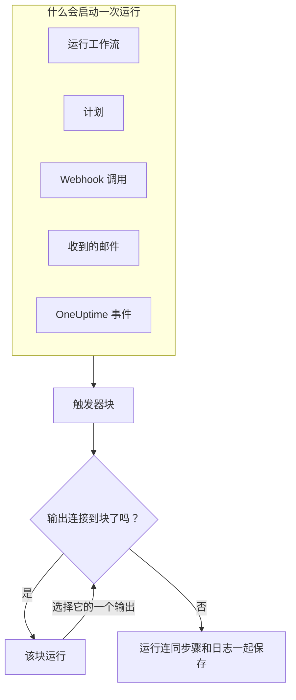
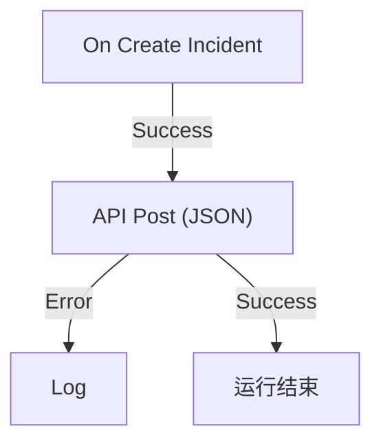

# 工作流概览

工作流让你无需编写代码就能在 OneUptime 中自动化工作。你把块放到画布上并连接起来，每当触发器触发时，工作流就会自行运行：事件被创建、计划时间到达、其他工具调用一个 URL，或者收到一封邮件。用它们把 OneUptime 与你技术栈的其余部分连接起来，并在你专注于问题本身时处理例行的后续工作。

:::cards
- [创建工作流](/docs/workflows/authoring): 创建一个工作流，然后在画布上添加、连接并设置它的块。
- [触发器](/docs/workflows/triggers): 手动、按计划、通过 Webhook、邮件或 OneUptime 事件启动工作流。
- [组件](/docs/workflows/components): 你可以添加的每一种块，从 API 调用到 OneUptime 记录。
- [运行记录](/docs/workflows/runs-and-logs): 逐步查看每次运行做了什么。
:::

## 工作流的工作方式

每个工作流都由三部分组成：

1. **触发器** —— 启动工作流的东西：手动运行、计划、Webhook 调用、收到的邮件，或 OneUptime 中的事件，例如新事件。每个工作流恰好有一个。
2. **组件** —— 工作流要做的事：发送消息、调用 API、检查条件、创建或更新 OneUptime 记录。
3. **连接** —— 你从一个块画到下一个块的线。它们决定什么在什么之后运行。

触发器触发时，OneUptime 会开始一次 **运行**。每个块最后都会选择它的一个输出，例如 **Success** 或 **Error**、**Yes** 或 **No**，接下来只运行连接到该输出的块。如果没有块连接到某个块所选的输出，那条路径就到此结束。运行会连同它的状态、走过的路径以及每个块接收和返回的内容一起保存。



这一切都在画布上以可视化方式搭建。大多数工作流完全不需要代码；需要时，一个 **Run Custom JavaScript** 块可以运行几行 JavaScript。

## 你可以用工作流做什么

- **把 OneUptime 连接到你的其他工具** —— 向 Slack、Microsoft Teams、Discord、Telegram 或 IRC 发帖，创建 Jira 工单，或向你技术栈中的任意 API 发送请求。
- **对 OneUptime 中发生的事做出反应** —— 事件创建时，通知合适的频道并自动开一个工单。
- **按计划运行任务** —— 每五分钟、每晚、每周一早上。
- **接收外部数据** —— 让其他系统通过调用工作流的 URL 或向它的地址发邮件来启动工作流。
- **复用通用的自动化** —— 只搭建一次，然后用 **Execute Workflow** 块从任何其他工作流启动它。

## 关键术语

| 术语             | 含义                                                                                                   |
| ---------------- | ------------------------------------------------------------------------------------------------------ |
| **工作流**       | 整个自动化：一个名称、一块放着块的画布，以及一个开启或关闭它的开关。                                   |
| **触发器**       | 第一个块。它决定工作流何时运行。每个工作流恰好有一个。                                                 |
| **组件**         | 其他任何块：它发送消息、发出请求、检查条件或更改记录。                                                 |
| **输出**         | 块底部的一个点，例如 **Success** 或 **Error**。从它引出的线通向下一个块。                              |
| **运行**         | 工作流的一次执行，连同状态、时间戳以及每个块做了什么一起保存。                                         |
| **全局变量**     | 一个值（例如 API 密钥），你只需保存一次，就能在项目的任何工作流中使用。                                |

## 开始之前

- **包含工作流的套餐。** 在 OneUptime Cloud 上，工作流需要 **Growth** 套餐或更高，每个套餐每 30 天允许一定数量的运行——参见 [套餐限制](/docs/workflows/configuration#套餐限制)。没有计费的自托管安装两种限制都没有。
- **构建的权限。** 创建和更改工作流需要 **Workflow Admin**、**Project Admin** 或 **Project Owner**，或者具有相应权限的自定义角色。**Workflow Member** 可以打开工作流并手动运行，但不能更改它们。参见 [权限](/docs/workflows/configuration#权限)。

## 在 OneUptime 中哪里找到工作流

在顶部栏打开 **产品**，然后在 **仪表板与自动化** 下选择 **工作流**。它的菜单包含：

- **工作流** —— 你的工作流列表。新建一个或打开已有的。
- **全局变量** —— 所有工作流共享的值。
- **日志 → 运行记录** —— 项目中所有工作流的执行历史。
- **设置 → 标签规则** 和 **所有者规则** —— 自动给新工作流加标签并指定所有者。
- **高级 → 已归档** —— 你归档的工作流。它们永远不会运行，也不会出现在列表中；可以在这里取消归档。参见 [归档工作流](/docs/workflows/configuration#归档工作流)。
- **开发者** —— 如何用 Terraform、API 或 AI 助手管理工作流。

打开单个工作流，它自己的菜单包含：

- **概览** —— 名称、描述、标签以及 **已启用** 开关。
- **生成器** —— 设计工作流的画布，顶部有 **已启用** 开关。
- **工作流变量** —— 只属于这个工作流的值。
- **日志 → 运行记录** —— 这个工作流的每次运行及其详情。
- **所有者** —— 负责这个工作流的人员和团队。
- **开发者** —— 如何用 Terraform、API 或 AI 助手管理这个工作流。
- **设置** —— 复制、导出和归档。

**设置** 位于菜单的 **高级** 部分，与 **审计日志** 和 **删除工作流** 在一起。**高级** 和 **开发者** 在这个菜单以及其他所有菜单中都默认折叠，这样你每天用的页面排在前面。点击某个部分的名称即可显示它的页面。当你位于其中某个页面时，它会自动展开。

## 构建你的第一个工作流

每个工作流都按同样的方式搭建起来：

:::steps
1. **创建** —— 选择一个起点，然后给工作流起个名字。参见 [创建工作流](/docs/workflows/authoring)。
2. **选择触发器** —— 手动、计划、Webhook、收到的邮件，或来自 OneUptime 的事件。参见 [触发器](/docs/workflows/triggers)。
3. **添加组件** —— 在画布上添加操作并把它们连接起来。参见 [组件](/docs/workflows/components)。
4. **开启它** —— 在 **生成器** 顶部打开 **已启用**。已禁用的工作流根本无法运行，手动也不行。
5. **测试** —— 在 **生成器** 中点击 **运行工作流**，观看运行的进行过程。
:::

下面的示例为一个真实的工作流走一遍这些步骤。

## 示例：把新事件发送到 Webhook

这个工作流把每个新事件的 JSON 摘要发送到你指定的 URL——工单系统、数据仓库，任何接受 Webhook 的东西——并在请求失败时把原因写入运行的日志。



> [!TIP]
> **Forward new incidents to another system** 模板会为你搭建同样的工作流。创建工作流时，可以在 **事件** 下找到它。

:::steps
### 创建工作流

打开 **工作流** 并点击 **创建工作流**。点击 **从零开始**，把工作流命名为 `Send new incidents to a webhook`，然后点击 **创建工作流**。

新工作流会在 **生成器** 中打开，处于关闭状态。

### 添加触发器

点击虚线的 **Choose what starts this workflow** 块，然后在 **Add Trigger** 面板中点击 **Popular** 下的 **On Create Incident**。

触发器会取代虚线块的位置。它上面的 ID `incident-on-create-1` 就是后续块引用它的方式。

### 选择事件字段

点击触发器。在 **Select Fields** 中勾选请求要携带的字段，例如标题和描述，然后点击 **保存**。

触发器会把新事件连同这些字段一起传下去。你没有选择的字段到达时为空。

### 添加 API 块

点击 **添加组件**，然后点击 **Popular** 下的 **API Post (JSON)**。从触发器的 **Success** 点向下拖到新块顶部的点。

### 填写请求

点击写着 **Click to set up** 的 API 块。在 **URL** 中填入你的端点。在 **Request Body** 中写下要发送的 JSON，在需要的地方用 **{ }** 插入事件的字段，然后点击 **保存**。

```json title="Request Body"
{
  "id": "{{local.components.incident-on-create-1.returnValues.model._id}}",
  "title": "{{local.components.incident-on-create-1.returnValues.model.title}}",
  "description": "{{local.components.incident-on-create-1.returnValues.model.description}}"
}
```

工作流运行时，每个 `{{…}}` 引用都会被替换为事件的值。语法参见 [变量](/docs/workflows/variables)。

### 捕获失败

点击 **添加组件**，然后点击 **日志**。把 API 块的 **Error** 点连接到它，然后把 Log 块的 **Value** 设为 `Could not send the incident: {{local.components.api-post-1.returnValues.error}}`。

失败的请求——无法访问的 URL，或者不是 2xx 的响应——现在会走这条路径，运行的日志会说明原因。

### 开启它

在 **生成器** 顶部打开 **已启用**。

### 测试它

点击 **运行工作流**，输入本项目中某个事件的 **事件 ID**，点击 **Run Workflow Manually**，然后用 **Run** 确认。

**工作流运行** 面板会打开并跟随这次运行。打开 **API Post (JSON)** 步骤，即可看到它发送的正文和收到的响应。
:::

从现在起，项目中的每个新事件都会启动一次运行。你可以在工作流的 [运行记录](/docs/workflows/runs-and-logs) 中找到它们。

> [!NOTE]
> 请求从 OneUptime 发出。在 OneUptime Cloud 上，URL 必须能从互联网访问。自托管安装会拒绝私有网络地址，除非管理员允许——参见 [出站网络访问](/docs/workflows/configuration#出站网络访问)。

## 工作流与 OneUptime 其他部分的关系

- **监视器** 发现问题。**事件** 和 **警报** 记录问题。**工作流** 对问题做出反应。
- **Runbook** 是团队在事件、警报或维护时逐步执行的响应流程：手动步骤、审批和脚本，有人参与其中。工作流在无人值守的情况下运行。当需要有人在过程中做决定时，使用 [Runbook](/docs/runbooks/index)；当每一步都是自动的，使用工作流。
- **工作区连接** 把项目连接到 Slack 和 Microsoft Teams，用于事件频道和通知。工作流中的 Slack 和 Microsoft Teams 块不使用它们：每个块都通过自己的传入 Webhook URL 发帖。

## 后续步骤

:::cards
- [创建工作流](/docs/workflows/authoring): 使用画布、块及其设置。
- [变量](/docs/workflows/variables): 在块之间传递数据，并把密钥放在工作流之外。
- [配置与安全](/docs/workflows/configuration): 上线前的权限、限制和安全。
:::
