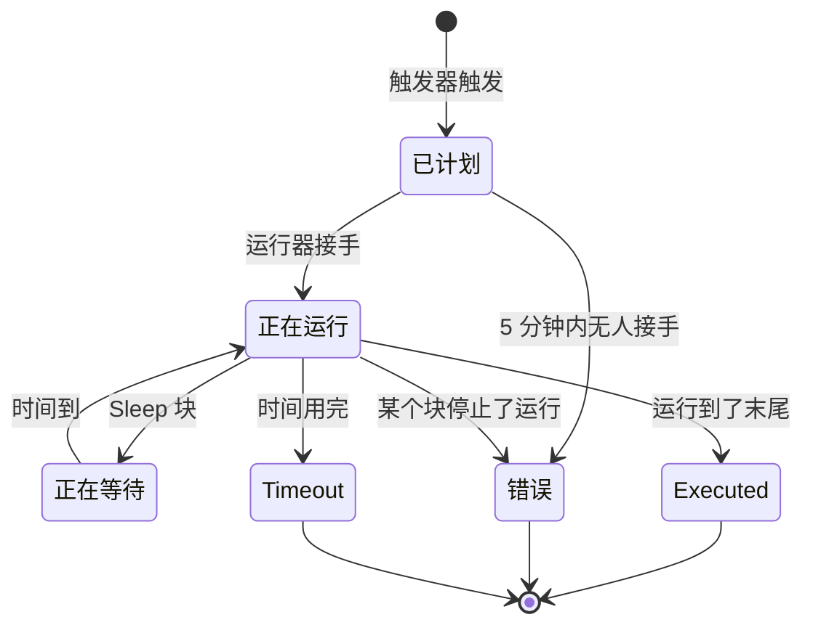

# 工作流运行记录

每当工作流运行一次，OneUptime 都会保存一份发生了什么的记录——它何时运行、是否成功，以及每个块接收和返回了什么。这份记录称为一次 **运行**。通过运行，你可以确认工作流是否正常工作，排查没有正常工作的工作流，并回顾过去的活动。

:::cards
- [运行状态](#运行状态): 已计划、正在等待、Executed 等状态的含义。
- [阅读一次运行](#阅读一次运行): 一个块一个块地跟随运行走过的路径。
- [故障排除](#故障排除): 没有运行的工作流、一直没有运行的块、到达时为空的值。
:::

## 在哪里找到它们

| 页面                                                 | 你会看到                                                                                           |
| ---------------------------------------------------- | -------------------------------------------------------------------------------------------------- |
| **工作流 → 日志 → 运行记录**（工作流菜单）           | 项目中每个工作流的每次运行。可按工作流名称、状态和时间筛选。                                       |
| **工作流 → 日志 → 运行记录**（单个工作流的菜单）     | 只有这一个工作流的运行。这里用 **运行 ID** 筛选代替工作流筛选。                                    |
| **单次运行**                                         | 通过运行行上的 **查看日志** 按钮打开——行本身不可点击。                                             |

从 **生成器** 启动运行时，会打开同一个 **工作流运行** 视图，并且已经在跟随这次运行，所以你可以看着它发生，而不必事后再去找。

## 运行状态

| 状态                                | 含义                                                                                                                                                                                                                                                                  |
| ----------------------------------- | --------------------------------------------------------------------------------------------------------------------------------------------------------------------------------------------------------------------------------------------------------------------- |
| **已计划**                          | 触发器已触发，运行正在排队等待运行器。通常不到一秒。5 分钟后仍处于已计划状态的运行会失败：没有任何东西接手它。                                                                                                                                                       |
| **正在运行**                        | 工作流正在进行中。                                                                                                                                                                                                                                                    |
| **正在等待**                        | 运行停在一个 **Sleep** 块上，会自行继续。等待期间它不占用任何 worker。                                                                                                                                                                                                |
| **Executed**                        | 运行没有失败地到达了末尾。这是成功状态：标记上写的是 **Executed**，而不是“成功”。                                                                                                                                                                                    |
| **错误**                            | 某个块停止了运行。在以下情况下也会使用：排队的运行一直无人接手、休眠运行的恢复丢失、计划表达式无法解析，以及运行在 **Sleep** 块上等待期间工作流被关闭或归档。                                                                                                         |
| **Timeout**                         | 运行时间超过了允许的时长：默认 2 分钟。参见 [一次运行能跑多久](/docs/workflows/configuration#一次运行能跑多久)。                                                                                                                                              |
| **Execution Exceeded Current Plan** | 项目已用完最近 30 天的工作流运行次数，或者订阅未付款。运行会被记录，但不会执行。仅限 OneUptime Cloud。                                                                                                                                                              |

走 **Error** 输出的块——例如收到 4xx 响应的 API 块——不会让运行失败。连接到 **Error** 的块会运行，运行仍以 **Executed** 结束。该步骤本身会以红色显示，方便你找到。

## 阅读一次运行

在一次运行上点击 **查看日志** 来打开它。**工作流运行** 视图有两个选项卡：**步骤** 和 **Full Log**。

### 步骤选项卡

运行走过的路径，每个块一张带编号的卡片，按运行顺序排列。无需展开任何内容，每张卡片就会显示：

- 块的标题和 ID，它是 **已成功** 还是 **失败**，以及耗时。
- 它走了哪个输出（按画布上的名称），以及通向哪里：下一个步骤的编号和名称，或者一条说明，指出没有任何东西连接到它，因此运行或该分支在那里结束。它通向但从未运行的步骤会显示 **(did not run)**。Error 输出以红色显示；Yes 和 No 只是运行走的方向。把指针悬停在输出名称上可以看到它的含义。
- 如果步骤失败，会显示它的错误，以及关于它的任何警告——例如一个解析为空的 `{{…}}` 引用。

展开一张卡片可以看到两块详情：

| 块           | 显示的内容                                                                                                                                                                                                      |
| ------------ | --------------------------------------------------------------------------------------------------------------------------------------------------------------------------------------------------------------- |
| **Received** | 在所有变量填好之后，块得到的设置，按名称并按设置列表中的顺序排列。引用了其他步骤或变量的设置会在引用旁边显示它变成的值，变成空时显示 **Did not resolve**。                                                    |
| **Returned** | 它产生的内容，并标出每个值的 ID（`returnValues` 引用的最后一部分）。列表和对象会缩进显示。                                                                                                                      |

失败的步骤、带警告的步骤，以及只有一个步骤的运行中的那个步骤，会默认展开。**步骤** 选项卡上的计数在有内容失败时变成红色，在某个步骤带警告时变成橙色。

有几类运行读起来不太一样：

- **单个步骤的测试。** 用 **Run just this step** 启动的运行会在顶部显示 **Only this step ran**。它之前的步骤没有运行，所以它从这些步骤读取的值是缺失的（这些值会出现 **Did not resolve** 警告），它之后的步骤会显示 **(not run in this test)**。要试整条路径，请用 **运行工作流**。
- **在步骤之间停止的运行。** 如果运行因为某个没有任何步骤能解释的原因而停止——在两个步骤之间超时，或在第一个步骤之前失败——路径会以 **The run stopped here** 和原因结束。
- **休眠中的运行。** 停在 **Sleep** 块上等待的运行会以 **Sleeping** 和它自行继续的时间结束；Sleep 之后的步骤会显示 **(not run yet)**。

每个步骤标题下的 ID，正是要写进 `{{local.components.<id>.returnValues.…}}` 引用中的内容，这让这里成为写对引用最快的方法。

显示的值是块收到的内容，即变量填好之后、块对它们做任何处理之前的样子，但有两个例外：密钥和块标记为敏感的字段会被隐藏，超过 4,000 个字符的值会被截断并加上 "… (truncated)"。一次运行保留最近的 100 个步骤；很长或经常被恢复的运行会在较早步骤被丢弃的位置显示一条橙色说明。在输出名称开始被保存之前记录的运行，会按 ID 显示输出，并且不显示它通向哪里。

### Full Log 选项卡

运行器逐行写下的原始日志，包括块自己记录的任何内容，例如 **Log** 块的值或脚本的 `console.log`。当步骤选项卡解释不了失败时，就用它。

## 复制和下载一次运行

在 **工作流运行** 视图顶部，关闭按钮旁边，**复制日志** 会把整个 **Full Log** 放到剪贴板，方便粘贴到聊天或工单中。**下载** 会把运行保存为文件：

| 下载                                    | 你会得到                                                                                                                                                                                                                               |
| --------------------------------------- | -------------------------------------------------------------------------------------------------------------------------------------------------------------------------------------------------------------------------------------- |
| **下载日志**                            | 一个 `.txt` 文件，包含运行器打印出的完整日志，无论多长，上方有一个简短的标头：工作流的名称和 ID、运行 ID、它的状态，以及它被计划、开始和完成的时间。                                                                                 |
| **以 JSON 格式下载运行**                | 一个 `.json` 文件，以数据形式包含同样的信息、**步骤** 选项卡显示的步骤（每个步骤接收和返回了什么、走了哪个输出），以及作为行列表的日志。步骤的形状与 API 返回运行的 `stepTrace` 时相同，并且与 **步骤** 选项卡一样是运行的最近 100 个。日志总是完整的。 |

同样的两种下载也在两个运行列表中每次运行的 **⋯** 菜单里，所以你不必打开运行就能保存它。从 **生成器** 启动的运行在仍在进行时就可以复制或下载；你会得到它到目前为止记录的内容。

文件按工作流、运行和开始时间（UTC）命名，所以存放它们的文件夹会先按工作流、再按时间排序：`nightly-sync-run-<run id>-2026-09-30T10-00-01.txt`。

下载的文件中不包含任何你在运行中原本读不到的内容。密钥和块标记为敏感的字段在运行被记录时就已隐藏，所以在文件中也是隐藏的，并且任何能打开运行的人都可以下载它。

## 故障排除

:::details 我的工作流没有运行
1. 确认工作流处于 **已启用** 状态：开关位于它的 **生成器** 顶部，工作流关闭时，生成器会在画布上方说明。新工作流一开始是禁用的，而已禁用的工作流会拒绝每一次运行——包括手动运行。对它的 Webhook 调用会收到 HTTP 400，并附有说明如何开启它的消息。
2. 对于 OneUptime 事件触发器，确认事件确实发生了：打开记录并查看它的历史。带有 **Listen on** 的 **On Update** 触发器只在其中某个字段发生变化时触发。
3. 对于 Webhook 触发器，确认另一个系统发送到了正确的 URL。大多数工具在发送 Webhook 时都会记录——去那里检查。
4. 对于计划触发器，确认 cron 表达式与你预期的时间相符。计划以 UTC 运行。

如果运行出现了，状态为 **Execution Exceeded Current Plan**，说明项目已用完最近 30 天的所有工作流运行次数，或者订阅未付款。运行的日志会写明次数和你的套餐上限。这只适用于 OneUptime Cloud。
:::

:::details 后面的某个块一直没有运行
不运行的块通常是连线问题。打开 **生成器** 检查：

- 前一个块的输出连接到这个块的输入了吗？
- 前一个块是否走了你没想到的输出——**Error** 而不是 **Success**，或者 **No** 而不是 **Yes**？**步骤** 选项卡会说明它走了哪个输出、通向哪里，或者说明没有任何东西连接到它。
:::

:::details 值到达时为空，或者是 {{…}} 文本
打开运行并查看该步骤。没有解析的引用会作为警告在步骤本身上指出，它在 **Received** 块中的设置会标记为 **Did not resolve**。

- 如果你看到字面的 `{{local.components.…}}` 文本，说明引用没有解析。通常是组件 ID 或返回值 ID 拼错了——记住它是块的 **Identifier**，而不是块上显示的名称。也检查一下 `local.components` 本身的拼写：`{{local.componets.api-get-1.returnValues.response-body}}` 会作为字面文本发送，而运行仍然报告 **Executed**。如果这次运行是 **Run just this step** 测试，前面的块根本没有运行——请改为运行整个工作流。
- 如果你看到 **Empty text**，说明前面的块运行了，但没有产生那个字段。

同样的警告也会出现在 **Full Log** 选项卡中，是一行以 `Warning:` 开头的内容。
:::

:::details 手动运行时正常，从触发器运行就不行
打开 **生成器**，点击 **运行工作流**，用看起来像真实触发器会发送的值填写触发器的字段。然后把这次运行的 **Received** 值与真实运行的值并排比较。差别通常在某一个字段的名称或类型上。
:::

## 重新运行工作流

没有“重试这次运行”的按钮。旧的运行永远不会被自动重新运行，因为它们的副作用——Slack 消息、API 调用、工单——重复执行可能并不安全。要重做这项工作，修复工作流，等下一次真实触发器来启动它，或者打开 **生成器**，用同样的值点击 **运行工作流**。

## 运行会保留多久？

在 OneUptime Cloud 上，运行会保留 **30 天**，然后被删除——这就是为什么两个运行列表都说明它们涵盖最近 30 天。自托管安装会一直保留运行，直到你删除它们；如果某个工作流运行得非常频繁、把历史弄得很乱，就关闭或删除它。

在步骤跟踪加入之前记录的运行没有 **步骤** 内容，只显示它们的 **Full Log**。

## 后续步骤

:::cards
- [配置与安全](/docs/workflows/configuration): 时间限制、套餐限制，以及记录中隐藏的内容。
- [变量](/docs/workflows/variables): 你的块使用的引用语法。
- [组件](/docs/workflows/components): 每个块返回什么，以及何时走哪个输出。
:::
