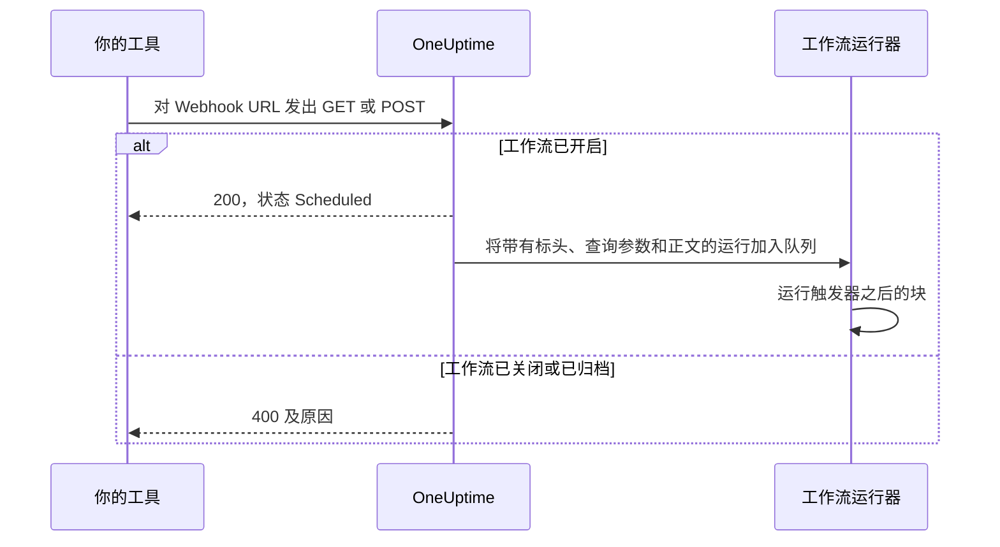
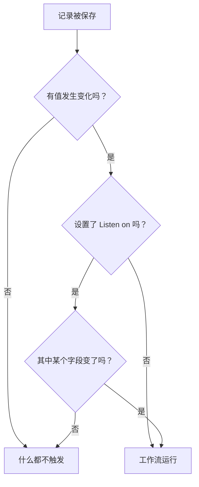

# 工作流触发器

触发器是工作流的第一个块——它决定工作流何时运行。每个工作流恰好有一个触发器。你可以从五种类型中选择。

:::cards
- [手动](#manual): 从生成器或另一个工作流启动工作流。
- [计划](#schedule): 按用 cron 表达式写成的循环计划运行它。
- [Webhook](#webhook): 让另一个系统通过调用一个 URL 来启动它。
- [收到的邮件](#incoming-email): 每封发到它专属地址的邮件都会启动它。
- [OneUptime 事件触发器](#oneuptime-事件触发器): 在记录被创建、更新或删除时做出反应。
:::

要添加触发器，点击新工作流画布上的虚线 **Choose what starts this workflow** 块。要更换它，删除触发器块，虚线块就会回来。参见 [创建工作流](/docs/workflows/authoring#添加块)。

## 我该用哪种触发器？

| 如果你想……                                     | 选择                        |
| ---------------------------------------------- | --------------------------- |
| 点击按钮来运行工作流                           | **Manual**                  |
| 按循环计划运行                                 | **计划**                    |
| 让另一个系统把数据送进来                       | **Webhook**                 |
| 从一封邮件开始                                 | **Incoming Email**          |
| 对 OneUptime 中的事做出反应                    | **OneUptime 事件**          |

一个工作流只能有一个触发器。如果你需要两种方式启动同一段自动化，就把共用的逻辑搭建在一个带 **Manual** 触发器的工作流中，再从两个很薄的“包装”工作流里用 **Execute Workflow** 块启动它。

## Manual

随时运行工作流：在 **生成器** 页面点击 **运行工作流**，填写触发器的 **JSON**，点击 **Run Workflow Manually**，然后用 **Run** 确认。另一个工作流也可以用 **Execute Workflow** 块启动它。

适用于：你想用一个按钮触发的一键式自动化，例如“轮换这个密钥”或“发送一条测试警报”，以及在工作流之间共享的逻辑。

**Returns**: **JSON** —— 启动这次运行时传入的内容。

- 从 **运行工作流** 启动时，它是你输入的 JSON，以文本形式到达。要读取其中的字段，先让它经过一个 **Text to JSON** 块。
- 从 **Execute Workflow** 块启动时，块的 **Arguments** 中的每个键都是一个独立的值。对于 `{"customerId": "42"}`，后续块读取 `{{local.components.manual-1.returnValues.customerId}}`，其中 `manual-1` 是 Manual 触发器的 ID。

## Schedule

按循环计划运行工作流。在 **Schedule at** 中设置频率：从 **Common schedules** 中选一个，输入一个 **Custom cron** 表达式，或者选择一个包含表达式的 **变量**。输入框下方会用文字描述这个计划，并显示 **Next runs**。

适用于：夜间清理、每小时同步、每周报告。

时间使用 UTC，所以选择钟点时请从你所在的时区换算。cron 表达式的五个部分依次是分钟、小时、日期、月份和星期几：

| 表达式        | 运行时间                               |
| ------------- | -------------------------------------- |
| `*/5 * * * *` | 每 5 分钟。                            |
| `0 * * * *`   | 每小时整点。                           |
| `0 0 * * *`   | 每天 UTC 午夜。                        |
| `0 9 * * 1-5` | 每个工作日 UTC 9:00。                  |
| `0 9 * * 1`   | 每周一 UTC 9:00。                      |

工作流关闭时不会安排任何运行。使用 **变量** 的计划会读取一个工作流变量或全局变量，例如 `{{local.variables.schedule}}`。如果它不能变成有效的 cron 表达式，工作流就不会被安排，运行列表中会出现一次失败的运行并说明原因。

要不等计划就测试工作流，在 **生成器** 中点击 **运行工作流**：它会立即启动一次运行。

## Webhook

OneUptime 会给工作流一个专属的 URL。任何调用这个 URL 的东西都会启动工作流，并传入请求的标头、查询参数和正文。

适用于：把另一个工具的数据接收进 OneUptime——CI/CD 回调、其他监控系统的警报、CRM 中的注册。

要获取 URL，点击画布上的 Webhook 触发器。URL 显示在它的设置顶部，旁边有 **复制 URL** 按钮、它接受的方法，以及一条可以粘贴到终端里试用的 `curl` 命令：

```bash
curl -X POST "https://oneuptime.example.com/workflow/trigger/<secret key>" \
  -H "Content-Type: application/json" \
  -d '{"message": "Hello"}'
```

这个 URL 同时接受 `GET` 和 `POST`。调用方会很快收到确认 `{"status": "Scheduled"}`——工作流本身在后台运行，所以调用方永远看不到它做了什么。对已关闭或已归档工作流的调用会以 HTTP 400 和原因被拒绝。



**Returns**:

| 值                       | 包含的内容                                                                                                             |
| ------------------------ | ---------------------------------------------------------------------------------------------------------------------- |
| **Request Headers**      | 请求的每个标头，按小写名称列出，例如 `content-type`。                                                                  |
| **Request Query Params** | URL 中的查询参数，按名称列出。                                                                                         |
| **Request Body**         | 调用方发送的正文。用 `Content-Type: application/json` 发送的 JSON 正文可以逐个字段读取。                               |

要读取单个字段，把它的名称加到引用后面，例如 `{{local.components.webhook-1.returnValues.request-body.message}}`。

请求到达后，触发器之后每个块中的值选择器都会知道里面有什么：它会列出正文的字段、标头和查询参数，各自带有内容，因此你可以选择 `incident.title`，而不必输入路径。在此之前，它会说明还没有请求到达，并提供 **Copy test request**，即一条发往该 URL 的 `curl` 命令；一旦请求启动的那次运行结束，字段就会出现。参见 [使用前面块的值](/docs/workflows/authoring#使用前面块的值)。

要在没有那个工具的情况下测试工作流，在 **生成器** 中点击 **运行工作流**，然后输入标头、查询参数和正文。

### 保护好 URL

URL 的最后一部分是工作流的密钥，任何拿到 URL 的人都能启动工作流。所以在你点击 **显示** 之前，密钥是隐藏的，**复制 URL** 会在不显示的情况下复制整个 URL。

如果 URL 泄露，在同一位置点击 **重置 URL**：工作流会得到一个新 URL，旧的会立即失效，所以请更新所有调用它的东西。只有允许编辑工作流的人才能查看或重置它的 URL——参见 [Webhook 安全](/docs/workflows/configuration#webhook-安全)。

> [!WARNING]
> 把 URL 当作密码对待。任何拿到它的人都可以不登录就启动你的工作流。

## Incoming Email

OneUptime 会给工作流一个专属的邮件地址。每封发到这个地址的邮件都会启动工作流并传入这封邮件：发件人、收件人、主题、文本和 HTML、标头，以及附件（如果有）的名称。

适用于：处理来自无法调用 Webhook 的系统的邮件——旧监控工具的警报、供应商的状态通知、夜间任务发出的报告。

要获取地址，点击画布上的 Incoming Email 触发器。地址显示在它的设置顶部，旁边有 **复制地址** 按钮。把它交给需要启动工作流的东西：只能发邮件的工具、供应商的通知设置，或者你自己邮箱中的转发规则。

每封邮件都会启动自己的一次运行。无论地址出现在收件人还是抄送中、是密送，还是通过转发规则到达，邮件都会到达工作流。提到这个地址两次的邮件只会启动一次运行。

**Returns**:

| 值              | 包含的内容                                                                                               |
| --------------- | -------------------------------------------------------------------------------------------------------- |
| **From**        | 发件人的地址。                                                                                           |
| **To**          | 邮件的所有收件人，写在一行中，例如 `ops@example.com, oncall@example.com`。                               |
| **CC**          | 邮件抄送的所有人，写在一行中。                                                                           |
| **Subject**     | 主题行。                                                                                                 |
| **Body**        | 邮件的纯文本。                                                                                           |
| **HTML Body**   | 邮件的 HTML（如果有）。Body 和 HTML Body 各自在 1 MB 处截断。                                            |
| **Headers**     | 邮件的每个标头，按小写名称列出，例如 `message-id`。                                                      |
| **Attachments** | 每个附件的名称、类型和大小。文件本身不会保存。                                                           |
| **Received At** | OneUptime 收到这封邮件的时间。                                                                           |

邮件到达后，触发器之后每个块中的值选择器都会知道里面有什么：它会列出邮件带有的每个标头和每个附件及其内容，因此你可以选择 `headers.message-id`，而不必输入路径。在此之前，它会说明还没有邮件到达这个地址。参见 [使用前面块的值](/docs/workflows/authoring#使用前面块的值)。

要在不发邮件的情况下试用工作流，在 **生成器** 页面点击 **运行工作流**，填写发件人、主题和正文。你没有填写的值到达时为空。

只有在工作流开启时，邮件才会启动它。发给已关闭工作流的邮件会被忽略，发给触发器已不再是 Incoming Email 的工作流的邮件也会被忽略。

### 保护好地址

地址中 `@` 之前的部分包含工作流的密钥，任何拿到地址的人都能启动工作流。所以在你点击 **显示** 之前，密钥是隐藏的，**复制地址** 会在不显示的情况下复制整个地址。

如果地址泄露，在同一位置点击 **重置地址**：工作流会得到一个新地址，从此发到旧地址的邮件会被忽略，所以请把新地址告诉所有给工作流发邮件的东西。只有允许编辑工作流的人才能查看或重置它的地址——参见 [收到的邮件的安全](/docs/workflows/configuration#收到的邮件的安全)。

> [!WARNING]
> 任何人都可以在邮件上填写任意发件人，所以 **From** 不能证明是谁发的。在某个步骤做重要的事之前，先检查只有真正的发件人才知道的东西。

> [!NOTE]
> 在自托管安装上，OneUptime 通过管理员配置的入站邮件服务商接收邮件——参见 [SendGrid Inbound Email](/docs/self-hosted/sendgrid-inbound-email)。在此之前，触发器没有地址，它的设置会说明这一点。

## OneUptime 事件触发器

OneUptime 中几乎所有东西——监视器、事件、警报、计划维护、状态页面、值班策略、团队——都可以启动工作流。每一种最多提供三个事件：

- **On Create** —— 新增一个时触发。
- **On Update** —— 有一个被更改时触发。用记录已有的值保存它，例如未作更改就保存的表单，或按原状态提交的开关，不算更改，不会触发。
- **On Delete** —— 有一个被删除时触发。

这样，你就能搭建“当 OneUptime 中发生 X 时，做 Y”，而无需在循环里反复检查。

**On Update** 可以用 **Listen on** 限定在某些字段上：这样只有当更新把其中某个字段改成任何值时才会触发——关闭开关或清空字段也算。



**On Create** 和 **On Update** 会把记录传给下一个块，带上你在触发器的 **Select Fields** 中选择的字段。例如，**Incident → On Create** 触发器会传下新事件，下一个块就能读取它的标题、描述、严重程度或你选择的任何其他字段，例如 `{{local.components.incident-on-create-1.returnValues.model.title}}`。你没有选择的字段到达时为空。

**On Delete** 只传下被删除记录的 ID：工作流运行时记录已经不在了，所以无法读取它的其他字段。

要不等事件发生就测试事件触发器，在 **生成器** 中点击 **运行工作流**，然后输入一条现有记录的 ID，例如 **事件 ID**。这次运行会读取那条记录及你选择的字段。

### 团队最常用的事件

| 资源                                      | 团队用它做什么                                                                            |
| ----------------------------------------- | ----------------------------------------------------------------------------------------- |
| **事件**                                  | 在事件被宣布、更新（已确认、已解决）或删除时做出反应。                                    |
| **警报**                                  | 警报的同样三个事件。                                                                      |
| **监视器**                                | 在监视器被添加、编辑或移除时做出反应。                                                    |
| **计划 维护 事件**                        | 在维护窗口被安排时自动发布公告。                                                          |
| **状态页面 订阅者**                       | 欢迎订阅状态页面的人。                                                                    |
| **值班策略**                              | 把策略的变更同步到另一个值班系统。                                                        |

在 **Add Trigger** 面板中，它们位于 **OneUptime resources** 下：先点击资源，再点击触发器。**Browse all resources** 列出全部资源，搜索框可以用几个词找到触发器，例如 `incident created`。

## 后续步骤

:::cards
- [组件](/docs/workflows/components): 你在触发器之后添加的操作。
- [变量](/docs/workflows/variables): 在后续块中读取触发器传入的内容。
- [运行记录](/docs/workflows/runs-and-logs): 确认触发器已触发，并查看它带来了什么。
:::
