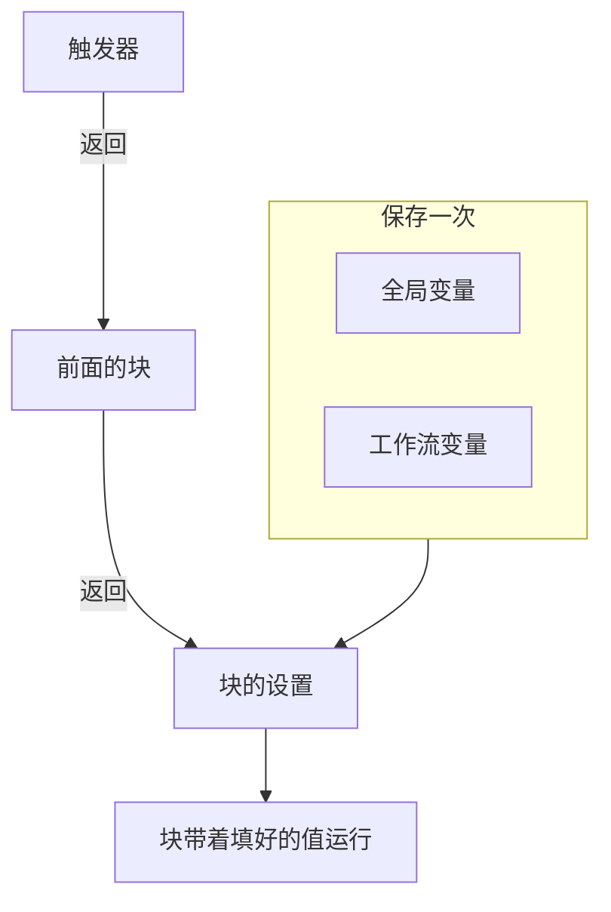
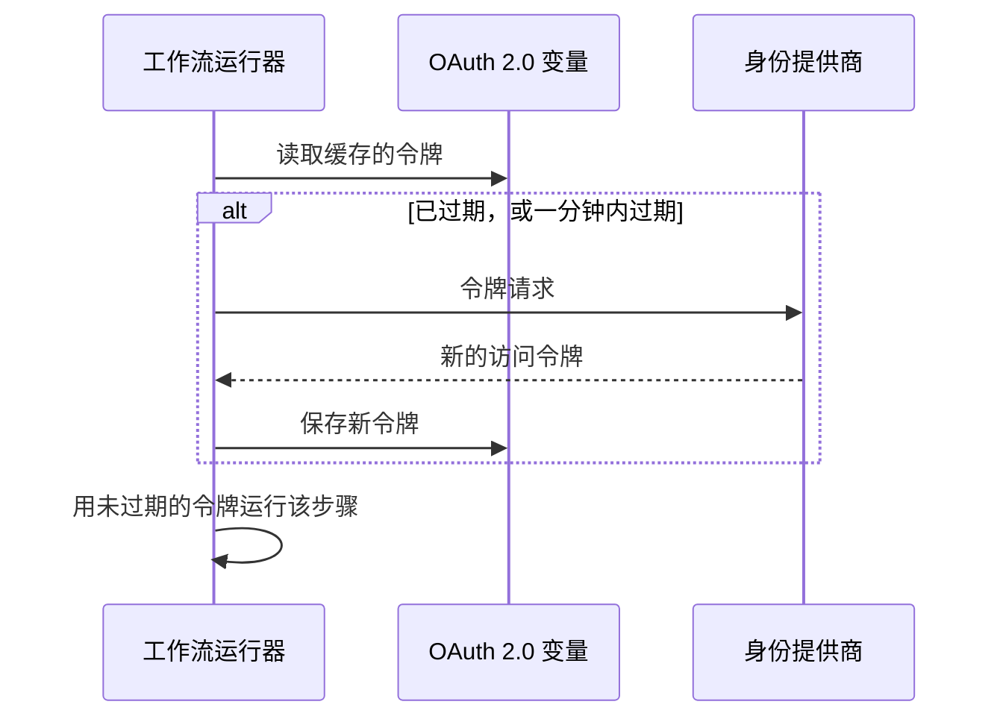

# 工作流变量

变量是数据在工作流中流动的方式：从触发器到第一个块，从一个块到下一个块，以及从你保存一次的值到每个需要它的块。块的设置用双花括号中的引用来读取值，运行器会在块运行前一刻把它填进去。

| 值                             | 来自哪里                                                             | 块如何读取它                                          |
| ------------------------------ | -------------------------------------------------------------------- | ----------------------------------------------------- |
| **全局变量**                   | 保存在 **工作流 → 全局变量** 下                                      | `{{global.variables.NAME}}`                          |
| **工作流变量**                 | 保存在某个工作流的 **工作流变量** 页面上                             | `{{local.variables.NAME}}`                           |
| **前面块的值**                 | 本次运行中触发器或前面的块返回的内容                                 | `{{local.components.BLOCK_ID.returnValues.VALUE_ID}}` |



你很少需要手写引用。点击设置末尾的 **{ }**，或在设置中输入 `{{`，然后从列表中选择值。参见 [使用前面块的值](/docs/workflows/authoring#使用前面块的值)。

## 全局变量

整个项目范围的值，保存一次就能在每个工作流中复用：API 密钥、URL、频道名称——任何你不想复制到十个不同工作流中的东西。

:::steps
### 打开全局变量

前往 **工作流 → 全局变量**，点击 **创建工作流 变量**。

### 为变量命名

在 **变量** 步骤中填写：

- **名称** —— 你用来引用它的名字。至少两个字符，不含空格，只能包含字母、数字、连字符和下划线。`UPPER_SNAKE_CASE` 是个好习惯，因为它在块中很醒目。
- **描述** —— 可选的自由文本，提醒你它是做什么用的。

点击 **下一步**。

### 给它一个值

在 **值** 步骤中填写：

- **内容** —— 值本身。这是一个长文本输入框，所以多行的值也可以。
- **密钥** —— 开启后，值会从运行日志和步骤跟踪中去除。

点击 **创建工作流 变量**。在此之前要更改名称或描述，点击表单旁步骤列表（在宽屏上显示）中的 **变量**；你在两个步骤中输入的内容都会保留。
:::

在任何工作流中这样使用全局变量：

```text
{{global.variables.NAME}}
```

例如，如果你把 PagerDuty 密钥保存为 `PAGERDUTY_KEY`，任何块都可以用 `{{global.variables.PAGERDUTY_KEY}}` 使用它——编辑器保存的是引用，工作流的日志记录会去除解析后的密钥值。

列表显示每个变量的名称和描述。点击某一行的 **查看** 打开变量的页面。它会显示变量是静态的还是 OAuth 2.0 的，其他操作都在这里进行：

| 按钮                                       | 作用                                                                                                                                             |
| ------------------------------------------ | ------------------------------------------------------------------------------------------------------------------------------------------------ |
| **编辑变量**                               | 更改名称、描述，以及——对于尚未设为密钥的静态变量——密钥标记。变量一旦设为密钥，就会一直是密钥。                                                  |
| **Update Content**                         | 替换静态值。保存的内容无法读回，所以你要完整输入新值。                                                                                           |
| **Use in Workflows**                       | 显示要粘贴到块中的确切引用，并带有复制按钮。                                                                                                     |
| **删除工作流 变量**                        | 在请你确认后删除它。确认信息会写明变量名，方便你核对删的是不是对的那个。                                                                         |

如果要为 **OAuth 2.0 访问令牌** 创建变量，打开 **创建工作流 变量** 旁边的 **更多** 菜单（**⋯**），选择 **Create OAuth 2.0 Variable**。OAuth 2.0 变量在下面有 [单独的一节](#oauth-20-变量会自动刷新的令牌)。变量保存后，类型就不能再更改。

你也可以通过 API 更新变量，方法在 [本页末尾](#从工作流更新变量) 介绍。全局变量和工作流变量是 Growth 套餐的功能。

## 工作流本地变量

属于单个工作流的变量，在该工作流菜单的 **工作流变量** 中管理。它们的用法与全局变量相同：**创建工作流 变量** 创建静态变量，**更多** 菜单（**⋯**）创建 OAuth 2.0 变量，**查看** 打开变量的页面。这样引用它们：

```text
{{local.variables.NAME}}
```

把它用于只有这个工作流需要的值，例如某个模板的 Slack Webhook URL。会询问设置的模板会把设置保存为工作流变量，这样你以后无需编辑块就能更改。

## OAuth 2.0 变量（会自动刷新的令牌）

粘贴到静态变量中的 bearer 令牌只在过期前有效，通常不到一小时。之后，每个使用它的运行都会以 `401 Unauthorized` 失败，直到有人粘贴一个新的。**OAuth 2.0 访问令牌** 变量保存的是 OAuth 令牌交换所需的信息，而不是令牌本身，由 OneUptime 保持令牌最新。

用法与其他变量完全一样：

```http
Authorization: Bearer {{global.variables.CRM_API_TOKEN}}
```

### 令牌如何保持有效



- 工作流第一次使用变量时，OneUptime 会向你的身份提供商的令牌端点请求访问令牌并保存。
- 在每个引用该变量的步骤之前，运行器都会检查令牌。如果已过期，或将在接下来一分钟内过期，就会在步骤运行前获取新的令牌。无论变量闲置了多久、运行已经进行了多久，组件拿到的总是未过期的令牌。
- 只有真正引用了变量的步骤才会触发刷新。从不使用某个变量的运行永远不会获取它的令牌，也不会因为那个提供商宕机而失败。
- 当许多运行同时需要新令牌时，其中一个去获取，其余的直接使用。
- 如果提供商没有说明令牌何时过期（没有 `expires_in`，令牌也不是带 `exp` 声明的 JWT），OneUptime 会每次运行获取一次新令牌，并在该次运行的各个步骤之间共享。

### 授权类型

| 授权类型                       | 用于                                                                                                                                                                                                                                                |
| ------------------------------ | --------------------------------------------------------------------------------------------------------------------------------------------------------------------------------------------------------------------------------------------------- |
| **Client Credentials**         | OneUptime 以你的应用程序身份登录。这是服务器到服务器 API 的常见选择，例如 Microsoft Graph、Auth0 或 Okta 的 API，或 Keycloak 后面的内部服务。                                                                                                     |
| **刷新令牌**                   | 代表某个用户的委托访问。授权应用程序一次（例如在提供商的 OAuth playground 或 Postman 中），然后粘贴得到的 refresh token。OneUptime 会用它换取访问令牌，如果你的提供商会轮换 refresh token，则会保存每一个新的。没有客户端密钥的公共客户端也可以。 |

### 创建一个

**Create OAuth 2.0 Variable** 每一步问一件事：

1. **变量**：工作流用来引用它的名称，以及描述。
2. **提供商**：选择你的 **身份提供商**，OneUptime 会填好它的 **令牌 URL**：

   | 身份提供商 | 填入的令牌 URL |
   |---|---|
   | Microsoft Entra ID | `https://login.microsoftonline.com/{tenant-id}/oauth2/v2.0/token` |
   | Google | `https://oauth2.googleapis.com/token` |
   | Okta | `https://{your-domain}/oauth2/default/v1/token` |
   | Auth0 | `https://{your-domain}/oauth/token` |

   把花括号中的部分替换为你自己的值，例如目录（租户）ID 或 Okta 域名。只要 URL 中还留着它，表单就不会继续。对于其他任何提供商，选择 **其他提供商**，自己填写它的令牌端点。然后选择 **授权类型**。选择 Google 时会选中 **刷新令牌**，因为 Google 的 OAuth 客户端无法使用 Client Credentials。提供商只用于填写表单，不会随变量保存。
3. **凭据**：你在提供商处注册的应用程序的 **客户端 ID** 和 **客户端密钥**，对于 Refresh Token 授权类型还有 **刷新令牌**。使用 Refresh Token 授权类型的公共客户端可以把客户端密钥留空。
4. **高级**，全部可选：
   - **范围**：以空格分隔。留空则获得提供商的默认范围。对于 Client Credentials，Microsoft Entra ID 需要以 `/.default` 结尾的范围（例如 `https://graph.microsoft.com/.default`），Okta 需要一个自定义范围。
   - **附加参数**：令牌请求的额外表单字段，例如 Auth0 的 `audience`（Client Credentials 必需）或 Azure AD v1 的 `resource`。能读取该变量的任何人都能读取它们，所以不要把密钥放在这里。
   - **客户端认证**：客户端 ID 和密钥是放在 HTTP Basic 标头中发送（默认），还是放在请求正文中发送。如果你的提供商回复 `invalid_client`，试试另一种。

在一些字段下方，表单会针对你选择的提供商加一行帮助，例如 Microsoft Entra ID 在哪里显示你的租户 ID，以及它的客户端密钥是密钥的 **Value**，而不是它的 **Secret ID**。

保存新的 OAuth 2.0 变量时，OneUptime 会立即获取它的第一个令牌，并告诉你提供商的回复。密钥或 URL 中的拼写错误会当场暴露，而不是几小时后在一次失败的运行中才发现。获取令牌会写入变量，所以需要编辑工作流变量的权限；如果你能创建变量但不能编辑，就由第一个使用该变量的工作流运行来获取它的令牌。

变量的页面（点击其所在行的 **查看**）有一张 **OAuth 2.0 Settings** 卡片。**编辑设置** 会依次经过同样的 **提供商**（令牌 URL）、**凭据**（客户端 ID）和 **高级**（范围、附加参数、客户端认证）步骤。**下一步** 向前推进，**保存更改** 在最后一步。每一步都已经填好，所以表单旁的步骤列表可以打开其中任何一步：在对应步骤中更改一个设置，然后打开最后一步并保存。授权类型保存后就固定了。

### 访问令牌卡片

OAuth 2.0 变量页面上的 **访问令牌** 卡片会显示以下状态之一：

| 状态                       | 含义                                                                                                                                 |
| -------------------------- | ------------------------------------------------------------------------------------------------------------------------------------ |
| **Valid**                  | 缓存的令牌尚未过期。                                                                                                                 |
| **已过期**                 | 对于最近没有工作流使用的变量来说是正常的。下一个使用它的运行会获取新令牌。                                                           |
| **尚未获取**               | 自变量创建或其设置更改以来，还没有获取过令牌。                                                                                       |
| **No expiry reported**     | 提供商没有说明令牌何时过期，所以每次运行都会获取一个新令牌。                                                                         |
| **Refresh failed**         | 上一次获取令牌的尝试失败了。提供商给出的原因会完整显示，并附上发生时间。下一次成功刷新会清除它。                                     |

状态下方的 **立即刷新** 会立刻获取一个新令牌。用它来检查新设置，而不必运行工作流。**OAuth 2.0 Settings** 卡片上的 **Update Credentials** 会替换客户端密钥或 refresh token，然后用它们获取令牌。更改某个设置（令牌 URL、客户端 ID、范围等）会丢弃缓存的令牌，这样下一次运行会用新设置获取令牌。

### 当提供商拒绝时

需要令牌的步骤会在运行前失败，运行的日志会写明变量并引用提供商的回复，例如 `Could not get an OAuth 2.0 access token for {{global.variables.CRM_API_TOKEN}}: The token endpoint refused the request (HTTP 400): invalid_grant - Token has been expired or revoked.` 同样的原因也会显示在变量的 **访问令牌** 卡片上。Refresh Token 变量上出现 `invalid_grant`，几乎总是意味着 refresh token 本身已过期或被撤销，解决办法是 **Update Credentials**。

如果刷新失败时缓存的令牌其实还没过期（只是处在一分钟的余量之内），步骤会继续使用缓存的令牌，日志会说明这一点。

### 安全

- OAuth 2.0 变量总是密钥。访问令牌在运行日志和步骤跟踪中会被替换为 `[REDACTED]`，包括在运行中途被替换的令牌。
- 客户端密钥、refresh token 和访问令牌在数据库中加密，永远无法通过 API 或仪表板读回。**立即刷新** 会告诉你新令牌何时过期，但从不显示令牌本身。
- 令牌 URL 必须是 `http` 或 `https`。发往回环地址、链路本地地址和云元数据地址的请求会被拒绝。在 OneUptime Cloud 上，私有网络地址也会被拒绝。自托管安装可以连接到它们自己网络中的身份提供商。OneUptime 在令牌请求中不跟随重定向，所以请把令牌 URL 指向端点实际应答的地址。令牌请求在 20 秒后放弃。

### 把现有的静态令牌切换为 OAuth 2.0

变量的类型保存后就固定了。删除静态变量，然后用 **相同的名称** 创建一个 OAuth 2.0 变量。工作流按名称引用变量，所以无需任何更改就会用上新的变量。

## 组件输出（来自前面块的数据）

每个触发器和组件都可以在运行期间产生输出。用设置中的 **{ }** 按钮，或在设置中输入 `{{` 来插入引用，而不是手写——这样插入的是运行器期望的确切 ID，并且值会显示为一个写明块和值的标签。

你也可以从产生值的块开始：它的设置会在 **Returns** 下列出每个输出，附带确切的引用和一个复制按钮。

这样引用前面块的输出：

```text
{{local.components.COMPONENT_ID.returnValues.FIELD_ID}}
```

`COMPONENT_ID` 是块的 **Identifier**——显示在块上的短 ID，而不是块上写的名称。新块会得到像 `api-get-1` 这样的 ID，你可以在块的 **ID** 部分重命名它。重命名它会让已经指向它的所有引用失效，就像重命名变量一样。`FIELD_ID` 是值的 ID，其后的路径会读取 JSON 值中的字段。

| 在这样的块之后……                                          | 读取                                                                                   |
| --------------------------------------------------------- | -------------------------------------------------------------------------------------- |
| ID 为 `lookup-user` 的 **API** 块                         | 它的状态码：`{{local.components.lookup-user.returnValues.response-status}}`。它的正文：`{{local.components.lookup-user.returnValues.response-body}}`。 |
| ID 为 `transform` 的 **Run Custom JavaScript** 块         | 它返回的内容：`{{local.components.transform.returnValues.returnValue}}`。              |
| ID 为 `incident-on-create-1` 的 **On Create Incident** 触发器 | 事件的标题：`{{local.components.incident-on-create-1.returnValues.model.title}}`。记录触发器返回一个值 `model`，你深入其中读取。 |

块的值只在当前运行期间存在。每次新的运行都从头开始。

## 变量在哪里有效

几乎每个文本输入框都接受变量：

- API 块上的 URL。
- Slack、Teams、Discord、Telegram、IRC、Email 上的消息文本。
- 邮件的主题和正文。
- 标头和正文字段（在字符串值内）。
- **If / Else** 块的两侧。

在 JSON 输入框中——记录组件上的 **Data (JSON Object)**、**Query** 和 **Select Fields**，API 块的 **Request Body**，**Run Custom JavaScript** 上的 **Arguments**——引用会按它所在的位置被填入：

- **在引号内，它是文本。** `{"title": "Down: {{local.components.ci-webhook.returnValues.request-body.service}}"}` 会把值放进字符串里。值中的引号、反斜杠和换行会被转义，所以 JSON 仍然有效，值仍是一个字符串。
- **单独出现时，它就是值本身。** `{"customFields": {{local.components.transform.returnValues.returnValue}}}` 会插入整个对象，列表仍是列表，数字仍是数字。本身就是 JSON 的文本——`5`、`true`，或者块以 JSON 文本返回的对象——会作为那个值插入。其他任何文本都作为字符串插入。

位于键的引号内的引用也是文本。如果需要动态构建结构，就用 **Run Custom JavaScript** 块构建，再把它的输出传给下一个块。

**Run Custom JavaScript** 块不会自动获得变量——沙箱中什么都不会被注入。把 `{{global.variables.NAME}}`（或任何组件引用）放进块的 JSON 输入框 **Arguments**；这些值会在脚本运行前填好，并以 `args` 形式到达。

## 遍历数组

在文本输入框中，可以用 `{{#each path}}…{{/each}}` 为列表中的每一项重复一段文本。在块内部，`{{property}}` 从当前项中读取，`{{@index}}` 是它从 0 开始的位置，`{{this}}` 在简单值的列表中是该项本身。`{{#each}}` 块内的名称会去除首尾空白，所以多余的空格在那里没有影响——与其他所有地方不同。

例如，这段 **Message Text** 会列出 Webhook 发送的每条警报：

```text title="Message Text"
{{#each local.components.ci-webhook.returnValues.request-body.alerts}}
- {{@index}}: {{name}} is {{status}}
{{/each}}
```

## 示例

### 从 Webhook 构建负载

一个 Webhook 带着类似 `{ "service": "checkout", "status": "failed" }` 的正文到达。要把它变成一个 OneUptime 事件：

1. 一个 ID 为 `ci-webhook` 的 **Webhook** 触发器。
2. 一个 **If / Else** 块：**Value to check** 是 Webhook 的 Request Body 中的 `status` 字段（`{{local.components.ci-webhook.returnValues.request-body.status}}`），**Comparison** 是 **is equal to**，**Compare with** 是 `failed`。
3. 从 **Yes** 分支接一个 **Create One Incident** 块，其中：
   - 标题：`CI build failed: {{local.components.ci-webhook.returnValues.request-body.service}}`
   - 描述：`See {{local.components.ci-webhook.returnValues.request-body.url}} for the logs.`

### 在 API 调用中使用密钥

一个调用 PagerDuty 的工作流：

1. 把 `PAGERDUTY_KEY` 保存为秘密全局变量。
2. 在 **API** 块上，把 `Authorization` 标头设为 `Token token={{global.variables.PAGERDUTY_KEY}}`。

这个密钥不会出现在工作流和日志中。

### 串联两个 API 调用

第一个调用给你第二个调用需要的 ID：

1. **API** 组件 `lookup-order`：在它的 **URL** 中，在 `/orders?email=` 之后，用 **{ }** 插入手动触发器的 JSON，路径为 `email`。
2. **API** 组件 `cancel-order`：`POST /orders/{{local.components.lookup-order.returnValues.response-body.id}}/cancel`。

如果 `lookup-order` 失败，触发的是它的 **Error** 输出而不是 **Success**。把它连接到一个 Email 或 Slack 块，免得失败无人察觉。

## 从工作流更新变量

一个常见的模式是按计划轮换凭据：从第三方获取一个新令牌，再把它存回变量，供下一次运行使用。用一个调用 OneUptime API 的 **API** 块来做。

如果凭据是 OAuth 2.0 访问令牌，你就不需要自己搭建这些。[OAuth 2.0 变量](#oauth-20-变量会自动刷新的令牌) 会自行获取并刷新令牌。

发送 `PUT /api/workflow-variable/<variable-id>`，带上 `ApiKey` 标头，并且——这正是人们容易出错的地方——把你要更改的字段 **包在一个 `data` 对象里**：

```json title="Request Body"
{
  "data": {
    "content": "{{local.components.get-token.returnValues.response-body.access_token}}"
  }
}
```

没有 `data` 包装的扁平正文会以 400 被拒绝。只发送你真正要更改的字段；`name` 和 `description` 可以不放进负载。

API 密钥需要 **Edit Workflow Variables**。不需要读取权限——更新不会把行读回来。

需要注意两件事：

- **不要重命名你正在引用的变量。** `name` 是 `{{local.variables.NAME}}` 的一部分。更改它会让所有现有引用无法解析，而无法解析的引用会作为字面文本传下去——参见 [陷阱](#陷阱)。
- **变量可以这样写入，但永远无法读回。** 通过 API，所有变量的 `content` 都是只写的，无论是否为密钥。正是这一点让变量成为存放轮换令牌的安全位置。把它标记为密钥，还会让它的值不出现在运行日志和步骤跟踪中。

## 陷阱

- **使用 { }（或输入 `{{`）。** 它会插入运行器期望的确切组件、返回值和变量 ID，并且只提供块运行时会存在的值。
- **变量名区分大小写。** `{{global.variables.MyKey}}` 和 `{{global.variables.mykey}}` 是不同的。
- **无法解析的引用会原样保留，而不是变为空。** 引用不存在的东西不是错误，也不会得到空字符串：花括号会原样传下去，所以步骤 ID 拼错的 `{{local.components.api-get-1.returnValues.body}}` 会一字不差地出现在你的 Slack 消息、URL 或请求正文中，而运行仍然报告 **Executed**。运行的 **步骤** 选项卡会在该步骤上显示一条警告，列出每个漏过去的引用，并把它所在的设置标记为 **Did not resolve**；运行的日志中也有同样的警告行。
- **问题面板无法检查变量名。** 它会在你保存前标出它无法匹配的组件引用——未知的步骤 ID、未知的返回值、无效的根——但看不出变量是否存在。块的设置可以：对缺失变量的引用会在那里显示为橙色标签。除此之外，改了名的变量只有运行的日志才能发现。
- **花括号内的空格不会被去除。** `{{ local.variables.NAME }}` 与 `{{local.variables.NAME}}` 是不同的查找，永远不会被解析。唯一的例外是在 `{{#each}}` 块内，那里的名称会去除首尾空白。

## 后续步骤

:::cards
- [组件](/docs/workflows/components): 每个块需要什么、返回什么。
- [运行记录](/docs/workflows/runs-and-logs): 查看一次运行中每个引用变成了什么值。
- [配置与安全](/docs/workflows/configuration#密钥): 把密钥放在块、导出文件和日志之外。
:::
