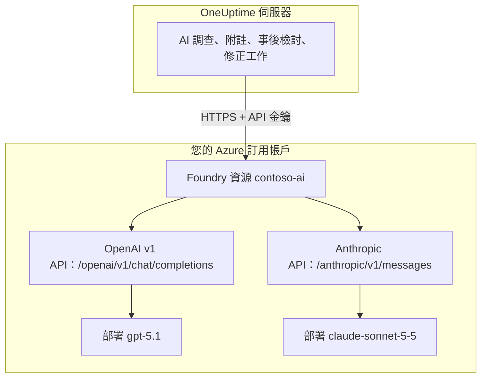

# Microsoft Foundry 與 Azure OpenAI

讓 OneUptime 的 AI 功能執行在您部署於 Microsoft Foundry（舊稱 Azure AI Foundry）或 Azure OpenAI 的模型上。OneUptime 會把每個要求直接傳送到您 Azure 訂用帳戶中的資源，因此提示詞和回答都由您選定的部署、在您選定的位置處理。本頁帶您從一個空的訂用帳戶走到一個可用的提供商：Azure 資源、模型部署、端點和金鑰、OneUptime 的設定、網路，以及要求失敗時該怎麼辦。

:::cards
- [設定 Azure](#設定-microsoft-foundry): 建立資源、部署模型、複製端點和金鑰。
- [連線 OneUptime](#連線-oneuptime): 在專案設定中填寫四個欄位，然後按測試按鈕。
- [自行託管](#用環境變數設定自行託管的執行個體): 用環境變數為所有專案註冊一個提供商。
- [疑難排解](#疑難排解): 401、403、找不到部署、api-version。
:::

## 運作方式

OneUptime 從 OneUptime 伺服器透過 HTTPS 呼叫您的 Foundry 資源，從不經由使用者的瀏覽器。每個要求都帶有資源的一個 API 金鑰，並指明由哪個部署來回答。



一種提供商類型 **Azure OpenAI / Microsoft Foundry** 即可涵蓋資源上的所有部署。基底 URL 告訴 OneUptime 要呼叫哪個 API：

| 您部署的模型 | OneUptime 呼叫的 API | 基底 URL |
| --- | --- | --- |
| OpenAI 模型，例如 GPT-5.1 和 GPT-4.1 | OpenAI v1 chat completions | `https://contoso-ai.openai.azure.com/openai/v1` |
| 支援 chat completions 的 Foundry Models，例如 DeepSeek 和 Grok | OpenAI v1 chat completions | `https://contoso-ai.services.ai.azure.com/openai/v1` |
| Claude | Anthropic Messages | `https://contoso-ai.services.ai.azure.com/anthropic` |

> [!IMPORTANT]
> OneUptime 的 AI 功能會呼叫工具：運作時會查詢您的監測器、事件和遙測資料。請部署支援工具呼叫（function calling）的模型。提供商的 **測試** 按鈕會替您檢查這一點。

## 開始之前

您需要一個 Azure 訂用帳戶、一個可以建立和讀取資源的角色，以及一個可以新增 LLM 提供商的 OneUptime 角色。

| 用途 | 在 Azure 中需要什麼 |
| --- | --- |
| 建立資源 | 資源群組上的 **Owner** 或 **Contributor**，或 **Foundry Account Owner** |
| 部署模型 | 資源群組上的 **Owner** 或 **Contributor**，或資源上的 **Foundry Owner** 或 **Foundry Account Owner**。Claude 另外需要訂閱 Azure Marketplace 供應項目的權限 |
| 讀取資源的金鑰 | 具有 `Microsoft.CognitiveServices/accounts/listKeys/action` 的角色，例如 **Owner**、**Contributor** 或 **Cognitive Services Contributor** |

OneUptime 本身不需要任何 Azure 角色。一個金鑰本身就能存取資源上的所有部署，不經過角色檢查，所以請像對待密碼一樣對待它。

在 OneUptime 中，為專案新增提供商需要 **Project Owner**、**Project Admin**、**Project Member**、**Settings Admin**、**Settings Member** 或 **Create LLM**。自行託管的執行個體也可以改用環境變數為所有專案註冊一個提供商，這需要能存取伺服器。

## 設定 Microsoft Foundry

:::steps
### 建立資源

在 [Foundry 入口網站](https://ai.azure.com) 中建立 Foundry 資源，或選擇既有的資源。Azure OpenAI 資源的用法相同。記下資源的名稱：它是端點的第一部分，例如 `https://contoso-ai.openai.azure.com` 中的 `contoso-ai`。

選擇提供所需模型的區域。暫時讓資源的網路存取對所有網路開放；[網路需求](#網路需求) 說明了何時以及如何關閉它。

### 部署模型

在 Foundry 入口網站中依序選擇 **Discover** 和 **Models**，然後選擇一個模型，例如 `gpt-5.1` 或 `claude-sonnet-5-5`。選擇 **Deploy**，再選擇 **Custom settings**：

- **Deployment name**：Foundry 會填入模型名稱。OneUptime 依這個名稱要求部署，所以請準確記下。
- **Deployment type**：決定在哪裡處理提示詞。請參閱 [資料在哪裡處理](#資料在哪裡處理)。

選擇 **Deploy**，等待部署狀態變成 **Succeeded**。

### 複製端點和一個金鑰

在 [Azure 入口網站](https://portal.azure.com) 中開啟資源，然後進入 **Resource Management** > **Keys and Endpoint**。複製 **Endpoint** 和 **KEY 1**。把 **KEY 2** 留作輪替之用：先把 OneUptime 切換到它，再重新產生 **KEY 1**。

在 Foundry 入口網站中，同一個金鑰位於部署的 **Details** 索引標籤上，就在其 **Target URI** 旁邊。
:::

:::details 偏好命令列？
用 Azure CLI 完成同樣的步驟。`--model-version` 填寫模型目錄為該模型列出的版本。

```bash
az cognitiveservices account create \
  --name contoso-ai --resource-group oneuptime-ai \
  --kind AIServices --sku S0 --location eastus2 \
  --custom-domain contoso-ai

az cognitiveservices account deployment create \
  --name contoso-ai --resource-group oneuptime-ai \
  --deployment-name gpt-5.1 \
  --model-name gpt-5.1 --model-version <version> --model-format OpenAI \
  --sku-name GlobalStandard --sku-capacity 50

# KEY 1
az cognitiveservices account keys list \
  --name contoso-ai --resource-group oneuptime-ai \
  --query key1 --output tsv
```

使用 `--custom-domain contoso-ai` 時，資源的端點是 `https://contoso-ai.openai.azure.com`。
:::

## 連線 OneUptime

:::steps
### 開啟 LLM 提供商

前往 **專案設定** > **人工智慧** > **LLM 提供商**，然後按一下 **建立LLM 提供商**。

### 為提供商命名

在 **基本資訊** 中輸入 **名稱**，例如 `Azure gpt-5.1`，如有需要再輸入 **描述**。按一下 **下一步**。

### 填寫供應商設定

| 欄位 | 填寫內容 |
| --- | --- |
| **LLM 提供商** | **Azure OpenAI / Microsoft Foundry** |
| **API 金鑰** | 資源的 **KEY 1** 或 **KEY 2** |
| **模型名稱** | 與 Foundry 顯示完全一致的部署名稱，例如 `gpt-5.1` |
| **基底 URL** | 資源端點加上 `/openai/v1`，例如 `https://contoso-ai.openai.azure.com/openai/v1`。Claude 使用：`https://contoso-ai.services.ai.azure.com/anthropic` |

**更多欄位** 下的 **設為預設** 已開啟：AI 功能使用專案的預設提供商。按一下 **建立LLM 提供商**。

### 測試連線

在提供商所在列按一下 **測試**。可用的提供商會回答 "Connection successful. The LLM provider responded to a test prompt and used tool calling." 如果測試失敗，訊息會說明 Azure 回傳了什麼、需要改什麼；請參閱 [疑難排解](#疑難排解)。
:::

完成後的提供商範例：

```text
名稱: Azure gpt-5.1
LLM 提供商: Azure OpenAI / Microsoft Foundry
API 金鑰: <contoso-ai 的 KEY 1>
模型名稱: gpt-5.1
基底 URL: https://contoso-ai.openai.azure.com/openai/v1
```

從現在起，專案的 AI 功能就使用這個部署。在 OneUptime Cloud 上，這些要求不從專案的 AI 額度扣款，而由 Azure 計入您的訂用帳戶帳單。

## 基底 URL 的格式

OneUptime 接受 Azure 入口網站和 Foundry 入口網站所顯示的各種形式的端點，並把每個要求傳送到右側的位址。請優先使用簡短的形式：基底 URL 最多可容納 100 個字元。

| 基底 URL | 要求送往 |
| --- | --- |
| `https://contoso-ai.openai.azure.com` | `https://contoso-ai.openai.azure.com/openai/v1/chat/completions` |
| `https://contoso-ai.openai.azure.com/openai/v1` | `https://contoso-ai.openai.azure.com/openai/v1/chat/completions` |
| `https://contoso-ai.services.ai.azure.com/openai/v1` | `https://contoso-ai.services.ai.azure.com/openai/v1/chat/completions` |
| `https://contoso-ai.openai.azure.com/openai/deployments/gpt-4o` | `https://contoso-ai.openai.azure.com/openai/deployments/gpt-4o/chat/completions?api-version=2024-10-21` |
| `https://contoso-ai.services.ai.azure.com/anthropic` | `https://contoso-ai.services.ai.azure.com/anthropic/v1/messages` |

- **v1 API**（`/openai/v1`）是 Microsoft 目前的 API。它不需要 `api-version`，把部署名稱當作模型，同樣服務 OpenAI 模型和其他 Foundry Models。新的提供商請使用它。
- **部署 URL**（`/openai/deployments/<name>`）本身就指明了部署，Azure 以這個名稱為準，而不是 **模型名稱**。除非基底 URL 自帶 `api-version`，否則 OneUptime 會加上 `api-version=2024-10-21`。以這種方式儲存的提供商照常運作。
- **部署的 Target URI** 從 Foundry 入口網站整段貼上也可以使用，只要不超過 100 個字元。
- **Claude**：Foundry 只透過 Anthropic Messages API 提供 Claude，位於資源的 `/anthropic` 路徑下。OneUptime 使用同一個金鑰呼叫它。提供商類型 **Anthropic** 用同樣的基底 URL 也能存取它。

## 用環境變數設定自行託管的執行個體

在自行託管的執行個體上，`GLOBAL_LLM_PROVIDER_*` 變數會在啟動時註冊一個全域 LLM 提供商，所有沒有自有提供商的專案都會使用它，AI 修正工作也不例外。專案自己的提供商一律優先。

```bash
GLOBAL_LLM_PROVIDER_TYPE=AzureOpenAI
GLOBAL_LLM_PROVIDER_NAME=Azure gpt-5.1
GLOBAL_LLM_PROVIDER_BASE_URL=https://contoso-ai.openai.azure.com/openai/v1
GLOBAL_LLM_PROVIDER_MODEL_NAME=gpt-5.1
GLOBAL_LLM_PROVIDER_API_KEY=<KEY 1 of contoso-ai>
```

:::tabs
@tab Docker Compose
把變數加入 `config.env`，然後依您當初啟動的方式重新啟動 OneUptime：

```bash
(export $(grep -v '^#' config.env | xargs) && docker compose up --remove-orphans -d)
```
@tab Kubernetes
把金鑰保存在 Secret 中，並透過圖表全域的 `extraEnv` 傳入變數：

```bash
kubectl create secret generic azure-foundry \
  --namespace oneuptime --from-literal=api-key='<KEY 1 of contoso-ai>'
```

```yaml title="values.yaml"
extraEnv:
  - name: GLOBAL_LLM_PROVIDER_TYPE
    value: AzureOpenAI
  - name: GLOBAL_LLM_PROVIDER_NAME
    value: Azure gpt-5.1
  - name: GLOBAL_LLM_PROVIDER_BASE_URL
    value: https://contoso-ai.openai.azure.com/openai/v1
  - name: GLOBAL_LLM_PROVIDER_MODEL_NAME
    value: gpt-5.1
  - name: GLOBAL_LLM_PROVIDER_API_KEY
    valueFrom:
      secretKeyRef:
        name: azure-foundry
        key: api-key
```

接著用這些值執行 `helm upgrade`。
:::

提供商會跟隨變數變化：修改變數後，它會在下次啟動時更新；移除 `GLOBAL_LLM_PROVIDER_TYPE` 後，它會被刪除。如果這種類型缺少金鑰或基底 URL，啟動記錄會指出。所有變數和提供商類型請參閱 [LLM 提供商](/docs/ai/llm-provider)。

## 網路需求

OneUptime 伺服器會透過 443 連接埠，向資源的主機名稱（例如 `contoso-ai.openai.azure.com` 或 `contoso-ai.services.ai.azure.com`）建立 HTTPS 連線。請在防火牆或 Proxy 中允許這些輸出流量。

- **OneUptime Cloud** 透過網際網路存取資源，因此資源必須接受公用流量。若要讓資源不暴露在網際網路上，請自行託管 OneUptime。
- **自行託管，私人端點**：把資源放在 OneUptime 伺服器可以存取的虛擬網路中的私人端點之後，並把私人 DNS 區域 `privatelink.openai.azure.com`、`privatelink.services.ai.azure.com` 和 `privatelink.cognitiveservices.azure.com` 連結到該網路，讓資源平常的主機名稱解析為其私人位址。基底 URL 保持不變。
- **私人位址**：除非設定了 `DATA_SOURCE_BLOCK_PRIVATE_ADDRESSES=true`，自行託管的執行個體會連線到私人位址。全域 LLM 提供商在任何情況下都會連線到它們。
- **資源上的網路規則**：在資源的 **Networking** 中，**Selected networks and private endpoints** 會擋下其他所有流量。被規則拒絕的要求會以 403 失敗。

## 資料在哪裡處理

部署模型時選擇的部署類型，決定 Azure 在哪裡處理 OneUptime 的提示詞和模型的回答。靜態儲存的資料會保留在資源所在的 Azure 地理位置內。

| 部署類型 | 提示詞和回答的處理位置 |
| --- | --- |
| Global Standard, Global Provisioned | 任何 Azure 區域 |
| Data Zone Standard, Data Zone Provisioned | 僅在資料區域內：美國、歐盟或亞太地區 |
| Standard, Regional Provisioned | 資源所在的 Azure 地理位置內 |

Claude 部署分為 **Hosted on Azure** 和 **Hosted on Anthropic** 兩種。選擇 **Hosted on Azure** 可讓提示詞和回答留在 Azure 內。詳情請參閱 Microsoft 的 [部署類型](https://learn.microsoft.com/en-us/azure/foundry/foundry-models/concepts/deployment-types)。

## 要求和回應範例

若要在 OneUptime 之外檢查某個部署，請用 `curl` 向它傳送 OneUptime 所傳送的要求：

:::tabs
@tab OpenAI v1 API
```bash
curl https://contoso-ai.openai.azure.com/openai/v1/chat/completions \
  -H "Content-Type: application/json" \
  -H "api-key: $AZURE_API_KEY" \
  -d '{
    "model": "gpt-5.1",
    "messages": [
      { "role": "user", "content": "Reply with the word: OK" }
    ]
  }'
```

回應（已刪節）：

```json
{
  "id": "chatcmpl-7R1nGnsXO8n4oi9UPz2f3UHdgAYMn",
  "object": "chat.completion",
  "model": "gpt-5.1",
  "choices": [
    {
      "index": 0,
      "finish_reason": "stop",
      "message": { "role": "assistant", "content": "OK" }
    }
  ],
  "usage": { "prompt_tokens": 12, "completion_tokens": 2, "total_tokens": 14 }
}
```
@tab Anthropic API
```bash
curl https://contoso-ai.services.ai.azure.com/anthropic/v1/messages \
  -H "Content-Type: application/json" \
  -H "x-api-key: $AZURE_API_KEY" \
  -H "anthropic-version: 2023-06-01" \
  -d '{
    "model": "claude-sonnet-5-5",
    "max_tokens": 1024,
    "messages": [
      { "role": "user", "content": "Reply with the word: OK" }
    ]
  }'
```

回應（已刪節）：

```json
{
  "id": "msg_01XFDUDYJgAACzvnptvVoYEL",
  "type": "message",
  "role": "assistant",
  "model": "claude-sonnet-5-5",
  "content": [{ "type": "text", "text": "OK" }],
  "stop_reason": "end_turn",
  "usage": { "input_tokens": 14, "output_tokens": 4 }
}
```
:::

OneUptime 自己的要求包含更多內容：它的指示、對話、模型可以呼叫的工具，以及權杖上限。它從回答中讀取文字、工具呼叫、模型停止的原因和權杖用量，這些用量會在 **專案設定** > **人工智慧** > **AI 日誌** 中逐一要求列出。提供商的 **其他參數** 會加入每個要求。

## Microsoft Entra ID 與不使用金鑰的資源

OneUptime 使用資源的一個 API 金鑰登入資源。尚不支援以服務主體或受控識別透過 Microsoft Entra ID 登入。

如果您的組織為 AI 資源關閉了金鑰存取（`disableLocalAuth`），要求會以 `AuthenticationTypeDisabled` 失敗。請在 OneUptime 使用的資源上允許金鑰存取，或者在資源前面放置 Azure API Management：

1. 把資源的部署作為 Azure OpenAI API 匯入 API Management。之後 API Management 會用自己的受控識別登入資源。
2. 把該 API 的訂用帳戶金鑰標頭名稱設為 `api-key`。
3. 在 OneUptime 中，把 **基底 URL** 設為 API Management 中該部署對應的 API 位址，例如 `https://contoso-apim.azure-api.net/aoai/openai/deployments/gpt-5.1`，並像任何部署 URL 一樣帶上部署所需的 `api-version`。把 **API 金鑰** 設為一個 API Management 訂用帳戶金鑰。

只接受 Microsoft Entra ID 的 Claude 模型（例如 Claude Mythos）暫時還不能使用。

## 疑難排解

OneUptime 會把需要修改的內容放在錯誤的開頭，後面接著 Azure 自己的回答。**測試** 按鈕會顯示完整的錯誤；**AI 日誌** 保存前 490 個字元。

:::details "Azure did not accept the API key" (401)
金鑰錯誤、已重新產生，或屬於另一個資源。請從基底 URL 所指資源的 **Keys and Endpoint** 重新複製 **KEY 1**，並貼到 **API 金鑰** 中。
:::

:::details "Key-based authentication is turned off for this resource" (403)
Azure 回傳了 `AuthenticationTypeDisabled`：該資源只接受 Microsoft Entra ID。請參閱 [Microsoft Entra ID 與不使用金鑰的資源](#microsoft-entra-id-與不使用金鑰的資源)。
:::

:::details "Azure refused the request" (403)
資源上的網路規則擋下了要求。請對照 [網路需求](#網路需求) 檢查資源的 **Networking** 設定。
:::

:::details "This resource has no deployment named ..." (404)
Azure 回傳了 `DeploymentNotFound`。請把 **模型名稱** 設為與 Foundry 入口網站所列完全一致的部署名稱。幾分鐘內剛建立的部署可能還沒準備好。如果基底 URL 是部署 URL，需要檢查的是 `/openai/deployments/` 後面的名稱。
:::

:::details "Azure found nothing at this address" (404)
基底 URL 沒有指向任何 Azure OpenAI API。請使用資源端點加上 `/openai/v1`，例如 `https://contoso-ai.openai.azure.com/openai/v1`。已停止提供的 Azure AI Inference SDK 的模型推論端點（`/models`）不屬於此類：請在同一資源上使用 `/openai/v1`。
:::

:::details "This model needs api-version ... or later" (400)
部署 URL 在未指定其他版本時會要求 `api-version=2024-10-21`，而較新的模型（例如 o 系列和 GPT-5）會拒絕這麼舊的版本。請把基底 URL 改為 v1 API `https://contoso-ai.openai.azure.com/openai/v1`，並把部署名稱填入 **模型名稱**。或者把 Azure 指出的版本（例如 `?api-version=2024-12-01-preview`）加到基底 URL 上。
:::

:::details "Azure's v1 API takes no dated api-version" (400)
基底 URL 以 `/openai/v1` 結尾，同時還帶有含日期的 `api-version`。請從基底 URL 中移除 `api-version`。
:::

:::details "基底 URL 不得超過 100 個字元。"
帶有 `api-version` 的 Target URI 往往比這更長。請使用資源端點加上 `/openai/v1`，並把部署名稱填入 **模型名稱**。
:::

:::details "...could not be reached" 或 "...host name could not be resolved"
OneUptime 伺服器無法連線到資源。在 OneUptime Cloud 上，資源必須能從網際網路存取。在自行託管的執行個體上，請檢查伺服器能否解析資源的主機名稱（使用私人端點時透過私人 DNS 區域），以及是否允許輸出 HTTPS。
:::

:::details 要求過多 (429)
部署的每分鐘權杖配額已用完。AI 功能會等待後重試，在約五分鐘內最多嘗試十次，然後才回報失敗；**測試** 按鈕會更早放棄。請在 Foundry 入口網站中提高部署的配額，或把它改為其他部署類型。
:::

## 後續步驟

:::cards
- [LLM 提供商](/docs/ai/llm-provider): 所有提供商類型，以及專案如何選用其中之一。
- [AI SRE](/docs/ai/ai-sre): 使用此提供商執行的調查。
- [Ask AI](/docs/ai/ask-ai): 關於您系統的問題，在儀表板中獲得回答。
:::
