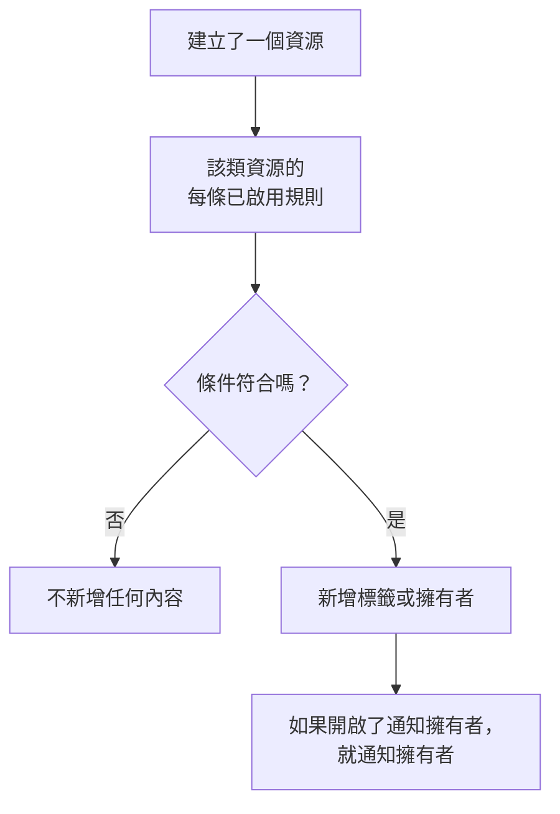

# 標籤與擁有者規則

標籤規則和擁有者規則會替您整理資源。**標籤規則** 會為每個符合規則的新資源加上標籤，**擁有者規則** 會將使用者和團隊新增為該資源的擁有者。如此一來，新的資料庫事件就會被加上 _Database_ 標籤並歸資料庫團隊所有，而不需要任何人記得去做。

:::cards
- [建立規則](#建立規則): 兩個步驟：先選擇規則比對什麼，再選擇它新增什麼。
- [繼承標籤和擁有者](#繼承標籤和擁有者): 沿用事件的監測器、主機和服務所帶有的標籤和擁有者。
- [規則何時執行](#規則何時執行): 對新資源執行，對既有資源則使用 **Run Now**。
:::

## 運作方式

規則會在資源建立時執行。每條已啟用的規則都會用自己的條件檢查新資源，每條符合的規則都會新增它要新增的內容。

標籤和擁有者決定了您如何篩選和分組資源、OneUptime 會就這些資源通知誰，以及 [依標籤限定和依擁有權限定的權限](/docs/permissions/index) 能涵蓋哪些資源。規則讓它們保持一致，而不需要任何人記得去做。

## 在哪裡找到規則

每個具有標籤和擁有者的產品都有這兩種規則，位於其 **設定** 下（在事件、警示和排定維護中位於 **規則** 下）：監測器、事件和事件片段、警示和警示片段、排定維護事件、狀態頁面、服務、主機、Kubernetes 叢集、Docker 主機、Docker Swarm 叢集、Podman 主機、Proxmox 叢集、VMware vCenter、Ceph 叢集、儲存陣列、資料庫、佇列、IoT 裝置群、無伺服器函式、雲端資源、RUM 應用程式、儀表板、待命策略、待命排程、來電策略、工作流程、運行手冊、網路設備和 SLO。

例如，監測器標籤規則位於 **監測器 → 設定 → 標籤規則**，事件標籤規則位於 **事件 → 規則 → 標籤規則**。**設定** 和 **規則** 在側邊選單中預設為摺疊：點選該區段的標題即可展開。事件和警示頁面有一個 **Incident Rules**（或 **Alert Rules**）分頁和一個 **Episode Rules** 分頁。

## 建立規則

每條標籤規則和擁有者規則都以相同的方式分兩個步驟建立。

:::steps
### 開啟規則清單

開啟產品的 **標籤規則** 或 **擁有者規則** 頁面，點選以規則命名的建立按鈕，例如 **建立Monitor Label Rule**。

### 選擇規則比對什麼

在 **比對** 步驟中，為資源必須符合的每個條件點選一次 **新增條件**。有兩個以上的條件時，選擇 **符合全部** 或 **符合任一**。沒有條件的規則會符合每個新資源。

### 選擇規則新增什麼

在 **標籤** 步驟中，選擇 **要新增的標籤**。在擁有者規則中，這個步驟是 **擁有者**：**新增擁有者** 會開啟一份包含人員和團隊的清單。

**名稱** 會依您的選擇自動填入（*新增 Production*、*將 Platform 新增為擁有者*），並隨您的選擇而變化，直到您輸入自己的名稱為止。只做繼承的規則則會以其繼承來源命名（見下文）。

### 檢查摺疊的欄位

**更多欄位** 中有選填的 **描述**，在擁有者規則中還有預設開啟的 **通知擁有者**：規則新增的擁有者會收到與手動新增的擁有者相同的「您已被新增為擁有者」通知。關閉它即可在不通知的情況下新增擁有者。

### 儲存規則

在最後一個步驟中，再次點選以規則命名的按鈕，例如 **建立Monitor Label Rule**。規則建立後即為啟用狀態，清單中會顯示綠色的 **已啟用** 標記。
:::

新規則必須新增一些內容：至少一個標籤（或擁有者），或者在事件、警示或排定維護規則中，至少繼承一項內容（見下文）。若要暫停規則而不刪除它，請在其編輯表單中關閉 **已啟用**；清單接著會顯示紅色的 **已停用** 標記。

### 無論規則如何建立

透過 API、Terraform、工作流程或 [標籤規則匯入](/docs/configuration/label-rule-import-export) 建立的規則也是如此：OneUptime 會拒絕不新增任何內容的新規則，並傳回一則說明需要填寫哪些欄位的訊息。無論使用哪種語言，這些訊息都以英文顯示。

| 規則 | 訊息 |
| --- | --- |
| 標籤規則 | This label rule adds nothing. Choose at least one label in Labels to Add. |
| 事件、警示或排定維護標籤規則 | This label rule adds nothing. Choose at least one label in Labels to Add, or turn on an Inherit Labels switch. |
| 擁有者規則 | This owner rule adds nothing. Choose at least one user or team in Owner Users or Owner Teams. |
| 事件、警示或排定維護擁有者規則 | This owner rule adds nothing. Choose at least one user or team in Owner Users or Owner Teams, or turn on an Inherit Owners switch. |

- **API**：將 `labelsToAdd`（或 `ownerUsers` / `ownerTeams`）設為專案中的至少一筆紀錄，或將規則的某個 `inheritLabelsFrom…`（`inheritOwnersFrom…`）開關設為 `true`（JSON 布林值）。
- **Terraform**：沒有任何新增內容的標籤規則或擁有者規則資源會在 `terraform apply` 時失敗，並顯示上述訊息。請為其設定 `labels_to_add`（或 `owner_users` / `owner_teams`），或開啟其中一個繼承開關。

既有的規則不受影響，請參閱 [編輯規則](#編輯規則)。

## 繼承標籤和擁有者

事件、警示和排定維護規則還可以沿用事件所涉及資源上的標籤和擁有者。在 **要新增的標籤**（或 **擁有者**）下方，摺疊的 **繼承標籤**（或 **繼承擁有者**）區段包含六個開關：

- **從監測器繼承標籤**：事件的監測器上的每個標籤也會附加到事件上。警示只有一個監測器，因此在警示規則中，這個開關是 **從監測器繼承標籤**（在警示擁有者規則中則是 **從監測器繼承擁有者**）。
- **從主機繼承標籤**、**從 Kubernetes 叢集繼承標籤**、**從 Docker 主機繼承標籤**、**Inherit Labels From Podman Hosts** 和 **從服務繼承標籤** 會對相應的資源做同樣的事。

擁有者規則也有同樣的六個開關，用於擁有者（**從監測器繼承擁有者** 等）。在沒有開啟任何開關時，摺疊的區段會說明其用途；在會繼承的規則上，它會自動展開。片段規則沒有繼承開關。

會繼承的規則可以讓 **要新增的標籤**（或 **擁有者**）保持空白：它會新增繼承到的內容。這樣的規則會以其繼承來源命名：

| 開啟的開關 | 名稱 |
| --- | --- |
| **從監測器繼承標籤** | *從 監測器 繼承標籤* |
| **從監測器繼承標籤** 和 **從主機繼承標籤** | *從 監測器, 主機 繼承標籤* |
| 警示規則上的 **從監測器繼承標籤** | *從 監測器 繼承標籤* |

名稱會隨開關而變化，直到您選擇一個標籤（之後規則會以其標籤命名）或輸入自己的名稱為止。

## 編輯規則

規則的編輯表單有同樣的兩個步驟，並多了 **已啟用** 開關。它不會強制要求規則新增內容：在 OneUptime 開始要求之前透過 API、Terraform、匯入或舊表單儲存的規則可能什麼都不新增，而編輯也可能移除規則新增的所有內容。

這樣的規則仍然可以重新命名、關閉或刪除，也可以透過 API 和 Terraform 進行。清單會在不新增任何內容的規則的狀態旁標示 **不新增任何內容**，規則本身的頁面也是如此。請編輯它以選擇要新增的內容，或將其刪除。

## 規則何時執行

每條已啟用的規則都會在資源建立時執行，無論資源是從儀表板還是透過 API 建立，每條符合的規則都會新增它要新增的內容：

- 多條符合的規則會新增它們所有的標籤和擁有者。
- 規則從不移除任何內容：既不移除他人手動新增的標籤或擁有者，也不移除它自己新增的。
- 已停用的規則什麼也不做。

您今天撰寫的規則適用於之後建立的資源。若要將其套用到既有資源，請使用 **Run Now**，請參閱 [對現有資源執行規則](/docs/configuration/run-rules-now)。標籤規則也可以在專案之間複製，請參閱 [匯入和匯出標籤規則](/docs/configuration/label-rule-import-export)。

## 後續步驟

:::cards
- [對現有資源執行規則](/docs/configuration/run-rules-now): 將規則套用到您既有的資源。
- [匯入和匯出標籤規則](/docs/configuration/label-rule-import-export): 以 JSON 格式在專案之間複製標籤規則。
- [事件設定與自動化](/docs/incidents/settings): 事件可以執行的其他規則。
- [SLO 標籤和擁有者規則](/docs/slo/label-and-owner-rules): SLO 規則比對什麼。
:::
