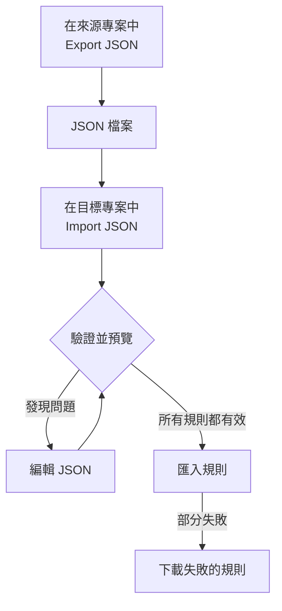

# 匯入和匯出標籤規則

以 JSON 檔案的形式在專案之間複製標籤規則，或一次建立多條規則。每個 **標籤規則** 頁面的 **更多選項**（**⋯**）選單中都有 **Export JSON** 和 **Import JSON** 動作，包括事件、警示、監測器和網路設備。唯一的例外是 VMware：它的 vCenter 標籤規則兩者都沒有。



## 匯出規則

開啟 **更多選項** 並選擇 **Export JSON**，即可下載目前專案中該類型的所有規則。匯出會包含表格其他頁面上的規則，並忽略表格篩選條件。

檔案會保留每條規則的啟用狀態、條件、要新增的標籤和標籤繼承選項。專案 ID、規則 ID 和稽核欄位不會包含在內。

連結的標籤、監測器和嚴重程度會以其確切名稱寫入。匯入不會建立它們：它們必須已存在於目標專案中。

## 匯入規則

:::steps
### 開啟 Import JSON

開啟目標專案的 **標籤規則** 頁面，選擇 **更多選項 → Import JSON**。

### 新增檔案

上傳 JSON 匯出檔案，或貼上其內容。

### 驗證並預覽

選擇 **Validate and preview**。在建立任何規則之前會檢查每條規則，且所參照的資源必須以唯一且相符的名稱存在於目標專案中。

### 檢閱預覽

檢查規則名稱、啟用狀態、標籤和條件。規模較大的批次會分頁顯示。若要更正內容，請選擇 **Edit JSON** 並重新驗證。

### 匯入

選擇顯示規則數量的匯入按鈕（例如 **Import 2 rules**），並保持視窗開啟，直到出現結果。
:::

匯入會新增新規則並保留既有規則，因此再次匯入同一個檔案會再建立一份副本。每條規則都適用一般的建立權限和伺服器驗證。

如果部分規則失敗，請選擇 **Download failed rules** 只儲存這些列，更正後再次匯入該檔案。如果要求逾時，請在重試前檢查規則清單：伺服器可能在回應遺失之前就已儲存了規則。

## 用 JSON 建立批次

匯出一條既有規則以取得適合您資源類型的範例，然後在 `items` 陣列中編輯或新增項目。這個範例會建立兩條監測器標籤規則。標籤 `Production` 和 `Infrastructure` 必須已存在於目標專案中。

```json title="monitor-label-rules.json"
{
  "fileType": "oneuptime-label-rules",
  "schemaVersion": 1,
  "resourceType": "MonitorLabelRule",
  "items": [
    {
      "name": "Production API monitors",
      "description": "Label production API monitors automatically",
      "isEnabled": true,
      "monitorNamePattern": "^api-prod-",
      "monitorLabels": [],
      "labelsToAdd": ["Production"]
    },
    {
      "name": "Database monitors",
      "isEnabled": false,
      "monitorNamePattern": "^database-",
      "labelsToAdd": ["Infrastructure"]
    }
  ]
}
```

| 欄位 | 內容 |
| --- | --- |
| `fileType` | 一律為 `oneuptime-label-rules`。 |
| `schemaVersion` | 一律為 `1`。 |
| `resourceType` | 檔案中規則的類型，例如 `MonitorLabelRule`。 |
| `items` | 規則，每條規則一個物件。檔案中至少需要一條。 |

`isEnabled` 使用 JSON 布林值，模式使用文字，連結的資源使用名稱陣列。

以下情況會在匯入步驟之前讓整個批次停止：無效的模式、未知的欄位、缺少名稱，以及模稜兩可的參照。不新增任何內容的規則（`labelsToAdd` 為空，且在事件、警示或排定維護規則中沒有任何 `inheritLabelsFrom…` 開關設為 `true`）也會如此，因為 OneUptime 拒絕建立這樣的規則（請參閱 [標籤與擁有者規則](/docs/configuration/label-and-owner-rules#無論規則如何建立)）。如果這樣的規則是在這項檢查出現之前儲存的，匯出中可能會包含它；請在匯入前為其新增標籤，或將其從檔案中移除。

> [!NOTE]
> 檔案和貼上的 JSON 上限為 10 MB。

## 在資源類型之間複製

在檔案中保留原本的 `resourceType`，並在目標頁面上開啟 **Import JSON**。相容的主要名稱或標題模式、描述模式和先決標籤會對應到目標的欄位，預覽會列出這些對應以便您檢閱。事件和警示的嚴重程度參照會與目標的嚴重程度名稱比對。

目標不支援的條件或動作會阻止匯入。例如，限定於特定監測器的事件規則，在未編輯這些條件的情況下無法複製為網路設備規則。

> [!WARNING]
> 網路設備和 SLO 標籤規則除了正規表示式之外還支援萬用字元比對。在這些規則與其他類型的規則之間轉移時，包含 `*` 或前後空白的模式會被拒絕，因為它們在那裡的比對方式不同。請為目標編輯這些模式，或在同一資源類型內使用該規則。網路設備和 SLO 標籤規則的比對方式相同，因此它們之間可以互換任何模式。

## 後續步驟

:::cards
- [標籤與擁有者規則](/docs/configuration/label-and-owner-rules): 標籤規則比對什麼、新增什麼。
- [對現有資源執行規則](/docs/configuration/run-rules-now): 將匯入的規則套用到您既有的資源。
:::
