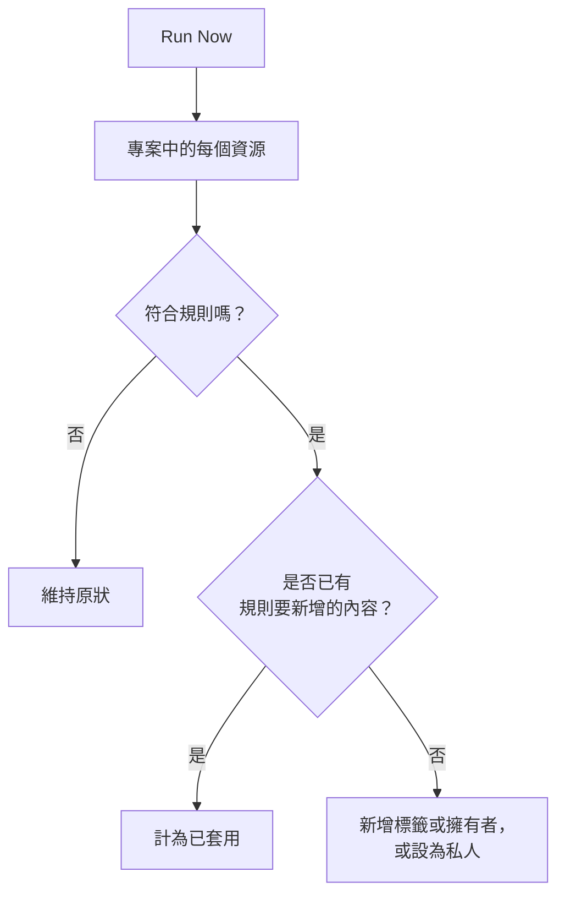

# 對現有資源執行規則

標籤規則、擁有者規則和隱私規則會在資源 **建立** 時自動執行。因此，您今天撰寫的規則不會對既有的監測器、事件或主機產生任何作用。**Run Now** 補上了這個缺口：它會將一條規則套用到專案中已存在的每個資源。

## 可以執行哪些規則

- **標籤規則** 和 **擁有者規則**，適用於所有具有這些規則的資源：監測器、事件、事件片段、警示、警示片段、排定維護事件、狀態頁面、服務、主機、Kubernetes 叢集、Docker 主機、Docker Swarm 叢集、Podman 主機、Proxmox 叢集、VMware vCenter、Ceph 叢集、儲存陣列、資料庫、佇列、IoT 裝置群、無伺服器函式、雲端資源、RUM 應用程式、儀表板、待命策略、待命排程、來電策略、工作流程、運行手冊、網路設備和 SLO。
- **隱私規則**，適用於事件、警示、事件片段和警示片段。
- 狀態頁面上的 **Monitor Rules**。每次儲存規則時，它們都會重新同步頁面；執行它會立即重新同步。
- SLO 上的 **Monitor Rules**。每次儲存規則時，它們都會重新同步 SLO；執行它會立即重新同步 SLO 的監測器。請參閱 [監測器與監測器規則](/docs/slo/monitor-rules)。

執行動作而非描述資源的規則（**待命規則**、**Runbook 規則**、**自動補救規則** 和 **分組規則**）無法對既有紀錄執行。執行它們會為已經結束的事件呼叫人員、執行運行手冊、啟動修復或重新組織片段。

## 開始之前

若要執行規則，您需要編輯該規則的權限 **和** 編輯它所變更資源的權限。例如，監測器標籤規則同時需要監測器標籤規則的編輯權限和監測器的編輯權限。擁有者規則還需要新增擁有者的權限。狀態頁面或 SLO 上的監測器規則只需要編輯該規則的權限。

> [!IMPORTANT]
> 僅限於特定標籤或您所擁有資源的權限是不夠的：一次執行可能會變更專案中的每個資源。團隊封鎖清單的作用與其他地方相同，僅限於某些標籤的封鎖也會計入：執行會變更帶有這些標籤的資源，因此，如果對規則所變更資源的編輯設有帶標籤的封鎖，執行就會被拒絕。

在既有設備上執行網路的規則時，要求也相同。站點指派規則或設備標籤規則的 **Run Now** 需要編輯該規則的權限和 **Edit Network Device**。自動匯入規則的 **Dry Run** 和 **Run Rule** 需要編輯該規則的權限、**Create Network Device**，以及在規則帶有監測器範本時的 **Create Monitor**。每項權限都必須涵蓋整個專案。請參閱 [使用自動匯入規則自動匯入](/docs/monitor/network-device-monitor#importing-automatically-with-auto-import-rules)。

## 執行一條規則

:::steps
### 開啟規則清單

開啟規則頁面，例如 **監測器 → 設定 → 標籤規則**。

### 選擇 Run Now

開啟規則所在列末端的 **⋯** 選單並選擇 **Run Now**，或選擇 **檢視**，然後在規則本身的頁面上選擇 **Run Now**。對話方塊會說明這次執行將做什麼。

### 選擇是否通知新擁有者

對於擁有者規則，選擇是否開啟 **Notify the owners this run adds**。它預設為關閉，且只有在規則本身開啟了 **通知擁有者** 時才會生效。擁有者每被新增到一個資源，就會收到一次通知。

### 執行規則

選擇 **Run Rule** 並保持對話方塊開啟。在大型專案中，對話方塊會顯示執行的進度。

### 閱讀報告

執行完成後，對話方塊會報告規則符合了多少資源、變更了多少資源，以及有多少資源已經具有規則要新增的內容。
:::

## 執行多條規則

在表格中選取規則，開啟批次動作選單並選擇 **Run Now**。所選的規則會依序執行。

- 批次執行所新增的擁有者永遠不會收到通知。若要通知他們，請改為單獨執行一條規則。
- 無法執行的規則（例如因為已停用）會連同原因一起列出，其他規則仍會執行。

## 執行會做什麼

- **它只會新增。** 附加標籤、新增擁有者、將資源設為私人。不會移除任何內容，也不會將任何內容設為公開，因此再次執行規則是安全的：第二次執行會報告所有內容都已套用。
- **會評估專案中的每個資源**，包括已解決的事件和警示。
- **會略過既有擁有者**，絕不會重複新增。
- **只會新增您專案自己的標籤。** 規則指定的標籤如果已不再是專案的標籤，就會被略過，規則的其他標籤仍會新增。規則在新資源上執行時也是如此。
- **規則的套用方式與建立時相同**，包括從事件的監測器、主機和服務繼承的標籤和擁有者。如果資源有活動動態，動態中會記錄是哪條規則變更了它。
- **已停用的規則不會執行。** 請先啟用該規則。
- **狀態頁面監測器規則** 會新增它們符合的監測器，並移除它們先前新增但已不再符合的監測器。手動新增到頁面的監測器永遠不會被更動。
- **一次執行最多涵蓋 100,000 個資源。** 在更大的專案中，執行會停止並告知您；再次執行該規則即可繼續。

## 後續步驟

:::cards
- [標籤與擁有者規則](/docs/configuration/label-and-owner-rules): 撰寫執行所套用的規則。
- [匯入和匯出標籤規則](/docs/configuration/label-rule-import-export): 先從另一個專案匯入標籤規則。
- [事件設定與自動化](/docs/incidents/settings): 事件規則，包括隱私規則。
:::
