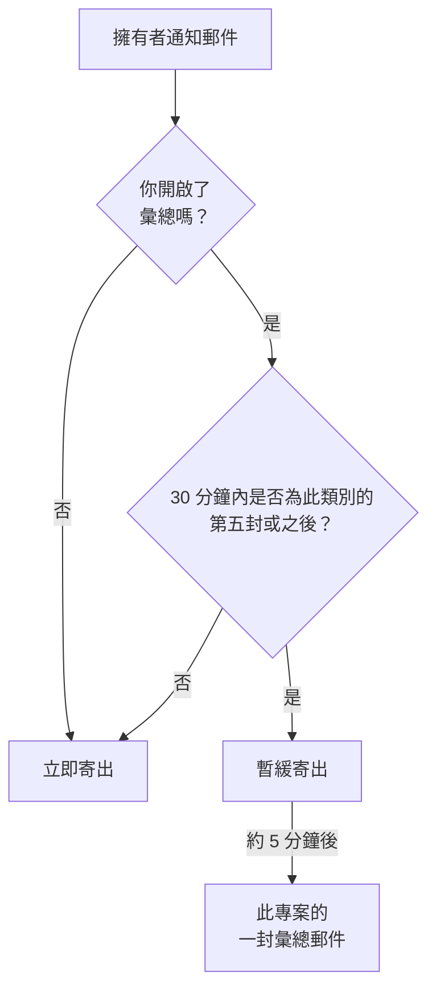

# 通知彙總

一旦出了大問題，通常不會只出一次。一條不穩定的上游連線讓 40 個監測器停擺，40 個事件被宣告、確認再解決，而每位擁有者在每一步都會收到一封郵件：一個收件匣塞進 200 封郵件，再也沒有人去讀。

OneUptime 會自動把這類集中湧入的通知彙總成一封郵件。它對所有人預設開啟，不需要任何設定；但如果你比較想讓每則通知都單獨寄成一封郵件，可以依專案[為自己關閉彙總](#為自己關閉彙總)。

:::cards
- [運作方式](#運作方式): 前四封郵件立即寄出，其餘的一起送達。
- [永遠不會被彙總的內容](#永遠不會被彙總的內容): 待命呼叫、安全性、帳務與訂閱者郵件。
- [關閉彙總](#為自己關閉彙總): 重新讓每則通知各自成為一封郵件。
- [減少例行郵件](#進一步減少郵件): 一次關閉資訊類郵件。
:::

## 運作方式

你收到的每一封擁有者通知郵件都會計入一個小額度，這個額度依專案、收件人、電子郵件地址與資源**類別**分別計算，類別包括事件、警示、監測器、排定維護、狀態頁面、探測器、SLO 等。



- 在任意 30 分鐘的時間範圍內，同一類別的**前四封**郵件會立即寄出，和以往完全相同：相同的主旨、相同的範本、相同的連結。
- 這段時間內的**第五封及之後**的郵件會暫緩寄出。
- 大約五分鐘後，這個專案中為你暫緩的所有通知（跨所有類別）會合併成**一封**郵件送達，列出發生了什麼事，並附上每個資源的連結。

彙總只包含寄出時你仍訂閱的通知。如果某個事件的通知還在佇列中時你關閉了它的郵件，這些通知就會從彙總中移除。之後重新開啟郵件，也不會補寄這些被略過的更新。

未達門檻時，這項功能什麼也不做。每天只產生三封擁有者郵件的專案，仍然會把這三封郵件分別寄出。

## 彙總郵件長什麼樣子

打開之前，主旨列就會告訴你這場通知風暴的規模*與類型*：

```text
[Acme Production] 112 notifications: 63 Monitors, 41 Incidents, 6 Alerts +2 more
```

郵件開頭的摘要卡片列出總數、彙總涵蓋的時間範圍，以及依類別的分布。下方依類別分成數個區段，最緊急的在前：先是事件，接著是警示，再來是發現它們的監測器與探測器。因此摘要下方的第一項，就是最值得先點開的一項。

每個區段以資源而非事件為單位，各占一列：

- **每一列顯示資源最後的狀態。** 如果一個事件先建立、再確認、最後解決，它只占一列，顯示最新狀態，這讓彙總比三封個別郵件*更*即時。
- **數字對得起來。** 每一列都標示最近一次更新的時間，合併了多筆更新的列會註明筆數，因此各區段與摘要卡片的總數永遠一致。
- **顯示嚴重性與狀態。** 警示與事件卡片會顯示其最新通知中的嚴重性與狀態，包括自訂名稱。缺少這些資訊的舊佇列通知仍會顯示，只是省略缺少的標籤。

時間以 UTC 顯示；彙總跨越多天時也會顯示日期。


## 永遠不會被彙總的內容

彙總只影響擁有者與成員通知，也就是「你負責的東西有了變化」這一類。它位在這些通知唯一經過的程式路徑中，其他通知都不經過那裡，所以影響不到任何其他內容。

永遠不延遲，也永遠不計數：

| 類別 | 範例 |
| ----------------------------------------- | ---------------------------------------------------------------------------------------------------- |
| 待命呼叫 | 每一次上報原則的呼叫，以及每一次確認請求 |
| 待命時間 | 「你現在正在待命」「下一個待命的是你」「你的班次即將開始」「你的班次已重新指派」 |
| 帳號安全性 | 重設密碼、驗證電子郵件、密碼已變更、雙重驗證備用碼被使用或重新產生 |
| 關於你帳號的管理通知 | 管理員變更了你的通知方式或待命規則 |
| 帳務與餘額 | 帳單、訂閱逾期、「由於信用卡遭拒，我們無法呼叫任何人」 |
| 執行個體健康狀態 | 寄給執行個體管理員的 Postgres、Valkey 與 ClickHouse 警告 |
| 狀態頁面訂閱者 | 你的狀態頁面寄給你自己的訂閱者的每一封郵件 |
| SLA 違約 | 雖然沿用「事件已建立」的通知類型，但會立即寄出 |

只有郵件受影響。簡訊、電話、推播通知、WhatsApp、Telegram、Slack、Microsoft Teams 與 Webhook 都會立即送達，和以往完全相同，即使是郵件被暫緩的那些通知也一樣。

## 限制

| 限制 | 值 |
| --- | --- |
| 一封彙總郵件中的通知數 | 最多 **500** 則。超出的部分留在佇列中，隨下一封彙總寄出，最多晚五分鐘。 |
| 一封彙總郵件中顯示的列數 | 最多 **100** 列。列依資源合併，因此相當於 100 個不同的資源；超出時，郵件會列出完整總數並連結到專案。 |
| 一個專案寄給一位收件人的彙總郵件 | 每小時最多 **12** 封。 |
| 暫緩的通知額外增加的延遲 | 最壞情況下約六分鐘。 |

每小時上限由資料庫而非計時器保證，因此即使通知風暴持續數小時也依然有效。

## 為自己關閉彙總

有些人喜歡合併寄送，也有人習慣在每則通知送達時立即歸檔，或把信箱交給會這樣處理的工具，而彙總郵件會打亂這種做法。因此彙總可以依人、依專案關閉。

:::steps
### 開啟郵件偏好設定

在專案中前往 **使用者設定 → 郵件偏好設定**，也就是每封彙總郵件底部連結開啟的頁面。

### 關閉 Email Rollup

在 **Email Rollup** 卡片中關閉開關。設定會自動儲存，接著卡片會顯示 "Off: every notification arrives as its own email, immediately."
:::

關閉後，這個專案中所有擁有者與成員通知郵件都會重新個別且立即寄給你：相同的主旨、相同的範本、相同的連結，沒有門檻，也沒有五分鐘的等待。關閉時已在佇列中等著寄給你的內容，仍會在幾分鐘後以最後一封彙總送達；之後的所有通知都逐封寄出。

這個開關**只屬於你，而且只作用於一個專案**。關閉它不會改變同事收到的內容，也不會影響其他專案。因此，吵雜的正式環境專案可以繼續彙總，而安靜的內部專案則逐封寄送，反之亦可。在每個人自己關閉之前，它對所有人都是開啟的。

它**不會**影響：

- **你會收到哪些通知。** 這由 **使用者設定 → 通知設定** 中依事件類型與管道的設定決定，就在隔壁頁面。彙總和這個開關只會改變這些通知被裝進幾封郵件。
- **待命呼叫與班次郵件**、**帳號安全性郵件**、**帳務郵件**、執行個體健康狀態警告，以及狀態頁面訂閱者郵件。這些本來就不會被彙總，所以關閉彙總對它們沒有任何影響，請參閱[永遠不會被彙總的內容](#永遠不會被彙總的內容)。
- **其他任何管道。** 簡訊、電話、推播、WhatsApp、Telegram、Slack、Microsoft Teams 與 Webhook 本來就是即時的。

## 進一步減少郵件

彙總會把例行更新打包在一起；你也可以乾脆不再接收其中大部分。

:::steps
### 從彙總郵件開啟偏好設定

開啟彙總郵件底部的偏好設定連結，或前往 **使用者設定 → 郵件偏好設定**。

### 選擇 Reduce routine emails

在 **Fewer routine emails** 卡片中選擇 **Reduce routine emails**。變更儲存後，卡片會顯示：**已關閉例行郵件。**
:::

這會在目前的專案中為你關閉以下資訊類郵件：

- 事件、警示、片段與排定維護中發布的備註。
- 你被新增為資源擁有者的通知。
- 新的監測器與狀態頁面。
- 新增到既有片段中的事件或警示。
- 被加入待命原則或從中移除。

你對事件與警示的建立、狀態變更、提醒、事件指派、監測器健康狀態以及待命班次的現有選擇都會保留，也不會重新開啟你已關閉的任何郵件。待命呼叫、其他送達管道、帳號郵件、帳務郵件以及狀態頁面訂閱者郵件皆不受影響。

這些變更會一起儲存。若要重新開啟某一封郵件，請檢查 **使用者設定 → 通知設定** 中依事件的開關。這些偏好設定同樣適用於正在等待彙總的通知；已寄出的郵件無法撤回。郵件彙總仍是獨立的設定，用來控制你保留的事件如何合併寄送。

## 疑難排解

:::details 一封通知郵件晚了幾分鐘才到
它是此類別在 30 分鐘內的第五封或之後的郵件，因此被暫緩，大約五分鐘後隨彙總寄出。請尋找同一專案的彙總郵件：這則通知是其中的一列。待命呼叫和其他管道並未延遲。
:::

:::details 我關閉了彙總，卻仍收到一封彙總郵件
關閉時已在佇列中等著寄給你的通知，會在幾分鐘後以最後一封彙總送達。之後的所有通知都逐封寄出。
:::

:::details 彙總郵件中少了我預期的某筆更新
每一列顯示資源的最新狀態，因此一個被建立、確認並解決的事件只占一列，並註明它合併的更新筆數。此外，如果你在通知排隊期間於 **使用者設定 → 通知設定** 中關閉了該事件的郵件，這則通知也會被移除。
:::

## 後續步驟

:::cards
- [SMTP 設定](/docs/emails/smtp): 透過你自己的郵件伺服器寄送 OneUptime 的郵件。
- [上報規則](/docs/on-call/escalation-rules): 待命呼叫如何送達到人，而且永遠不會被彙總。
:::
