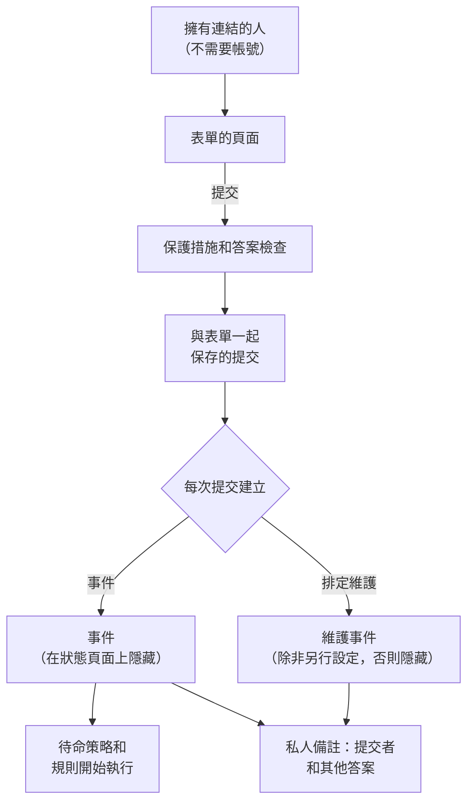

# 表單概覽

表單是一個頁面，任何擁有其連結的人都可以填寫，不需要 OneUptime 帳號。每次提交都會在您的專案中建立一項內容：問題回報會建立一個 **事件**，變更和維護要求會建立一個 **排定維護事件**。您可以在拖放式建構器中設計表單的問題，決定答案如何變成紀錄，並將連結分享給應該使用它的人。

當發現問題或需要變更的人，並不是負責處理事件和維護的人時，就可以使用表單：例如支援人員、其他部門的同事、門市經理或客戶的維運團隊。他們開啟連結、回答您的問題，然後按下 **提交**。您的團隊會收到一個一般的事件或維護事件，答案填在其欄位中，並附有一則記錄提交者身分的私人備註。

:::cards
- [建立您的第一個表單](#建立您的第一個表單): 從空白表單到可以分享的連結。
- [建構表單](/docs/forms/building): 問題、答案類型、隱藏的問題、範本和品牌。
- [提交會建立什麼](/docs/forms/on-submit): 答案和設定如何變成事件或維護事件。
- [分享與安全](/docs/forms/sharing-and-security): 連結、IP 允許清單、速率限制和疑難排解。
:::

## 表單的運作方式



每個要求都會先經過表單的保護措施：表單自己的頁面、速率限制、IP 允許清單和驗證碼。答案符合要求的提交會被保存，並建立一筆紀錄，這筆紀錄會依據答案、表單的 **提交時** 設定，以及（對於事件）其事件範本來填寫。在您的團隊做出決定之前，它建立的任何內容都不會出現在狀態頁面上。

## 概覽

- **獨立的產品** — **表單** 位於產品選單中，網址為 `/dashboard/{projectId}/forms`。每個表單都有自己的連結，在 OneUptime Cloud 上類似 `https://oneuptime.com/accounts/form/<share-key>`。
- **不需要帳號** — 任何擁有連結的人都可以開啟並提交表單，不需要登入。
- **是建構器，而不是設定頁面** — 新增您自己的問題（簡答、段落、下拉式選單、日期、核取方塊等）、表單所建立內容的欄位（標題、描述、嚴重程度、監測器、標籤、開始和結束時間）、您的自訂欄位，以及提交者的姓名和電子郵件。拖曳調整順序、預覽表單，然後儲存。
- **每個值從哪裡來由您決定** — **提交時** 頁面會列出新事件或維護事件的每個欄位及其來源：答案、預設值、一律套用的設定，或事件範本。
- **在有人發布之前保持隱藏** — 表單建立的事件在宣告時絕不會顯示在狀態頁面上，也不會寄送給訂閱者；維護事件也是如此，除非表單另有設定。
- **多層保護** — **接受提交** 開關、選用的 **IP 允許清單**、拒絕來自其他網站的要求、速率限制、執行個體的驗證碼，以及對每個答案的大小限制。
- **保留每一次提交** — 每個表單的 **提交紀錄** 頁面，以及彙整所有表單的 **表單 → 提交紀錄**，都會列出答案，並連結到每次提交所建立的內容。
- **您自己的品牌** — 在 **建構** 頁面的 **品牌** 區段上傳顯示在表單頁面頂端的標誌，以及顯示在瀏覽器分頁上的網站圖示。在您上傳之前，表單會顯示 OneUptime 的。
- **常見情況的範本** — 儲存具名的答案組，例如 **應用程式故障** 或 **計畫性維護**，大家可以在表單頂端選擇一個來填寫表單，或開啟該範本自己的連結。每個範本也可以針對其情況將某個問題設為必填、選填或隱藏。一個表單、一個書籤，就能服務整個團隊。
- **隱藏的問題** — 隱藏沒有人需要回答的問題（例如事件的描述），讓每個範本代為回答，或者只在需要它的情況下才提問。
- **複製表單** — 從一個運作良好的表單出發，連同其問題、範本和設定，為另一個團隊建立表單。

## 表單可以建立什麼

建立表單時，您要選擇 **每次提交建立** 什麼。之後可以在表單的 **提交時** 頁面上變更。

| 每次提交建立 | 用途 | 會發生什麼 |
| --- | --- | --- |
| **事件** | 問題回報 | 會立即宣告一個事件，因此您的待命策略和規則會執行，待命人員會收到通知。在回應者發布之前，它不會出現在狀態頁面上。 |
| **排定維護** | 變更和維護要求 | 會在提交者要求的時段內排定一個維護事件。除非表單另有設定，它不會出現在狀態頁面上，也不會通知任何訂閱者。 |

表單目前支援這兩種，未來還會支援更多類型的紀錄。

## 開始之前

- **包含表單的方案。** 在 OneUptime Cloud 上，表單需要 **Growth** 或更高的方案。請參閱 [方案](#方案)。
- **建立表單的權限。** **Create Form** 屬於專案擁有者和管理員，以及您授予該權限的角色。請參閱 [權限](#權限)。
- **事件表單需要嚴重程度。** 每個事件都需要一個嚴重程度：來自某個問題、表單的設定或其事件範本。沒有嚴重程度時，每次提交都會被拒絕。請參閱 [提交會建立什麼](/docs/forms/on-submit#how-a-submission-becomes-an-incident)。

## 建立您的第一個表單

:::steps
### 建立表單

從產品選單中開啟 **表單**，然後點選 **建立表單**。為表單命名（即其公開頁面的標題，在專案中必須是唯一的），選擇 **每次提交建立** 什麼，也可以選擇用 Markdown 撰寫描述，顯示在公開頁面的頂端。

### 建構問題

表單會在其 **建構** 頁面上開啟，已經在詢問標題、描述和提交者；如果是維護表單，還會詢問維護的開始和結束時間。新增、移除問題並調整順序，然後點選 **儲存變更**。請參閱 [建構表單](/docs/forms/building)。

### 決定提交會建立什麼

在 **提交時** 中，檢查提交如何變成事件或維護事件，然後點選 **編輯設定** 為其設定預設值：嚴重程度、事件範本、一律附加的監測器和標籤，以及要通知的擁有者。請參閱 [提交會建立什麼](/docs/forms/on-submit)。

### 如果經常回報相同的情況，新增範本

在 **範本** 中，為大家經常回報的每種情況儲存一個範本：表單會在問題上方列出這些範本，依據所選的範本自動填寫，並按照該範本的設定提問。某種情況需要的問題，可以在該情況的範本中設為必填，在其他範本中隱藏。請參閱 [範本](/docs/forms/building#templates)。

### 分享連結

在 **分享** 中複製連結，並寄給應該使用該表單的人。請參閱 [分享與安全](/docs/forms/sharing-and-security)。
:::

> [!IMPORTANT]
> 新表單一建立就處於 **接受提交** 狀態，但在您分享其連結之前，沒有人能存取它。請先設定好它的問題和保護措施。

## 表單的頁面

| 頁面 | 包含的內容 |
| --- | --- |
| **建構** | 表單的名稱和描述、摺疊的 **品牌**（標誌和網站圖示），以及建構器：問題、問題面板和 **預覽**。 |
| **範本** | 大家可以用來開始填寫表單的具名答案組、每個範本如何提問、表單開啟時使用的範本，以及每個範本自己的連結。 |
| **提交時** | 每次提交建立什麼，以及其每個欄位如何填寫。**編輯設定** 用於變更預設值和一律套用的內容。 |
| **分享** | **接受提交**、**分享連結**、提交後顯示的訊息，以及 **IP 允許清單**。 |
| **提交紀錄** | 透過該表單進行的每一次提交，最新的在前，並顯示答案和所建立的內容。 |
| **複製表單** | 位於 **進階** 下：表單的副本，會自動命名，帶有原表單的問題、範本、提交時設定、品牌、感謝訊息和 IP 允許清單，以及它自己的連結。副本建立時為關閉狀態，並在其建構器中開啟。 |
| **刪除表單** | 位於 **進階** 下，用於刪除表單。其提交紀錄會一併刪除，但它建立的事件和維護事件不會被刪除。 |

與其他所有資源一樣，表單選單的 **開發者** 區段包含其 Terraform、API 和 AI 助理頁面。

## 表單與事件範本

範本和表單都能讓您不必重複輸入同一個事件，但它們服務的是不同的人：

| | 事件範本 | 表單 |
| --- | --- | --- |
| 誰使用 | 您的團隊，已登入 OneUptime | 任何擁有連結的人，不需要帳號 |
| 在哪裡 | 事件清單上的 **從範本建立** | 表單連結對應的獨立頁面 |
| 能變更什麼 | 宣告前事件的每個欄位 | 只有您所選問題的答案 |
| 能看到什麼 | 您的監測器、策略、擁有者和每個欄位 | 表單的名稱、描述和問題，以及您選擇提供的選項 |
| 狀態頁面 | 由範本和宣告表單決定 | 在回應者發布事件之前保持隱藏 |

它們可以搭配使用。在事件表單的 **提交時** 頁面上為其指定一個 **事件 範本**，它宣告的每個事件都會以該範本宣告：用範本準備您的團隊在事件上需要的內容，用表單詢問您想問提交者的問題。

## 提交紀錄

表單的 **提交紀錄** 頁面會列出透過該表單進行的每一次提交，最新的在前，並顯示 **提交時間**、**提交者**（提交者填寫的姓名和電子郵件，或 **匿名**），以及 **已建立**（指向所建立的事件或維護事件的連結）。**檢視回答** 會依提交者填寫的原樣顯示每個答案。**表單 → 提交紀錄** 會列出專案中所有表單的提交。

提交由表單寫入，從不手動撰寫，也無法編輯。刪除一筆提交會從清單中移除其答案以及提交者的姓名和電子郵件；它建立的事件或維護事件會保留，其中重複記錄了提交者資訊和答案的私人備註也會保留。當事件或維護事件被刪除時，其提交會保留，其 **已建立** 欄會顯示 **之後已刪除**。

> [!WARNING]
> 移除某人的個人資料時，只刪除提交是不夠的：還要編輯或刪除該提交所建立的事件或維護事件上的私人備註。

## 權限

表單讓團隊以外的人可以在您的專案中建立事件和維護事件，因此表單由專案擁有者和管理員，以及您授予 **Form** 權限的角色來管理。這些權限位於 [權限參考](/docs/permissions/reference) 的 **Form** 群組中：

| 權限 | 允許的操作 | 預設擁有者 |
| --- | --- | --- |
| **Create Form** | 建立表單以及複製表單。 | Project Owner, Project Admin |
| **Edit Form** | 變更表單：其問題、品牌、範本、提交時設定、**接受提交**、連結和 **IP 允許清單**。 | Project Owner, Project Admin |
| **Delete Form** | 刪除表單，其提交紀錄也會隨之刪除。 | Project Owner, Project Admin |
| **Read Form** | 檢視表單及其問題、設定和連結。 | 以上角色，以及 Project Member、Viewer，和事件與排定維護相關的角色 |
| **Read Form Submission** | 檢視提交及其答案。 | Project Owner, Project Admin |
| **Delete Form Submission** | 刪除提交。 | Project Owner, Project Admin |

提交中包含陌生人輸入的內容（姓名、電子郵件地址，以及可能永遠不會進入紀錄的答案），因此除非您授予 **Read Form Submission**，否則只有專案擁有者和管理員能看到它們。任何能讀取表單的人都能看到並分享其連結。提交表單不需要任何權限。關於角色和細部權限如何組合，請參閱 [使用者、團隊與權限](/docs/permissions/index)。

## 方案

在 OneUptime Cloud 上，表單需要 **Growth** 或更高的方案，表單的 **IP 允許清單** 需要 **Scale**，無論是在建立表單時設定還是之後編輯時設定。低於 **Growth** 方案或訂閱未付款的專案，其連結會顯示無法使用的訊息，且不會建立任何內容。

## 透過 API 使用表單

表單是位於 `/api/form` 的一般 API 資源，其提交位於 `/api/form-submission`，提交可以讀取和刪除，但不能建立或編輯。[API 參考](/reference) 中有完整的要求和回應結構。

### 問題和設定

表單的問題在其 `fields` 欄中，這是一個依表單提問順序排列的 JSON 清單；其提交時設定在 `targetSettings` 中：

```json
{
  "data": {
    "targetType": "Incident",
    "fields": [
      {
        "id": "what",
        "source": "TargetField",
        "targetField": "title",
        "label": "What is wrong?",
        "isRequired": true
      },
      {
        "id": "office",
        "source": "Question",
        "type": "Dropdown",
        "label": "Which office are you in?",
        "dropdownOptions": "Berlin\nLondon",
        "isRequired": false
      },
      {
        "id": "email",
        "source": "Submitter",
        "submitterField": "Email",
        "label": "Your Email",
        "isRequired": true
      }
    ],
    "targetSettings": {
      "incidentSeverityId": "<severity-id>",
      "labelIds": ["<label-id>"]
    }
  }
}
```

每個問題都有自己的 `id`（字母、數字、`-` 和 `_`）、一個 `source`、一個 `label`，以及選用的 `helpText` 和 `isRequired`：

| `source` | 詢問的內容 |
| --- | --- |
| `Question` | 表單自己的問題，依 `type` 作答：`Text`、`LongText`、`Markdown`、`Number`、`Dropdown`、`MultiSelectDropdown`、`Boolean`、`Date` 或 `DateTime`。下拉式選單會列出其 `dropdownOptions`，每行一個。 |
| `TargetField` | 表單所建立內容的一個欄位，由 `targetField` 指定：事件為 `title`、`description`、`incidentSeverityId`、`monitors`、`labels` 和 `impactStartedAt`；維護事件為 `title`、`description`、`startsAt`、`endsAt`、`monitors`、`statusPages` 和 `labels`。透過選擇作答的欄位會在 `allowedOptionIds` 中列出其提供的紀錄。 |
| `TargetCustomField` | 事件或維護事件的某個自訂欄位，由 `customFieldId` 指定。 |
| `Submitter` | 提交者的 `Name` 或 `Email`，由 `submitterField` 指定。 |

`isHidden` 設為 `true` 的問題不會顯示在公開頁面上，永遠不是必填，只能由提交所指定的範本來回答，除非該範本會提出這個問題。`isRequired` 和 `isHidden` 是表單的預設值；每個範本都可以用自己的方式提出問題。

### API 中的範本

表單的範本在其 `templates` 欄中，這是一個依表單列出順序排列的 JSON 清單。每個範本都有自己的 `id`（字母、數字、`-` 和 `_`）、一個最多 100 個字元且在表單內唯一的 `name`，以及以問題 ID 為鍵的 `answers`，每個答案的格式與提交時傳送的相同：文字、數字、`true` 或 `false`、選項的值，或多選的值清單。將 `isDefault` 設為 `true` 會使其成為表單開啟時使用的範本；一個表單最多有一個這樣的範本，最多可有 50 個範本。

`fieldSettings` 同樣以問題 ID 為鍵，說明範本如何提出問題：`Required`、`Optional` 或 `Hidden`。範本未列出（或列為 `null`）的問題會依表單的方式提問，維護事件的 `startsAt` 和 `endsAt` 問題只能設為 `Required`：

```json
{
  "data": {
    "templates": [
      {
        "id": "outage",
        "name": "Application Outage",
        "isDefault": true,
        "answers": {
          "what": "The application is down",
          "office": "Berlin"
        },
        "fieldSettings": {
          "office": "Required",
          "email": "Optional"
        }
      }
    ]
  }
}
```

無論是從儀表板、API、Terraform 還是工作流程儲存，問題、範本和設定在每次儲存時都會被檢查，違反規則的清單會被拒絕，並附有說明問題所在的訊息。`shareKey` 是表單連結中的金鑰，由 OneUptime 在建立表單時設定，**重設連結** 就是用來變更它的。

### API 中的品牌

表單的品牌是其 `logoFileId`、`logoAltText` 和 `faviconFileId`。先在表單所在的專案中使用 `POST /api/file` 上傳圖片：使用該專案的 API 金鑰，或以該專案成員身分登入並在 `tenantid` 標頭中填入專案 ID。傳送其 `name`、`fileType`（例如 `image/png`），以及在 `file` 中以 base64 編碼的位元組，然後設定傳回的 `_id`。上傳到您不是其成員的專案會被拒絕，並顯示 "You can upload files only to a project you are a member of."。每次上傳都是私人的：無論要求中寫了什麼，`isPublic` 都由 OneUptime 設定。每張圖片會在儲存表單時檢查：它必須是在表單所在的專案中上傳的，標誌必須是 512 KB 或更小的 PNG、JPEG、GIF、WebP 或 SVG 圖片，網站圖示必須是上述格式之一或 128 KB 或更小的 ICO。將 ID 設為 `null` 即可恢復為 OneUptime 的。請參閱 [品牌](/docs/forms/building#branding)。

### 讀取提交紀錄

列出表單的提交紀錄：

```bash
curl -X POST https://oneuptime.com/api/form-submission/get-list \
  -H "apikey: $ONEUPTIME_API_KEY" \
  -H "Content-Type: application/json" \
  -d '{
    "query": { "formId": "<form-id>" },
    "select": { "submitterName": true, "submitterEmail": true, "answers": true, "incidentId": true, "scheduledMaintenanceId": true, "createdAt": true },
    "limit": 50,
    "skip": 0
  }'
```

### 工作流程

表單擁有自動產生的工作流程元件，例如 **On Create Form**、**On Update Form** 等。若要對表單建立的內容執行動作，請使用 **On Create Incident** 或 **On Create Scheduled Maintenance**。

### 公開頁面自己的端點

公開頁面會與兩個不需要 API 金鑰的路由通訊：`GET /api/form/public/<shareKey>` 會傳回表單的名稱、描述和問題，如果有的話，還會傳回其標誌、標誌的替代文字和網站圖示（圖片為 base64），以及其範本和這些範本對頁面所問問題的答案；`POST /api/form/public/<shareKey>/submit` 用於提交表單，並在 `templateId` 中指明提交者所使用的範本。它們是頁面自己的端點，而不是供您在其上建構的 API：每次呼叫都要經過表單的保護措施（請參閱 [分享與安全](/docs/forms/sharing-and-security)），且會隨頁面一起變更。若要從您自己的程式碼建立事件，請使用 API 金鑰呼叫 `POST /api/incident`，請參閱 [宣告事件](/docs/incidents/declaring-incidents)。

## 您的事件表單去了哪裡

表單取代了以前位於 **事件 → 設定 → 表單** 下的 **Incident Forms**。升級時，每個事件表單都已移轉過來，連結和提交紀錄維持不變：

- 它的問題變成了建構器中的問題：標題；描述（除非它被隱藏）；嚴重程度（如果提交者可以選擇）；它詢問的每個自訂欄位（依自訂欄位的排序順序）；以及 **Your Name** 和 **Your Email**，除非表單允許匿名回報，否則這兩項為必填。
- 它的嚴重程度和事件範本變成了 **提交時** 的預設值。
- 它的 **已啟用** 開關、成功訊息和 **IP 允許清單** 維持不變，連結也不變：舊的 `/accounts/incident-form/<share-key>` 連結會在新網址開啟表單。
- 對於擁有 **Incident Form** 權限的每個團隊和 API 金鑰，這些權限都變成了 **Form** 權限。

舊的儀表板頁面會重新導向到新頁面。

## 後續步驟

:::cards
- [建構表單](/docs/forms/building): 問題、答案類型、連結的欄位、自訂欄位和預覽。
- [提交會建立什麼](/docs/forms/on-submit): 答案和提交時設定如何變成事件或維護事件。
- [分享與安全](/docs/forms/sharing-and-security): 連結、IP 允許清單、速率限制、驗證碼和疑難排解。
- [宣告事件](/docs/incidents/declaring-incidents): 宣告事件的其他方式。
:::
