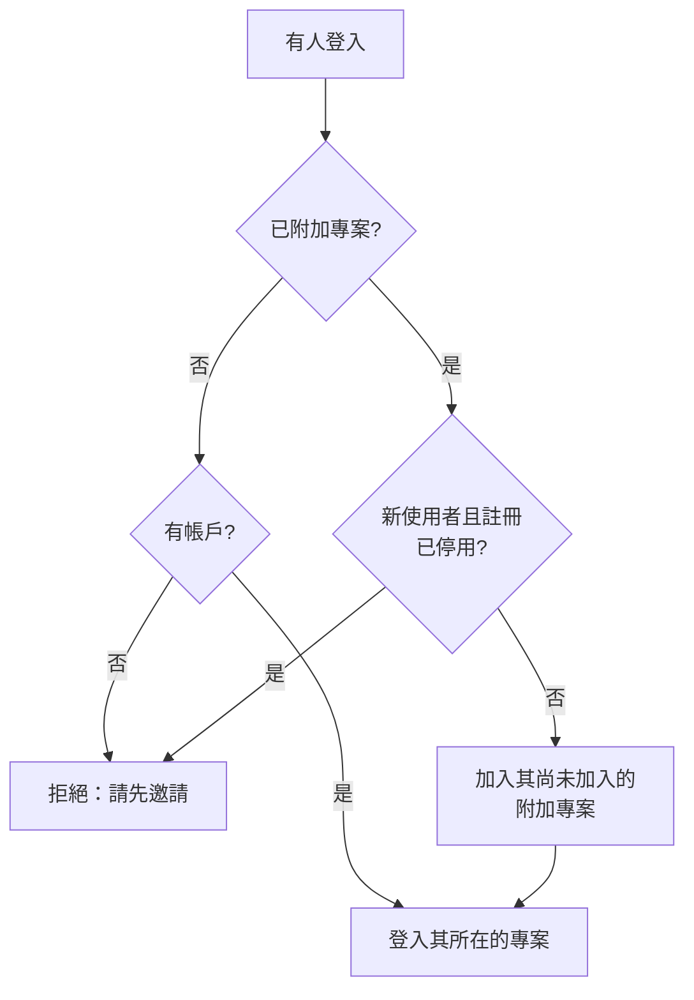

# 全域 SSO

全域 SSO 讓 OneUptime 的 **執行個體管理員**（主管理員）在執行個體層級 **一次性** 設定 SAML 2.0 或 OpenID Connect（OIDC）身分提供者，並將其連接到伺服器上的任何專案。不必讓每位專案擁有者各自設定身分提供者，由主管理員設定一個為整個執行個體服務的提供者即可。

> [!NOTE]
> 全域 SSO（包括整個執行個體的「Require SSO for Login」開關）屬於 OneUptime 的所有版本：每個自行託管的執行個體都有它，包括 Community Edition，不需要授權。它屬於執行個體管理功能，因此不適用於 OneUptime Cloud。各版本包含哪些功能，請參閱 [企業版](/docs/self-hosted/enterprise)。

:::cards
- [設定提供者](#設定全域-sso): 建立它，把 OneUptime 的 URL 交給身分提供者，然後進行測試。
- [使用者如何登入](#使用者如何登入): 僅限現有成員，或把新來的人加入您附加的專案。
- [強制使用 SSO](#強制使用-sso): 為一個專案或整個執行個體要求使用 SSO。
- [關閉提供者](#關閉或刪除提供者): 哪些會結束，以及 OneUptime 會拒絕哪些變更。
:::

## 全域 SSO 與專案 SSO 比較

|          | 專案 SSO                           | 全域 SSO                                     |
| -------- | ---------------------------------- | -------------------------------------------- |
| 設定者   | 專案擁有者/管理員（專案設定）       | 執行個體主管理員（Admin Dashboard）           |
| 範圍     | 單一專案                           | 整個執行個體，可連接到任何專案               |
| 登入結果 | 存取該單一專案                     | 存取使用者可以存取的所有專案                 |

單一專案自己的提供者，請參閱 [SSO](/docs/identity/sso)。

## 設定全域 SSO

:::steps
### 開啟提供者清單

:::tabs
@tab SAML
以主管理員身分登入，然後透過使用者選單中的 **管理員設定** 開啟 Admin Dashboard。接著前往 **設定** > **驗證** > **Global SSO**。
@tab OpenID Connect
以主管理員身分登入，然後透過使用者選單中的 **管理員設定** 開啟 Admin Dashboard。接著前往 **設定** > **驗證** > **Global OIDC**。
:::

### 建立提供者

:::tabs
@tab SAML
- 按一下 **Create Global SSO**。
- 輸入 **名稱**、身分提供者的 **Sign On URL** 和 **Issuer**，並貼上 **Public Certificate**。其餘內容已在 **更多欄位** 中填好：**Signature Method**（`RSA-SHA256`）、**Digest Method**（`SHA256`）以及描述（`Sign in with` 加上名稱）。僅在您的 IdP 需要時才變更它們。儲存後會開啟提供者的頁面。
@tab OpenID Connect
- 按一下 **Create Global OIDC**。
- 輸入 **名稱**、**Issuer URL**，以及您在 IdP 中註冊之應用程式的 **Client ID** 和 **Client Secret**。也可以把 IdP 的探索 URL 貼到 **Issuer URL** 中。其餘內容已在 **更多欄位** 中填好：**Discovery URL**（簽發者後接 `/.well-known/openid-configuration`）、**Scopes**（`openid email profile`）、`email` 和 `name` 宣告名稱，以及描述（`Sign in with` 加上名稱）。僅在您的 IdP 需要時才變更它們。儲存後會開啟提供者的頁面。
:::

### 把 OneUptime 的 URL 複製到身分提供者

:::tabs
@tab SAML
在提供者的頁面上，**Identity Provider URLs** 卡片會顯示 **ACS URL (Assertion Consumer Service / Reply URL)** 和 **Issuer (Entity ID)**。把兩者都貼到您的身分提供者中（Okta、Microsoft Entra ID、OneLogin、JumpCloud 等）。
@tab OpenID Connect
在提供者的頁面上，**Identity Provider URL** 卡片會顯示 **Redirect URI (Callback URL)**。把它加入身分提供者允許的重新導向 URI。
:::

### 開啟提供者

新的提供者預設為關閉狀態。在提供者的頁面上按一下 **Edit Configuration**，然後開啟 **已啟用**。

啟用全域提供者只會在登入頁面上新增一個「Sign in with SSO」選項——它從不強制使用 SSO，也不會把任何人鎖在外面，因此可以放心地啟用、測試，並在需要時再次停用。

### 測試提供者

使用 **Test this SSO provider** 卡片（OpenID Connect 為 **Test this OIDC provider**）中的連結，透過您的身分提供者完整地走一遍登入流程。您不需要先附加任何專案：測試會讓您登入您已加入的專案。提供者必須已啟用，連結才能使用。
:::

## 使用者如何登入

全域提供者的行為取決於您是否為其附加了專案：

- **未附加專案（所有專案 / 先邀請）：** 使用者可以使用該提供者登入，並存取 **其已是成員的任何專案**。新使用者 **不會** 被自動建立——使用者必須先被邀請加入某個專案。適用於成員資格在其他地方管理的全公司 SSO。

- **已附加專案（自動佈建）：** 開啟該提供者，並使用 **Attached Projects** 表格附加一個或多個專案，每個專案皆搭配一組預設團隊。登入的使用者會在首次登入時被**自動佈建**至這些專案，並加入預設團隊。附加的專案預設選取其成員團隊；如果新使用者應以不同的存取權限開始，請選擇其他團隊。一次新增一個專案及團隊以建立清單；若要變更某項附加設定，請將其刪除後再重新新增。

已經是某個附加專案成員的人，會保留其在該專案中的團隊。

提供者上的兩個開關會改變這個行為。兩者預設都是關閉狀態，並收合在 **更多欄位** 中：

| 開關 | 開啟時的作用 |
| --- | --- |
| **Disable Sign Up with SSO** | 即使已附加專案，人員也必須先被邀請加入某個專案，才能使用此提供者登入。首次登入時不會建立新使用者。 |
| **Restrict to Attached Projects** | 使用此提供者登入只會在附加到它的專案中滿足 SSO 要求，因此已經登入的人可能會失去對其他專案的存取權限。關閉時，它會在此人所屬的每個專案中滿足要求，附加專案只決定新來的人被加入到哪裡。 |

## 強制使用 SSO

設定全域提供者並不會強制任何人使用它；密碼登入仍然有效。若要要求使用 SSO，請為專案或整個執行個體開啟該要求：

- **依專案：** 專案可以要求使用 SSO，並可以選擇要求使用 _特定_ 的提供者（專案提供者或全域提供者）。請參閱 [為專案要求使用 SSO](/docs/identity/sso#為專案要求使用-sso)。
- **整個執行個體：** **Admin** > **設定** > **驗證** 中有一個 **登入時要求使用 SSO** 開關，可為執行個體中的每位使用者強制使用 SSO。開啟前它會要求您確認，確認後立即儲存。主管理員仍然不受此限制，因此不會被鎖在外面。

開啟 **登入時要求使用 SSO** 需要一個能讓人登入的 SSO 提供者，以免有人因此被鎖在外面：

- 對於整個執行個體，每個本身不要求使用 SSO 的專案都需要一個：專案自己的一個已開啟的 SAML 或 OIDC 提供者，或一個已開啟且能把人登入該專案的全域提供者。只要有專案沒有這樣的提供者，開啟該開關就會被拒絕，訊息會列出這些專案（數量很多時，列出前幾個以及總數）。請先開啟一個全域提供者，或這些專案中的提供者。要求特定提供者的專案需要的正是那個提供者：當它已關閉、已刪除或無法把人登入該專案時，訊息會單獨列出該專案——請先開啟那個提供者，或在那裡要求另一個提供者。
- 對於專案，同樣的要求適用於該專案，以及它要求的提供者（如果它要求了某個提供者）。
- 在 **登入時要求使用 SSO** 已開啟時仍以開啟狀態傳送它的儲存（與其他設定一起傳送，或來自 API）會以同樣的方式檢查，無論是針對執行個體還是專案；指定專案已經要求之提供者的儲存也是如此。
- 對於還沒有自己提供者的新專案：當執行個體要求使用 SSO 時，建立專案需要一個已開啟且能把人登入每個專案的全域提供者，否則包括建立者在內，沒有人能開啟該專案。沒有這樣的提供者時，建立專案會被拒絕，訊息會請伺服器管理員開啟一個。主管理員仍然可以建立專案。在 **登入時要求使用 SSO** 已開啟的情況下建立的專案也需要同樣的提供者，無論由誰建立。

關閉它永遠不會被拒絕。

## 關閉或刪除提供者

關閉全域提供者、刪除它，或將其限制為附加的專案，會在它不再讓人登入的地方結束透過它進行的登入。在要求使用 SSO 的地方，透過它登入的人必須在下次請求時重新使用 SSO 登入，他們開啟的頁面會立即停止接收即時更新，有人在透過它登入後連接的 MCP 用戶端也會在該專案中停止運作。

重新開啟提供者不會恢復這些登入：使用者需要再次透過它登入。升級時已經處於關閉狀態的提供者，會被視為在升級時被關閉。

新的憑證或用戶端密鑰、其他 URL 或新名稱都會讓所有人保持登入狀態。

### 每個要求使用 SSO 的專案都會保留一條進入的途徑

要求使用 SSO 的專案（無論是專案本身要求，還是因為整個執行個體要求）一律會保留一個人們可以用來登入它的提供者。因此，如果以下變更會讓這樣的專案完全沒有提供者，或奪走它要求的提供者，這些變更就會被拒絕：

- 關閉全域提供者、刪除它，或將其限制為附加的專案；
- 對於限制為附加專案的提供者：附加其第一個專案（在此之前，它會把人登入每個專案）、關閉某項附加設定、把附加設定移到另一個專案或提供者，或移除附加設定。

訊息會列出這些專案，或列出前幾個以及總數。請先為它們開啟另一個提供者（它們自己的或全域的），或在那裡關閉 **登入時要求使用 SSO**。要求的正是此提供者的專案會被單獨列出：請先在那裡要求另一個提供者，或關閉 **登入時要求使用 SSO**。

讓提供者能登入更多人的變更——開啟它或某項附加設定、解除限制——永遠不會被拒絕。這些變更會立即到達每個應用程式伺服器，就像關閉 **登入時要求使用 SSO** 一樣：人們可以立即透過該提供者登入。只有當恰好在同一時刻儲存了對同一提供者的另一項變更時，應用程式伺服器最多才可能需要一分鐘才能跟上。

關於誰可以登入的兩項變更會依序檢查。如果同一時刻正在儲存另一項變更且耗時比平常長（為整個執行個體開啟 **登入時要求使用 SSO** 會讀取每個專案），變更會被拒絕，並顯示 "Another change to who can sign in with SSO is being saved. Try again in a moment."：請再次儲存。在那一刻建立的專案也會等待該變更，如果等待時間過長，會被拒絕並顯示 "The server's SSO settings are being changed. Create the project again in a moment."

## 疑難排解

:::details "You must be invited to a project on this OneUptime instance before you can sign in with SSO"
此人還沒有 OneUptime 帳戶，而提供者也不會建立帳戶：要麼沒有專案附加到它，要麼 **Disable Sign Up with SSO** 已開啟。請邀請此人加入某個專案，或把一個專案附加到該提供者。
:::

:::details "This SSO provider does not grant access to any project you are a member of"
**Restrict to Attached Projects** 已開啟，而此人不是任何附加到該提供者之專案的成員。請附加此人的某個專案，或把此人加入某個附加專案。
:::

:::details "You are not a member of any project on this OneUptime instance"
此人有帳戶，但不屬於任何專案，而提供者也沒有可以把此人加入的地方。請邀請此人加入某個專案，或把一個帶有預設團隊的專案附加到該提供者。
:::

:::details "Issuer URL does not match"
對於 SAML 提供者，身分提供者回應中的簽發者不是提供者上儲存的 **Issuer**。請從身分提供者重新複製；兩者必須完全一致。
:::

## 後續步驟

:::cards
- [SSO](/docs/identity/sso): 設定專案自己的 SAML 或 OIDC 提供者。
- [SCIM](/docs/identity/scim): 讓身分提供者自動新增和移除人員。
- [使用者、團隊與權限](/docs/permissions/index): 新來的人加入的團隊允許他們做什麼。
:::
