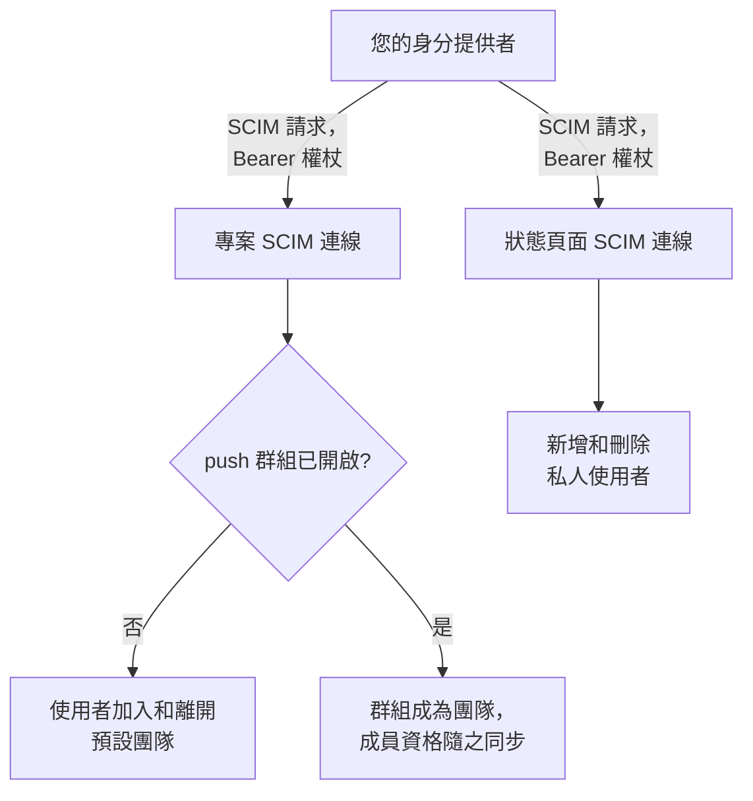
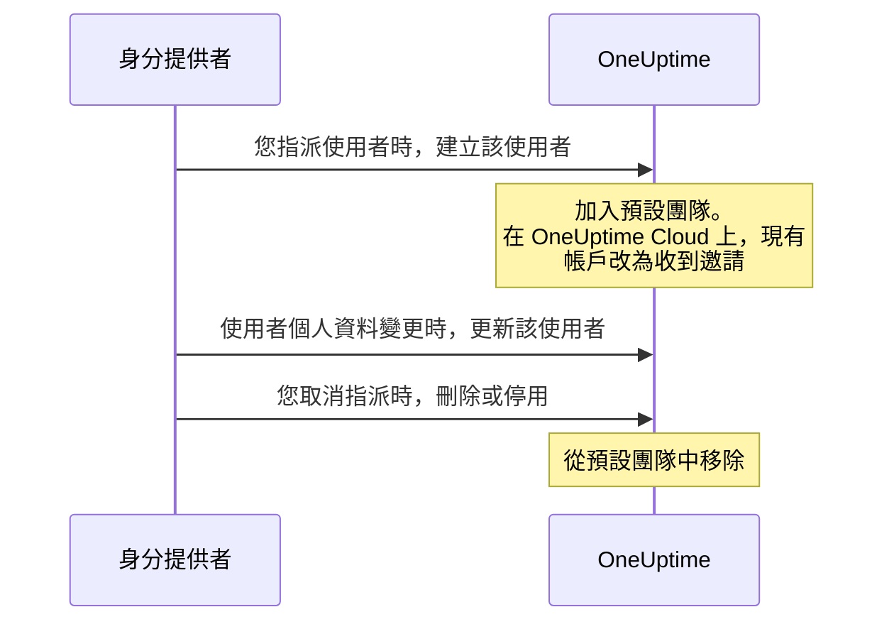
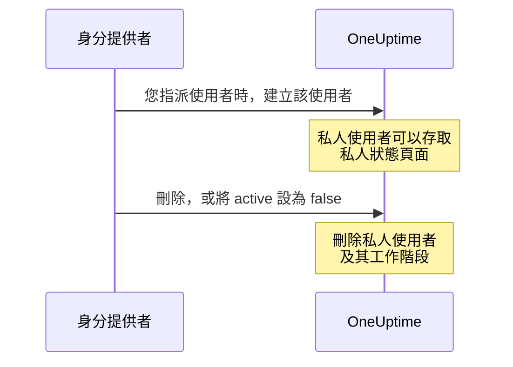

# SCIM

SCIM（System for Cross-domain Identity Management）會自動為人員佈建和取消佈建。您的身分提供者（IdP），例如 Microsoft Entra ID、Okta 或任何其他 SCIM 2.0 系統，會在您指派人員時把他們加入您的 OneUptime 專案和私人狀態頁面，並在您取消指派時將其移除。

> [!NOTE]
> **版本：** SCIM 屬於 OneUptime Enterprise Edition。在 OneUptime Cloud 上，**Scale** 及以上方案可用。自行託管的安裝需要 Enterprise Edition 映像檔和授權。請參閱 [企業版](/docs/self-hosted/enterprise)。如果沒有有效的授權（14 天試用期結束後，或授權到期 30 天後），SCIM 請求會被拒絕，直到啟用授權為止。

:::cards
- [設定專案 SCIM](#設定專案-scim): 建立連線，並把其 URL 和權杖交給您的 IdP。
- [設定狀態頁面 SCIM](#設定狀態頁面-scim): 為狀態頁面佈建私人使用者。
- [連接您的身分提供者](#連接您的身分提供者): Microsoft Entra ID 和 Okta 的逐步說明。
- [常見問題](#常見問題): 現有使用者、取消佈建、電子郵件地址變更。
:::

## 運作方式

每當您指派、變更或取消指派某人時，您的身分提供者都會使用 Bearer 權杖進行驗證，呼叫 OneUptime 的 SCIM 端點。請求變更的內容取決於連線所在的位置：



SCIM 整合提供以下優點：

- **自動佈建使用者**：在您的 IdP 中指派使用者時，會在 OneUptime 中建立該使用者。
- **自動取消佈建使用者**：在您的 IdP 中取消指派使用者時，會從 OneUptime 中移除該使用者。
- **使用者屬性同步**：使用者資訊在您的 IdP 和 OneUptime 之間保持一致。
- **集中式存取管理**：從您現有的身分管理系統管理 OneUptime 的存取權限。

SCIM 和 [SSO](/docs/identity/sso) 是彼此獨立的：SCIM 決定誰在專案中，SSO 決定他們如何登入。大多數組織會同時使用兩者。

## 專案 SCIM

專案 SCIM 讓身分提供者可以管理 OneUptime 專案中的團隊成員。

### 設定專案 SCIM

只有專案擁有者可以新增或變更專案的 SCIM 連線，或檢視或重設其 Bearer 權杖：透過 SCIM，您的身分提供者可以把人員加入專案中的任何團隊。
:::steps
1. **前往專案設定**

   - 進入您的 OneUptime 專案
   - 前往 **專案設定** > **安全性** > **SCIM**

2. **設定 SCIM**

   - 輸入 **名稱**。**預設團隊** 預設為專案的成員團隊：新使用者會被加入這些團隊
   - 在 **更多欄位** 中，**自動佈建使用者**（在您的 IdP 中指派使用者時新增使用者）和 **自動取消佈建使用者**（在您的 IdP 中取消指派使用者時移除使用者）為開啟狀態，**啟用 push 群組** 為關閉狀態。如有需要，請在那裡變更
   - 儲存。顯示用於 IdP 設定之 **SCIM Base URL** 和 **Bearer Token** 的對話方塊會立即開啟

3. **設定您的身分提供者**

   - 使用對話方塊中的 **SCIM Base URL**。在 OneUptime Cloud 上，它是 `https://oneuptime.com/identity/scim/v2/<scim-id>`；自行託管的安裝會顯示其自己的主機
   - 使用對話方塊中的 **Bearer Token** 設定 Bearer 權杖驗證
   - 對應使用者屬性（電子郵件為必填）。[連接您的身分提供者](#連接您的身分提供者) 中提供了 Microsoft Entra ID 和 Okta 的詳細資訊
:::

若要再次檢視這些 URL，請在連線所在列選擇 **檢視 SCIM URL**。**重設 Bearer Token** 會替換權杖；請用新權杖更新您的身分提供者。

### 專案使用者如何被佈建



已經有 OneUptime 帳戶的人，在 OneUptime Cloud 上接受邀請後即可加入（請參閱 [常見問題](#常見問題)）。透過連線預設團隊以外的團隊授予的存取權限不受影響。

## 狀態頁面 SCIM

狀態頁面 SCIM 讓身分提供者可以為能夠存取私人狀態頁面的狀態頁面私人使用者進行佈建和取消佈建。

### 設定狀態頁面 SCIM

:::steps
1. **前往狀態頁面設定**

   - 開啟 **狀態頁面** 並選擇您的狀態頁面
   - 前往 **安全性** > **SCIM**

2. **設定 SCIM**

   - 輸入 **名稱**。在 **更多欄位** 中，**自動佈建使用者**（在您的 IdP 中指派時新增私人使用者）和 **自動取消佈建使用者**（在您的 IdP 中取消指派時刪除私人使用者）為開啟狀態。如有需要，請在那裡變更
   - 儲存。顯示用於 IdP 設定之 **SCIM Base URL** 和 **Bearer Token** 的對話方塊會立即開啟

3. **設定您的身分提供者**

   - 使用對話方塊中的 **SCIM Base URL**。在 OneUptime Cloud 上，它是 `https://oneuptime.com/identity/status-page-scim/v2/<scim-id>`
   - 使用顯示的權杖設定 Bearer 權杖驗證
   - 對應使用者屬性（電子郵件為必填）
:::

若要再次檢視這些 URL，請在連線所在列選擇 **顯示 SCIM 端點 URL**。

狀態頁面 SCIM 只支援使用者，不支援群組或群組佈建。

### 私人使用者如何被佈建



> [!WARNING]
> 取消佈建會永久刪除狀態頁面私人使用者及其在該狀態頁面上的所有工作階段。如果之後再次指派該使用者，會將其作為新的私人使用者佈建。當 **自動取消佈建使用者** 為關閉狀態時，將 `active` 設為 `false` 的更新會被忽略，DELETE 請求會被拒絕。

## 連接您的身分提供者

下面的每個提供者都從在 OneUptime 中建立專案 SCIM 連線開始，然後把您的身分提供者連接到它。

### Microsoft Entra ID（舊稱 Azure AD）

Microsoft Entra ID 提供具備 SCIM 佈建的企業級身分管理。您需要：

- 擁有 Premium P1 或 P2 授權的 Microsoft Entra ID 租用戶（自動佈建需要）。
- OneUptime Cloud 上使用 **Scale** 或更高方案的 OneUptime 專案。
- Microsoft Entra ID 和 OneUptime 的管理員存取權限。

:::steps
#### 為 Entra ID 建立 SCIM 連線

1. 登入您的 OneUptime 儀表板
2. 前往 **專案設定** > **安全性** > **SCIM**
3. 按一下 **建立SCIM**
4. 輸入一個容易辨識的名稱（例如 "Microsoft Entra ID Provisioning"）
5. 檢查設定：
   - **預設團隊**：預設為專案的成員團隊；新使用者會被加入這些團隊
   - **自動佈建使用者** 和 **自動取消佈建使用者**：已開啟，位於 **更多欄位** 中
   - **啟用 push 群組**：位於 **更多欄位** 中；如果您想透過 Entra ID 群組管理團隊成員，請開啟它
6. 儲存設定
7. 從開啟的對話方塊中複製 **SCIM Base URL** 和 **Bearer Token**——在 Entra ID 中需要它們

#### 在 Entra ID 中建立企業應用程式

1. 登入 [Microsoft Entra admin center](https://entra.microsoft.com)
2. 前往 **Identity** > **Applications** > **Enterprise applications**
3. 按一下 **+ New application**，然後按一下 **+ Create your own application**
4. 輸入名稱（例如 "OneUptime"）
5. 選擇 **Integrate any other application you don't find in the gallery (Non-gallery)**，然後按一下 **Create**

#### 將 Entra ID 連接到 OneUptime

1. 在您的 OneUptime 企業應用程式中前往 **Provisioning**，按一下 **Get started**
2. 將 **Provisioning Mode** 設為 **Automatic**
3. 在 **Admin Credentials** 下，將 **Tenant URL** 設為 OneUptime 的 **SCIM Base URL**（例如 `https://oneuptime.com/identity/scim/v2/<scim-id>`），將 **Secret Token** 設為 **Bearer Token**
4. 按一下 **Test Connection** 驗證設定，然後按一下 **Save**

#### 在 Entra ID 中對應使用者屬性

1. 在 Provisioning 區段中按一下 **Mappings**，然後按一下 **Provision Azure Active Directory Users**
2. 設定以下屬性對應，移除不需要的對應，然後按一下 **Save**：

| Azure AD 屬性                                                 | OneUptime SCIM 屬性            | 是否必填 |
| ------------------------------------------------------------- | ------------------------------ | -------- |
| `userPrincipalName`                                           | `userName`                     | 是       |
| `mail`                                                        | `emails[type eq "work"].value` | 建議     |
| `displayName`                                                 | `displayName`                  | 建議     |
| `givenName`                                                   | `name.givenName`               | 選填     |
| `surname`                                                     | `name.familyName`              | 選填     |
| `Switch([IsSoftDeleted], , "False", "True", "True", "False")` | `active`                       | 建議     |

#### 在 Entra ID 中對應群組（選用）

如果您在 OneUptime 中開啟了 **啟用 push 群組**：

1. 返回 **Mappings**，按一下 **Provision Azure Active Directory Groups**
2. 將 **Enabled** 設為 **Yes**
3. 設定以下屬性對應，然後按一下 **Save**：

| Azure AD 屬性 | OneUptime SCIM 屬性 |
| ------------- | ------------------- |
| `displayName` | `displayName`       |
| `members`     | `members`           |

#### 在 Entra ID 中指派使用者和群組

1. 在您的 OneUptime 企業應用程式中前往 **Users and groups**
2. 按一下 **+ Add user/group**，選擇要佈建到 OneUptime 的使用者和群組，然後按一下 **Assign**

#### 在 Entra ID 中開始佈建

1. 前往 **Provisioning** > **Overview**，按一下 **Start provisioning**
2. 第一個佈建週期開始；首次同步最長可能需要 40 分鐘
3. 在 **Provisioning logs** 中檢查錯誤。您指派的人員會出現在 OneUptime 中專案的團隊裡
:::

### Okta

Okta 提供支援 SCIM 的彈性身分管理。您需要：

- 具備佈建功能（Lifecycle Management 功能）的 Okta 租用戶。
- OneUptime Cloud 上使用 **Scale** 或更高方案的 OneUptime 專案。
- Okta 和 OneUptime 的管理員存取權限。

:::steps
#### 為 Okta 建立 SCIM 連線

1. 登入您的 OneUptime 儀表板
2. 前往 **專案設定** > **安全性** > **SCIM**
3. 按一下 **建立SCIM**
4. 輸入一個容易辨識的名稱（例如 "Okta Provisioning"）
5. 檢查設定：
   - **預設團隊**：預設為專案的成員團隊；新使用者會被加入這些團隊
   - **自動佈建使用者** 和 **自動取消佈建使用者**：已開啟，位於 **更多欄位** 中
   - **啟用 push 群組**：位於 **更多欄位** 中；如果您想透過 Okta 群組管理團隊成員，請開啟它
6. 儲存設定
7. 從開啟的對話方塊中複製 **SCIM Base URL** 和 **Bearer Token**——在 Okta 中需要它們

#### 建立或開啟 Okta 應用程式

在 Okta Admin Console 中前往 **Applications** > **Applications**：

- 如果您已經在 OneUptime 中使用 Okta 進行 SSO，請開啟該應用程式。
- 否則，按一下 **Create App Integration**，選擇 **SAML 2.0**，將其命名為 "OneUptime"，並完成 SAML 設定（請參閱 [SSO](/docs/identity/sso)）。

#### 在 Okta 中開啟 SCIM 佈建

1. 前往您的 OneUptime 應用程式的 **General** 分頁
2. 在 **App Settings** 區段中按一下 **Edit**，在 **Provisioning** 下選擇 **SCIM**，然後按一下 **Save**
3. 會出現一個新的 **Provisioning** 分頁

#### 將 Okta 連接到 OneUptime

1. 在 **Provisioning** 分頁上按一下 **Integration**，然後按一下 **Configure API Integration**，並勾選 **Enable API integration**
2. 設定以下內容：
   - **SCIM connector base URL**：OneUptime 的 **SCIM Base URL**（例如 `https://oneuptime.com/identity/scim/v2/<scim-id>`）
   - **Unique identifier field for users**：`userName`
   - **Supported provisioning actions**：Import New Users and Profile Updates、Push New Users、Push Profile Updates，如果使用以群組為基礎的佈建，還有 Push Groups
   - **Authentication Mode**：**HTTP Header**
   - **Authorization**：OneUptime 的 **Bearer Token**。OneUptime 需要 `Authorization: Bearer <token>` 標頭；如果 Okta 已在欄位前顯示 Bearer 一詞，只需輸入權杖
3. 按一下 **Test API Credentials** 驗證連線，然後按一下 **Save**

#### 選擇 Okta 佈建的內容

1. 在 **Provisioning** 分頁上按一下 **To App**，然後按一下 **Edit**
2. 開啟 **Create Users**、**Update User Attributes** 和 **Deactivate Users**，然後按一下 **Save**

#### 在 Okta 中對應使用者屬性

向下捲動到 **Attribute Mappings** 並檢查以下對應。移除不需要的對應：

| Okta 屬性          | OneUptime SCIM 屬性             | 方向              |
| ------------------ | ------------------------------- | ----------------- |
| `userName`         | `userName`                      | Okta 到應用程式   |
| `user.email`       | `emails[primary eq true].value` | Okta 到應用程式   |
| `user.firstName`   | `name.givenName`                | Okta 到應用程式   |
| `user.lastName`    | `name.familyName`               | Okta 到應用程式   |
| `user.displayName` | `displayName`                   | Okta 到應用程式   |

#### 從 Okta 推送群組（選用）

如果您在 OneUptime 中開啟了 **啟用 push 群組**：

1. 前往 **Push Groups** 分頁，按一下 **+ Push Groups**
2. 選擇 **Find groups by name** 或 **Find groups by rule**
3. 搜尋並選擇要推送的群組，然後按一下 **Save**

#### 在 Okta 中指派人員

1. 前往 **Assignments** 分頁
2. 按一下 **Assign** > **Assign to People** 或 **Assign to Groups**，選擇要佈建的人，為每個人按一下 **Assign**，然後按一下 **Done**

#### 在 Okta 中檢查佈建

1. 在 Okta Admin Console 中前往 **Reports** > **System Log**，依您的 OneUptime 應用程式篩選
2. 確認佈建事件已成功，且人員出現在 OneUptime 中專案的團隊裡
:::

### 其他身分提供者

OneUptime 的 SCIM 實作遵循 SCIM v2.0 規格，可與任何相容的身分提供者搭配使用：

| 設定 | 值 |
| --- | --- |
| SCIM Base URL | OneUptime 的 **SCIM Base URL**：專案為 `https://oneuptime.com/identity/scim/v2/<scim-id>`，狀態頁面為 `https://oneuptime.com/identity/status-page-scim/v2/<scim-id>` |
| 驗證 | HTTP Bearer 權杖 |
| 唯一使用者識別碼 | `userName`，必須是有效的電子郵件地址 |
| 操作 | 在專案 SCIM 和狀態頁面 SCIM 中，對 Users 執行 GET、POST、PUT、PATCH 和 DELETE。Groups 僅在專案 SCIM 中受支援。 |

## SCIM API 參考

路徑相對於連線的 **SCIM Base URL**。

| 端點                     | 方法                    | 說明                                      |
| ------------------------ | ----------------------- | ----------------------------------------- |
| `/ServiceProviderConfig` | GET                     | SCIM 伺服器功能                           |
| `/Schemas`               | GET                     | 可用的資源結構描述                        |
| `/ResourceTypes`         | GET                     | 可用的資源類型                            |
| `/Users`                 | GET, POST               | 列出和建立使用者                          |
| `/Users/{id}`            | GET, PUT, PATCH, DELETE | 管理個別使用者                            |
| `/Groups`                | GET, POST               | 列出和建立群組/團隊（僅限專案 SCIM）       |
| `/Groups/{id}`           | GET, PUT, PATCH, DELETE | 管理個別群組（僅限專案 SCIM）             |
| `/Bulk`                  | POST                    | 在一個請求中執行多個操作                  |

`/ServiceProviderConfig` 回報的內容：

| 功能 | 是否支援 |
| --- | --- |
| PATCH | 是 |
| Bulk | 是，每個請求最多 1,000 個操作和 1 MB |
| Filter | 是，最多 200 個結果 |
| 排序 | 是 |
| 變更密碼 | 否 |
| ETag | 否 |
| 驗證 | HTTP Bearer 權杖 |

您的身分提供者建立的群組會成為專案中同名的團隊；如果已有同名的團隊，則使用該團隊，而不是新建團隊。

:::details SCIM 使用者結構描述
```json
{
  "schemas": ["urn:ietf:params:scim:schemas:core:2.0:User"],
  "userName": "user@example.com",
  "name": {
    "givenName": "John",
    "familyName": "Doe",
    "formatted": "John Doe"
  },
  "displayName": "John Doe",
  "emails": [
    {
      "value": "user@example.com",
      "type": "work",
      "primary": true
    }
  ],
  "active": true
}
```
:::

:::details SCIM 群組結構描述
```json
{
  "schemas": ["urn:ietf:params:scim:schemas:core:2.0:Group"],
  "displayName": "Engineering Team",
  "members": [
    {
      "value": "user-id-here",
      "display": "user@example.com"
    }
  ]
}
```
:::

## 方案和授權

在 OneUptime Cloud 上，SCIM 需要 **Scale** 方案。如頁面頂端的說明所述，自行託管的安裝需要 Enterprise Edition 和授權。

### 低於 Scale 方案時

在 OneUptime Cloud 上，只有當專案使用 **Scale** 或更高方案時，SCIM 佈建才能完整運作。低於該方案時（Scale 試用期結束或方案降級後），專案的 SCIM 連線以及其狀態頁面的 SCIM 連線只會移除人員，因此任何離開的人仍會失去存取權限：

- **仍然有效：** 停用使用者（在設定為移除其停用人員的連線上，將 `active` 設為 `false`）、刪除使用者、從群組中移除成員（Entra ID 對 `members` 執行以成員為值的 `Remove`，Okta 對 `members[value eq "..."]` 執行 `remove`，或用群組中已有成員的一部分取代成員）、刪除群組，以及僅由 `DELETE` 組成的 `Bulk` 請求。查詢也會得到回應——列出和篩選使用者和群組，這是身分提供者在移除某人之前會做的——但低於該方案時，查詢永遠不會建立任何人。
- **會被拒絕：** 建立使用者或群組、重新啟用使用者（對連線會重新放回其某個團隊的人，將 `active` 設為 `true`）、把某人加入其不在的群組，以及僅變更使用者的電子郵件或姓名，或群組的名稱。新增某人的請求會被整個拒絕，即使它同時移除人員也是如此，因為 SCIM 的 `PATCH` 要麼全部套用，要麼全部不套用。拒絕結果是帶有 SCIM 格式錯誤的 `402`，您的身分提供者會顯示它：`SCIM provisioning needs the Scale plan. This project's plan does not include it, so its SCIM connections can only remove people: requests that add or change people or groups are refused. The connections are kept: upgrade the project to Scale in Project Settings > Billing and they work fully again.` 每次拒絕也會記錄在連線的 SCIM 日誌中。
- **同時變更個人資料的移除**——傳送新電子郵件或新姓名的停用，或在移除成員的同時重新命名群組的群組更新——會通過，而電子郵件、姓名或群組名稱保持不變。身分提供者會重新傳送它們發現不同的內容，因此被拒絕過一次的變更會隨它們之後的請求再次到來，而移除永遠不必等待方案。在不會移除其停用人員的連線上（自動取消佈建已關閉，或改為推送群組）進行的停用不會移除任何人，因此隨之傳送的新電子郵件或新姓名會作為單獨的變更被拒絕。
- **不做任何變更的請求會照常得到回應**——Okta 對已在連線所有團隊中的人原樣 `PUT` 使用者並將 `active` 設為 `true`；把某人加入其已在的群組；以不同大小寫重新傳送的電子郵件；OneUptime 不儲存的屬性，例如職稱或部門。狀態頁面私人使用者要麼在頁面上，要麼根本不存在，因此將 `active` 設為 `true` 永遠不會改變這樣的使用者。

不會刪除任何內容。升級到 **Scale** 後，連線會照原樣再次完整運作，使用相同的 Bearer 權杖，不需要在您的身分提供者中重新設定；方案變更會在一分鐘內生效。身分提供者會依自己的排程繼續呼叫：Okta 會在其佈建錯誤中顯示這些拒絕，Entra ID 會在其佈建日誌中顯示它們，並可能隔離持續失敗的作業，這會讓同步（包括移除）減慢到大約每天一次。升級後請在那裡重新啟動佈建，以便佈建在此期間新增的人員。

低於 **Scale** 時，**專案設定** > **安全性** > **SCIM** 和狀態頁面的 **SCIM** 頁面會在方案升級提示下方顯示這些連線（**仍在設定中的 SCIM 連線**），並說明它們只會移除人員。若要移除某個連線，請將其刪除。新增連線、變更連線或替換其 Bearer 權杖都需要 **Scale**。清單不會顯示 Bearer 權杖，而且在任何方案上，只有專案擁有者才能讀取權杖。

## 疑難排解

先查看 **專案設定** > **安全性** > **SCIM**（或狀態頁面的 **SCIM** 頁面）中的 **日誌** 分頁。它會列出您的身分提供者傳送的 SCIM 請求及其狀態，**檢視詳細資料** 會顯示請求以及 OneUptime 的回應。

:::details Entra ID: Test Connection 失敗
請檢查 **Tenant URL** 是否與 OneUptime 顯示的 **SCIM Base URL** 完全一致，以及 **Secret Token** 是否為目前的 **Bearer Token**。執行 **重設 Bearer Token** 後，舊權杖將不再有效。
:::

:::details Okta: API 認證測試失敗，或請求收到 401 Unauthorized
請檢查 **SCIM connector base URL** 和權杖。OneUptime 會讀取 `Authorization: Bearer <token>` 標頭，因此請確保 Bearer 一詞只傳送一次。如果權杖遺失或外洩，請在 OneUptime 中選擇 **重設 Bearer Token** 並更新 Okta。
:::

:::details 使用者未被佈建
請檢查使用者是否已在您的身分提供者中指派給應用程式、那裡是否已開啟佈建，以及屬性對應是否正確。在 Entra ID 中，**Provisioning logs** 會顯示每個錯誤；在 Okta 中，則由 **System Log** 顯示。
:::

:::details Okta 中出現重複的使用者
請確保 `userName` 是唯一的，並與使用者的電子郵件地址對應。
:::

:::details 推送群組時發生錯誤
請檢查這些群組是否存在於您的身分提供者中且成員正確，以及 OneUptime 中是否已開啟 **啟用 push 群組**。
:::

:::details 來自 Entra ID 的變更需要一段時間才生效
Entra ID 依自己的排程進行佈建：首次同步最長可能需要 40 分鐘，之後的同步大約每 40 分鐘執行一次。被 Entra ID 隔離的作業同步頻率更低；請修正 **Provisioning logs** 中的錯誤並重新啟動該作業。
:::

## 常見問題

:::details 使用者被取消佈建後會發生什麼事？
可以透過 DELETE 請求，或在 PUT/PATCH 更新中將 `active` 設為 `false` 來要求取消佈建：

- **專案 SCIM**：開啟 **自動取消佈建使用者** 時，使用者會從 SCIM 設定中設定的預設團隊中移除，而其 OneUptime 帳戶會保留。透過其他團隊取得的存取權限不受影響。開啟 push 群組時，團隊成員由群組佈建管理。
- **狀態頁面 SCIM**：開啟 **自動取消佈建使用者** 時，狀態頁面私人使用者及其在該狀態頁面上的所有工作階段會被永久刪除。這不會刪除專案中另外的 OneUptime 使用者帳戶。
:::

:::details 我可以在不使用 SSO 的情況下使用 SCIM 嗎？
可以，SCIM 和 SSO 是彼此獨立的功能。您可以使用 SCIM 佈建使用者，同時讓使用者使用其 OneUptime 密碼或其他驗證方式登入。
:::

:::details 如何處理 OneUptime 中已存在的使用者？
當 SCIM 嘗試建立一個已存在的使用者（依電子郵件比對）時，OneUptime 不會建立重複的使用者。接下來會發生什麼取決於 OneUptime 的執行位置：

- **自行託管**：現有使用者會立即被加入設定的預設團隊（使用 push 群組時，則加入該群組對應的團隊）。
- **OneUptime Cloud**：OneUptime 帳戶屬於使用者本人，而不屬於任何單一專案，因此 SCIM 無法擅自讓某人成為您專案的成員。現有使用者會改為被 **邀請** 加入這些團隊，並收到一般的邀請 email。使用者在 OneUptime 的 **專案邀請** 中接受邀請，或是透過 OneUptime 在其首次以 SSO 登入時寄出的 email 確認您專案的單一登入（SSO）後，即可加入。在此之前，該使用者會顯示為待處理。當群組加入一位尚未成為您專案成員的現有使用者時，也同樣適用。

由 SCIM 自行建立的使用者以及您專案的成員，在兩種環境下都會被立即加入。確認您專案的 SSO 會讓某人成為成員，因此此人也會被立即加入；此後已離開您專案的人會被重新邀請。
:::

:::details SCIM 能否變更使用者的電子郵件地址或姓名？
OneUptime 帳戶的電子郵件地址是此人登入其所屬每個專案時使用的地址，也是密碼重設連結的寄送地址。因此：

- **OneUptime Cloud**：SCIM 絕不會變更電子郵件地址。會變更電子郵件地址的請求將被拒絕，並傳回類型為 `mutability` 的 SCIM `400` 錯誤，該請求中的任何內容都不會套用；您的身分提供者會顯示原因。請使用者在自己的 OneUptime 個人資料中自行變更地址。如果請求中提交的地址與帳戶現有地址相同，則不屬於變更，請求會成功。
- **自行託管**：只有當使用者已加入此專案、不屬於任何其他專案且不是 OneUptime 管理員時，SCIM 才會變更其電子郵件地址。任何其他變更都會以同樣的方式被拒絕。

姓名在任何地方都遵循相同的規則：只有當使用者已加入此專案、不屬於任何其他專案且不是 OneUptime 管理員時，SCIM 才會更新其姓名。對於其他所有人，姓名保持不變，請求的其餘部分仍會成功。
:::

:::details 預設團隊和 push 群組有什麼差別？
- **預設團隊**：透過 SCIM 佈建的所有使用者都會被加入相同的預先定義團隊
- **push 群組**：團隊成員由您的身分提供者管理，因此不同使用者可以依其在 IdP 中的群組加入不同的團隊
:::

:::details 多久同步一次？
這取決於您的身分提供者：

- **Microsoft Entra ID**：首次同步最長可能需要 40 分鐘；之後每 40 分鐘同步一次
- **Okta**：大多數操作接近即時，並定期進行完整同步
:::

## 後續步驟

:::cards
- [SSO](/docs/identity/sso): 讓 SCIM 佈建的人員使用您的身分提供者登入。
- [使用者、團隊與權限](/docs/permissions/index): 預設團隊允許新使用者做什麼。
- [全域 SSO](/docs/identity/global-sso): 在自行託管的執行個體上為所有專案使用一個身分提供者。
:::
