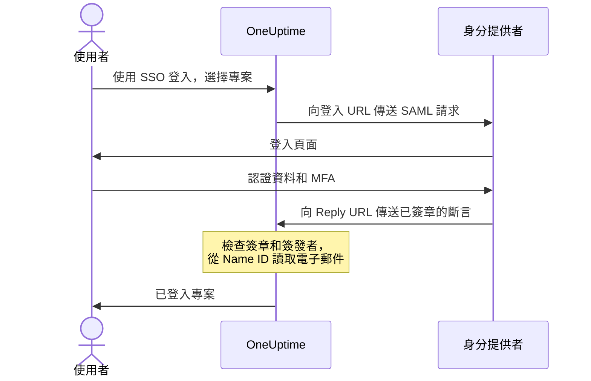

# SSO

單一登入（SSO）讓專案中的人員透過組織的身分提供者（IdP），使用 SAML 2.0 或 OpenID Connect 登入 OneUptime。您可以在同一個地方管理存取權限、密碼和多重要素驗證，也可以要求專案中的所有人都使用 SSO。

> [!NOTE]
> **版本：** SSO（包括「Require SSO for login」）屬於 OneUptime 的所有版本：自行託管的安裝在 Community Edition 中即可使用，不需要授權。在 OneUptime Cloud 上，**Scale** 及以上方案可用。各版本包含哪些功能，請參閱 [企業版](/docs/self-hosted/enterprise)。

:::cards
- [設定 SAML 提供者](#設定-sso): 在 OneUptime 中建立它，並把兩個 URL 交給您的 IdP。
- [身分提供者指南](#身分提供者指南): Keycloak、Microsoft Entra ID 和 Okta 的逐步說明。
- [OpenID Connect](#openid-connect-oidc): 改為透過 OIDC 應用程式登入。
- [要求使用 SSO](#為專案要求使用-sso): 讓 SSO 成為進入專案的唯一方式。
:::

## SAML 登入的運作方式

一個 SAML 提供者會把一個專案連接到身分提供者中的一個應用程式。登入的人在 OneUptime 的 **使用 SSO 登入** 頁面上選擇專案，在您的 IdP 登入，然後以已登入狀態返回。



OneUptime 只會從您的 IdP 傳送的斷言中讀取少量內容：

| 斷言中的內容 | OneUptime 如何處理 |
| --- | --- |
| 簽章 | 使用提供者的 **公開憑證** 進行驗證。回應必須已簽章，且不得加密。 |
| Issuer | 必須與提供者的 **簽發者** 完全一致。 |
| Name ID | 此人的電子郵件地址。必須是有效的電子郵件地址。 |
| `http://schemas.microsoft.com/identity/claims/displayname` | 此人的姓名，在 OneUptime 建立其帳戶時使用。選填。 |

首次登入的人會加入該提供者的 **團隊**，這些團隊決定了他們能做什麼：請參閱 [SSO 使用者的角色和團隊](#sso-使用者的角色和團隊)。

> [!NOTE]
> 在 OneUptime Cloud 上，當某人首次透過專案的某個 SAML 或 OIDC 提供者登入該專案時，OneUptime 不會直接讓其登入，而是透過電子郵件寄送一個連結給此人。此人開啟連結，確認專案的單一登入可以為其登入，然後繼續登入。該連結在 24 小時內有效。這在每個專案中只會發生一次；如果此人離開專案後又回來，則會再次發生。自行託管的安裝會直接讓人登入。

## 設定 SSO

您需要新增 SSO 提供者的權限（**Project Owner**、**Project Admin** 或 **Create Project SSO**），在 OneUptime Cloud 上還需要 **Scale** 方案。身分提供者端的設定請參閱 [身分提供者指南](#身分提供者指南)。

:::steps
1. **前往專案設定**

   - 進入您的 OneUptime 專案
   - 前往 **專案設定** > **安全性** > **SSO**

2. **建立 SSO 設定**

   - 按一下 **建立SSO**
   - 輸入 SSO 設定的 **名稱**（例如 "Keycloak SAML" 或 "Okta SAML"）
   - 輸入身分提供者的 **登入 URL**
   - 輸入身分提供者的 **簽發者**（實體 ID）
   - 貼上身分提供者的 **公開憑證**
   - 在 **登入** 步驟中，**團隊** 預設為專案的成員團隊：首次登入的人會加入這些團隊。只接受您自己可以邀請他人加入的團隊：授予的存取權限超出您自身權限的團隊會在 **團隊** 下方註明
   - 其餘內容已在 **更多欄位** 中填好：**簽章方法**（`RSA-SHA256`）、**摘要方法**（`SHA256`）以及描述（「Sign in with」加上名稱）。僅在您的身分提供者需要時才變更它們

3. **取得 OneUptime 的 SSO 中繼資料**
   - 儲存後會開啟 **SSO Configuration** 對話方塊。也可以透過 **檢視 SSO 設定** 按鈕再次開啟
   - 複製 **Identifier (Entity ID)**，例如 `https://oneuptime.com/<project-id>/<provider-id>`，IdP 設定中需要它
   - 複製 **Reply URL (Assertion Consumer Service URL)**，例如 `https://oneuptime.com/identity/idp-login/<project-id>/<provider-id>`，IdP 設定中需要它
   - 新的提供者預設為關閉狀態。在 IdP 設定好這兩個值後，請編輯該提供者並開啟 **已啟用**

4. **測試提供者**
   - 開啟 **Test Single Sign On (SSO)** 卡片中的連結，並在開啟的頁面上選擇該提供者。您會被帶到身分提供者的登入頁面，然後以已登入狀態返回 OneUptime
   - 確認可以正常使用後，您就可以為專案 [要求使用 SSO](#為專案要求使用-sso)
:::

## 身分提供者指南

選擇您的身分提供者。每份指南都會取得 IdP 的值，在 OneUptime 中建立提供者，然後把 OneUptime 的 **Identifier (Entity ID)** 和 **Reply URL** 交給 IdP。

:::tabs
@tab Keycloak
Keycloak 是一款熱門的開放原始碼身分與存取管理解決方案。您需要一個具有 realm 且正在執行的 Keycloak 執行個體，以及 Keycloak 和 OneUptime 的管理員存取權限。

:::steps
1. **收集 realm 的值**

   - **登入 URL**：`https://<your-keycloak-domain>/auth/realms/<your-realm>/protocol/saml`
   - **簽發者**：`https://<your-keycloak-domain>/auth/realms/<your-realm>`
   - **憑證**：realm 的簽章憑證。開啟 `https://<your-keycloak-domain>/auth/realms/<your-realm>/protocol/saml/descriptor` 並複製 `X509Certificate` 的值，或開啟 **Realm settings** > **Keys**，按一下 RS256 金鑰的 **Certificate**

   Keycloak 17 及更新版本提供的這些 URL 不帶 `/auth` 前置詞。請把憑證放在各自獨立的行之間，如下所示：

   ```text
   -----BEGIN CERTIFICATE-----
   MIICnzCCAYcCBgFyPZ8QFzANBgkqhkiG.......
   -----END CERTIFICATE-----
   ```

2. **在 OneUptime 中建立提供者**

   前往 **專案設定** > **安全性** > **SSO**，按一下 **建立SSO** 並填寫：
   - **名稱**：一個描述性的名稱（例如 `my-project-oneuptime`）
   - **登入 URL** 和 **簽發者**：上面的值
   - **公開憑證**：憑證，放在各自獨立的 `BEGIN CERTIFICATE` 行和 `END CERTIFICATE` 行之間
   - **簽章方法** 和 **摘要方法**：已在 **更多欄位** 中設定好（`RSA-SHA256` 和 `SHA256`）

   儲存，然後從開啟的對話方塊中複製 **Identifier (Entity ID)** 和 **Reply URL (Assertion Consumer Service URL)**。

3. **建立 Keycloak 用戶端**

   在 Keycloak 中開啟您 realm 的 **Clients**，建立一個用戶端或編輯現有的用戶端：
   - **Client Protocol**（用戶端類型）：`saml`
   - **Client ID**：OneUptime 的 **Identifier (Entity ID)**
   - **Root URL** 和 **Valid Redirect URIs**：您的 OneUptime URL
   - **Assertion Consumer Service POST Binding URL**：OneUptime 的 **Reply URL (Assertion Consumer Service URL)**

4. **調整用戶端設定**

   - 將 **Name ID Format** 設為 `email`，並開啟 **Force Name ID Format**，讓 Keycloak 一律以電子郵件作為 Name ID 傳送
   - 在用戶端的 **Keys** 分頁上，關閉 **Client signature required**（位於 **Signing keys config** 中）：OneUptime 不會為其請求簽章

5. **開啟提供者並進行測試**

   在 OneUptime 中編輯提供者並開啟 **已啟用**，然後開啟 **Test Single Sign On (SSO)** 卡片中的連結並選擇該提供者。您應該會被帶到 Keycloak 登入頁面，然後返回 OneUptime。
:::
@tab Microsoft Entra ID
Microsoft Entra ID（舊稱 Azure AD / Active Directory）是 Microsoft 的雲端身分服務。您需要一個支援使用 SAML SSO 之企業應用程式的租用戶，以及 Entra ID 和 OneUptime 的管理員存取權限。

:::steps
1. **在 Entra ID 中建立企業應用程式**

   - 登入 [Microsoft Entra admin center](https://entra.microsoft.com)
   - 前往 **Identity** > **Applications** > **Enterprise applications**，按一下 **+ New application**，然後按一下 **+ Create your own application**
   - 輸入名稱（例如 "OneUptime"），選擇 **Integrate any other application you don't find in the gallery (Non-gallery)**，然後按一下 **Create**

2. **複製 Entra ID 的 SAML 值**

   - 在應用程式中前往 **Single sign-on** 並選擇 **SAML**
   - 在 **SAML Certificates** 中下載 **Certificate (Base64)**，用文字編輯器開啟該檔案並複製其內容
   - 在 **Set up OneUptime** 中複製 **Login URL** 和 **Microsoft Entra Identifier**（在較舊的租用戶中為 **Azure AD Identifier**）

3. **在 OneUptime 中建立提供者**

   前往 **專案設定** > **安全性** > **SSO**，按一下 **建立SSO** 並填寫：
   - **名稱**：一個描述性的名稱（例如 `Azure AD SAML`）
   - **登入 URL**：**Login URL**
   - **簽發者**：**Microsoft Entra Identifier**
   - **公開憑證**：Base64 憑證，包括 `BEGIN CERTIFICATE` 行和 `END CERTIFICATE` 行
   - **簽章方法** 和 **摘要方法**：已在 **更多欄位** 中設定好（`RSA-SHA256` 和 `SHA256`）

   儲存，然後從開啟的對話方塊中複製 **Identifier (Entity ID)** 和 **Reply URL (Assertion Consumer Service URL)**。

4. **把 OneUptime 的 URL 交給 Entra ID**

   在 **Basic SAML Configuration** 中按一下 **Edit** 並設定：
   - **Identifier (Entity ID)**：OneUptime 的 **Identifier (Entity ID)**
   - **Reply URL (Assertion Consumer Service URL)**：OneUptime 的 **Reply URL**

   按一下 **Save**。

5. **以 Name ID 傳送電子郵件**

   在 **Attributes & Claims** 中按一下 **Edit**：
   - 將 **Unique User Identifier (Name ID)** 設為使用者的電子郵件地址：`user.mail`，或在 `user.userprincipalname` 就是電子郵件地址時使用它
   - 將 **Name identifier format** 設為 `Email address`
   - 選擇性：新增一個名為 `http://schemas.microsoft.com/identity/claims/displayname`、來源屬性為 `user.displayname` 的宣告，讓新帳戶取得此人的姓名。OneUptime 會忽略其他宣告

6. **指派使用者和群組**

   在應用程式的 **Users and groups** 中按一下 **+ Add user/group**，選擇要授予 SSO 存取權限的使用者和群組，然後按一下 **Assign**。

7. **開啟提供者並進行測試**

   在 OneUptime 中編輯提供者並開啟 **已啟用**，然後開啟 **Test Single Sign On (SSO)** 卡片中的連結並選擇該提供者。您應該會被帶到 Microsoft 登入頁面，然後返回 OneUptime。
:::
@tab Okta
Okta 是一款廣泛使用、支援 SAML SSO 的身分平台。您需要一個具有管理員存取權限的 Okta 組織，以及 OneUptime 的管理員存取權限。

:::steps
1. **在 Okta 中建立 SAML 應用程式**

   - 在 Okta Admin Console 中前往 **Applications** > **Applications**，按一下 **Create App Integration**
   - 選擇 **SAML 2.0** 並按一下 **Next**，在 **App name** 中輸入 "OneUptime"，然後按一下 **Next**
   - Okta 會在顯示自己的 URL 之前先要求填寫 OneUptime 的 URL。暫時把您的 OneUptime 位址（例如 `https://oneuptime.com`）填入 **Single sign-on URL** 和 **Audience URI (SP Entity ID)**：您會在步驟 4 中替換這兩個值
   - 將 **Name ID format** 設為 `EmailAddress`，將 **Application username** 設為 `Email`
   - 按一下 **Next**，選擇 **I'm an Okta customer adding an internal app**，然後按一下 **Finish**

2. **複製 Okta 的 SAML 值**

   在應用程式的 **Sign On** 分頁上，在 **SAML Signing Certificates** 中找到使用中的憑證：
   - 按一下 **Actions** > **View IdP metadata**，複製 **登入 URL**（Identity Provider Single Sign-On URL）和 **簽發者**（Identity Provider Issuer）
   - 按一下 **Actions** > **Download certificate**，用文字編輯器開啟 `.cert` 檔案並複製其內容

3. **在 OneUptime 中建立提供者**

   前往 **專案設定** > **安全性** > **SSO**，按一下 **建立SSO** 並填寫：
   - **名稱**：一個描述性的名稱（例如 `Okta SAML`）
   - **登入 URL** 和 **簽發者**：Okta 的值
   - **公開憑證**：憑證，包括 `BEGIN CERTIFICATE` 行和 `END CERTIFICATE` 行
   - **簽章方法** 和 **摘要方法**：已在 **更多欄位** 中設定好（`RSA-SHA256` 和 `SHA256`）

   儲存，然後從開啟的對話方塊中複製 **Identifier (Entity ID)** 和 **Reply URL (Assertion Consumer Service URL)**。

4. **把 OneUptime 的 URL 交給 Okta**

   在應用程式的 **General** 分頁上，按一下 **SAML Settings** 中的 **Edit** 和 **Next**，然後設定：
   - **Single sign-on URL**：OneUptime 的 **Reply URL (Assertion Consumer Service URL)**
   - **Audience URI (SP Entity ID)**：OneUptime 的 **Identifier (Entity ID)**

   選擇性：新增一個名為 `http://schemas.microsoft.com/identity/claims/displayname`、值為 `user.firstName + " " + user.lastName` 的 attribute statement，讓新帳戶取得此人的姓名。按一下 **Next**，然後按一下 **Finish**。

5. **指派人員**

   在 **Assignments** 分頁上按一下 **Assign** > **Assign to People** 或 **Assign to Groups**，選擇要授予 SSO 存取權限的人，為每個人按一下 **Assign**，然後按一下 **Done**。

6. **開啟提供者並進行測試**

   在 OneUptime 中編輯提供者並開啟 **已啟用**，然後開啟 **Test Single Sign On (SSO)** 卡片中的連結並選擇該提供者。您應該會被帶到 Okta 登入頁面，然後返回 OneUptime。
:::
@tab 其他
OneUptime 的 SSO 使用 SAML 2.0，可與任何相容的身分提供者搭配使用：

:::steps
1. 取得身分提供者的 **登入 URL**（其 SSO 端點）、**簽發者**（其實體 ID）和 **公開憑證**（其 X.509 簽章憑證）。如果您的 IdP 只有在應用程式存在後才顯示這些值，請先用您的 OneUptime 位址作為暫時 URL 建立應用程式。
2. 在 OneUptime 中用這些值建立提供者，並從 **SSO Configuration** 對話方塊（或 **檢視 SSO 設定**）中複製 **Identifier (Entity ID)** 和 **Reply URL (Assertion Consumer Service URL)**。
3. 在身分提供者的 SAML 應用程式中，將 **Assertion Consumer Service URL / Reply URL** 和 **Entity ID / Audience URI** 設為 OneUptime 的值，並將 **Name ID Format** 設為電子郵件地址。
4. **簽章方法**（`RSA-SHA256`）和 **摘要方法**（`SHA256`）已在 **更多欄位** 中設定好；僅在您的身分提供者使用不同的簽章方式時才變更它們
5. 為提供者開啟 **已啟用**，並使用 **Test Single Sign On (SSO)** 卡片中的連結進行測試。
:::
:::

## OpenID Connect (OIDC)

專案也可以透過 OpenID Connect 提供者登入，例如 Google Workspace、Okta、Microsoft Entra ID、Auth0 或 Keycloak。您需要新增 OIDC 提供者的權限（**Project Owner**、**Project Admin** 或 **Create Project OIDC**），在 OneUptime Cloud 上還需要 **Scale** 方案。

:::steps
1. 在身分提供者中註冊一個可以使用帶有 PKCE 之授權碼流程的應用程式（OIDC 用戶端），並複製其 **簽發者 URL**、**用戶端 ID** 和 **用戶端密鑰**。
2. 在 OneUptime 中前往 **專案設定** > **安全性** > **OIDC**，按一下 **建立OIDC**。
3. 輸入 **名稱**（使用者在登入頁面上看到的名稱）、**簽發者 URL**、**用戶端 ID** 和 **用戶端密鑰**。也可以改為把提供者的探索 URL 貼到 **簽發者 URL** 中。
4. 在 **登入** 步驟中，**團隊** 預設為專案的成員團隊：首次登入的人會加入這些團隊。其餘內容已在 **更多欄位** 中填好：**探索 URL**（簽發者後接 `/.well-known/openid-configuration`）、**範圍**（`openid email profile`）、`email` 和 `name` 宣告名稱，以及描述（「Sign in with」加上名稱）。僅在您的提供者需要時才變更它們。只接受您自己可以邀請他人加入的團隊：授予的存取權限超出您自身權限的團隊會在 **團隊** 下方註明。
5. 儲存。**OIDC Configuration** 對話方塊會開啟並顯示 **Redirect URI**：請把它加入應用程式允許的重新導向 URI。新的提供者預設為關閉狀態，因此接著請編輯它並開啟 **已啟用**。
6. 在為專案要求使用 SSO 之前，使用 **Test OpenID Connect (OIDC)** 卡片中的連結透過該提供者登入一次。
:::

## SSO 使用者的角色和團隊

OneUptime 不會對應身分提供者中的角色或群組。一個人能做什麼取決於其所在的團隊：提供者會把新來的人加入它的 **團隊**，而團隊及其權限在 OneUptime 中管理，如 [使用者、團隊與權限](/docs/permissions/index) 所述。若要讓團隊成員與身分提供者保持同步，請使用 [SCIM](/docs/identity/scim)。

提供者的團隊決定了透過它登入的人能做什麼，因此只有當儲存者本人可以邀請他人加入這些團隊時，提供者才能儲存。每次儲存都會重新檢查：如果提供者的團隊授予的存取權限超出您自身的權限，則只有存取權限能涵蓋這些團隊的人（例如專案擁有者）才能變更它。在此檢查推出之前儲存的提供者會繼續把人登入其團隊。任何可以編輯提供者的人仍然可以關閉它，以便立即停止它。

## 為專案要求使用 SSO

設定提供者並不會阻止任何人使用密碼登入。若要讓 SSO 成為進入專案的唯一方式，請使用 **專案設定** > **安全性** > **SSO** 中提供者下方的 **登入時要求使用 SSO** 開關：

:::steps
1. 先使用 **Test Single Sign On (SSO)** 卡片中的連結測試您的提供者。
2. 開啟 **登入時要求使用 SSO**。OneUptime 會在儲存任何內容之前詢問：從那時起，專案中的每個人（包括您自己）都必須使用 SSO 登入才能開啟專案，任何使用密碼登入的人都會被鎖在專案之外，直到使用 SSO 登入為止。
3. 按一下 **要求使用 SSO** 進行確認。開關會立即儲存，沒有另外的儲存按鈕。
:::

開啟 **登入時要求使用 SSO** 需要一個能把人登入該專案的提供者：專案自己的一個已開啟的 SAML 或 OIDC 提供者，或一個已開啟且能把人登入該專案的全域提供者。沒有這樣的提供者時，OneUptime 會拒絕，並提示先為專案開啟一個提供者並進行測試。如果您選擇專案要求的提供者，它必須是其中之一；之後要求另一個提供者時，也會進行同樣的檢查。

在 **登入時要求使用 SSO** 已開啟時仍以開啟狀態傳送它的儲存，或指定專案已經要求之提供者的儲存，也會以同樣的方式檢查——API、Terraform 等工具在每次儲存時常常會傳送所有設定。因此，當專案沒有能讓人登入的提供者，或它要求的提供者後來被關閉時，這樣的儲存無論還變更了什麼，都會以相同的措辭被拒絕：請先開啟一個提供者、要求另一個提供者，或關閉 **登入時要求使用 SSO**。

新專案也遵循同樣的規則。新專案還沒有自己的提供者，因此在 **登入時要求使用 SSO** 已開啟的情況下建立專案（只有主管理員可以這樣做）需要一個已開啟且能把人登入每個專案的全域提供者；沒有這樣的提供者時，會以相同的措辭被拒絕。請先建立專案，設定並測試其提供者，然後再開啟該開關。

當整個伺服器要求使用 SSO 時（**Admin** > **設定** > **驗證** > **登入時要求使用 SSO**），建立任何專案也都需要這樣的全域提供者，否則包括建立者在內，沒有人能開啟該專案。沒有這樣的提供者時，建立專案會被拒絕，訊息會請伺服器管理員開啟一個。主管理員仍然可以建立專案。

關閉 **登入時要求使用 SSO** 會在您切換開關時立即儲存，成員可以馬上重新使用密碼進入——除非恰好在同一時刻有人再次開啟它，此時應用程式伺服器最多可能需要一分鐘才能跟上。專案擁有者、專案管理員以及擁有 **Edit Project** 權限的成員可以變更它；其他人看到的開關會處於鎖定狀態，並顯示他們所需的權限。

> [!NOTE]
> 在 OneUptime Cloud 上，要求使用 SSO 需要 **Scale** 方案，而關閉它在任何方案上都可以。低於 Scale 時，**專案設定** > **安全性** > **SSO** 會顯示方案的升級提示；對於 Scale 試用期結束後仍要求使用 SSO 的專案，升級提示下方也會顯示 **登入時要求使用 SSO**，以便將其關閉。再次開啟需要 **Scale**。

## 關閉或刪除提供者

| 您變更的內容 | 透過該提供者登入的人 |
| --- | --- |
| 關閉或刪除它 | 在要求使用 SSO 的地方，下次請求時重新使用 SSO 登入 |
| 新的憑證或用戶端密鑰、其他 URL、新名稱或其他團隊 | 保持登入狀態 |
| 開啟它 | 可以立即透過它登入 |

關閉或刪除 SAML 或 OIDC 提供者，會結束透過它進行的登入。在要求使用 SSO 的專案中（無論是專案本身要求，還是因為整個伺服器要求）：

- 所有透過它登入的人都必須在下次請求時重新使用 SSO 登入，他們開啟的頁面會立即停止接收即時更新。
- 有人在透過它登入後連接的 MCP 用戶端會在該專案中停止運作。請在使用 SSO 登入後重新連接它。
- 重新開啟提供者不會恢復這些登入：使用者需要再次透過它登入。

變更提供者的其他任何內容都會讓所有人保持登入狀態：新的憑證或用戶端密鑰、其他 URL、新名稱或其他團隊。登入在發生時已經過檢查，下一次登入會使用新的設定。

當專案要求使用 SSO 時，OneUptime 會保留一條進入的途徑：您不能關閉或刪除人們可以用來登入該專案的最後一個提供者（包括能把人登入該專案的全域提供者），也不能關閉或刪除專案要求的提供者。請先關閉 **登入時要求使用 SSO**。

開啟提供者後，人們可以立即透過它登入。

當整個伺服器要求使用 SSO 時（**Admin** > **設定** > **驗證** > **登入時要求使用 SSO**），每個專案都會以同樣的方式保留一條進入的途徑，即使專案本身不要求使用 SSO：請先為它開啟另一個提供者。

全域提供者也遵循同樣的規則：如果對某個全域提供者或其附加專案的變更會讓要求使用 SSO 的專案沒有提供者，該變更會被拒絕，並指出該專案。請參閱 [全域 SSO](/docs/identity/global-sso#關閉或刪除提供者)。

在專案和伺服器都不要求使用 SSO 的地方，關閉提供者會阻止透過它進行新的登入。已經登入的人會保持登入狀態，就像使用密碼登入的人一樣。

## 低於 Scale 方案時保留的提供者

專案仍有的 SAML 或 OIDC 提供者，在 Scale 試用期結束或方案降級後會繼續讓人登入。因此，低於 Scale 時，**SSO** 和 **OIDC** 頁面會在升級提示下方列出專案的提供者（**仍在設定中的 SAML 提供者**、**仍在設定中的 OIDC 提供者**）：

- **關閉** 會立即停止提供者。OneUptime 會先詢問。
- **刪除** 會將其刪除。

新增提供者、變更提供者或重新開啟提供者都需要 **Scale**。誰可以執行每項操作與 Scale 方案下相同：關閉提供者需要編輯它的權限，刪除它需要刪除它的權限。

當專案仍要求使用 SSO 時，其 **SSO** 和 **OIDC** 頁面還會顯示 **登入時要求使用 SSO**：請在關閉最後一個提供者之前先關閉它。在此之前，人們可以用來登入的最後一個提供者無法被關閉或刪除，因此不會有人被鎖在專案之外。

狀態頁面的 **SSO** 和 **OIDC** 頁面會以同樣的方式列出狀態頁面自己的提供者。當狀態頁面仍要求使用 SSO 時，這兩個頁面也會顯示 **登入時要求使用 SSO**：請在關閉其提供者之前先關閉它，否則其私人使用者將完全無法登入。

## 疑難排解

:::details "SSO Config not found"
提供者已關閉，或連結指向的提供者已不存在。新的提供者預設為關閉狀態：請編輯它並開啟 **已啟用**。
:::

:::details "No teams added."
此人尚未加入專案，而提供者沒有可以把此人加入的 **團隊**。請編輯提供者並至少選擇一個團隊，例如專案的成員團隊。
:::

:::details "Issuer URL does not match"
IdP 斷言中的簽發者不是提供者的 **簽發者**。請從 IdP 重新複製它（Keycloak 的 realm URL、**Microsoft Entra Identifier** 或 Okta 的 Identity Provider Issuer），讓兩者完全一致。
:::

:::details 登入因簽章或憑證錯誤而失敗
把 IdP 目前的簽章憑證貼到 **公開憑證** 中，包括 `BEGIN CERTIFICATE` 行和 `END CERTIFICATE` 行。對於 Entra ID，請下載 **Base64** 憑證，而不是原始憑證；對於 Okta，請下載使用中的簽章憑證；對於 Keycloak，請下載正確 realm 的憑證。
:::

:::details "Encrypted SAML Responses are not supported"
OneUptime 不會解密斷言。請在 IdP 中關閉該應用程式的斷言加密，讓它傳送未加密的已簽章斷言。
:::

:::details "SAML response did not include a valid email address"
OneUptime 會從 Name ID 讀取電子郵件地址。請將 Name ID 設為使用者的電子郵件：在 Keycloak 中為 **Name ID Format** `email` 加上 **Force Name ID Format**，在 Entra ID 中為 **Unique User Identifier (Name ID)**，在 Okta 中為 **Name ID format** `EmailAddress` 和 **Application username** `Email`。該地址必須與此人的 OneUptime 帳戶一致。
:::

:::details Entra ID: AADSTS700016
Entra ID 中的 **Identifier (Entity ID)** 與 OneUptime 的不一致。請從 **檢視 SSO 設定** 重新複製；兩個值必須完全相同。
:::

:::details Okta: 404，或 audience 不相符
Okta 中的 **Single sign-on URL** 必須與 OneUptime 的 **Reply URL** 完全一致，**Audience URI** 必須與 OneUptime 的 **Identifier (Entity ID)** 完全一致。請確認兩者都已替換掉暫時的值。
:::

:::details 使用者未指派給應用程式
Entra ID 和 Okta 只會讓指派給應用程式的人登入。請指派該使用者，或指派其所在的群組。
:::

:::details Keycloak: 重新導向迴圈
請檢查正確 realm 中的用戶端上，**Valid Redirect URIs** 和 **Assertion Consumer Service POST Binding URL** 是否已依上文設定。
:::

## 後續步驟

:::cards
- [全域 SSO](/docs/identity/global-sso): 在自行託管的執行個體上為所有專案使用一個身分提供者。
- [SCIM](/docs/identity/scim): 讓身分提供者自動新增和移除人員。
- [使用者、團隊與權限](/docs/permissions/index): 新來的人加入的團隊允許他們做什麼。
:::
